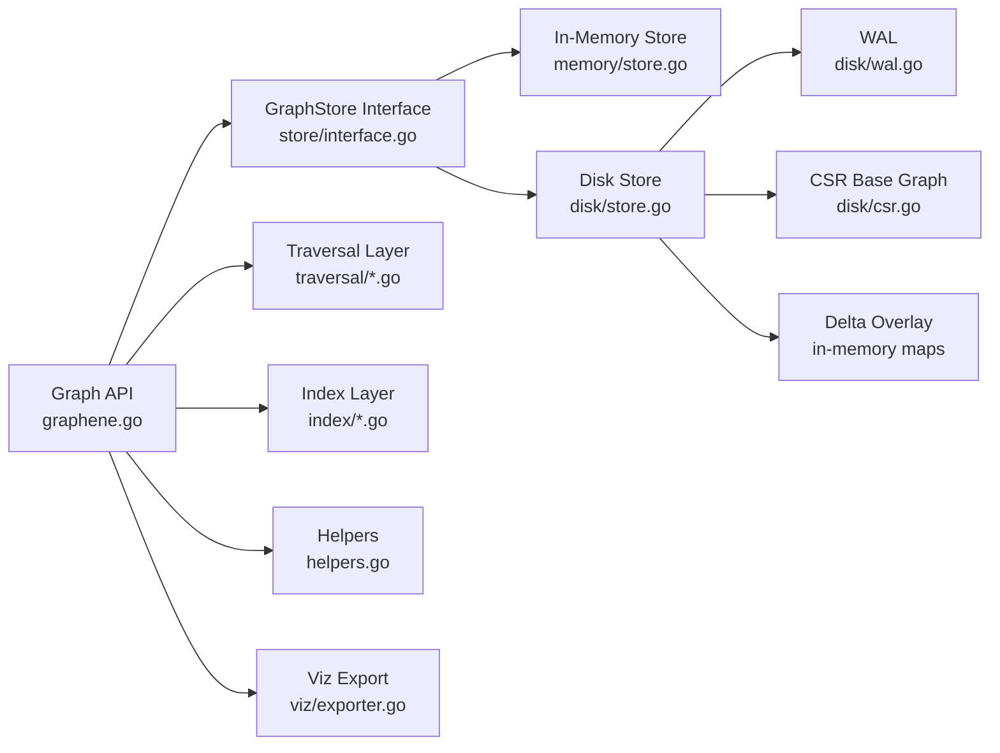
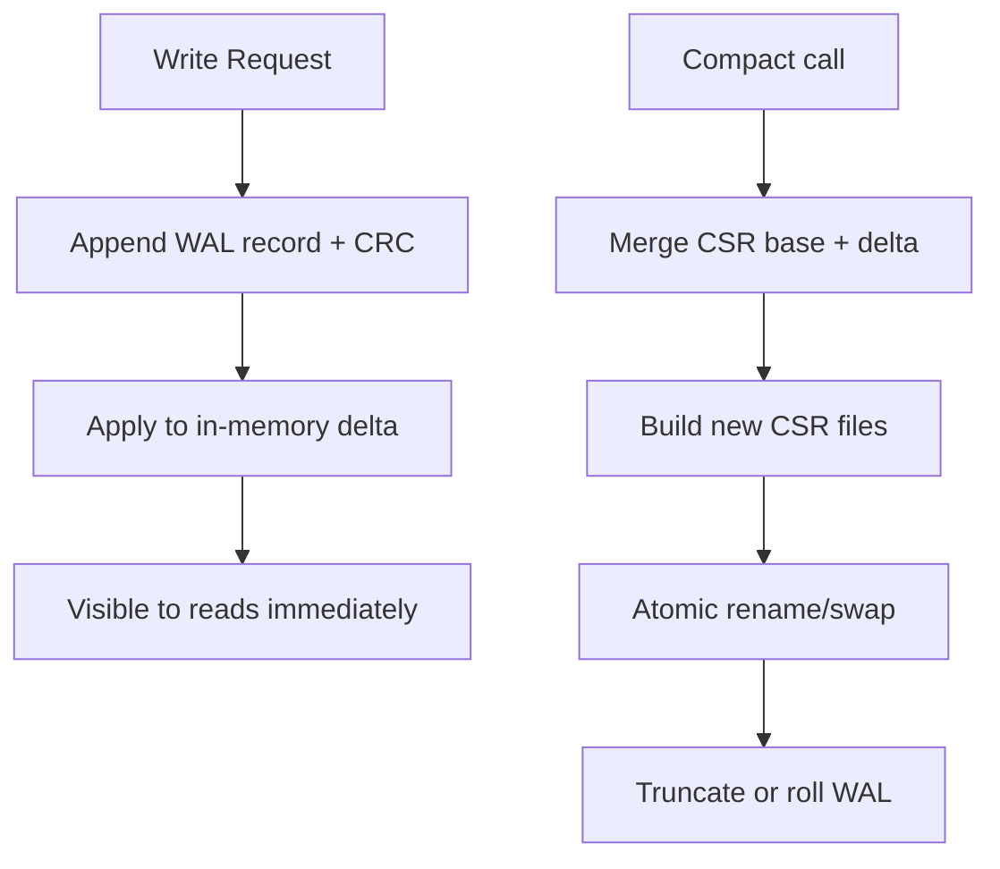
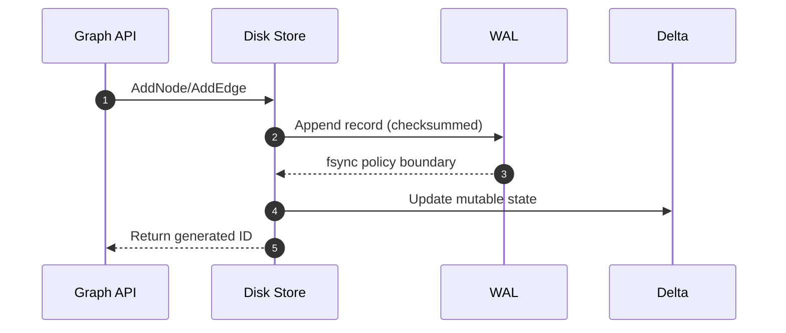
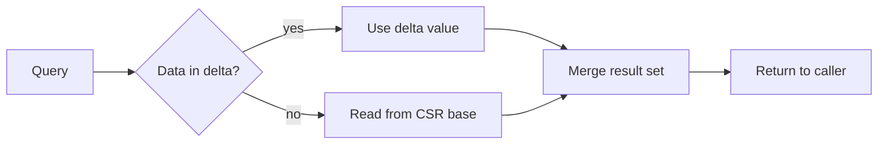
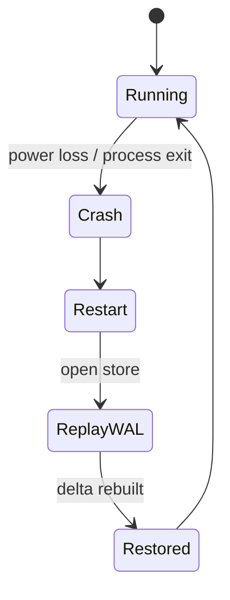

# GrapheneDB Technical Details

This document is the deep technical companion to the landing README. It is
intentionally implementation-heavy, but organized so you can skim architecture
first and dive into low-level details only when needed.

## Status Note

GrapheneDB is currently pre-production. The material in this document describes
the current implementation direction and behavior, not a finalized production
contract.

## 1. System Intent

GrapheneDB is designed for a specific workload shape:

1. Ingest large, connected datasets quickly.
2. Persist safely with crash recovery.
3. Run many read-heavy graph queries and traversals.

The storage path and APIs are optimized around this sequence.

## 2. Architecture (LLD View)

### Component Responsibilities

| Component        | Responsibility                          | Main Files                                                                           |
| ---------------- | --------------------------------------- | ------------------------------------------------------------------------------------ |
| Public API       | Stable graph operations and wrappers    | `graphene.go`, `helpers.go`                                                          |
| Type system      | Core graph types and contracts          | `store/types.go`, `store/interface.go`                                               |
| Memory backend   | Fast, test-focused store                | `memory/store.go`                                                                    |
| Disk backend     | Durable storage, replay, compaction     | `disk/store.go`, `disk/wal.go`, `disk/csr.go`                                        |
| Traversal engine | BFS, DFS, pathing, pattern matching     | `traversal/bfs.go`, `traversal/dfs.go`, `traversal/path.go`, `traversal/subgraph.go` |
| Indexes          | Type, temporal, property lookup support | `index/type_index.go`, `index/temporal_index.go`, `index/property_index.go`          |
| Visualization    | HTML export for graph inspection        | `viz/exporter.go`                                                                    |

## 3. Storage Design

### 3.1 Core Model

GrapheneDB uses a typed property graph:

- Nodes: unique ID + one or more labels + optional raw property blob.
- Edges: unique ID + src/dst + one or more labels + optional weight + property
  blob.

### 3.2 Disk Strategy

Disk mode combines three layers:

1. WAL (append-only) for durability.
2. Delta overlay for recent writes.
3. CSR base for compact, read-friendly adjacency.

### 3.3 Why CSR

CSR gives contiguous adjacency reads for neighborhood operations. After
compaction, traversal-heavy read phases benefit from cache-friendly sequential
access.

## 4. Read and Write Paths

### 4.1 Write Path (Detailed)

Write guarantees are single-operation durability and replay safety, not
multi-statement ACID transactions.

### 4.2 Read Path (Detailed)

Reads observe merged logical state (base + delta).

## 5. Indexing Internals

### 5.1 Type Index

- Maps node label to node IDs.
- Maps edge label to edge IDs.
- Supports multi-label entities by indexing under each label.

### 5.2 Property Index

- Explicit indexing model: properties are queryable only after indexing calls.
- Keeps query behavior predictable and avoids implicit indexing costs.

### 5.3 Temporal Index

- Sorted temporal entries with binary-search range access.
- Optimized for time-window filters.

## 6. Traversal and Pattern Engine

### 6.1 Traversal Coverage

- BFS for k-hop neighborhoods.
- DFS for directional exploration.
- Bidirectional BFS for shortest path.
- Provenance chains for ancestry-style analysis.

### 6.2 Pattern Matching

Pattern queries use a VF2-inspired backtracking strategy with label pruning and
optional scope restriction.

Practical recommendation:

1. Run BFS to compute a local scope.
2. Run `FindPatterns` on that scope.
3. Keep match limits explicit.

## 7. Concurrency and Safety

- Concurrent operations are guarded by backend synchronization where needed.
- WAL replay restores disk-backed state after unclean exits.
- Compaction uses rebuild + atomic swap semantics to avoid torn base snapshots.

## 8. Benchmark and Stress Evidence

### 8.1 Current Benchmark Sample

Source run: `./test.ps1 -Bench -BenchTime 1s` on Windows (Ryzen 9 5980HS).

| Benchmark           | Throughput Signal |           Allocation Signal |
| ------------------- | ----------------: | --------------------------: |
| AddNode             |       728.9 ns/op |       268 B/op, 3 allocs/op |
| GetNode             |       7.945 ns/op |         0 B/op, 0 allocs/op |
| BFS                 |      447459 ns/op | 223560 B/op, 3058 allocs/op |
| ShortestPath        |      260022 ns/op | 124864 B/op, 2061 allocs/op |
| PropertyIndexLookup |       51.42 ns/op |          8 B/op, 1 alloc/op |

### 8.2 Stress Scenarios Covered

- Large insert path: 100k nodes, 500k edges.
- Concurrent write pressure: 50 goroutines.
- Concurrent read pressure: 50 goroutines.
- Property index scale test: 50k entities.
- Opt-in persistent limit test: up to 1M nodes.

## 9. Failure Recovery Model

Recovery objective: never lose acknowledged WAL-backed writes.

## 10. Package-Level LLD Map

| Package      | Role                 | Notes                                         |
| ------------ | -------------------- | --------------------------------------------- |
| `disk/`      | Durable backend      | WAL, CSR serialization, compaction pipeline   |
| `memory/`    | Volatile backend     | Fast unit and stress execution                |
| `index/`     | Query acceleration   | Type/property/temporal lookup structures      |
| `traversal/` | Query algorithms     | BFS/DFS/path/provenance/pattern matching      |
| `store/`     | Contracts + entities | Shared types and graph interface              |
| `viz/`       | Visual output        | Interactive HTML rendering for sampled graphs |

## 11. Trade-Off Summary

| Decision                   | Benefit                                  | Trade-Off                          |
| -------------------------- | ---------------------------------------- | ---------------------------------- |
| Explicit compaction        | Predictable ingest speed and read layout | Caller must schedule compaction    |
| Explicit property indexing | Stable query costs                       | Requires up-front key planning     |
| Typed labels               | Clear domain APIs                        | Less dynamic than free-form labels |
| Embedded architecture      | No external infra dependency             | No built-in query language server  |

## 12. Practical Ops Guidance

1. Batch ingest first, compact once, then run heavy read/traversal phases.
2. Index only keys that appear in recurring query paths.
3. Use scoped traversal before expensive pattern matching.
4. Keep stress data directories isolated per run for reproducibility.

---

If you only need usage patterns, start with [USER_GUIDE.md](USER_GUIDE.md). If
you need competitive context, see [comparison.md](comparison.md).
