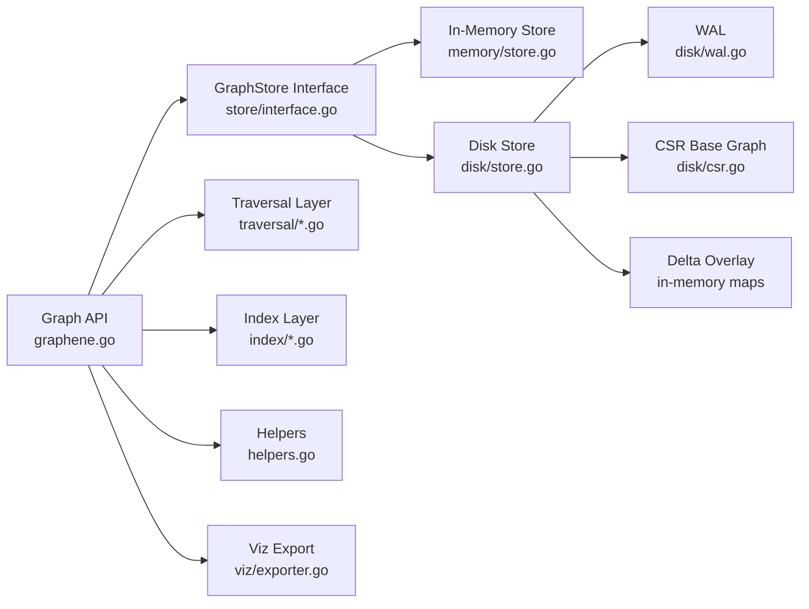
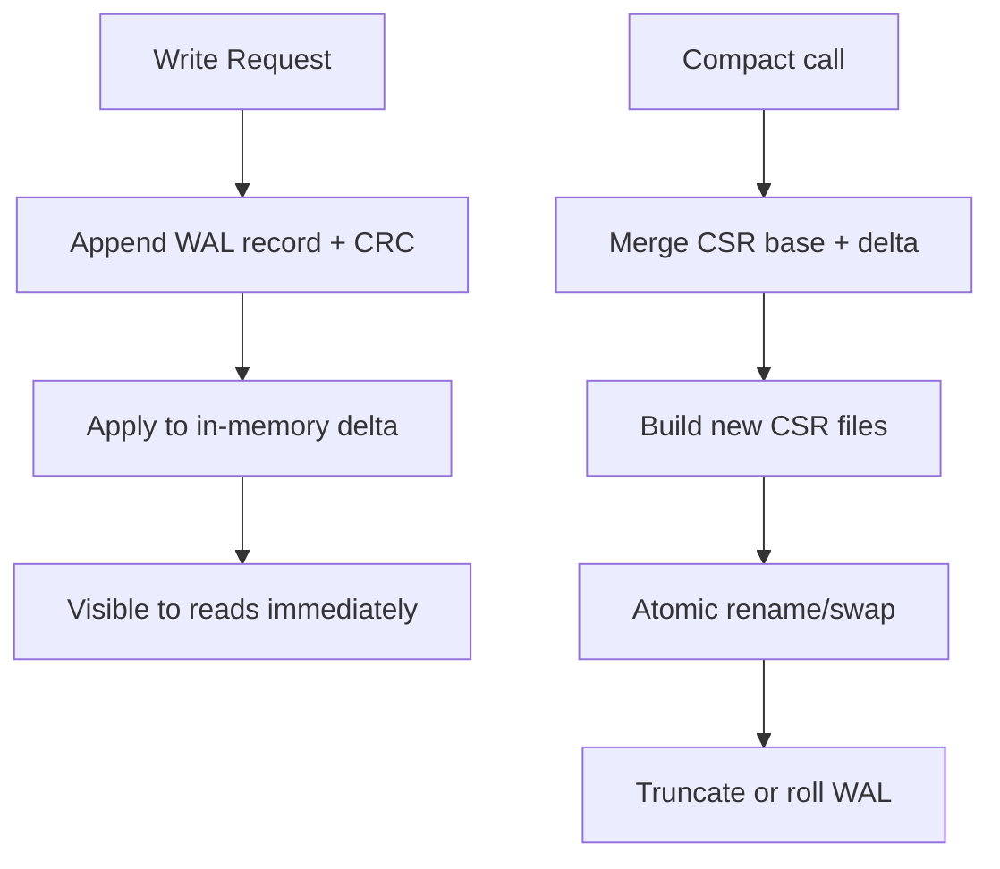
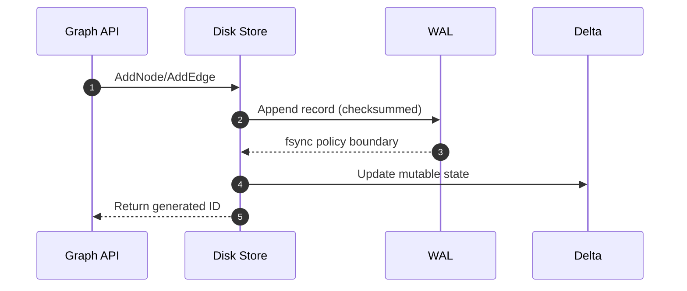
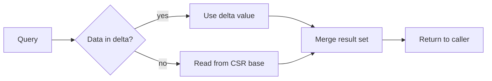
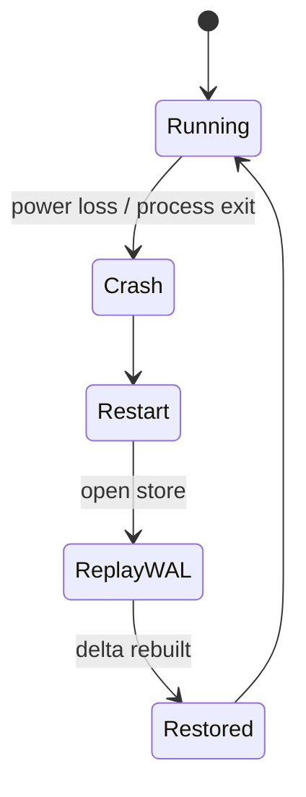

# GrapheneDB Technical Details

This document is the deep technical companion to the landing README. It is
intentionally implementation-heavy, but organized so you can skim architecture
first and dive into low-level details only when needed.

## Status Note

GrapheneDB is currently pre-production. The material in this document describes
the current implementation direction and behavior, not a finalized production
contract.

GrapheneDB is best understood today as an experimental embedded native graph
engine. It owns its graph-shaped storage layout directly, but it is not yet
positioned as a production-complete peer to server-oriented graph database
products.

## 1. System Intent

GrapheneDB is designed for a specific workload shape:

1. Ingest large, connected datasets quickly.
2. Persist safely with crash recovery.
3. Run many read-heavy graph queries and traversals.

The storage path and APIs are optimized around this sequence.

## 2. Architecture (LLD View)

```mermaid
flowchart LR
    A[Graph API<br/>graphene.go] --> B[GraphStore Interface<br/>store/interface.go]
    B --> C[In-Memory Store<br/>memory/store.go]
    B --> D[Disk Store<br/>disk/store.go]

    A --> E[Traversal Layer<br/>traversal/*.go]
    A --> F[Index Layer<br/>index/*.go]
    A --> G[Helpers<br/>helpers.go]
    A --> H[Viz Export<br/>viz/exporter.go]

    D --> I[WAL<br/>disk/wal.go]
    D --> J[CSR Base Graph<br/>disk/csr.go]
    D --> K[Delta Overlay<br/>in-memory maps]
```

### Component Responsibilities

| Component        | Responsibility                          | Main Files                                                                           |
| ---------------- | --------------------------------------- | ------------------------------------------------------------------------------------ |
| Public API       | Stable graph operations and wrappers    | `graphene.go`, `helpers.go`                                                          |
| Type system      | Core graph types and contracts          | `store/types.go`, `store/interface.go`                                               |
| Memory backend   | Fast, test-focused store                | `memory/store.go`                                                                    |
| Disk backend     | Durable storage, replay, compaction     | `disk/store.go`, `disk/wal.go`, `disk/csr.go`                                        |
| Traversal engine | BFS, DFS, pathing, pattern matching     | `traversal/bfs.go`, `traversal/dfs.go`, `traversal/path.go`, `traversal/subgraph.go` |
| Indexes          | Type, temporal, property lookup support | `index/type_index.go`, `index/temporal_index.go`, `index/property_index.go`          |
| Visualization    | HTML export for graph inspection        | `viz/exporter.go`                                                                    |

## 3. Storage Design

### 3.1 Core Model

GrapheneDB uses a typed property graph:

- Nodes: unique ID + one or more labels + optional raw property blob.
- Edges: unique ID + src/dst + one or more labels + optional weight + property
  blob.

### 3.2 Disk Strategy

Disk mode combines three layers:

1. WAL (append-only) for durability.
2. Delta overlay for recent writes.
3. CSR base for compact, read-friendly adjacency and durable node/edge property
   blobs after compaction.

```mermaid
flowchart TD
    W[Write Request] --> WAL[Append WAL record + CRC]
    WAL --> DELTA[Apply to in-memory delta]
    DELTA --> READS[Visible to reads immediately]

    C[Compact call] --> SNAP[Merge CSR base + delta]
    SNAP --> NEWCSR[Build new CSR files]
    NEWCSR --> SWAP[Atomic rename/swap]
    SWAP --> TRUNC[Truncate or roll WAL]
```

### 3.2.1 Mutation: update and delete

Graphene supports in-place update and delete of nodes and edges without breaking
the append-only WAL:

- **Update** re-appends a normal node/edge record (`0x01`/`0x02`) carrying the
  same ID. On replay the record is applied as an upsert (last write wins). Edge
  endpoints (`Src`/`Dst`) are immutable — an update changes labels, weight and
  properties only.
- **Delete** appends a *tombstone* record — `0x05` for a node, `0x06` for an edge
  — whose payload is just the 8-byte ID.

Deleting a node **cascades**: one edge tombstone is written for every incident
edge before the node tombstone, so a crash mid-delete never leaves an edge
pointing at a missing node.

In memory the delta overlay may now *shadow* or *mask* a CSR record with the same
ID. Two masking sets (`deletedNodes` / `deletedEdges`) hide a still-in-CSR record
from every read until the next compaction. Reads consult the overlay first, honour
the masks, and re-validate `NodesByType`/`EdgesByType` candidates against the
authoritative view so a label edit is reflected. Property-index entries for a
deleted entity are purged immediately.

**Space is reclaimed at `Compact`**: the rebuilt CSR simply omits masked and
delta-overridden records, and the masks are cleared. Until then, a deleted CSR
record still occupies its slot on disk (its space is freed by the next compaction).

**IDs are never reused**, even across a delete-then-compact-then-reopen cycle.
The monotonic node/edge sequence high-water marks are persisted in the CSR header
(format v5) and restored on `Open`, so an ID whose record was dropped during
compaction is never handed out again.

WAL record types:

| Byte   | Record                     |
|--------|----------------------------|
| `0x01` | Node (add or update)       |
| `0x02` | Edge (add or update)       |
| `0x03` | Node property index entry  |
| `0x04` | Edge property index entry  |
| `0x05` | Node tombstone (delete)    |
| `0x06` | Edge tombstone (delete)    |
| `0xFF` | Checkpoint                 |

### 3.3 Why CSR

CSR gives contiguous adjacency reads for neighborhood operations. After
compaction, traversal-heavy read phases benefit from cache-friendly sequential
access. The compacted CSR also stores raw node and edge property blobs inline so
`GetNode` and `GetEdge` preserve the same property-bearing entity contract
across restart and compaction.

## 4. Read and Write Paths

### 4.1 Write Path (Detailed)

```mermaid
sequenceDiagram
    autonumber
    participant API as Graph API
    participant DS as Disk Store
    participant WAL as WAL
    participant DEL as Delta

    API->>DS: AddNode/AddEdge
    DS->>WAL: Append record (checksummed)
    WAL-->>DS: fsync policy boundary
    DS->>DEL: Update mutable state
    DS-->>API: Return generated ID
```

Write guarantees are single-operation durability and replay safety, not
multi-statement ACID transactions.

### 4.2 Read Path (Detailed)

```mermaid
flowchart LR
    Q[Query] --> M{Data in delta?}
    M -- yes --> D[Use delta value]
    M -- no --> C[Read from CSR base]
    D --> R[Merge result set]
    C --> R
    R --> OUT[Return to caller]
```

Reads observe merged logical state (base + delta).

The current query surface is intentionally API-first rather than language-first:
the engine exposes graph operations through Go interfaces and traversal helpers,
not through a built-in declarative query runtime.

## 5. Indexing Internals

Every index below is consulted by the query planner; none of them is decorative.
Which operators each one accelerates is the practical question, so that is stated
per index.

### 5.1 Label (type) index

- Maps node label to node IDs and edge label to edge IDs, indexing multi-label
  entities under each of their labels.
- Postings are **sorted by ID**. That makes removal a binary search plus a
  memmove instead of a full rewrite, and lets a lookup hand the query path an
  already-ordered result it does not need to sort again.
- The disk backend builds the same postings over the CSR at load
  (`buildLabelIndex`), so `NodesByType` is proportional to the number of matches
  rather than to the size of the graph. They are derived state, rebuilt on open,
  and deliberately not part of the file format.
- Duplicate labels on one entity are collapsed at every insertion site, so an
  entity created with `[Tag, Tag]` appears once.

### 5.2 Property index

- Explicit indexing model: properties are queryable only after an indexing call.
  This keeps behaviour predictable and the storage layer free of any need to
  understand your property encoding.
- Postings per `(key, value)` are sorted and deduplicated; registering the same
  triple twice is a no-op.
- A reverse `ID → [(key, value)]` map makes removal proportional to the entity's
  own entries rather than to the size of the whole index.
- **Persisted** inside the CSR file (format v6), so a compacted store reopens
  without replaying anything and the WAL is left empty.
- **Sharded 16 ways by key hash.** The reverse map is sharded alongside the
  forward map rather than by ID, so no operation ever holds two shard locks —
  there is no lock ordering to get wrong.
- Accelerates: equality (`PropertyOpEqual`).

### 5.3 Ordered (range) index

- Opt-in per key via `Graph.DeclareOrderedProperty`. Keeps that key's distinct
  values sorted, answering range and prefix predicates with two binary searches.
- Accelerates: `>`, `>=`, `<`, `<=`, `Between`, and `Prefix`.
- **Declaring a key changes how it compares.** Undeclared keys use the scan rule —
  numeric when both sides parse, byte order otherwise — which is fine value by
  value but is *not a valid sort order*: under it `"9" < "10" < "1x" < "9"`, a
  cycle, so no sorted structure can be built on it. A declared key is compared
  byte-wise throughout. Encode values with `index/encoding`, which supplies
  order-preserving encoders for int64, uint64, float64, string and time.
- Not persisted: a declaration is a runtime choice about how to index, like an
  index definition elsewhere, and must be re-issued after reopening.

### 5.4 What is not indexed

- `PropertyOpContains` is a scan and will remain one — no ordering can bound a
  substring match. A trigram index is the only route and is out of scope.
- A range or prefix filter on an *undeclared* key scans that key's buckets. That
  is bounded by the key, not by the whole index, but it is still linear.

### 5.5 Query Execution Model (Typed APIs)

The query system is API-first and intentionally function-driven:

- `QueryNodeIDs` / `QueryNodes`
- `QueryEdgeIDs` / `QueryEdges`
- `QueryRelationIDs` / `QueryRelations`

Execution behavior is shared across memory and disk backends:

1. Drive: pick the cheapest source guaranteed to contain the answer — explicit
   IDs, the most selective equality postings, an ordered-key range, the label
   postings, or a full scan. See §5.6.
2. Apply type filters (`Types`, `SrcIDs`, `DstIDs`) as pre-filters.
3. Apply the remaining property filters:
   - `MatchAll` narrows the candidates directly, costing each residual filter
     against the candidate count and skipping the one that drove the query;
   - `MatchAny` resolves each filter to its own set and unions them, because no
     single filter's set contains a union.
4. Apply deterministic ordering:
   - `QueryOrderAsc` or `QueryOrderDesc`.
5. Apply pagination window:
   - `Offset`, `Limit`.

Comparison semantics for range operators depend on whether the key was declared
ordered:

- **undeclared** — numeric first (`ParseFloat` on both sides), falling back to
  byte-wise when either side does not parse;
- **declared ordered** — byte-wise throughout.

They differ because the fallback rule is not a total order — under it
`"9" < "10" < "1x" < "9"`, a cycle — so no sorted structure can be built on it.
Every path that evaluates a filter has to pick the same rule for a given key.

Disk-store parity notes:

- query candidates merge delta + CSR data,
- dedupe and ordering are applied after merge,
- property index state is replayed from WAL and re-emitted across compaction.

Relation-query semantics:

- `QueryRelationIDs` is ID-first for service/pagination workflows,
- `QueryRelations` hydrates IDs into edge entities,
- `DirectionBoth` performs global dedupe, then global ordering and pagination.

Custom type-selector semantics:

- selector APIs parse built-ins and custom forms (`custom:7`, `custom(7)`,
  `custom-7`),
- custom labels are treated as first-class types, not unknown labels.

### 5.6 Query planning

Resolving a query has two steps, and they are costed separately.

**Driving.** The planner picks the cheapest source guaranteed to contain the
answer, in order of preference: an explicit ID list, the most selective equality
filter's postings, a range or prefix on a key declared ordered, the label
postings, and failing all of those a full scan. Selectivity is exact for equality
— the postings length is a map lookup away — so "most selective" is measured, not
guessed.

Under `MatchAll` every filter's own set contains the result, so any of them may
drive. Under `MatchAny` the result is a union, which no single filter's set
contains, so only a one-filter query can be driven this way. `store.SupersetDrivers`
encodes that rule in one place.

**Residuals.** The filters that did not drive still have to be applied, and the
cost of applying one depends on what the candidate set looks like by then:

| | cost |
|---|---|
| probe the candidates through the reverse map | one lookup per candidate |
| resolve the filter to its own set and intersect | the size of that set |

The second is where the old planner lost. A filter no index can serve — a
`Contains`, or a range on a key never declared ordered — costs a scan of every
entry under its key, so a query driven down to a single candidate was still doing
work proportional to the graph. Costing both ways and taking the cheaper turned
one such query from 12.97 ms into 443 ns.

Residuals run most-selective-first, so candidates die as early as possible, and
the pass stops as soon as none are left. The driving filter is excluded outright
rather than re-derived — it built the candidate set.

This lives in [index/narrow.go](index/narrow.go). It needs nothing but the
property index, so both backends share one implementation.

**Comparison is the subtle part.** An undeclared key compares numerically when
both operands parse as numbers and byte-wise otherwise; a key declared ordered
compares byte-wise throughout. A probe must pick whichever rule the index would
have picked for that key, or it silently disagrees with the path it replaced.
The two operators the ordered index declines to serve, `Equal` and `Contains`,
are comparator-free on both sides, so the rule holds everywhere.

`Graph.ExplainNodeQuery` reports all of this: driver, candidate count, and each
residual with its estimated cost and how it was applied. It is what makes planner
behaviour testable — results alone cannot distinguish an index lookup from a full
scan that happened to agree with it.

## 6. Traversal and Pattern Engine

### 6.1 Traversal Coverage

- BFS for k-hop neighborhoods.
- DFS for directional exploration.
- Bidirectional BFS for shortest path.
- Provenance chains for ancestry-style analysis.

### 6.2 Pattern Matching

Pattern queries use a VF2-inspired backtracking strategy with label pruning and
optional scope restriction.

Practical recommendation:

1. Run BFS to compute a local scope.
2. Run `FindPatterns` on that scope.
3. Keep match limits explicit.

## 7. Concurrency and Safety

- WAL replay restores disk-backed state after unclean exits.
- Compaction rebuilds and atomically swaps the base snapshot, so readers never
  observe a torn one.

### 7.1 Lock-free reads on the disk backend

A published `CSRGraph` is immutable, so a reader that obtains the pointer
atomically can read a record from it without taking the store lock at all.

The delta maps and delete masks still need the lock — they are ordinary Go maps —
but they only ever *shadow* CSR records, never rewrite them. The store therefore
keeps a count of CSR records superseded by an update or tombstone in the current
epoch. While that count is zero, every CSR record is still authoritative and a
point read that finds its answer there needs no lock.

Counting shadows rather than asking "is the delta empty" is what makes this
useful under concurrent writes: **appending new entities shadows nothing**, so
ongoing ingest does not disable the fast path for pre-existing records.

Two invariants make it sound. The counter is only incremented within an epoch, so
observing zero *after* a lookup proves it was zero throughout. And the epoch is
sampled *before* the CSR pointer and re-checked afterwards, so a compaction that
swaps the CSR and resets the counter mid-read cannot make a stale answer look
valid.

### 7.2 Scaling characteristics

`b.RunParallel` reports wall-time per operation, so lower is better and perfect
scaling would divide by the core count.

| Path | 1 core | 16 cores | Scaling |
|---|---:|---:|---|
| Point lookup (disk) | 59.61 ns | 12.46 ns | 4.8× |
| 3-hop BFS (disk) | 5 706 ns | 1 056 ns | 5.4× |
| Property registration, 16 distinct keys | 1 127 ns | 402 ns | 2.8× |

Known limits, stated rather than glossed:

- **The in-memory backend does not scale on reads.** It has no CSR, so it gets
  none of the above and still serialises on one `RWMutex`. It is the reference
  implementation for development and testing; the disk backend is the one to
  measure.
- **Writes serialise.** The store takes an exclusive lock, and on disk the WAL is
  a single append-only file, so ingest throughput does not grow with cores.
- **Single-key property traffic caps out around four cores.** Sharding is by key,
  so traffic concentrated on one key contends on that one shard.

### 7.3 Read consistency

The guarantee a read gives is:

> every ID returned named an entity that was live at the moment it was checked,
> and every record returned is internally coherent.

The moment is inside the call. The entity may be gone by the time the caller acts
on it, and closing that would need snapshot isolation, which the store does not
offer.

Holding that line took one fix. Property lookups went straight to the property
index, which is a separate structure under separate locks from the records:
`DeleteNode` holds the store lock across its whole cascade, but a lookup
consulting only the index could read postings the delete had not reached and
return an entity the records no longer had. Postings are now resolved against the
records, which makes the records the authority, and covers the related case of an
index entry with no record behind it — index writes do not verify existence, and
such an entry is invisible to reads and reported by `VerifyIndexes`.

The label paths never had this problem, for a reason worth stating: memory keeps
label postings inside the store lock alongside the records, and the disk backend
re-validates candidates against the authoritative view under a single lock hold.
The property index was the outlier precisely because it is separate — which
sharding it by key made more true, not less.

`graphene_consistency_test.go` asserts these properties under concurrent
mutation. It separates a lookup returning an entity whose deletion had already
*completed* — a torn read, which fails the suite — from one returning an entity
deleted after the lookup began, which is the caller's race and is counted and
logged rather than failed. The deleter publishes progress through an atomic that
readers sample before each lookup; without that ordering the two are
indistinguishable, and the suite's first version reported the benign case as
82 and 99 failures.

## 8. Benchmark and Stress Evidence

### 8.1 Current Benchmark Sample

The suite runs 68+ benchmarks covering reads, writes, concurrency, a 10k→100k
scale sweep, and resident memory footprint. Full methodology and results are in
[benchmarks.md](benchmarks.md); a representative slice:

| Benchmark | Result | Allocation |
|---|---:|---:|
| GetNode | 5.8 ns/op | 0 B, 0 allocs |
| Point lookup, disk | 50.2 ns/op | 64 B, 1 alloc |
| Equality property query, disk | 290.7 ns/op | 184 B, 5 allocs |
| Typed degree on a 1000-edge hub, disk | 8.21 µs/op | 0 B, 0 allocs |
| `NodesByType`, selective label, disk | 4.90 µs/op | 4.0 KiB, 5 allocs |
| BFS over a 1000-node chain | 353 µs/op | 229 KiB, 77 allocs |
| Reopen a compacted 50k store | 60.6 ms/op | — |

**Numbers here are comparative, not absolute.** They come from a warm laptop, and
measuring the same commit in two different sessions has shown 10–23% drift. Any
performance claim in this repository is produced by running baseline and current
**interleaved** — alternating rounds against a `git worktree` at the comparison
commit — with untouched code paths included as controls. If those controls do not
read "no significant change", the measurement is discarded.

### 8.2 Stress Scenarios Covered

- Large insert path: 100k nodes, 500k edges.
- Concurrent write pressure: 50 goroutines.
- Concurrent read pressure: 50 goroutines.
- Property index scale test: 50k entities.
- Opt-in persistent limit test: up to 1M nodes.

## 9. Failure Recovery Model

```mermaid
stateDiagram-v2
    [*] --> Running
    Running --> Crash: power loss / process exit
    Crash --> Restart
    Restart --> ReplayWAL: open store
    ReplayWAL --> Restored: delta rebuilt
    Restored --> Running
```

Recovery objective: never lose acknowledged WAL-backed writes.

Recovery also preserves compacted node and edge property blobs because CSR
serialization now carries them inline rather than treating them as transient
delta-only state.

## 10. Package-Level LLD Map

| Package      | Role                 | Notes                                         |
| ------------ | -------------------- | --------------------------------------------- |
| `disk/`      | Durable backend      | WAL, CSR serialization, compaction pipeline   |
| `memory/`    | Volatile backend     | Fast unit and stress execution                |
| `index/`     | Query acceleration   | Type/property/temporal lookup structures      |
| `traversal/` | Query algorithms     | BFS/DFS/path/provenance/pattern matching      |
| `store/`     | Contracts + entities | Shared types and graph interface              |
| `viz/`       | Visual output        | Interactive HTML rendering for sampled graphs |

## 11. Trade-Off Summary

| Decision                   | Benefit                                  | Trade-Off                          |
| -------------------------- | ---------------------------------------- | ---------------------------------- |
| Explicit compaction        | Predictable ingest speed and read layout | Caller must schedule compaction    |
| Explicit property indexing | Stable query costs                       | Requires up-front key planning     |
| Typed labels               | Clear domain APIs                        | Less dynamic than free-form labels |
| Embedded architecture      | No external infra dependency             | No built-in query language server  |
| API-first query model      | Type-safe integration in Go              | No declarative language optimizer  |

Positioning note: these trade-offs make Graphene a strong fit for embedded,
controlled graph workloads, while leaving some of the product surface expected
from full graph database platforms intentionally out of scope for now.

## 12. Practical Ops Guidance

1. Batch ingest first, compact once, then run heavy read/traversal phases.
2. Index only keys that appear in recurring query paths.
3. Use scoped traversal before expensive pattern matching.
4. Keep stress data directories isolated per run for reproducibility.

## 13. Current Query Limitations

1. No declarative query language. There *is* a cost model — driver selection by
   exact postings cardinality, and residual filters costed per strategy — but it
   is driven by the `NodeQuery` struct, not by parsed text. See §5.6, and
   `ExplainNodeQuery` to inspect what it decided.
2. Cardinality statistics are exact and computed on demand, never persisted. A
   query pays a handful of map lookups to plan; nothing is remembered between
   calls, and there are no histograms, so selectivity within a range filter is
   estimated by the key's entry count rather than by distribution.
3. No regex or fuzzy search operators.
4. `Contains` cannot be served by any index and always scans the key.
5. Range behaviour on an undeclared key falls back to the scan rule, which is not
   a total order. Declare the key and use `index/encoding` for range queries that
   need to be both fast and well-defined.
6. Property indexing remains explicit and key-specific by design.
7. No snapshot isolation: a sequence of calls is not a transaction. See §7.3.

---

If you only need usage patterns, start with [USER_GUIDE.md](USER_GUIDE.md). If
you need competitive context, see [comparison.md](comparison.md).
