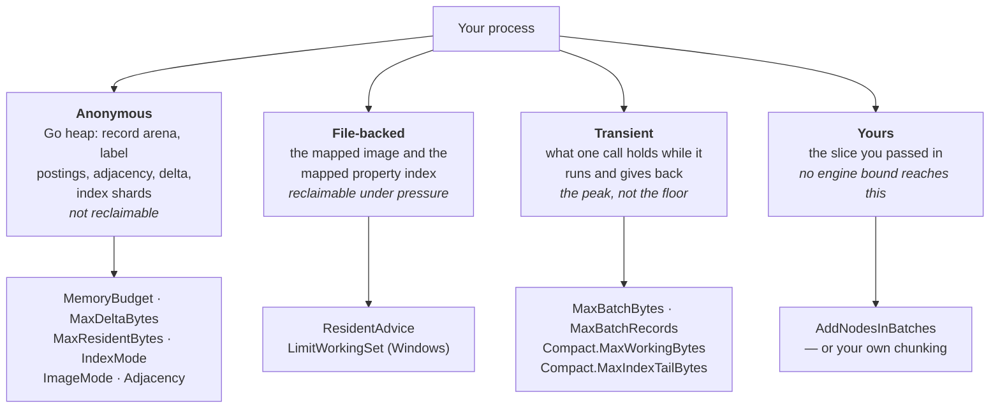
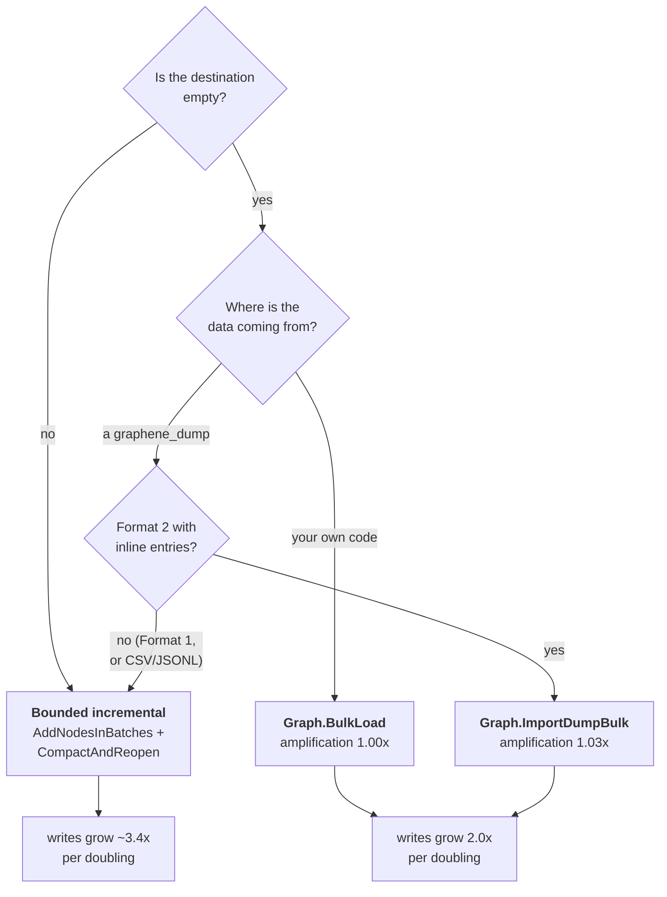

# Memory and performance: holding a 2 GiB ceiling

This is the operational guide for running Graphene inside a fixed memory budget
without giving up the speed you came for. It is written for engineers embedding
the library, and every figure in it is measured rather than modelled — where a
number is a projection it says so, and where two arms were not interleaved it
says that too.

`docs/MEMORY_MODEL.md` is the evidence: per-term coefficients, the harness, and
the measurements this document summarises. Read that when you need to know *why*
a figure is what it is. Read this when you need to know what to set.

---

## 1. Start here

If you want one configuration that holds a 2 GiB ceiling for a store of up to
roughly ten million records, this is it.

```go
g, err := graphene.OpenWithOptions(dir, disk.Options{
    // Discover the ceiling instead of hard-coding it. Under a container this
    // reads the cgroup; under a Job Object on Windows it reads the job.
    DiscoverMemoryBudget: true,

    // A refusal, not a degradation: an operation that will not fit is refused
    // at the door rather than attempted and OOM-killed half way through.
    MemoryBudget: 2 << 30,

    // The defaults, named so you can see they are deliberate.
    ImageMode: disk.ImageMapped,   // the record image is a mapping, not heap
    IndexMode: disk.IndexMapped,   // the property index is read in place

    // Background compaction, bounded by what the store actually holds rather
    // than by the delta alone.
    AutoCompact: &store.CompactionPolicy{
        MaxDeltaBytes:    32 << 20,
        MaxDeltaRecords:  200_000,
        MaxResidentBytes: 1 << 30,
    },
})
```

And for filling that store, the rule that matters more than every option above:

> **If the destination is empty, do not ingest. Load.**
> `Graph.BulkLoad` and `Graph.ImportDumpBulk` write the image once. An
> incremental ingest rewrites it once per bound, so what it writes grows with
> the square of what you are loading. At two hundred thousand 3.2 KB records
> that is **6.85 GiB against 0.64**, and the gap widens with every doubling.

And the limit both of them run into, because it is the question this guide is
most often read with the wrong answer to:

> **The ceiling is a record count, not a data size.** Payload is mapped, so bytes
> are nearly free against the anonymous budget; the per-record structures are not,
> and they are the store rather than a transient. **Roughly ten million records is
> comfortable and twenty-three million is the wall**, whatever those records
> weigh. Batching, committing and compacting between batches does **not** move it
> — see §4.6 before planning anything large.

Everything else in this document is the detail behind those blocks.

---

## 2. What a ceiling can and cannot mean

An operating-system limit **enforces**; it does not **control**. It converts
"used too much" into "stopped existing" — the cgroup OOM killer on Linux, a
refused commit and a Go runtime `fatal error: out of memory` on Windows. Neither
is recoverable: an allocation failure in Go is a runtime throw, not a panic.

Graphene is a library inside your process, so an overshoot kills *your*
application. The write-ahead log makes that survivable rather than corrupting — a
batch is applied on replay only when its commit marker landed, and a torn tail is
dropped — so the cost is lost uncommitted work plus a replay. That is the floor
on the damage, and it is why the engine's own bounds are refusals rather than
best-effort.

**So Graphene reads limits; it does not impose them.**

| | discover the ceiling | bound anonymous | bound resident | measure |
|---|---|---|---|---|
| Linux | cgroup v2 `memory.max` / `memory.high`, v1 `memory.limit_in_bytes`, else `MemTotal` | `GOMEMLIMIT` | `madvise` on the mapping | `RssAnon`/`RssFile`, `memory.peak` |
| Windows | `QueryInformationJobObject`, else `GlobalMemoryStatusEx` | `GOMEMLIMIT` | `SetProcessWorkingSetSizeEx` | commit charge, `PeakJobMemoryUsed` |
| macOS | `sysctl hw.memsize` only — **best effort** | `GOMEMLIMIT` | `madvise` | `getrusage` peak only |

`Options.DiscoverMemoryBudget` performs the first column and reports which source
answered through `StorageStats.MemoryBudgetSource`. A discovered budget is never
larger than one you configured explicitly.

**macOS can never verify a ceiling, so it must never need one.** The
cross-platform guarantee comes from the in-code bounds; Linux and Windows
acceptance runs are the *check* on arithmetic that holds everywhere.

**Graphene will not set `GOMEMLIMIT` for you.** It is process-global and this is
a guest in your process. Set it in your deployment. It is soft — it reclaims
garbage and cannot shrink a live set — so it targets the gap between the modelled
heap and what the process charges, and nothing below the live floor. Measured on
the passing arm: **128 MiB of headroom recovers 36% of that gap for free, and
64 MiB recovers 44% for 51% more wall clock.** Below the live floor its failure
mode is a GC death spiral.

---

## 3. The four classes, and which knob moves which

Almost every memory question here is really "which of these four is growing?"



Two consequences worth internalising:

**File-backed is not free, but it is not anonymous either.** A cgroup charges it;
an operator's dashboard shows it; reclaim under pressure is a latency event. But
the kernel *can* take it back, and it cannot take anonymous memory back. Moving a
term from anonymous to file-backed is the single highest-leverage change
available, which is why `ImageMapped` and `IndexMapped` are the defaults. A store
now holds **1.04× its own file in RSS instead of 3.49×**.

**The caller's own slice is nobody else's problem.** A ten-million-element slice
passed to `AddNodes` is an argument; no cap inside the engine can bound it. The
batch caps bound what the engine adds *on top*.

---

## 4. Filling a store: pick the path first, tune second

This is where the ceiling is won or lost. The knobs in §1 matter far less than
this choice.



### 4.1 What the choice costs, measured

One dump, imported both ways, into an empty store. 3.2 KB records, four index
entries each, `-bound 32` on the incremental arm, Windows on ReFS.

| records | dump size | incremental writes | one-pass writes | incremental peak anon | one-pass peak anon | incremental wall | one-pass wall |
|---:|---:|---:|---:|---:|---:|---:|---:|
| 50,000 | 0.15 GiB | 0.75 GiB | **0.16 GiB** | 169.1 MiB | **93.3 MiB** | 3.27 s | **1.44 s** |
| 100,000 | 0.31 | 2.02 | **0.32** | 202.2 | **118.9** | 8.04 | **2.54** |
| 200,000 | 0.62 | 6.85 | **0.64** | 214.7 | **157.5** | 25.92 | **5.91** |

Read the *ratios between rows*, not the rows:

- **Writes.** Incremental grows **2.69× then 3.39× per doubling**. One-pass grows
  **2.00× then 2.00×** — exactly linear, to three digits, twice.
- **Write amplification** (bytes written ÷ bytes of data): incremental **5.0× →
  6.5× → 11.0×**, rising. One-pass **1.07× → 1.03× → 1.03×**, flat.
- **Wall clock**: one-pass is **2.3× → 3.2× → 4.4×** faster, widening for the
  same reason.

Taken directly rather than through a dump, `BulkLoad` at the target shape writes
**3.70 GiB at one million records and 7.39 GiB at two million — amplification
1.00× at both, 3,969 B per node against 3,971 B at twenty-five thousand.** Flat
across an eightyfold range.

### 4.2 The honest caveat: the one-pass peak is not bounded by a knob

Look again at the peak column. The one-pass arm is lower at **all three sizes**
(0.55×, 0.59×, 0.73×) — and it is *rising faster*. The incremental arm's peak is
nearly flat (169 → 202 → 215 MiB) because `-bound 32` is holding it there. That is
the bound doing its job.

So the two trends converge, and on these three points they would meet somewhere
above a few hundred thousand records. **Do not read that crossover as a measured
number — it is an extrapolation from three points and this arm was not built to
find it.** What it does establish is the shape of the trade:

- the **one-pass** path is bounded by *the graph*: the external sort, plus eight
  bytes per node for identifier remapping, plus the final reopen;
- the **incremental** path is bounded by *a figure you choose*, and pays for that
  in writes that grow quadratically.

If your store is large enough that the one-pass peak is the binding constraint,
the answer is `MEMORY_MODEL.md` §9.12's measurement of the load itself, which is
**flat at 10.3–13.9 MiB across an eightyfold size range**. The growing term is the
reopen at the end, and every path pays that.

### 4.3 The three things a bulk load gives up

Stated before the benefits, because they are not negotiable:

1. **It is atomic and not incremental.** A crash means the load did not happen.
   There is nothing to resume from. In exchange, a failure leaves the directory
   exactly as it was found.
2. **The store is not readable while it runs.**
3. **It needs an empty store.** A store holding records is refused with
   `disk.ErrBulkLoadNotEmpty` rather than merged into.

Declare your ordered and composite index keys **before** the load. A composite is
computed from a record's entries as the record goes past, so a tuple declared
afterwards describes nothing until the next compaction.

### 4.4 Importing a dump

```go
g, sum, err := g.ImportDumpBulk(func() (io.ReadCloser, error) {
    return os.Open(path)
}, graphene.BulkImportOptions{})
```

The source is a *function that opens* rather than a reader, because a load asks
for every node and then, separately, for every edge — so the dump is read twice.
A file can be re-opened; a pipe cannot, and a piped dump has to be staged to a
file first. Staging it is cheaper than what the incremental path would write.

It needs a **Format 2 dump whose records carry their own index entries**. Format 1
kept every entry in a key-major section after the records, so one record's entries
are spread across the whole of it and gathering them means holding every triple —
the memory a one-pass load exists not to spend. A dump that cannot drive a load is
refused with `graphene.ErrDumpNotBulkLoadable` **at the header, before anything is
written**, and your handle survives the refusal so you can fall back to
`bulk.ImportDump` on the same file.

From the command line this is automatic:

```console
$ graphene import graph -format dump -from graph.dump ./store
  into   ./store
  nodes  200000
  mode   one-pass
```

`mode` tells you which path ran. Naming any of `-batch`, `-batch-bytes`, `-bound`
or `-compact` selects the incremental path, because those flags are only
meaningful there — an import that quietly took a different route would look like
your `-bound` had been honoured. Asking for both is refused rather than resolved.

### 4.5 When you must ingest incrementally

Into a store that already holds records, this is the arm that holds a ceiling:

```go
policy := store.DefaultCompactionPolicy()
policy.MaxDeltaBytes = 32 << 20

for chunk := range chunks {
    if _, err := g.AddNodesInBatches(chunk); err != nil { /* ... */ }

    if due, _ := policy.Evaluate(mustStats(g)); due {
        // CompactAndReopen, not Compact. See below.
        if g, err = g.CompactAndReopen(); err != nil { /* ... */ }
    }
}
```

**`CompactAndReopen`, never a bare `Compact`, in a loop.** A compaction writes a
new image and then goes on serving the records it wrote *out of the heap*, because
a base is attached on the load path and a compaction is not one. A long ingest
therefore ratchets. Measured: the payload term climbed **49.0 MiB per 100,000
records and never reset**, reaching 661.8 MiB at the point where the run died.
Reopening is what gives those bytes back.

`AutoCompact` **cannot** do this for you — it is a background goroutine and it has
no way to hand you a new handle. It bounds the delta and not the payload term.
That is a real limitation and it is why the loop above is written out.

### 4.6 The limit batching does not move: record count, not data size

The loop in §4.5 is the right loop, and it is worth being precise about what it
buys, because the obvious reading of this guide is more optimistic than the
engine is.

**It bounds three of the four classes in §3 and not the fourth.** The delta, the
batch transient and the compaction working set are all bounded by figures you
choose. What is left is the per-record structure the store holds *at rest* —
record arrays at 56 B, label postings at 8, adjacency at 16, and the property
index on top. That is not a transient. It is the store, it grows with every
record you add, and no option in §8 reduces it below what the records require.

So committing and compacting between batches keeps each *step* small. It does
nothing about the total, and the total is what the ceiling is measured against.

#### The arithmetic

From §5's measured slope — **87.0 MiB per million records above a 49.7 MiB
intercept**:

| records | peak anonymous | headroom under 2 GiB |
|---:|---:|---:|
| 1,000,000 | 136.7 MiB *(measured)* | 93% |
| 2,000,000 | 223.7 *(measured)* | 89% |
| 5,000,000 | ~485 | 76% |
| 10,000,000 | ~920 | 55% |
| 15,000,000 | ~1,355 | 34% |
| 20,000,000 | ~1,790 | 13% |
| **22,970,000** | **~2,048** | **none — an open alone fills the ceiling** |

Everything up to two million is measured; the rest is that line extended. Two
points cannot show that a line is straight, so what the extrapolation actually
rests on is §9's decomposition: the per-record terms are slice lengths, linear in
the record count by construction, and they sum to the measured total. The risk in
the table is therefore not curvature — it is your schema, because the property
index sits on top of these figures and is the one term that depends on what you
declare.

Treat ~10M as the size to plan for and ~23M as the wall, because at the wall the
store opens and there is nothing left to read it with.

#### Which is why "terabytes" has no single answer

Property blobs live in the mapped image. They are file-backed, so they cost
almost nothing against the anonymous budget — the payload term at rest is **2 B
per node**. It is the *count* that costs. At ten million records:

| average record | total data on disk | under a 2 GiB ceiling |
|---:|---:|---|
| 256 B | 2.6 GB | fits |
| 3.2 KB | 32 GB | fits — this is the shape everything here is measured at |
| 32 KB | 328 GB | fits |
| 100 KB | **1.0 TB** | fits |
| 1 MB | **10.5 TB** | fits |

So terabytes are reachable, and reachable comfortably, **when your records are
large**. They are not reachable by adding hundreds of millions of small ones: one
terabyte at 3.2 KB a record is 312 million records, which projects to **26.6 GiB
of anonymous memory — thirteen times over the ceiling.** No amount of batching
changes that number, because it is what the store holds after the ingest has
finished.

#### Three things that bite before memory does

- **Write volume, on the incremental path.** §4.1 measured its writes growing
  2.69× then 3.39× per doubling. Extended from 6.85 GiB at two hundred thousand
  records, a hundred-million-record incremental ingest is in the petabytes
  written. Memory is not what stops it. `BulkLoad` writes 1.00× — but it is
  atomic, one-shot and needs an empty store, so it is not a "batch, then next
  batch" loop either.
- **Deletes do not give the arena back.** `ResidentEstimate.RecordArrays` scales
  with *identifiers issued*, not records held, because a page is materialised
  whole. A long-lived store that churns walks toward the wall at constant size.
  `StorageStats.HighestNodeID` is the figure to watch, not the record count.
- **A cgroup charges file-backed pages too.** They are reclaimable, so a
  multi-terabyte mapping under a 2 GiB limit thrashes rather than OOM-kills you.
  That is the better failure of the two, and it is still a failure: random access
  over a mapping far larger than the limit degrades badly. `ResidentAdvice` (§7)
  is the knob aimed at this.

#### What would move the wall, and what to do until it does

Packing the record arena from 56 to 24 bytes a record is designed and costed in
`disk/arena_spike_test.go` and needs no format change. It would take the slope
from 87.0 to **56.5 MiB per million**, putting ten million at ~615 MiB and the
wall at **~35 million records**. **It is not built**, because at the shapes
measured so far it is not needed; do not plan against it.

If you are past the wall, the answer is not a setting. It is more than one store:
partition by whatever your queries already partition by — time window, tenant,
case — and give each its own directory and its own budget. The engine does not do
this for you, and this guide would rather say so than imply a knob exists.

---

## 5. Reading: what an open holds

An open of a store holds what the store holds, and essentially nothing else.

| records | peak anonymous | settled | transient above settled | open wall |
|---:|---:|---:|---:|---:|
| 1,000,000 | 136.7 MiB | 136.5 | 0.2 | 1.09 s |
| 2,000,000 | 223.7 | 223.1 | 0.6 | 2.12 s |

**87.0 MiB per million records above a 49.7 MiB intercept**, so ten million
projects to **920 MiB — 55% headroom under 2 GiB**. Both rows are a second
reading; the first pair came out at 136.8 and 220.6, so the two-million figure
moves 1.4% between runs and that spread is this instrument's precision.

At the full consumer shape — 1.4M nodes, a 1,689 MiB image, 18.2M index entries —
a reader reaches **561 MiB anonymous, 70% headroom under a real 2 GiB cgroup**,
measured directly under the limit rather than projected.

### 5.1 The three residency options are independent and additive

Each moves exactly one term, and they sum to the byte:

| option | what it moves | measured |
|---|---|---:|
| `IndexMode: IndexMapped` *(default)* | the property index | 273.26 MiB |
| `ImageMode: ImageMapped` *(default)* | the record image's blobs | 149.44 MiB of heap |
| `Adjacency: AdjacencyLazy` | the four adjacency arrays | 6.11 MiB |

Total 428.81 MiB, which is exactly what the total column moves.

> **A live reader taking the defaults gets neither mapping and pays 3.8×.**
> `Options.LiveReader` forgoes the directory lock, and a mapping needs it. Use
> `ImageMappedUnlocked` only if you understand that an outside process truncating
> the file will `SIGBUS` your process on Unix.

`AdjacencyLazy` is worth **15.5 MiB less anonymous memory and an 11% faster open**
for a property-only pass. It is not the default because **a writer that deletes
gets nothing from it**: `DeleteNode`'s cascade to incident edges reads those
arrays, so the first delete builds them. Check `StorageStats.Adjacency` to see
which side of the build a handle is actually on.

`IndexMapped` is dramatic on a sparse index: **236 bytes for 64,000 entries**
against 6.85 MB resident.

---

## 6. Bounding a single call: batch control

`Options.MaxBatchBytes` and `Options.MaxBatchRecords` cap one write and refuse it
with `disk.ErrBatchTooLarge`, carrying both the offending figure and the cap so
you can split without guessing. The check runs **before any ID is taken and before
the lock**.

Two dimensions, because neither alone is a bound: a byte cap does not bound a
million empty nodes, and a record cap does not bound ten records carrying a
gigabyte each.

**You do not have to set them.** Left at zero they derive from the effective
memory budget, so turning the budget down turns the caps down with it and the two
cannot be set inconsistently. Inconsistent explicit values are refused at `Open`.

### What the cap actually costs you

The cap is a figure in the *delta's* accounting. What it is *for* is the memory
one call holds while it runs, and those are not the same number:

| shape | peak held ÷ charged | retained ÷ charged |
|---|---:|---:|
| empty records | 3.20× | 0.59 |
| 256 B blobs | 4.36× | 0.90 |
| 3,200 B blobs | 4.27× | 0.99 |

So a batch at the cap holds **3.2–4.4× what the cap charges it**. The derived
fraction is 2% of the budget, which means 2% of a 2 GiB budget is 41 MiB charged
and roughly **176 MiB actually held — 8.6% of the budget**. That is the figure to
plan against.

For an input you cannot size in advance, `AddNodesInBatches` and
`AddEdgesInBatches` split and commit repeatedly. **They are deliberately not
atomic**, and they are a separate API for exactly that reason: `AddNodes`
guarantees all-or-nothing and silently splitting it would be a defect rather than
a feature.

### The gap `MaxDeltaBytes` does not see

`DeltaBytes` counts record payloads. The property index those same writes created
is **not in it**. At a heavily-indexed shape the ratio is **1,893 B held against
338 B watched — 5.6×**; the multiplier is `1 + 107·entries/recordBytes`, so
roughly 1.45× for fat records and much worse for small heavily-indexed ones.

Use `CompactionPolicy.MaxResidentBytes` alongside it. It is the only one of the
five rules that sees what actually grows, reading `StorageStats.EstimatedResidentBytes`
— which is O(1) specifically so a policy can poll it. Treat that figure as a
**floor, not a budget**: during a rebuild the process charges roughly 2.6× the
modelled heap.

---

## 7. Bounding the resident (file-backed) class

Moving terms into a mapping makes them reclaimable, not absent. Two opt-in
mechanisms reduce what is actually resident.

**`Options.ResidentAdvice`** advises the kernel per phase: sequential over a parse
and a compaction's read, random for the point-lookup life in between, and the
record image's pages dropped once a compaction has finished with them.

Measured on Linux, interleaved, four rounds: **file-backed residency after a
compaction falls 53.28 → 6.38 MiB — 88% less, 8.35×**, with the arms' ranges not
touching, and the anonymous control flat at 1.006.

It is **off by default, and stays off**, because only half the trade is measured.
The residency drop is measured; the page-fault cost on the next query is reasoned.
Turn it on when residency is your binding constraint and you can measure the
latency yourself. Note also what it does *not* do: it does **not** reduce the peak
*during* a compaction (0.994). An unsupported platform reports through
`MetricResidentAdvice` rather than failing silently.

**`disk.LimitWorkingSet` / `LimitWorkingSetFromCeiling`** (Windows) caps resident
bytes directly with `QUOTA_LIMITS_HARDWS_MAX_ENABLE`, **trimming rather than
killing**. It is a function and not an `Option` because it acts on the whole
process — the same reason `GOMEMLIMIT` is a deployment knob. The cap is read back
through `GetProcessWorkingSetSizeEx`, so one that failed to apply cannot report as
applied.

---

## 8. Every bound in one table

| bound | unit | default | what it does **not** cover |
|---|---|---|---|
| `MemoryBudget` | bytes | 0 (none) | gates `Open` and `Compact` only; a refused compaction leaves a growing delta |
| `DiscoverMemoryBudget` | bool | false | never exceeds an explicit `MemoryBudget` |
| `MaxBatchBytes` / `MaxBatchRecords` | bytes / records | derived from budget | the slice you passed in; the index entries a write creates |
| `CompactionPolicy.MaxDeltaBytes` | bytes | 128 MiB | the property index — see the 5.6× above |
| `CompactionPolicy.MaxDeltaRecords` | records | set | byte size |
| `CompactionPolicy.MaxResidentBytes` | bytes | 0 (off) | it is a floor; a rebuild charges ~2.6× the modelled heap |
| `Compact.MaxWorkingBytes` | bytes | 4,325,376 | only a mapped-index compaction's four intermediates |
| `Compact.MaxIndexTailBytes` | bytes | 16 MiB (floor 64 KiB) | overflow means the index stays resident, not an error |
| `ResidentAdvice` | bool | false | anonymous memory; the peak *during* a compaction |
| `ImageMode` / `IndexMode` / `Adjacency` | mode | mapped / mapped / eager | each moves exactly one term |
| `DeltaSoftLimit` | bytes | 0 | **reports only; never acts** |
| `GOMEMLIMIT` | bytes | unset | the live set; it reclaims garbage only |

Two knobs where the obvious instinct is wrong:

- **Raising `Compact.MaxWorkingBytes` buys nothing.** Fifteen times the memory
  produced no measurable improvement. Going the other way does buy something: the
  floor saves 3.32 MiB for 12–42% more compaction wall clock.
- **`DeltaSoftLimit` does not act.** It reports. Use `MaxDeltaBytes` and
  `MaxResidentBytes` to act.

---

## 9. Capacity planning

### At rest

A store that has been compacted and reopened holds, per node:

| term | bytes |
|---|---:|
| record arrays | 56 |
| label postings | 8 |
| adjacency | 16 |
| payload (mapped) | 2 |
| composites (since GCPX) | 0 |
| **total** | **82** |

That is 78.5 MiB at one million records, decomposing exactly as the coefficients
predict. Ten million is roughly **820 MiB anonymous plus ~32 GiB of evictable page
cache** — and the measured open figure in §5, 920 MiB at ten million, is the same
statement including the load's own working set.

The property index is on top and depends on your schema. The multiplier is
`1 + 107·entries/recordBytes` against the record bytes.

### Three shapes under 2 GiB

| shape | records | indexed entries each | anonymous at rest | verdict |
|---|---:|---:|---|---|
| fat records (3.2 KB) | 10,000,000 | 4 | ~920 MiB | **fits, 55% headroom** |
| the audited consumer | 1,400,000 | 13 | 561 MiB measured | **fits, 70% headroom** |
| small, heavily indexed (256 B) | 1,000,000 | 13 | 78.5 MiB records + a much larger index | index dominates — measure it |

The third row is the one to be careful with. At 256 B records and 13 entries each
the multiplier is roughly 6.4×, and the index is the store. `EstimateResident`
breaks the total into seven terms; read it rather than guessing.

All three rows are sized by their **record count**, and none of them is near the
wall. **§4.6 is where the wall is** — ~23 million records, whatever they weigh —
and it is the first thing to check when planning something larger than these.

### What a rebuild costs, which is not the same question

Reading a 1.4M store fits in 561 MiB. Rebuilding the whole layer **in the same
process** needed 3,853 MiB — missing the target by 3.2×. Bounding the delta barely
helped, because a compaction leaves its own output resident until the store is
reopened.

That is now largely closed: installing the compacted base at the commit takes the
index term from 83.8 MiB to 15.3, identical to a reopen, and bounding the delta
**starts working** — it bought 3.8% before and 36% after, taking a 200k rebuild
under a real 2 GiB limit from **829.9 to 520.0 MiB charged, 59.5% to 74.6%
headroom**. The price is a lookup after compacting at 98–124 ns, which is what the
same store already cost reopened.

**Plan a rebuild as a separate budget from a read.** They are different workloads
and the arithmetic does not transfer.

---

## 10. Verifying it where you run

Do not take this document's word for it. Three instruments, in increasing order of
effort:

**1. `StorageStats`, continuously.**

```go
st, ok := g.StorageStats()
// st.EstimatedResidentBytes — O(1), safe to poll
// st.DeltaBytes            — what MaxDeltaBytes watches
// st.IndexMode, st.ImageMode, st.Adjacency — which side of each trade you are on
```

`st.Adjacency` is worth watching specifically: it tells you whether a handle you
opened `AdjacencyLazy` has since built the arrays anyway because something
deleted.

**2. `Options.ReportProcessMemory`**, for the real anonymous/file-backed split.

Off by default, because `StorageStats` is polled and this is its only field that
asks the kernel a question (~800 ns, 2 allocations on Windows). Check
`st.Process.Split` before trusting the numbers: on Windows the split collapses
whenever commit charge meets or exceeds the working set, which is the common case
rather than an edge, and it now reports `Split=false` instead of a misleading zero.

**3. The ceiling harness**, for acceptance.

`tests/ceiling_test.go` runs your workload under a real cgroup v2 limit on Linux or
a real Job Object on Windows, **reads the limit back** so one that failed to apply
cannot go green, and treats `oom_kill > 0` as a hard failure. That is the only kind
of evidence that settles the question.

---

## 11. When it goes wrong

| symptom | most likely cause | what to do |
|---|---|---|
| memory climbs steadily through a long ingest and never falls | `Compact()` in a loop without reopening | `CompactAndReopen` |
| memory climbs even with `CompactAndReopen` every batch | the store itself is growing; batching bounds steps, not totals | §4.6 — check the record count against ~23M |
| a store at constant size drifts upward over months | the arena scales with identifiers issued, and deletes do not return them | watch `StorageStats.HighestNodeID`; rebuild into a fresh directory |
| an ingest writes far more than the data | incremental path into an empty store | `BulkLoad` / `ImportDumpBulk` |
| `MaxDeltaBytes` is set but memory still climbs | the property index is not in `DeltaBytes` (up to 5.6×) | add `MaxResidentBytes` |
| `AutoCompact` is on and the payload term still ratchets | it cannot reopen, by construction | compact from your own loop |
| RSS is large but the process is fine | the mapped image — file-backed and reclaimable | check `st.Process.Split`; consider `ResidentAdvice` |
| a query returns nothing after switching index modes | not a memory problem | see `MEMORY_MODEL.md` §7 |
| `ErrBatchTooLarge` | working as designed | `AddNodesInBatches`, accepting the loss of atomicity |
| `ErrBulkLoadNotEmpty` | the destination already holds records | incremental path, or load into a fresh directory |
| `ErrDumpNotBulkLoadable` | Format 1 dump, or one exported without entries | re-export with this build, or `bulk.ImportDump` |

---

## 12. Where these numbers come from

Every figure here is measured on a real kernel with the arms interleaved where
wall clock is involved. Two standing rules from `docs/benchmarks.md` apply to
anything you measure yourself:

- **Timing differences below roughly 25% are not resolvable in this dataset.** A
  1.1× wall-clock difference is noise unless the arms' ranges do not touch.
- **Bytes written and peak committed bytes are counters**, so they need no
  interleaving — but a peak is *sampled*, and a sampled peak can miss a spike.

Where a measurement was superseded, the old figure is marked in place rather than
deleted, so you can see which way an estimate moved and by how much. Where
something is a projection rather than a measurement — the ten-million row in §5
and §9, and the crossover in §4.2 — it is labelled as one.

Source sections: `MEMORY_MODEL.md` §4.2 (the transient model), §6 (the runtime's
share), §8 (the residency options, measured together), §9.7 (per-record
coefficients), §9.8 (the ratchet), §9.9–9.10 (the ingest series and the
`GOMEMLIMIT` sweep), §9.11–9.13 (the bulk arm, the target shape, and what an open
stopped holding).
