# GrapheneDB — Technical Details

The low-level design. This is the document to read **before modifying the
engine**: it describes every on-disk structure to the byte, every non-obvious
algorithm, the concurrency protocol, and — importantly — the alternatives that
were tried and rejected, so they are not re-attempted.

For *using* the engine, read [API_REFERENCE.md](API_REFERENCE.md) and
[USER_GUIDE.md](USER_GUIDE.md). For numbers, read [benchmarks.md](benchmarks.md);
for what holds resident memory and why, [MEMORY_MODEL.md](MEMORY_MODEL.md) — and
its §8 for what each of the three residency options costs, before choosing any of
them, and its §9 for what fits under a real 2 GiB ceiling and what does not;
figures here are illustrative and that document is authoritative.

**Status.** Pre-production. This describes the current implementation, not a
frozen contract. It is an embedded native graph engine — it owns its graph-shaped
storage layout directly — not yet a production-complete peer to server-oriented
graph databases.

---

## Contents

1. [System intent](#1-system-intent)
2. [Architecture](#2-architecture)
3. [Storage model](#3-storage-model)
4. [On-disk formats](#4-on-disk-formats)
5. [Read and write paths](#5-read-and-write-paths)
6. [Indexing internals](#6-indexing-internals)
7. [Query planning and execution](#7-query-planning-and-execution)
8. [Traversal and pattern matching](#8-traversal-and-pattern-matching)
9. [Concurrency and safety](#9-concurrency-and-safety)
10. [Consistency model](#10-consistency-model)
11. [Failure and recovery](#11-failure-and-recovery)
12. [Worked examples](#12-worked-examples)
13. [Extension points](#13-extension-points)
14. [Trade-offs and rejected alternatives](#14-trade-offs-and-rejected-alternatives)
15. [Invariants](#15-invariants)
16. [Known limitations](#16-known-limitations)

---

## 1. System intent

One workload shape drives every decision here:

1. Ingest large, connected datasets quickly.
2. Persist safely, with crash recovery.
3. Run many read-heavy graph queries and traversals against a long-lived process.

Point three is why several trade-offs land where they do. Opens are counted per
process; lookups are counted per query. Anything that makes startup cheaper by
taxing every read is the wrong direction — see §14.

---

## 2. Architecture

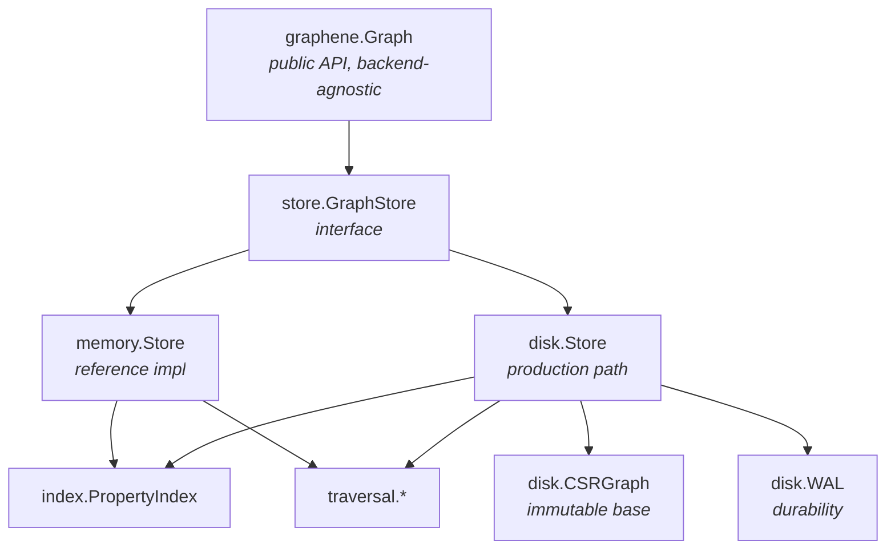

### 2.1 Component responsibilities

| Component | Responsibility |
|---|---|
| `graphene.Graph` | Façade: batch helpers, result utilities, visualisation hand-off |
| `store.GraphStore` | The contract both backends satisfy |
| `store` (types) | IDs, records, queries, filters, sorted-ID helpers, plan types |
| `memory.Store` | In-memory reference implementation |
| `disk.Store` | CSR + delta + WAL; the production path |
| `disk.CSRGraph` | Immutable compacted base, addressed by ID |
| `disk.WAL` | Append-only durability log with a lock-free ring buffer |
| `index.PropertyIndex` | Sharded secondary index, forward and reverse |
| `index.orderedIndex` | Sorted values per declared key |
| `index/encoding` | Order-preserving encoders |
| `traversal` | BFS, DFS, shortest path, subgraph matching |
| `viz` | Standalone HTML export |

### 2.2 Why a façade

`Graph` delegates almost everything, which is why most of its methods are
one-liners. The intent is that **the interface is the contract** and the façade
never becomes a second place where behaviour lives. When a method here contains
logic, that is a smell worth checking.

### 2.3 Capability interfaces, not one fat interface

`GraphStore` carries only what every backend must have. Everything optional is a
small separate interface a backend may satisfy, which callers type-assert:

| Interface | Purpose |
|---|---|
| `AdjacencyReader` | `IncidentEdges` into a caller buffer; `NodeExists` without materialising |
| `BatchReader` | `GetNodesBatch` / `GetEdgesBatch` — many IDs under one lock hold |
| `Transactor` | `ReserveNodeID`/`ReserveEdgeID` and `ApplyTransaction([]TxOp)` — the multi-record commit behind `Graph.Begin` (§5.1a) |
| `Syncer` | `Sync` — force pending writes durable without a full `Compact()` |
| `DegreeCounter` | Degree from CSR offsets without building records |
| `Reindexer` | `UpdateNodeIndexed`, reindex policy |
| `IndexVerifier` | `VerifyIndexes` |
| `IndexRebuilder` | `RebuildIndexes` |
| `OrderedIndexDeclarer` | `DeclareOrderedProperty` |
| `UniqueIndexDeclarer` | `DeclareUniqueProperty`, and the owner lookups upsert needs |
| `EdgeCardinalityDeclarer` | `DeclareUniqueEdge`, `EdgeBetween` (§6.8) |
| `Aggregator` | `CountNodesByType`, `CountNodesByProperty` and their edge forms (§6.9) |
| `NodeQueryExplainer` / `EdgeQueryExplainer` | Query plans |

This is what lets the disk backend expose a zero-allocation degree count from CSR
offsets without forcing the memory backend into the same shape, and lets callers
degrade gracefully rather than crash on a backend that lacks a capability.

**Three of them do not degrade, and the distinction matters.** Most of these are
optimisations: a backend ignoring `DegreeCounter` answers every question
correctly, only slower, so `Graph` type-asserts and falls back. But
`UniqueIndexDeclarer` and `EdgeCardinalityDeclarer` are *constraints* — a store
that quietly does not enforce one has handed the caller the guarantee they asked
for and none of the behaviour — and `Aggregator` has no fallback to degrade to,
because a `GraphStore` cannot enumerate its own types and an empty map would say
the graph is empty. All three return an error on a backend that lacks them.

---

## 3. Storage model

### 3.1 Core model

Property graph. Nodes and edges both carry:

- a monotonic ID (`NodeID` / `EdgeID`, `uint64`, never reused — §15),
- zero or more `uint16` labels,
- an opaque property blob (msgpack by convention; the storage layer never parses
  it).

Edges additionally carry `Src`, `Dst` and a `float32` weight.

**The blob is opaque on purpose.** The engine never decodes it, which is why
property *indexing* is explicit: the caller supplies `(key, value)` pairs in its
own encoding. That keeps the storage layer schema-agnostic at the cost of making
index maintenance the caller's responsibility on update (§6.5).

### 3.2 The disk store is a two-layer read

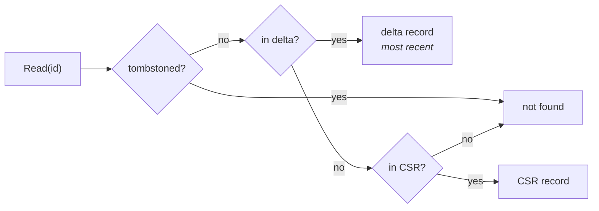

| Layer | Contents | Mutability |
|---|---|---|
| Delta | records written since the last compaction, plus tombstones | mutable Go maps |
| CSR | the compacted base | **immutable once published** |

That asymmetry is the whole basis of the lock-free read path (§9.2): the delta
needs a lock because it is a map, but the CSR does not because it never changes.

`Compact()` folds the delta into a fresh CSR, publishes it atomically, and
empties the WAL.

### 3.3 Why CSR

Compressed Sparse Row, addressed through a **two-level page table**. The
identifier space is cut into pages of 4096; a directory maps a page number to an
arena page, or to −1 when nothing falls in it:

```
 id = 4099                    id >> 12 = 1        id & 4095 = 3

                    ┌───────────────────────────────────────────┐
 nodeDir[]          │ 0 │ 1 │ -1 │ -1 │ 2 │  int32 per 4096 IDs  │
                    └───────────────────────────────────────────┘
                           └──┐  a page nothing occupies costs 4 bytes
                    ┌─────────▼─────────────────────────────────┐
 nodeRecs[]         │ page 0: 4096 slots │ page 1: 4096 slots │…│
                    └───────────────────────────────────────────┘
                    GetNode(4099) = nodeRecs[1<<12 | 3], then rec.ID == 4099
                                              ← two dependent loads, ~6-8 ns

 outOffset[]        │ 0 │ 2 │ 5 │ 5 │ 7 │      len = slots + 1, indexed by slot
                       └───┬───┘
 outEdges[]         │ e₃ │ e₇ │ e₁ │ e₄ │ e₉ │ e₂ │ e₅ │

 neighbours(1) = outEdges[outOffset[slot(1)] : outOffset[slot(1)+1]] = [e₁, e₄, e₉]
```

Arena pages are handed out in ascending page number, so **arena order is
identifier order**: a linear walk of the arena that skips the zero-valued dead
slots visits exactly the live records, ascending — which is the order the file
is written in and the order the Merkle leaves are hashed in. Nothing about the
pages reaches disk; they are a load-time construct, like the adjacency arrays
themselves.

Three properties follow, and they are the reason for the layout:

1. **A point lookup is two array indexes**, not a hash — no hashing, no probe
   chain. The directory for a live band of 1.5M identifiers is 367 entries,
   which stays in L1.
2. **Adjacency is contiguous**, so a traversal walks memory linearly rather than
   chasing pointers. One CSR spans the whole slot space with a single sentinel,
   so the range of a page's last slot is closed by the next page's first.
3. **Degree is `outOffset[s+1] - outOffset[s]`** — O(1), zero allocation, no
   record materialised.

**The cost:** the arenas follow the pages the live identifiers fall in, not the
live count, so deletions leave holes until `Compact()` and a page keeps its 4096
slots until nothing in it survives. Measured at 715 B per live node
half-deleted-uncompacted against 158 B compacted — **4.5×**. What it is no
longer proportional to is the *highest identifier ever issued*: a page whose
records have all been deleted and compacted away costs one int32, which is what
makes a repeated rebuild bounded (§14.15).

---

## 4. On-disk formats

**Everything is little-endian.**

A minimal store is two files. Each opt-in integrity mechanism adds one more, and
none of them is created unless the corresponding option is set:

| File | Always? | Written by |
|---|---|---|
| `graphene.csr` | after the first `Compact()` | compaction |
| `graphene.wal` | yes | every mutation |
| `graphene.NNN.wal` | `Options.Retention` | segment rotation at compaction |
| `graphene.audit` | `Options.Audit` | operator actions |
| `graphene.redactions` | `Options.Redaction` | attributed removals |
| `graphene.grants` | `Options.Roles` | privilege changes |
| `graphene.checkpoints` | on `PublishCheckpoint` | anchoring |
| `graphene.labels` | on `DeclareTypeNames` | the custom-label name table (§4.5) |
| `graphene.schema` | on any `Declare*` | the declaration catalogue (§4.6) |

The four ledgers are each hash-chained and independently readable; see
[FORENSICS.md](FORENSICS.md).

Everything after the first two rows is a **sidecar**: a file beside the image
rather than a section inside it. That is what lets each of them be added without
a format generation, and what lets an engine that predates one ignore it and read
the store correctly anyway. `Backup` copies the directory rather than a list of
names it knows, so a new sidecar travels with no change to backup.

### 4.1 CSR file layout

v8 turned the file into a **sectioned container**. Before it, every capability
needing to persist something required a version bump; v8 carries a section
directory instead, so a new capability adds a section and leaves the version
alone. Three have been added since without touching it.

```
┌─────────────────────────────────────────────────────────┐
│ HEADER (102 bytes, v8)                                  │
├─────────────────────────────────────────────────────────┤
│ NODE RECORDS      × nodeCount     (variable length)     │
├─────────────────────────────────────────────────────────┤
│ EDGE RECORDS      × edgeCount     (variable length)     │
├─────────────────────────────────────────────────────────┤
│ SECTIONS, in directory order                            │
├─────────────────────────────────────────────────────────┤
│ SECTION DIRECTORY  ← at header.sectionTableOffset        │
└─────────────────────────────────────────────────────────┘
```

v2–v6 also carried flat adjacency arrays between the edge records and the index
section (`outOffset[] │ outEdges[] │ inOffset[] │ inEdges[]`). **v7 dropped
them**: the reader always rebuilt adjacency from the edge records and skipped the
arrays entirely, so they were ~21% of the file, written on every `Compact()` and
read by nobody. A v2–v6 file is still read, arrays and all.

**Header, v8 — 102 bytes.** The first 46 bytes are byte-identical in meaning to
v6/v7, so a reader can identify the file and its counts before it knows anything
about sections — which is what lets `cmd/graphene` report on a partially corrupt
file rather than refusing to say anything.

| Offset | Size | Field | Since |
|---:|---:|---|---|
| 0 | 4 | magic `GCSR` | v2 |
| 4 | 2 | version (2–8 readable, 8 written) | v2 |
| 6 | 8 | node count | v2 |
| 14 | 8 | edge count | v2 |
| 22 | 8 | node sequence high-water mark | v5 |
| 30 | 8 | edge sequence high-water mark | v5 |
| 38 | 8 | property-index section offset (**0 in v8**) | v6 |
| 46 | 8 | commit sequence high-water mark | v8 |
| 54 | 8 | last compaction time (**excluded from the digest**) | v8 |
| 62 | 8 | section table offset | v8 |
| 70 | 32 | SHA-256 digest, computed with these bytes zeroed | v8 |

The compaction timestamp is excluded from the digest deliberately: the digest is
an identity for *content*, two parties holding the same evidence must compute the
same value, and hashing a wall-clock reading would make two compactions of
identical content disagree.

**Sections.** Each directory entry is magic(4) + flags(4) + offset(8) +
length(8). Bit 0 of flags marks a section **CRITICAL**: a reader meeting an
unknown critical section must refuse the file, while an unknown optional one is
skipped. Same rule as unknown WAL record types, for the same reason — a build
that cannot check an attestation must not present the file as though it had.

| Magic | Contents | Critical |
|---|---|---|
| `GIDX` | property index | no — losing it costs a scan, not an answer |
| `GORD` | ordered-key declarations | no |
| `GHSH` | snapshot roots | **yes** |
| `GATT` | signed attestation | **yes** |
| `GRDT` | redaction tombstones | **yes** |
| `GCMP` | composite index declarations | no — losing it costs an intersection, not an answer |

**Snapshot roots (`GHSH`) are themselves versioned**, because adding a component
changes what a snapshot root *is* and a retained root must stay verifiable:

| Body version | Binds | Leaf encoding |
|---|---|---|
| v1 | node, edge, index, prev | properties hashed inline |
| v2 | + tombstone root | properties hashed inline |
| v3 | + tombstone root | properties hashed **separately** (`SHA256(0x07 ‖ props)`) |

Every proof and every recomputation reads the encoding from the image rather than
using this build's preference, so a v1 image stays checkable by a v3 binary.

**Node record** (variable length):

| Size | Field |
|---:|---|
| 8 | node ID |
| 1 | label count |
| 2 × count | labels (`uint16` each; **1 byte each before v4**) |
| 4 | property blob length (`uint32`) |
| n | property blob |

**Edge record** (variable length):

| Size | Field |
|---:|---|
| 8 | edge ID |
| 8 | source node ID |
| 8 | destination node ID |
| 1 | label count |
| 2 × count | labels (`uint16` each; 1 byte before v4) |
| 4 | weight (`float32`) |
| 4 | property blob length (`uint32`) |
| n | property blob |

**v2 carried no property blob** — it reserved 8 bytes there and the reader skips
them, which is why a v2 file loses nothing by upgrading but cannot round-trip
properties until it does.

**Version history:**

| Version | Change |
|---|---|
| v2 | baseline readable format |
| v3 | — |
| v4 | labels widened from `uint8` to `uint16` |
| v5 | sequence high-water marks added |
| v6 | property-index section + `indexOffset` |
| v7 | flat adjacency arrays no longer written (−21% file size) |

All of v2–v7 are readable; v7 is written. Older files upgrade on the next
`Compact()`.

**Two header fields worth explaining:**

*Sequence high-water marks* exist because IDs must never be reused (§15). Without
them, a store whose highest-ID record was deleted before the CSR was written
would, on reopen, derive its next ID from the surviving records and **reissue a
live ID**. The marks persist the true watermark independently of what survives.

*`indexOffset`* makes the property-index section directly addressable. Without
it, a reader would have to walk every variable-length record to find where the
section begins.

### 4.2 Property-index section

```
┌──────┬────────────┬───────────────┬────────────┬───────────────┐
│ GIDX │ nodeCount8 │ node entries… │ edgeCount8 │ edge entries… │
└──────┴────────────┴───────────────┴────────────┴───────────────┘

entry:  [id:8][keyLen:2][key][valueLen:4][value]
        └ uint64 ┘└ uint16 ┘      └ uint32 ┘
```

Note the asymmetry: key length is `uint16` (keys are short identifiers) while
value length is `uint32` (values are caller-encoded and may be arbitrary bytes).
Minimum entry size is 14 bytes, which is the bound checked before each read.

Magic, per-list counts, and strict bounds checks on every length — which is why
`Open` does not need to verify the index separately (§11.3).

Only the **property** index is persisted. Label postings and adjacency are
derivable from the records in one pass at load, so persisting them would add file
size and a consistency risk for nothing. Property entries are caller-supplied and
recoverable from nothing else — hence the asymmetry.

### 4.3 WAL format

```
record:  [type:1][length:4][payload:length][crc32:4]
```

| Type | Meaning |
|---|---|
| `0x01` | node upsert |
| `0x02` | edge upsert |
| `0x03` | node property index entry |
| `0x04` | edge property index entry |
| `0x05` | node delete (tombstone) |
| `0x06` | edge delete (tombstone) |
| `0x07` | node property purge |
| `0x08` | edge property purge |
| `0x09` | batch begin — payload is the record count |
| `0x0A` | batch commit — payload is count, a CRC over the batch body, and (v8+) the commit sequence, timestamp, actor and signature |
| `0x0D` | signing-key transition, signed by the **outgoing** key |
| `0xFF` | checkpoint |

Replay **rejects** an unknown record type rather than skipping it. Skipping would
let an older binary apply a rolled-back batch by ignoring the very begin/commit
markers meant to suppress it, so a log written by a newer build is deliberately
unreadable by an older one — forward-compatible only in the direction that is
safe.

The log also carries a container header (`GWAL`) naming its **framing version**.
v2 framing checksums each record's type and length along with its payload; v1
covered the payload only. A pre-existing log keeps its original framing until the
store is compacted, because changing what the checksums cover would invalidate
every record already written. `graphene wal <dir>` reports which framing is in
use.

**The purge types exist for a specific bug.** With `ReindexPurge`, an update drops
an entity's index entries. If that were not journalled, replay would re-apply the
original `0x03` records and **resurrect entries the purge had dropped**.

### 4.3.1 Transactional batches

A batch is written as one contiguous run bracketed by markers:

```
[0x09 begin | count]  [rec 1] [rec 2] … [rec N]  [0x0A commit | count | crc]
                                                  ▲
                          replay applies the batch only on reaching this
```

**Per-record CRCs catch a torn record; they do not catch a torn batch.** If a
1 000-record write is interrupted after 500, every one of those 500 is
individually valid, and replay without markers would apply half a transaction.

Replay buffers everything between the markers and applies it only on a commit
whose count *and* CRC agree with what was read back — "the commit is present" and
"the batch is intact" being different claims. Reaching EOF with a batch still
open discards the buffer, and **that discard is the rollback**: it costs nothing
because none of it had been applied.

**Unknown record types are rejected, not skipped.** Replay previously ignored
types it did not recognise. That is unsafe once markers exist: a build that does
not understand them would ignore a begin/commit pair and apply a *rolled back*
batch as if it had committed.

Aborted batches leave gaps in the ID sequence, since IDs are assigned before the
write. That is consistent with §15 — IDs are monotonic and never reused, never
promised to be dense.

### 4.4 WAL write path — the ring buffer

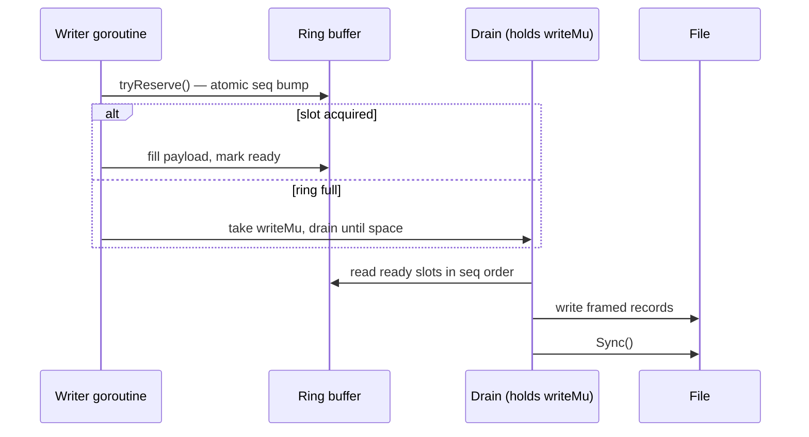

A writer reserves a slot with an atomic sequence bump, fills it, and marks it
ready — no lock on the common path. A drain pass writes ready slots to the file
**in sequence order**, so WAL order matches logical order. Overflow takes
`writeMu` and drains until space appears.

A `barrier` flag lets maintenance (compaction) exclude new writers without
holding a lock across the whole operation: writers observing the barrier yield
rather than reserving.

**The limit, stated plainly:** the file is still a single append point. The ring
removes lock contention between writers, not the serialisation of the write
itself, so write scaling is bounded by the file regardless.

---

### 4.5 The label table

`NodeTypeCustomBase` opens 32 768 values whose meaning the application defines.
The store records that node 4 981 is type 32 768; what 32 768 *means* lives in
the program that wrote it. So a store outliving that program — or examined by
anything else, which for a forensics engine is the normal case rather than the
exception — is a graph of numbers, and a program whose own table has drifted
since the data was written reads every one of them as the wrong thing,
confidently and with no symptom.

`graphene.labels` is the numbering, written beside the image:

```
graphene-labels v1
node<TAB>32768<TAB>App
node<TAB>32769<TAB>AppVersion
edge<TAB>32768<TAB>Owns
```

Deliberately the least interesting format in the tree. It is text, because the
thing it exists to defend against is a reader that has nothing but the file; it
is sorted by kind and then by value, so one naming produces one file and two
stores with the same naming produce the same bytes; and it is written to a
temporary and renamed, because a half-written label table is a mislabelling that
survives. Names cannot contain a tab or a newline because
`store.RegisterNodeTypeName` rejects control characters, so the encoding needs no
escaping.

The header is a generation marker, and an unrecognised one is an error rather
than something to guess at: guessing is how a label table becomes a
mislabelling.

**The registry it feeds is process-wide**, and that is a deliberate consequence
rather than an accident of implementation. `String()` is a method on a `uint16`
with no store in scope, and moving rendering behind a store handle would change
every call site in the engine and in every caller. What follows is that one
process has one naming — which is the correct constraint for what this is, since
a numbering is a property of the data and two stores that disagree about 32 768
cannot both be rendered correctly. `Open` therefore *reports* the disagreement
(`ErrTypeNameConflict`) rather than resolving it.

Only the custom range can be named, and a name that could not round-trip through
`ParseNodeType` is refused — a built-in name, a bare numeric, anything shaped
like `custom:7`. The property being defended is that a type parses back to what
it prints as, which is the whole reason the mechanism is trustworthy.

### 4.6 The declaration catalogue

`graphene.schema` records every declaration a store carries: ordered keys,
composite tuples, unique property keys, and unique edge types.

**Why it exists.** A declaration tells the engine something it cannot derive.
Before this file, telling it did not survive. Ordered and composite declarations
were written into the image, so they came back after a compaction and vanished
after a bare reopen; unique property keys and edge cardinality constraints were
written nowhere at all. The lost optimisation was the mild half. The sharp half
was that two processes could open one directory enforcing different rules, both
believing they held the guarantee — and the one that had not declared would
write exactly the duplicates the other existed to refuse.

**Why a sidecar.** A WAL record would be durable at declare time and then
destroyed by the operation that makes a store permanent: compaction truncates the
log, which is what happens to the key-rotation timeline and what §11a.2 warns
against generally. A new WAL record type is also a one-way format break, because
replay treats an unknown type as an error rather than skipping it (§4.3). And a
CSR section alone is what GORD and GCMP already are — their reopen hole is the
defect being fixed. A sidecar has none of those problems and travels with a
backup for free, because backup copies the directory (§4).

**Format.** UTF-8, LF, one declaration per line, tab-separated, sorted whole by
byte order after the header so that two stores with the same schema produce
identical bytes. Property keys are escaped (`\`, `	`, `
`, `
`), so the
file imposes no restriction of its own on what a key may contain. A composite
tuple keeps its declared key order inside its line, because that order is part of
its identity: `(a,b)` and `(b,a)` are two declarations and both survive.

```
graphene-schema v1
!unique-edge-type	32768
!unique-node	sha256
composite-node	case	bucket
ordered-node	score
```

**The `!` prefix marks a line critical**, mirroring `csrSectionCritial` in the
image's section table and reusing its argument. An unrecognised *critical* kind
refuses the open: it was written by a build that knew a constraint this one does
not, and reading the line as though it were absent would drop that constraint
silently. An unrecognised *optional* kind is skipped, because a reader ignoring
it still answers every query correctly. That is §2.3's optimisation-versus-
constraint split, written into the file.

**Applied in two places, and the split matters.** Ordered and composite
declarations are applied *before* the image loads, so their structures are built
by the incremental path as entries arrive rather than backfilled over them
afterwards — the argument `csr_io.go` already makes for GORD. Constraints are
applied *after* the WAL replays, because they validate against the data and the
data is not complete until then. Both go straight to the index rather than
through the public `Declare*` methods, which is what lets a read-only store get
its declarations: those methods refuse a read-only store, correctly, because they
are writes, and this is not one.

**Nothing is written at open.** An open is not a writer, and `OpenReadOnly` and
`OpenLive` leave the directory untouched.

**Union with GORD and GCMP cannot conflict.** All four kinds are monotone: the
image sections say "declared as of the last compaction", the sidecar says
"declared, ever". A union cannot lose a declaration, and unlike a label table —
where one number can be given two names, which is why §4.5 is strict — there is
no key here that could hold two values.

**Validation at open is load-bearing.** Because the record outlives the process,
a store's data can stop satisfying a constraint the file names: an older build,
or a process that never declared, could have written duplicates. `Open` therefore
re-validates, and `disk.ConstraintPolicy` chooses what happens when it fails.
`ConstraintRefuse` is the default and fails the open naming every violated
declaration — the same check `DeclareUniqueProperty` makes, at the same moment,
because a store that opens believing a constraint it does not keep has the
guarantee and none of the behaviour. `ConstraintDrop` opens without the violated
declarations and reports them through `DroppedDeclarations()`; it exists because
a store that cannot be opened cannot be repaired, and it is the default for
`OpenReadOnly` and `OpenLive`, which enforce nothing anyway.

**Not bound into the snapshot root.** The root describes the graph; a declaration
writes no record and produces no commit, so binding it would move the root for a
reason the chain could not explain. The catalogue is outside the image and so
outside the CSR digest too.

---

## 5. Read and write paths

### 5.1 Write path

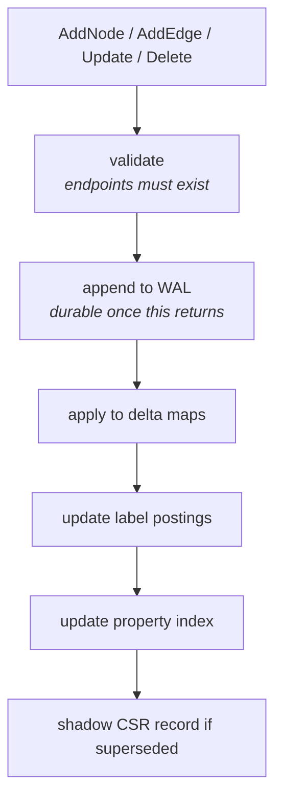

**Validation, WAL append and apply happen under a single lock hold.** That is
what makes `AddEdge` racing `DeleteNode` on the same node resolve cleanly: either
the edge is created before the node is gone and is then cascaded, or it is
rejected with `ErrInvalidEdge`. There is no window where a committed edge points
at a missing node.

**Cascade ordering matters for crash safety.** `DeleteNode` journals tombstones
for every incident edge *before* the node's own tombstone. A crash midway leaves
edges deleted and the node alive — recoverable and consistent. The reverse order
would leave edges pointing at a missing node.

### 5.1a Transactions

`Graph.Begin()` buffers writes and commits them as one unit. It exists for the
one shape the slice APIs cannot express: nodes and the edges between them.
`AddNodes` then `AddEdges` is two commits, and a crash between them leaves nodes
without their edges.

```mermaid
sequenceDiagram
    participant C as caller
    participant T as Tx (caller-side buffer)
    participant S as Store
    C->>T: AddNode(n)
    T->>S: ReserveNodeID()
    S-->>T: id (atomic bump)
    T-->>C: id — usable immediately
    C->>T: AddEdge{Src: id, ...}
    Note over T: buffered; no lock, no WAL traffic
    C->>T: Commit()
    T->>S: ApplyTransaction(nodes, edges)
    Note over S: lock → validate all edges<br/>→ one framed write → apply
    S-->>C: nil, or "nothing happened"
```

**IDs are reserved at buffer time, not assigned at commit.** That is what lets
`AddEdge` name a node the store has not seen. A transaction that rolls back burns
the IDs it took — permitted by the standing invariant that IDs are monotonic and
never reused, but never promised dense. `AddNodesBatch` has burned IDs on WAL
failure since the batch framing work; the transaction applies an existing rule
rather than adding one.

`ApplyTransaction` orders its work so atomicity and replayability both fall out:

1. **Validate every edge first**, against live nodes *and* the transaction's own
   pending nodes. A failure happens before anything is written.
2. **Frame nodes, then edges**, into one batch. Replay applies records in file
   order, so a node always precedes any edge that depends on it.
3. **One `AppendBatch`.** If it fails nothing is applied — the commit marker never
   reached the file, so replay discards the partial bytes. That absence is the
   rollback; there is no undo path to get wrong.

The in-memory backend has no WAL, so its atomicity is structural: validate
everything, then apply, with nothing in between that can fail. It must reject
exactly what disk rejects, since it is the oracle disk is compared against.

A `Tx` is a caller-side buffer and is not safe for concurrent use; the store lock
is taken once, at commit. Buffering means a transaction costs memory proportional
to its size — the same trade the slice APIs make, and the reason the API
documentation recommends chunking a bulk load rather than opening one transaction
over it.

#### Ordering and the cascade

A transaction is a **sequence**, not a set. `store.TxOp` carries the six
operation kinds and each is evaluated against the store as modified by the ones
before it, so `AddNode` then `DeleteNode` on the same ID nets out to nothing, and
an edge onto a node the transaction has already deleted is rejected.

Deleting a node cascades to its incident edges — including edges that exist only
inside the transaction:

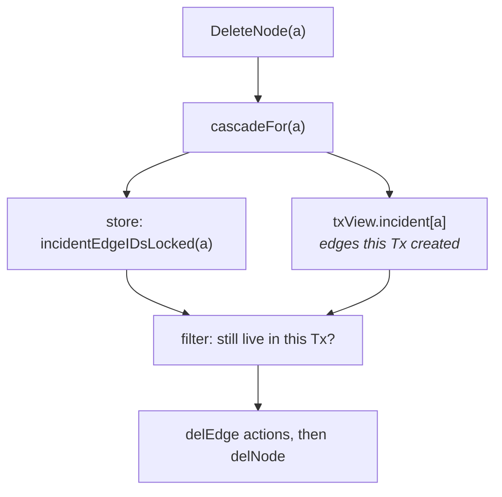

The cascade is computed at commit under the lock, never buffered — buffering it
would resolve against a graph that can still change before the transaction
commits.

#### resolve → frame → apply

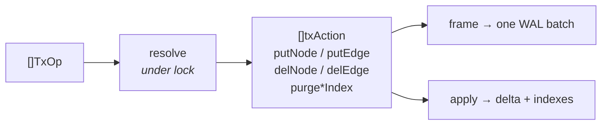

Resolution flattens the operations into primitives with no conditionals left in
them; framing and applying then read **the same list**. An earlier shape
validated and then re-derived the work while applying — two passes computing the
same thing from different inputs, which is how a WAL drifts from the state it
claims to describe.

Index purges are resolved actions too. `Graph.UpdateNode` honours
`ReindexPolicy == ReindexPurge`; a transaction that skipped it would leave stale
property-index entries that the non-transactional path removes, so the purge is
framed and applied with everything else.

Index *registration* is a resolved action too, since v0.5.0. `Tx.IndexNodeProperties`
buffers a `TxOpIndexNode`, which resolves to a `txActionIndexNode` carrying the
entity and its entries **in sorted key order**, frames into `0x03`/`0x04` records
inside the same batch, and applies at the same epoch as the topology. The record
types and their replay predate transactions by several versions; what was missing
was a way to put them between the begin and commit markers.

Sorting is load-bearing rather than tidy. Framing and applying read the same
list, and entries arrive as a map — so encounter order would make two identical
transactions write different bytes, which is the property §12.1's compaction
determinism rests on.

*Scope:* what a transaction still cannot do is span two stores, and `Tx` remains
a caller-side buffer with no read methods: a transaction does not see its own
uncommitted writes, only resolution does (through `txView`).

### 5.2 Read path

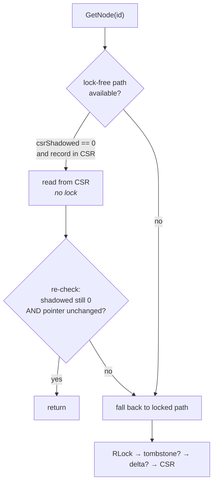

The fast path is described in full in §9.2.

### 5.3 Blob ownership: copy in, alias out

Property blobs and label slices are handled asymmetrically, deliberately.

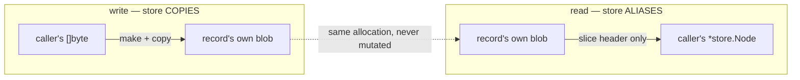

**Writes copy.** A caller may reuse or overwrite its buffer the moment
`AddNode`/`AddEdge`/`UpdateNode` returns. Retaining the caller's slice would let
later caller writes silently rewrite stored data. These copies look redundant and
are not; `graphene_blob_aliasing_test.go` pins them on both backends.

**Reads alias.** A read returns the record's own slice. Four properties make this
safe, and each is a real constraint on future changes:

1. **A blob is its own allocation.** `readCSRProperties` does
   `make([]byte, propLen)` + copy per record while deserialising. Blobs are *not*
   windows into one large file buffer — so holding one retains `propLen` bytes,
   not the whole CSR. Were blobs ever changed to slice a shared buffer, aliasing
   would become a retention hazard and this decision would need revisiting.
2. **Blobs are never mutated after construction.** The only operations reading a
   blob are `append`-from; nothing assigns into one.
3. **Ingest copies**, per above, so a record's blob is never caller-owned.
4. **The API contract permits it** — and always has.

This was previously inconsistent rather than wrong: delta-resident reads aliased
while CSR-resident reads copied, so a single `EdgesOf` result could contain
entries under both policies depending on where each record happened to live.
`Labels` had always aliased on every path. The copy was removed rather than a
copy-on-demand view built, because the contract already allowed the cheaper
behaviour and the code was simply not taking it.

The effect is structural: **disk read cost is now flat in blob size** instead of
proportional to it. A 512-byte-blob point lookup went 151 ns → 45 ns, a 10 000-node
bulk read 2.05 ms → 0.48 ms. Figures in [benchmarks.md](benchmarks.md).

---

## 6. Indexing internals

### 6.1 Catalogue

| # | Index | Structure | Complexity | Persisted |
|---|---|---|---|---|
| 1 | Primary (memory) | hash map | O(1) | no |
| 2 | Primary (CSR) | page directory + arena slot | O(1) | yes |
| 3 | Primary (delta) | hash-map overlay | O(1) | via WAL |
| 4 | Adjacency (CSR) | prefix-sum arrays over slots | O(degree) | no (rebuilt at load) |
| 5 | Adjacency (delta/memory) | `map[NodeID]{out,in}` | O(degree) | via WAL |
| 6 | Label postings | sorted `[]ID` per label | O(log n) lookup | rebuilt at load |
| 7 | Label postings (CSR) | sorted `[]ID` | O(1) lookup | derived at load |
| 8 | Property index | sorted postings + reverse map | O(1) equality | **yes**, v6 |
| 9 | Ordered index | sorted values per declared key | O(log n + k) | declarations only, v8 |
| 10 | Composite index | tuple → sorted postings, per declared key set | O(1) conjunction | declarations only, v8 |
| — | Edge cardinality | *no structure* — answered from out-adjacency | O(out-degree of src) per write | declarations only, in memory |
| — | Label names | copy-on-write map behind an atomic pointer | O(1) | **yes**, `graphene.labels` sidecar |

### 6.2 Why postings are sorted, not hashed

Three reasons, all load-bearing:

1. **Lookups return an already-ordered slice**, so the query path can merge and
   window without sorting.
2. **Removal is a binary search plus a memmove**, not a rehash.
3. **Intersection is a merge**, not a hash probe — one pass per side, no
   allocation, and the output is ascending so the final sort is retired.

The trade is that removal remains *linear* in the postings length: the search is
logarithmic, the shift is not. True O(log n) removal needs a non-contiguous
structure, which would make `NodesByType` — one contiguous copy today — worse.

### 6.3 Property index structure

```
PropertyIndex
 └── shards[16]                        ← chosen by FNV-1a over the KEY
      └── shard
           ├── mu  sync.RWMutex
           ├── nodes postings[NodeID]
           │    ├── byKey   map[key]map[value][]ID     ← forward, sorted IDs
           │    ├── ref1    map[ID]propRef             ← reverse, single entry
           │    ├── refN    map[ID][]propRef           ← reverse, 2+ entries
           │    └── perKey  map[key]int                ← O(1) scan costing
           ├── edges postings[EdgeID]                  ← same shape
           ├── orderedNodeKeys map[key]*orderedIndex
           └── orderedEdgeKeys map[key]*orderedIndex
```

**Sharded by key, so unrelated keys never contend.** Registering `sha256` on one
goroutine does not block a lookup of `bucket` on another.

**The reverse map is sharded alongside the forward map, not by ID.** Each shard
holds only the pairs for keys it owns, so removing an entity is a pass over all
16 shards, each taking its own lock. The cost is 16 map lookups instead of one.
The benefit is decisive: **no operation ever holds two shard locks**, so there is
no lock ordering to get wrong and no deadlock to reason about. Sharding the
reverse map by ID would require holding a key-shard lock and an ID-shard lock
simultaneously for a single removal.

**The reverse map is split by arity.** Sharding by key made "one entry per entity
per shard" the universal case — each key lives in exactly one shard, and an
entity normally carries one value per key. A `map[ID][]propRef` therefore
allocated a one-element backing array per entity, roughly 21.5 B of pure
overhead on top of the map entry. `ref1` stores that case inline; `refN` carries
only entities with two or more entries in the same shard, which requires two keys
hashing together.

An id appears in **exactly one** of the two maps, never both, and `refN` never
holds an id with fewer than two entries. `VerifyIndexes` checks both directly,
because a bug in the promotion path would otherwise surface much later as a lost
or duplicated entry.

### 6.4 Ordered index

```go
type orderedIndex[T] struct {
    values   []orderedValue[T] // sorted ascending by bytes.Compare, no duplicates
    totalIDs int               // sum of len(v.ids); maintained, not recomputed
}
type orderedValue[T] struct {
    value string   // raw encoded bytes
    ids   []T      // ascending, deduplicated
}
```

`totalIDs` exists for the planner, not for the reads: sizing a range against the
whole key is a comparison the planner makes on every query, and summing it there
would walk every distinct value — the scan this structure exists to avoid. Both
writers already touch a value's postings, so maintaining it is one increment on
a path that is doing an insert anyway, and `verify` recounts it (§11.4), because
a maintained counter nobody checks is a silent wrong answer rather than a loud
one.

A range filter resolves to `[lo, hi)` positions by binary search, then walks:

| Operator | Range |
|---|---|
| `GreaterThan` | `[upperBound(v), len)` |
| `GreaterThanOrEqual` | `[lowerBound(v), len)` |
| `LessThan` | `[0, lowerBound(v))` |
| `LessThanOrEqual` | `[0, upperBound(v))` |
| `BetweenInclusive` | `[lowerBound(v), upperBound(upper))` |
| `Prefix` | `[lowerBound(p), lowerBound(prefixUpperBound(p)))` |
| `Equal`, `Contains` | **not served** — see below |

`prefixUpperBound` increments the last non-`0xFF` byte and truncates. If the
prefix is all `0xFF` it reports "unbounded" and the range runs to the end,
because no successor exists.

**`Equal` and `Contains` are declined deliberately.** Equality is already O(1)
through the hash postings, and `Contains` cannot be bounded by any ordering.
Both are comparator-free (`bytes.Equal`, `strings.Contains`), which is what makes
declining them safe — see §7.4.

### 6.4a Composite index

An index over a *tuple* of keys, so a conjunction of equality filters is one
lookup rather than a driving set plus an elimination pass.

```go
type compositeIndex[T] struct {
    keys     []string             // the declared tuple, immutable
    postings map[string][]T       // encoded tuple → ascending, deduplicated ids
    members  map[T]*memberState   // per entity, its values at each position
    entries  int                  // (id, tuple) pairs; maintained
}
type memberState struct {
    one    []string           // the single value at each position
    filled uint64             // which positions have one — "" is a legal value
    more   map[int][]string   // extra values; nil for almost every entity
}
```

**It does not live in a shard.** Shards are chosen by hashing the property key,
and a composite spans several keys, which will generally hash to several shards.
Putting one in a shard would create an operation needing two shard locks at once,
and §9.1's freedom from lock ordering rests on that never happening. So a
composite owns its state and takes exactly one lock: its own. Registration
updates the owning shard, releases it, and only then takes the composite's lock —
never both.

**`members` is why.** A new value at one position needs the other positions'
values to form a tuple, and those live behind the shard locks this must not take.
So the composite keeps its own copy. That duplicates state the shards already
hold — the objection §14.11 makes against a persisted histogram — and the answer
is that here it is not reachable: "read it from the shards" is precisely the
option the lock discipline removes. It is also what makes registration a single
atomic step rather than a gather with a window in it.

**Multi-valued members are filed under every tuple.** Index entries are additive
(§6.5), so an entity whose `bucket` was registered as both `hot` and `cold`
matches either through the single-key postings. A composite filing it under only
one would return *fewer* rows than the intersection it replaces — silently, since
the driver applies no residual for the keys it covers. So the entity is filed
under the cross product of its members' values. That product is one tuple for
essentially every entity, and when it is not, it is the caller's own
registrations described exactly.

**Tuples are length-prefixed, not delimited.** Values are arbitrary bytes, so no
separator is unavailable, and `("a", "bc")` must not collide with `("ab", "c")`.

**A composite serves a query only when every one of its keys is pinned to a
value.** The postings are keyed by the whole tuple, so a partially specified one
has no entry to look up: a declaration over three keys does nothing for a query
fixing two. A B-tree over the tuple would serve prefixes; a hash map is what makes
the full-tuple case O(1), and the full-tuple case is the one the declaration was
made for.

**Declaration order is identity, not constraint.** `(a, b)` and `(b, a)` would be
two structures answering one question, so the tuple as declared is the key a
declaration is stored under — but matching is by key *set*, so `(a, b)` serves a
query filtering on `b` and `a`.

`verify` re-derives the entire index from `members` and compares both directions
(§11.4). Drift here is a wrong answer rather than a slow one, because the driver
skips exactly the filters that would have caught it.

### 6.5 Index maintenance on update

The engine cannot re-derive index entries: values are caller-encoded and the
property blob is opaque. So an update must state what happens to them.

| Policy | Behaviour | Failure mode |
|---|---|---|
| `ReindexReject` (default, v0.5.0+) | an update to an entity carrying entries is refused | none: it produces no answer rather than a wrong one |
| `ReindexKeep` (default before v0.5.0) | entries untouched | they go **stale** — the old value still matches |
| `ReindexPurge` | entity's entries dropped | they are **lost**, including untouched keys |

**Why the default moved, and why it did not move to `ReindexPurge`.** The old
default was a silently wrong answer that the query planner then trusted, and
avoiding it required every caller to remember a second method name — a design in
which forgetting produces no error and no symptom. `ReindexPurge` is not the safe
alternative: it drops the entity's *untouched* keys along with the stale one, so
it trades a stale-entry bug for a missing-entry bug, and a missing entry costs a
query result rather than a query. Refusing is the only option that loses nothing,
and it is scoped to entities that actually carry entries, so it costs nothing on
a graph it could not hurt.

The refusal is checked **before the log is touched** — an update whose record is
already appended cannot be taken back by returning an error — and the same check
runs in `resolveTransaction`, where it refuses the whole transaction.

`UpdateNodeIndexed` / `UpdateEdgeIndexed` state the whole desired entry set;
`UpdateNodePartialIndex` / `UpdateEdgePartialIndex` state only the keys that
moved. Both are exempt from the reject, because both carry the record and the
entries as one operation (`TxOpUpdateNodeIndexed`) and there is nothing left for
a policy to decide. Purges are journalled (`0x07`/`0x08`) so replay cannot
resurrect superseded values.

**A partial re-index is still a whole rewrite.** The log has a purge record per
entity and an add record per entry, and no per-key purge, so replacing one key
means reading the entity's current entries through the reverse map
(`PropertyIndex.NodeEntriesOf`), overlaying the named keys, and framing the
result. That is a deliberate trade: a per-key purge would be a new record type,
and a new record type is a log an older build cannot read (§4.3). A re-index that
changes nothing frames nothing at all, which is what makes a re-ingest of
unchanged data free.

### 6.6 Unique keys

A unique key is the promise that at most one live entity holds any given value
under it. It is what lets a caller treat an indexed value as a name, and without
it an upsert cannot be written at all: resolve-by-key is undefined when the key
resolves to a set.

**Nothing new is stored.** The hash postings already hold, per key, every
distinct value with its posting list, so "this key is unique" is exactly "every
value under it has one posting", and the owner of a value is that posting's
single element. A separate structure would be a second thing that can disagree
with the first, in a package whose entire verification story (§15, invariant 3)
is that the forward and reverse maps agree.

The declaration set lives on the **shard**, which needs no new lock and no lock
ordering: shards are chosen by hashing the property key (§6.3), so a key and its
uniqueness are in the same shard by construction. That is the same argument
§6.4a makes for why a composite index cannot live in one.

**Declaring validates.** `DeclareUniqueNodeKey` walks the key's values under the
shard write lock and returns **every** value held by two or more live entities,
declaring nothing if there are any. Reporting all of them rather than the first
is the difference between a repair that is one script and a repair that is one
pass per duplicate. Liveness is checked through a predicate the store supplies,
which keeps `index` free of any notion of a record and closes the window a
two-call shape would open — and it matters in practice, because a posting can
outlive the entity it names while a snapshot pins an older view (§10.3).

**Enforcement is check-then-insert inside one shard write lock**
(`IndexNodeUnique`). Splitting it into ask-then-register would leave exactly the
window the constraint exists to close, open to the concurrency the caller
declared uniqueness in order to stop worrying about. Registering the value an
entity already holds is not a conflict: that is the steady state an idempotent
re-ingest arrives at, and the underlying insert is already a no-op for it.

**Declarations are not persisted.** Ordered keys and composite tuples travel in
the CSR image (`GORD`, `GCMP`); a unique key does not, and must be re-declared by
each process that opens the store. That is a deliberate scope choice rather than
an oversight: persisting it would mean a new image section, a version bump, and a
hand-rolled binary reader owing a fuzz target. Re-declaring on every `Open` is
free — the declaration is idempotent — and it re-validates the data, which is
strictly more than a persisted flag would do.

### 6.7 Upsert, and where the ID comes from

The one genuinely hard part of an upsert here is not the key lookup; it is that
`Tx` reserves IDs at **buffer time**, caller-side, with no lock (§5.1a), because
that is what lets `AddEdge` name a node the store has not seen. An upsert cannot
know at buffer time whether its key already exists without reading, and cannot
re-map the ID at commit, because the edges the caller buffered next already point
at it.

So the early read is recorded rather than trusted. `TxOp.Expect` carries who held
the key when the operation was buffered — the entity's own ID for an update, the
invalid ID for a create — and resolution, which runs under the write lock,
re-reads the key and compares. A mismatch means another writer took or removed
the key in between, and there is nothing to repair from there, so the whole
transaction is refused with `ErrWriteConflict` and the caller retries against
what the winner wrote. A single-writer caller never sees it.

That is optimistic concurrency control over exactly one predicate, and it was for
a long time the write half of what a general read-set conflict check would give.
The general form now exists — `BeginTracked` and `store.ReadCheck`, §6.7a — and
the upsert path is unchanged by it: `Expect` still carries its own predicate,
because an upsert resolves a key whether or not the transaction is tracking, and
folding the two would have made every upsert pay for a read set it did not ask
for.

**Two upserts of one key in one transaction are one entity.** The index cannot
say so, because nothing has been registered there yet, so the claim is tracked in
two places: `Tx.claimed`, so the second call returns the ID the first reserved,
and `txView.claims`, so resolution sees the transaction's own pending
registrations before the index's.

### 6.7a Reading inside a transaction

Two separate features, and confusing them is the trap.

**Read-your-own-writes** is an overlay in `package graphene`
(`transaction_read.go`): the buffered ops replayed in order over whatever the
store answers, so `tx.GetNode` returns what the transaction is about to commit.
It is always on, builds nothing until the first read, and works on any backend —
including one that cannot do transactions at all, because it is caller-side
arithmetic over a plain reader. The backends already had this logic in `txView`,
but only inside `resolveTransaction`, under the store lock, at commit; exposing
that would have meant handing out a reader that holds a lock the caller does not
know about.

Three rules the overlay has to get right, each because a backend already does:

- **A delete cascades to reads.** An edge is reported missing when the
  transaction deleted it *or* deleted either endpoint. The cascade is resolved
  per lookup rather than precomputed, because precomputing it means listing a
  node's incident edges at buffer time — the read both backends refuse to make
  early, on the grounds that the graph can still move before commit.
- **An update does not move an edge's endpoints.** Both backends pin the current
  `Src` and `Dst` over whatever an update carries, so the overlay does too;
  otherwise a transaction reads back a record whose endpoints disagree with the
  adjacency it is listed in.
- **A unique claim is visible before it is registered.** `tx.UniqueNodeOwner`
  consults the transaction's own claims first — from upserts *and* from
  `IndexNodeProperties` on a declared-unique key — because the index cannot
  answer for something nothing has told it about.

**Read-set tracking** is opt-in, through `BeginTracked`. Each read that reached
the store records a `store.ReadCheck`; `Commit` routes through
`store.CheckedTransactor.ApplyTransactionChecked`, which re-reads every
observation under the write lock *before* resolving any operation, and refuses
the whole transaction with a `*store.ReadConflictError` wrapping
`ErrWriteConflict` if one moved. It is opt-in because it can only add a failure:
existing code that reads inside its transactions would begin seeing conflicts
from commits that previously succeeded — having silently overwritten.

**Validation re-reads; it does not stamp.** The obvious design is to record each
record's version and compare stamps at commit, and the disk backend has one to
hand in `nodeVersion.epoch` (§10.3). The in-memory backend does not: it keeps a
single store-wide counter and nothing per record. A stamped read set would
therefore have been disk-only, and the parity rule — the two backends accept and
refuse exactly the same things — is not negotiable for a constraint. So a check
carries an FNV-1a digest of what was observed, and validation recomputes it. The
side effect is a better semantic than stamping: a record rewritten with identical
bytes is deliberately *not* a conflict.

The comparison itself lives in `store.ReadSetValidator`, driven by both backends
through callbacks that read without locking. Neither owns the decision, which is
the only way two entirely different storage layouts can be relied on to reach the
same one. It also settles the one place they genuinely disagree: `EdgesOf` on a
missing node is an error in memory and an empty set on disk, so both validators
are written to the disk rule and the read set never inherits the difference.

**What it is not.** Not serialisability, and no protection from phantoms. A
transaction that read "no node carries this label" is not protected against one
appearing, because a predicate over the whole graph cannot be validated by
re-reading a bounded set. That is why the tracked reads stop at reads anchored to
an identity — a node, an edge, one node's adjacency, one unique key — and why
there is deliberately no tracked `QueryNodeIDs`. Offering one would be the
overstated guarantee CONTRIBUTING §4 forbids.

A backend that does not implement `CheckedTransactor` refuses a transaction
carrying reads rather than committing it unprotected, on the same reasoning that
makes `DeclareUniqueEdge` return an error instead of `nil`: a constraint the
store quietly does not enforce hands the caller the guarantee they asked for and
none of the behaviour.

**Which view a tracked read runs against.** A read and the validation of that
read have to come from the same state, and until they did, a tracked
read-modify-write loop under contention did not terminate.

Group commit (§11.1) applies a batch under the write lock and publishes its
epoch only once the fsync returns, so between those two points `visibleEpoch`
lags what the delta already holds — deliberately, because that is the durability
boundary doing its job. Validation cannot lag: it runs under the write lock and
reads through `writerLocked`, for the reason that function documents. So a
transaction read the old value, was refused by a writer it was not permitted to
see, retried, read the *same* old value because the fsync was still outstanding,
and was refused again. With a handful of concurrent writers there is always a
commit in flight, so no attempt can ever incorporate the write refusing it. That
is a livelock, not slowness, and no amount of retrying escapes it: measured at
15 877 conflicts with five of six writers starved, against 1 046 conflicts and
none starved with `SetSyncOnCommit(false)` — the sync being the entire window.

`store.AppliedReader` closes it. A **tracked** transaction's `GetNode`,
`GetEdge`, `NodeExists`, `EdgesOf` and `Neighbours` resolve through
`AppliedNode`/`AppliedEdge`/`AppliedEdgesOf`, which read at the applied epoch
under a read lock — the same view `validateReadsLocked` will use. The unique
owner lookups were already on it: `UniqueNodeOwner` has resolved liveness
through `nodeExistsLocked` since it was written.

What a caller gets in exchange is a read of state that is committed but not yet
durable. A crash losing that write loses this transaction's commit with it — the
commit is ordered after it in the same log, and replay stops at the first bad
frame — so a durable outcome never rests on a read that did not itself survive.
An **untracked** transaction is deliberately left alone: it has no read set, so
nothing it reads can refuse it, and there is no reason to show it state the disk
has not accepted yet. Plain reads outside a transaction are unaffected and go on
seeing only what is durable.

The in-memory backend implements the capability too, where it is the ordinary
read — one lock, no epochs, applied and visible are the same state. A capability
only one backend offered would be one the tracked path took on disk and not in
memory, and then the oracle would stop testing what the disk store does.

### 6.8 Edge cardinality, and why it is not an index

A unique property key names an entity by a value. That is right for an edge
carrying identity of its own and wrong for structure: an edge whose whole meaning
is "this owns that" has no value worth indexing, and a caller writing 10^6 of
them per source cannot afford an index entry each to restate what the endpoints
already say. `DeclareUniqueEdge(t)` gives the structural rule directly — at most
one live edge of type `t` between any ordered pair.

**Per label, not per label set.** `Edge.Labels` is a set and every filter in the
engine is OR over it, so a declaration on one type composes: an edge labelled
`{Owns, Contains}` counts against a declaration on `Owns` and one on `Contains`
independently. A rule about whole label *sets* would not compose, and a rule
about a "primary" label would invent a concept the store does not have — `viz`
picks `Labels[0]` for rendering, which is a display convention rather than a
model.

**Nothing new is stored**, for the reason §6.6 gives for unique keys: the answer
is already in the source node's outbound adjacency, and a second structure
holding it is a second thing that can disagree with the first. The consequences
of that choice are the whole design:

- The check is a scan of `src`'s outbound edges, O(out-degree of src). Cheap for
  ownership edges, which fan out from a source that owns tens or hundreds of
  things. Not cheap for a type whose sources are hubs, and the API documentation
  says so rather than leaving it to be measured.
- `deleteEdgeLocked` and `applyEdgeDelete` need no unindex step, `Compact` needs
  no rebuild, and there is no derived state that can go stale. A declaration is
  correct the moment it is made and stays correct.
- A sorted-by-neighbour adjacency (P7 in `RESEARCH_NATIVE_GRAPH.md`) would turn
  the scan into a binary search. It is not taken here for the reason that section
  gives: it costs +43.5% on a build and changes edge ordering for every existing
  caller, and one write-path scan is not the thing that justifies it.

**Five write funnels, two backends, one rule.** `AddEdge`, `AddEdgesBatch`,
`UpdateEdge` and the `TxOpAddEdge`/`TxOpUpdateEdge` resolver each check before
anything is written — before the ID is issued and long before the WAL is touched,
because a refusal whose record is already appended cannot be taken back by
returning an error. `memory.Store` is the parity oracle and the disk backend must
reject exactly what it rejects; `tests/graphene_edgeunique_test.go` runs every
case against both.

**A batch and a transaction check against themselves.** Two duplicates arriving
together are the same violation as one arriving after the other, and the
adjacency cannot see edges the batch has not applied yet. A batch keeps a
`(pair, type) → batch index` claim set; a transaction keeps `txView.pairs`, the
structural twin of `txView.claims` (§6.7).

**And a transaction's deletions free what its own additions claimed.** This is
the half that makes the constraint usable rather than merely safe: re-ingesting a
source means deleting the subtree it owns and rebuilding it, in one transaction,
and a check that only consulted the stored adjacency would see every edge the
transaction had just removed and refuse the entire rebuild. `txView.storedEdgeBetween`
skips edges the transaction has deleted or holds its own copy of, and
`releaseEdgePairs` gives back the slots an edge held when it is deleted or
relabelled. The reverse index `txView.pairsOf` is what keeps that O(slots held)
rather than a walk of every claim — a transaction that deletes a subtree does it
once per edge removed, and the walk would make that quadratic.

Declarations live in memory, as unique keys do (§6.6), and validation at
declaration time groups the type's edges by pair and reports every pair joined
more than once. On disk that means resolving each candidate posting against the
writer's epoch, which is the same order `EdgeCount` already pays.

### 6.9 Counting without materialising

`GraphStats` carried two numbers, and everything else a caller wanted — how many
of each type, how an indexed field distributes, which neighbours are shared —
meant pulling IDs into Go and counting them there. That is one `NodesByType` call
per type and a copy of every ID in the graph, built to be discarded. Fine at 10^3
entities; not fine at 10^5.

`store.Aggregator` is the optional extension both backends implement:

| Call | Memory | Disk |
|---|---|---|
| `CountNodesByType` | O(types) — posting lengths are exact | O(candidates) — postings are candidates until resolved |
| `CountEdgesByType` | O(types) | O(candidates) |
| `CountNodesByProperty` | O(entries under the key) | same, plus epoch resolution per holder |
| `CountEdgesByProperty` | O(entries under the key) | same |

The asymmetry is the delta layer. Memory maintains its label postings on every
write *and unmaintains them on every delete*, so `len(nodesByType[t])` is the
answer. On disk a posting is a candidate — entries are left behind while a
snapshot pins an older view — so every one is re-resolved against the reader's
epoch, which is the same order `NodeCount` already pays and still far cheaper
than a per-type `NodesByType` loop, because nothing is copied into a result
slice.

Two contracts worth stating rather than leaving to be discovered:

- **An entity is counted under every label it carries**, so the per-type counts
  total more than `NodeCount` on any multi-label graph. `graphene store stats`
  prints a note when that happens, because a reader who assumes otherwise
  concludes the store is corrupt.
- **Only live holders are counted, and only entities with an entry under the
  key.** A posting can outlive the entity it names while a snapshot pins an older
  view, and a distribution counting those would report entities no read would
  return — the same liveness filter §6.6 applies for the same reason.

There is no generic fallback: a `GraphStore` cannot enumerate its own types, so a
backend without the extension gets an error rather than an empty map that would
say the graph is empty. That is the `UniqueIndexDeclarer` rule (§13) rather than
the `DegreeCounter` one.

`NeighbourFrequency` is the third aggregate and lives in `traversal` instead,
because it is the one that needs a budget. The anchor set is usually the result
of an earlier query, so its size is data rather than something the caller chose,
and one hub among the anchors makes the work arbitrarily large. It counts
**anchors rather than edges** — a neighbour reached twice from one anchor is one
vote — because counting edges would make the ranking depend on how the graph
happens to be modelled rather than on what it says. It reuses the walker's
incident-edge buffer and its per-expansion neighbour set, so the whole aggregate
allocates one map plus the result.

---

## 7. Query planning and execution

### 7.1 Pipeline

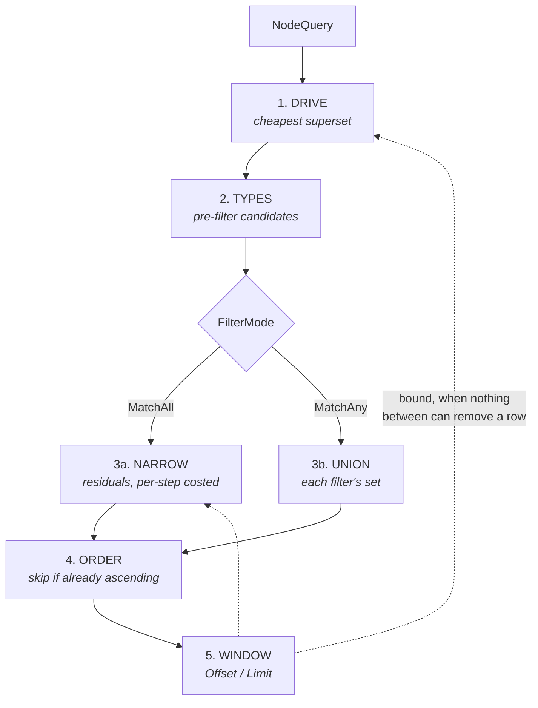

The window is the last step, but it does not only run last: when nothing between
a step and the window can remove a candidate, the bound is handed back to that
step so it can stop producing. §7.3a gives the exact conditions and what they
refuse.

### 7.2 Driver selection

The planner picks the cheapest source **guaranteed to contain the answer**:

| Priority | Source | Cost known? |
|---:|---|---|
| 1 | explicit `IDs` | exact |
| 2 | most selective equality postings | **exact** — postings length is a map lookup |
| 3 | label postings | **exact** — `NodesByType` aliases CSR memory, so `len` is O(1) |
| 4 | ordered-key range or prefix | **estimated** — exact for a narrow window, mean-based for a wide one (§7.2a) |
| 5 | declared composite tuple | **exact** — one map lookup, no estimate to make (§7.2b) |
| 6 | incident-edge lists (edge queries) | exact — CSR offsets give degree |
| 7 | full scan | — |

Priority is a starting order, not a decision: every source that reports a cost is
**compared**, not taken because it came first. A selective label beats a weak
filter — a 100-node label against a 25 000-hit filter is 58× faster driven from
the label. Ties go to whichever returns candidates already ascending: equality
beats a range (which sorts and dedupes what it collects), and both beat a label
union (which is unsorted), so equal candidate counts are not equal cost. A
composite wins its ties against equality and against a range, because a tie on
candidates is not a tie on the work after: it retires every filter it covers,
where the others retire one and leave the rest of the conjunction to the residual
pass.

> **Ranges joined this comparison late, and their absence from it was the
> planner's largest single misplan.** A range had no size, so it could not be
> compared with anything — and both planners fell back to *position*. The node
> planner tried ordered filters after equality and before labels, so any range
> beat any label: a window over every value in a key won against a 100-node
> label. The edge planner tried them below its switch, reachable only when
> equality, adjacency and labels were all absent, so a range matching 50 edges
> lost to a label carrying 10 000. Within one query the first ordered filter won
> whatever the others matched. Measured on a 50 000-node store, giving ranges a
> size moved those three shapes from **2.0–3.9 ms to 4–38 µs** — 110× to 420× —
> with a control query containing no range flat across the change.

Label counts are **upper bounds**: they double-count a record present in both the
delta and the CSR, and ignore tombstones. That is the safe direction — the driver
must be a superset of the answer, so overestimating makes the planner more
reluctant to choose labels, never wrong.

> This comparison existed on the in-memory backend before the disk one, which
> made it a parity bug as well as a performance gap: the same query could be
> planned differently per backend. `TestLabelDriverParity` now pins the two
> together.

### 7.2a Sizing a range or prefix

`rangeFor` already resolves a filter to a `[lo, hi)` window over the distinct
values with two binary searches (§6.4). The estimate is the number of *entries*
in that window, and it is read two ways:

| Window | Estimate | Why |
|---|---|---|
| empty | `0`, exact | It ends the query, so it must beat everything — and "few" must stay distinguishable from "none" |
| the whole key | `totalIDs`, exact | No arithmetic, no rounding; the commonest wide case |
| ≤ 64 distinct values | exact count | One `len()` per value over contiguous memory — a few cache lines, cheaper than the map lookup that found the index |
| wider | `totalIDs × width / len(values)`, rounded up | O(1) |

The split is not a performance compromise, it is where precision stops deciding
anything. A narrow window is exactly the case whose size determines the plan: a
range matching 3 of 900 000 has to beat every alternative, and rounding it to a
mean throws away the fact that makes it win. A window covering 40% of a key
loses to any label or equality filter whatever its true size, and the only
comparison it can win — against a full scan — it wins on any estimate.

**Where it is wrong.** The wide-window estimate assumes postings lengths are
roughly even across the key. Near-unique values — a hash, a timestamp, an
offset, most of what a forensic graph indexes — have a mean of about 1, so it is
almost exact. One value holding most of a key's entries breaks the assumption,
and a wide window containing it is under-estimated. That cannot make a result
wrong: the driver is a superset whatever its size, and every filter is still
applied. It can make the planner pick a worse driver, which is the trade the
64-value threshold is placed to bound.

**Cost.** Planning a query that contains a range costs ~0.3–0.5 µs more than
before, against savings measured in milliseconds. A query with no range pays
nothing: the estimate is only computed when an ordered driver exists.

**Why `MatchAny` usually cannot be driven.** Under `MatchAll` the result is the
intersection of every filter's set, so it is contained in each and any may drive.
Under `MatchAny` it is the union, which no single filter's set contains.
`store.SupersetDrivers` encodes this in one place: it returns `nil` for
`MatchAny` with more than one filter.

### 7.2b Composite drivers

A composite reports an exact size — `len(postings[tuple])`, one map lookup — so
unlike a range it has nothing for §7.2a's two regimes to decide between. It joins
the comparison on the same terms as everything else and is not preferred: a
10-node label beats a 33-row conjunction and the planner says so.

Two things make it cheap enough to consult on every query:

- **It is only consulted when the query carries at least two filters.** A
  composite covers a tuple of two or more keys, so a shorter query cannot match
  one however many are declared. Testing that in the planner rather than inside
  the index is what keeps a single-filter query from touching `PropertyIndex` at
  all — the declaration flag it would otherwise read is a cold cache line on a
  struct that query has no other reason to load, and it measured at **~20 ns
  against a 230 ns query**.
- **With no composite declared, the check is one atomic load.** Matching itself —
  which enumerates declarations and looks each tuple up — runs only past that.

`QueryPlan.DriverFilters` is a bitmask rather than the single index it used to
be, because a composite consumes its whole tuple and the residual pass must skip
all of it. Positions at 64 and above cannot be marked, which is the safe
direction: an unmarked filter is re-evaluated, and under `MatchAll` re-applying a
filter the candidates already satisfy returns the same candidates. A missed mark
costs work; marking one that was *not* applied would drop a filter, and the type
has no way to do that.

**What it is worth.** 100 000 nodes, two keys of 11 and 13 distinct values
(coprime, so the conjunction is a real intersection), ~700 rows matching both:

| | declared | undeclared | |
|---|---|---|---|
| the conjunction | 8.4–8.8 µs, 16 allocs | 450–512 µs, 7 allocs | **~56×** |
| control: one of the same keys alone | 99–101 µs | 97–99 µs | flat |
| registering both member keys, memory backend | 1.9–2.5 µs | 1.3–1.5 µs | +~45% |
| registering both member keys, disk backend | 11.0–11.4 µs | 10.0–10.2 µs | +~10% |

The undeclared arm is the plan a build without composites produces, on the same
graph — which is what makes this an A/B of the feature rather than of the whole
change. The write cost is the honest reason the index is opt-in: on a disk store
it is ~10%, because the WAL append dominates and does not move; the memory
backend's ~45% is the index maintenance with nothing else in front of it.

### 7.3 Residual evaluation

Filters that did not drive still have to be applied. Each is costed **both ways,
per step, against the current candidate count**:

| Strategy | Cost |
|---|---|
| Probe candidates via the reverse map | one lookup per candidate |
| Materialise the filter's set and intersect | the size of that set |

Deciding per step matters because each step shrinks the set: a filter not worth
probing against 1 000 candidates often is against the 5 that survive.

Filters run **most-selective-first** so candidates die early, the pass stops the
moment none remain, and **the driving filter is excluded outright** rather than
re-derived from the set it just produced.

The estimate is exact for equality (postings cardinality), sized from the
ordered index for a range or prefix on a declared key (§7.2a), and otherwise the
number of entries under the key — which is what a scan of that key would visit,
and therefore an upper bound.

That last case stays a bound rather than becoming a guess. Without an ordering
there is nothing cheaper than a scan that could tighten it, and inventing a
selectivity would order the steps on a number with no evidence behind it.

**The probe reads the stored value without copying it.** It converted the reverse
entry's string to `[]byte` once per candidate, which made the probe path allocate
in proportion to the candidate set it exists to *avoid* materialising — 7 700
allocations on a query with 7 693 candidates. The predicates only read the bytes,
which is the same contract the scan path already relies on, so the conversion is
now the shared-memory one. Measured interleaved with a flat control: **572–671 µs
→ 450–512 µs and 7 700 allocations → 7** on a 100 000-node two-filter query, and
6 → 5 allocations on the small `EqualityPlusContains` case.

**Why this matters.** A filter no index can serve — a `Contains`, or a range on
an undeclared key — costs a scan of *every entry under its key*. Before residual
costing, a query driven down to a single candidate still did work proportional to
the graph to eliminate it.

### 7.3a Stopping early: pushing a window into the pipeline

`Offset`/`Limit` used to be the last step and only the last step: the pipeline
produced every row, sorted them, and copied ten out. A query asking for ten rows
off a 90 000-node label paid for 90 000 — the cost tracked the graph, not the
answer.

Two places now stop early, and both are gated on the same two conditions:
**nothing between them and the window may remove a candidate**, and **the rows
must be taken from the front**.

**Into the driver.** `nodeDriverNeed` allows it only for an ascending,
unfiltered, label-driven query — which is not a narrow special case but the only
one that qualifies, because with no filters nothing else can drive. The label
postings are merged rather than concatenated (§7.2), so they arrive in order and
the merge simply stops after `Offset+Limit`. The type re-filter that would
normally follow is skipped for this driver, because it re-resolves labels the
driver already resolved against the records.

It is refused for:

| Case | Why |
|---|---|
| any property filter | a filter removes candidates, so the tenth candidate is not the tenth row |
| an explicit `IDs` list | resolved in the caller's order, not ascending |
| `Order: Desc` | the rows come from the far end; every ordered driver is ascending |
| edge queries with `SrcIDs`/`DstIDs` | an endpoint restriction removes candidates exactly as a filter does |

**Into the residual pass.** A filtered query cannot bound its driver, so the
bound moves one step later. `NarrowNodesUntil` evaluates the residual filters
over a **prefix** of the candidates, stops as soon as enough have survived, and
**doubles the prefix** when they have not.

The doubling is what protects the adaptivity. §7.3's whole argument is that
probe-versus-build is decided per step *against the current candidate count*;
narrowing a prefix keeps that decision, but makes it once per prefix. A fixed
prefix would therefore pay the fixed part of that decision `N/chunk` times on a
query that ends up draining everything. Doubling makes it `log N` times, which
bounds the downside at a small constant factor of the single-pass cost while
keeping the whole of the early-stop win.

`MatchAny` takes neither. A candidate set driven by one filter is not a superset
of the answer under `MatchAny` (§7.3), so there is nothing to narrow and nothing
whose prefix means anything.

**Measured**, interleaved against a control per CONTRIBUTING §1, on the 100 000-
node benchmark fixture:

| Query | Before | After |
|---|---|---|
| `Types + Limit 10`, disk | 17 952 B, 121 allocs | **160 B, 2 allocs** |
| `Types + Limit 10`, memory | 7 416 B, 16 allocs | **240 B, 3 allocs** |
| `Types + prefix filter + Limit 10`, disk | 19.1 MB, 90 818 allocs | **722 KB, 6 allocs** |
| `Types + prefix filter + Limit 10`, memory | 9.55 MB, 559 allocs | **1.44 MB, 7 allocs** |

Times moved with them — roughly 22 µs → 0.4 µs and 24 ms → 1.3 ms on the disk
arm — but the allocation counts are the number to trust: they are deterministic,
and the machine these ran on was not quiet.

**What `QueryPlan.Candidates` now means.** A driver that stopped early never
learned its own full size, so `Candidates` is what the query examined rather
than what existed. Filling the field in properly would mean running the driver
again unbounded, which would make asking for the plan cost more than the query.
`ResidualStep.Probe` has always been documented as a forecast rather than a
fact; this is the same trade, stated in the same place.

### 7.4 Comparison semantics — the sharpest edge in the system

Two rules coexist, and confusing them produces **wrong answers**, not slow ones:

| Key | Rule |
|---|---|
| **Undeclared** | numeric when both operands parse as numbers, byte-wise otherwise |
| **Declared ordered** | byte-wise throughout |

They differ because the first is **not a valid total order**. Under it:

```
"9" < "10"     (numeric: 9 < 10)
"10" < "1x"    (byte-wise: '0' < 'x')
"1x" < "9"     (byte-wise: '1' < '9')
∴ "9" < "9"    — a cycle
```

No sorted structure can be built on a comparator with a cycle, which is why
declaring a key **must** change its semantics. It is a correctness choice, not a
performance one.

Every path evaluating a filter must pick the same rule for a given key — the
index, the scan fallback, and the residual probe.
`store.PropertyFilterMatches` and `store.PropertyFilterMatchesOrdered` are the
two implementations. `index/encoding` supplies order-preserving encoders so byte
order means what the caller intends.

**`Equal` and `Contains` are comparator-free on both sides**, which is why the
ordered index declining to serve them cannot cause divergence.

### 7.5 Query plans

`ExplainNodeQuery` / `ExplainEdgeQuery` report the driver, candidate count, and
each residual with its cost estimate and strategy. They exist because **results
alone cannot distinguish an index lookup from a full scan that happened to agree
with it** — which also makes them the regression test for planner behaviour.

The `Probe` flag is a forecast: it reports the decision as of the start of the
pass, while the executor re-decides per step. Order and cost estimates are exact.

---

## 8. Traversal and pattern matching

### 8.1 BFS — two buffers, not a queue

```
depth 0:   current = [origin]              next = []
depth 1:   expand current → next           swap
depth 2:   expand current → next           swap
```

Two level buffers, reused and swapped at each depth. Memory is bounded by the
**widest level**, not by the number of nodes visited, and depth becomes the loop
counter so entries are bare IDs rather than `{id, depth}` pairs.

The original implementation used `queue = queue[1:]`, which slid through the
backing array so every append past capacity reallocated — one allocation per
visited node. `BFS_Deep` went from 30 190 allocations to 198.

`BFSIDs` walks without building any record at all: 20 allocations against 394 for
the record-returning walk on the same traversal.

### 8.2 DFS — `bestRemaining`, not `visited`

A boolean `visited` set is **incorrect under a depth limit**. A node first reached
by a long path gets marked visited, and is never re-expanded when a shorter path
later arrives with budget to spare.

```
A→B→C→E  plus shortcut A→C,  maxDepth 2

  boolean visited:  A B C ✗   (E lost — C consumed the budget via B)
  bestRemaining:    A B C E ✓
```

`bestRemaining map[NodeID]int` records the largest remaining budget each node has
been expanded with, and re-expands when a later path arrives with more. Nodes are
appended on first arrival only, so there are no duplicates.

**Complexity changed honestly:** a node can be expanded once per distinct
remaining value, so the bound is O(V × maxDepth) expansions rather than O(V).
Measured cost ≈6%.

**BFS cannot be replaced by DFS.** They return the same type but different
results under a depth limit; performance is a wash; and DFS is recursive, so
stack depth tracks graph depth. DFS is right where it is used —
`ProvenanceChain` follows a single chain and terminates early.

### 8.2a Weighted shortest paths — Dijkstra, and why not bidirectional

`ShortestPath` is a bidirectional BFS that stops at the first node both
frontiers have reached. That termination is sound only because every edge counts
the same: the first meeting is on a shortest path by construction. Give the
edges costs and it stops being true — the first meeting is merely the first, and
a cheaper route can still be one long hop away on either side.

Bidirectional Dijkstra exists, but it is a different algorithm with a different
proof: it must continue past the meeting until the two settled frontiers'
distances provably cannot improve on the best joint path found so far. That is
not a weight bolted onto the existing search, so `ShortestWeightedPath` is
**unidirectional**. What carries over from `path.go` is the provenance map and
the record-materialising tail (`materialisePath`, shared by both); the
two-frontier machinery does not.

The consequence is a real and measurable cost, recorded rather than hidden: on
the benchmark fixture a weighted path over 200 nodes runs ~15× slower than the
unweighted one, because a bidirectional search meets after about fifteen hops
while Dijkstra settles every node cheaper than the destination. `docs/benchmarks.md`
carries the numbers, and A* is the answer when the caller has an estimate.

**Cost is a selector, not a field.** `Edge.Weight` is documented as a similarity
score for `EdgeTypeSimilarTo` and zero otherwise, and it is encoded that way in
the Merkle leaf. Reinterpreting it as a distance would make "more similar" mean
"further away", so the reading comes from the caller:

```go
type EdgeCost func(IncidentEdge) float64
```

The obvious alternative — a selector taking `*store.Edge` — would force a
`GetEdge` per relaxation, which is the catastrophe §6.9 documents avoiding
(73.8 µs against 14.22 ns for materialising records merely to count them).
Instead `IncidentEdge` gained a `Weight` field, on the same argument that put
`Neighbour` there: the store has the edge record in hand while filtering, so
copying a float32 out of it is free. Measured against a control identical but
for that field, allocation counts are unchanged on every traversal benchmark and
byte counts grow by the width of the reused buffer — 24 B/op on a 3-hop BFS, 8 B
out of 1.2 MB on a deep DFS.

**No neighbour dedupe.** Every other walk in the package calls
`walker.beginExpansion` and drops the second edge reaching a neighbour already
seen in this expansion, matching what `Neighbours` reports. A weighted walk must
not: two parallel edges between the same pair are two different costs, and
taking whichever adjacency happened to report first returns a path that is not
the cheapest while reporting that it is. Every incident edge is relaxed, and the
relaxation discards the dearer one.

**A hand-rolled heap.** `container/heap` takes the collection as an interface
and calls back through `Len`/`Less`/`Swap`, so every comparison is an indirect
call, and its `Push` takes `any` — boxing every element, which puts one
allocation on the inner loop, once per relaxed edge. `traversal/heap.go` is a
binary min-heap generic over its payload with the priority a plain `float64`
field: no dispatch, no boxing, and a caller can preallocate.

The queue uses **lazy deletion** rather than decrease-key: a node is pushed once
per improvement found and stale pops are discarded by a `settled` flag. A
decrease-key heap needs a position index — a per-node allocation, which is the
whole saving.

**Refusals.** A negative cost makes a settled node re-openable, so Dijkstra is
simply wrong with one; it is refused with `ErrNegativeCost` at the relaxation
that produces it, at a cost of one comparison. The test is written `!(c >= 0)`
rather than `c < 0` so that NaN — which fails every comparison and would make
the queue ordering arbitrary rather than wrong-but-explicable — is caught by the
same branch. A nil selector is refused too, rather than defaulting to a unit
cost: a unit cost is exactly `ShortestPath`, and quietly returning the
unweighted answer would hide the caller's mistake for as long as the weights
happened not to matter.

The refusal covers costs the search **uses**, and cannot cover more than that:
the walk stops when the destination settles, so a negative edge in a corner it
never examined is never seen. The path returned is still correct — that edge
played no part in it — and checking otherwise would mean costing every edge in
the graph before answering.

**Budget.** `MaxNodes` is charged when a node is *settled* (popped with its
final cost), not when it is discovered. A weighted search discovers a node once
per improvement found, and charging those would make the same limit stop this
walk far earlier than a BFS over the same graph, so "nodes visited" would mean
two different things. `MaxEdges` is charged per edge examined, as elsewhere.

**A\*, and the obligation it puts on the caller.** `AStarPath` orders the queue
by distance-so-far plus `NodeHeuristic`'s estimate of the distance remaining. An
estimate that never overestimates returns the same answer sooner; one that
overestimates returns a dearer path **and no error**, because detecting that
would mean computing the answer the heuristic exists to avoid computing.

A node is settled once and never reopened. For a plain Dijkstra, or a consistent
heuristic, that rule costs nothing — nodes settle in non-decreasing distance
order. Under an *inconsistent* heuristic a settled node can be reached again at
a genuinely smaller distance, and declining to reopen it is what keeps every
node expanded at most once. Reopening would restore the optimal answer at the
price of re-expansion cascades that nothing bounds; this package does not make
that trade, which is why `NodeHeuristic` states consistency as an obligation.
`TestAStarPath_InconsistentHeuristicCostsCorrectness` pins the resulting
behaviour with a graph where a broken heuristic returns 11 and Dijkstra returns
3, so the doc and the code cannot drift apart silently.

### 8.3 Pattern matching

`FindSubgraphMatches` matches a small `Pattern` against a scope by backtracking,
pruned by node- and edge-label constraints. It used to be the worst path in the
codebase — a 2 000-node scope cost 24.6 ms and 399 950 allocations — and is now
4.75 ms and 150.

**Candidate building.** For each pattern node, scope members are tested against
the label postings by binary search. The earlier version loaded each node record
to read its labels back off it. Scope order is preserved, because candidate order
decides which matches a `maxMatches`-capped search returns.

**Edge checks — `edgeProbe`.** Backtracking asks "is there an edge from src to
dst with these labels?" once per candidate pair per pattern edge. That question
does not need edge records:

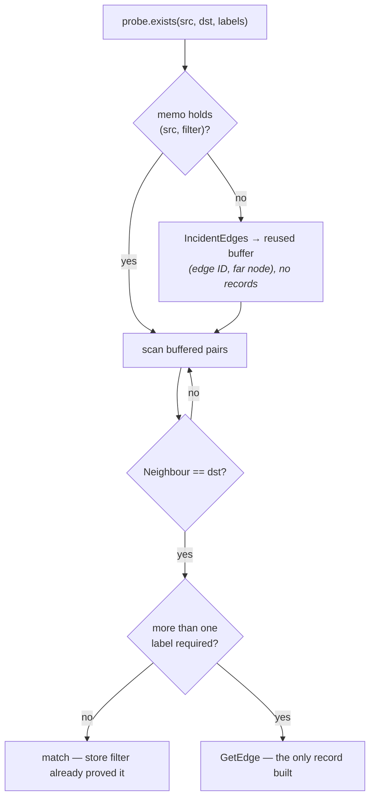

Two properties hold this together:

- **The store's edge filter is OR; a pattern's labels are AND.** So the filter
  can prove at most one required label on its own. That is exactly why the
  no-materialisation fast path is limited to `len(labels) <= 1`.
- **The memo is keyed on (source, filter).** Backtracking holds the source fixed
  while iterating every candidate for the next pattern node, so without it the
  same adjacency is re-walked — and re-locked — once per candidate. This was the
  *larger* half of the speedup, and invisible to allocation counts: after the
  record work was removed the path still spent 17 ms doing 150 allocations.

Caching within one search weakens nothing: §10 already states a query is not a
snapshot, and the previous code offered no cross-call guarantee either.

Correctness rests on `graphene_pattern_test.go`, which compares full match sets
against a brute-force oracle over five pattern shapes on both backends.

---

## 9. Concurrency and safety

### 9.1 Lock inventory

| Lock | Scope | Covers | Held during |
|---|---|---|---|
| `storeLock` (`graphene.lock`) | **process** | the whole store directory | open to close |
| `memory.Store.mu` | goroutine | records, adjacency, label postings | every operation |
| `disk.Store.mu` | goroutine | the delta layer's maps and the view swap | locked reads, all writes, a compaction's pin and commit |
| `propertyShard.mu` × 16 | goroutine | one shard's forward and reverse maps | that shard's operations |
| `WAL.writeMu` | goroutine | the drain pass and the fsync that follows it | a group-commit flush, overflow, maintenance |
| `syncGate.mu` | goroutine | which goroutine is flushing, and how far the log is durable | briefly, never across the fsync itself |

**`disk.Store.mu` is released before the commit fsync.** A batch assigns IDs,
queues its WAL bytes and applies its delta under the lock, then releases it and
waits for durability outside — which is what lets a second committer join the
first one's fsync (§11.1). It is safe because a commit becomes *visible* when its
epoch is published, not when its map write lands, and the epoch is published
after the wait (§10.3).

**`disk.Store.mu` is not held across a compaction's image build.** `Compact`
pins the records under the lock, builds and fsyncs the image with it released,
and retakes it to install the result (§9.4). It is also the one operation that
excludes itself explicitly, through `Store.compacting`, rather than relying on
`s.mu`: two compactions no longer overlap only because the lock is held
throughout, so `ErrCompactionInProgress` says so.

**No operation holds two shard locks.** This is a design constraint, not an
accident — it is what removes deadlock from the reasoning entirely.

**Acquisition order is process lock, then `s.mu`, then a shard.** The process
lock is taken once in `Open` and released once in `Close`, so it is never
acquired while an in-process lock is held and the ordering cannot be violated by
a code path — only by moving the acquisition, which is why it sits before the WAL
open rather than anywhere more convenient.

**A lock is never upgraded in place.** A read-only store does not become
writable; it is closed and reopened. Upgrading shared to exclusive means
releasing and reacquiring, and the window in between is one where another process
can take the store — so the API does not offer it, and a caller who needs to
write reopens and handles `ErrStoreLocked` like any other opener.

**Three modes, and only one of them gives anything up.**

| Open | Process lock | Excludes | Is excluded by | View |
|---|---|---|---|---|
| `Open` | exclusive | every other opener | any other opener | current, its own writes |
| `OpenReadOnly` | shared | writers | writers | fixed at open |
| `OpenLive` | **none** | nothing | nothing | fixed until `Refresh` |

`OpenLive` takes no OS lock at all — not because the platform cannot lock, which
is what `lock_unsupported.go` is for, but because a shared lock and the writer's
exclusive lock cannot coexist and a reader that follows a writer has to run
beside one. The reader is the side that gives: **the writer's exclusive lock is
unchanged, so "one writer" still holds**, and what is surrendered is the
reader's "no writer is running". §9.1c.

### 9.1a The process lock

Before this existed, nothing stopped two processes opening one directory. The
failure was not subtle: both replay the log, both append to it, and both build a
temp CSR and rename it over the live image. The second rename wins, and the first
process serves a graph that is no longer on disk. `inspect.go` and
`cmd/graphene` had both grown prose warnings about it.

| Platform | Primitive |
|---|---|
| Linux, macOS, BSD | `syscall.Flock` — `LOCK_EX`/`LOCK_SH`, always `LOCK_NB` |
| Windows | kernel32 `LockFileEx` via `syscall.NewLazyDLL` — `LOCKFILE_FAIL_IMMEDIATELY`, `LOCKFILE_EXCLUSIVE_LOCK` for a writer |
| solaris, aix, plan9, js | none; `LockEnforced()` returns `false` |

Zero external dependencies is a property this repository keeps, so Windows
resolves the two calls by hand rather than importing `golang.org/x/sys` — Go's
standard `syscall` exposes `CreateFile` and `Overlapped` but not `LockFileEx`.

**`flock`, not `fcntl`.** POSIX `fcntl` locks are owned by the *process*, and
that breaks both halves of what this is for. A second `Open` in the same process
would succeed silently, because the kernel merges the request into a lock the
process already holds — and one process opening a store twice destroys it just as
thoroughly as two processes opening it once. Worse, closing *any* descriptor to
the file drops every lock the process holds on it, so unrelated code that stats
the lock file through its own handle would silently unlock the store. `flock`
locks belong to the open file description, which is the ownership model this
needs. Windows handles behave the same way, which is what lets one set of
in-process tests cover both platforms.

**Why the locked byte is at offset 2^40.** A `LockFileEx` range is *mandatory*
for I/O, not advisory: a process without the lock gets `ERROR_LOCK_VIOLATION`
reading bytes inside it. Locking byte zero would make the owner record unreadable
by exactly the process that most wants to read it — the one being refused, which
wants to name the holder in its error. Locking a byte nothing ever writes keeps
the 32-byte record at offset 0 readable by anyone. Locking past EOF is legal on
both platforms and does not extend the file.

**No blocking, no timeout.** `LOCK_NB` and `LOCKFILE_FAIL_IMMEDIATELY` always.
Neither platform has a portable timed wait, so a timeout would be a polling loop,
and the right interval depends on what the caller is. `ErrStoreLocked` comes back
immediately, naming the holder's PID, and the caller decides.

### 9.1b Why an OpenReadOnly reader is a snapshot

The shared lock admits many readers alongside each other and none alongside a
writer. That second half is not a limitation of file locking — it follows from
how the store loads.

`Open` materialises everything once: the delta maps and property index from a WAL
replay (`store.go`), the CSR from a single read or a single mapping of
`graphene.csr` (`csr_io.go`, §14.18). Nothing re-reads afterwards, and a mapping
does not change that — the image is never rewritten in place (§15.13), so the
bytes behind it are the ones that were there at `Open`. A reader admitted alongside a writer would therefore serve
the graph as it stood at its own open, for its whole lifetime, with no indication
that it had gone stale — a wrong answer delivered confidently, which is worse
than a refusal.

So the shared lock exists for readers running alongside *other readers*, and the
exclusive lock is what keeps a writer from being one of them. Reopening is how an
`OpenReadOnly` reader advances, and that has not changed.

What has changed is that there is now a third mode for callers who want the other
trade — §9.1c.

Note that all of this is a different thing from §10.3's snapshots, which are
about consistency *within* one open store. A snapshot fixes what one process sees
while it reads; a live reader lets a second process see what the first has
written since. The version machinery §10.3 describes is the foundation the second
is built on — a refreshed view is a new view published at a new epoch, and the
"torn refresh" problem is the one that single atomic publish already solves.

Read-only mode also has to leave the directory alone, which took more than
withholding the mutators. `OpenWAL` creates the log if missing and writes a
container header into an empty one; the audit, redaction and grant ledgers all
open `O_WRONLY|O_APPEND`. A read-only store opens the log through a separate
read-only path and opens no ledger at all — their read paths were already
directory-based (`ReadAuditLog(dir)` and friends), and every write path already
refused on a nil ledger, so "the option is off" and "the store is read-only"
reach the same check.

### 9.1c Live readers

`OpenLive` is a read-only store that can be told to advance. It is the mode
§14.10 costed and deferred; the trade it named was taken, and this is what got
built.

**What it gives up, exactly.** A shared lock and an exclusive lock cannot
coexist, so one side has to yield. The reader does: `OpenLive` takes `LockNone`
and claims nothing. The writer's exclusive lock is untouched, so two writers
remain impossible and every guarantee on the writing side survives. `OpenReadOnly`
is untouched too — a caller who wants "no writer is running" gets exactly that by
not asking for this.

`LockNone` does not open `graphene.lock` either, which is the one place this mode
is *stricter* than `OpenReadOnly`. A shared holder must open the file because it
has to have something to lock, and on a store that has only ever been read that
means creating it; `LockNone` has nothing to lock. The owner record it would have
read is consumed only by a writer's unclean-shutdown check, so nothing was using
it — and opening it created a file in a directory this mode promises not to write
to and, on Windows, held a handle that stopped anyone deleting it.

**Two numbers make it a resumable read rather than a reopen.**

*The log generation* is the WAL container header's `SegmentSeq`. The field was
already there, already CRC-covered, and read by nothing — the plan's cheap part.
Every operation that ends the current log file now increments it: `Truncate`,
`truncateFrom`, `Rotate`. It answers the only question a byte offset depends on:
*is the file I have offsets into still the file at this path?*

*The replay offset* is how far into the records region the reader has applied, as
reported by `replayRecordsFrom`. That number **rewinds to the last point at which
no batch was open**, which is the whole of its correctness: resuming from where
the parser actually stopped would take a transaction the writer had not finished
and apply its second half alone, which is precisely what the begin/commit markers
exist to prevent. A torn record at the tail rewinds for the same reason.

**So a refresh is one of two things.** Same generation: replay the appended bytes
and publish the epoch they reach. Different generation: the log was truncated,
rebuilt or rotated, so every offset into it is meaningless — rebuild from the
files as they now are.

**A log shorter than the reader's offset is also a different log**, and the
generation does not catch it. The case is an operator putting a restored
directory in place under a follower: the file that lands there is a real log with
a real header, and its generation is whatever it had when the backup was taken —
which the reader may well have seen already. Left undetected, the reader resumes
past the end of a file, reads nothing, and reports every refresh as a successful
no-op while serving a store that no longer exists. Shrinking is the one thing a
log never does on its own — every writer path appends, and the three that do make
it shorter all change the generation — so a log shorter than the reader's offset
is by construction not the log those bytes came from, and a reload is the answer.
The check is one `Stat`, and a `Stat` that fails is *not* read as a shrink: the
header was read from that path a moment earlier, so a failure there is a
transient error rather than evidence, and throwing away the reader's whole state
over it would be the wrong trade.

**A changed image alone does not need a reload**, which is worth stating because
it looks like an oversight. `retireLog`'s third branch replaces the image and
leaves the log alone (§9.4), so a compaction can happen with no generation
change. A reader that keeps its old image is still correct there: the log was not
truncated, so it still holds every record the new image folded in, and the reader
has already applied them. *Old image plus every record ever seen* is the same
graph as *new image plus the same records*. The cost is a larger delta until some
generation does change, which is memory rather than correctness.

**The property index had to move into the view.** A reload replaces the image,
the delta and the index, and the index used to be a field on `Store` read by
unlocked paths. Swapping it beside a view swap is §9.2's two-word problem in a
third place: a query could pair new records with an old index. So `view` is now
`(csr, delta, idx)` and every read path resolves postings through the view it is
reading — one pointer load for all three. For a writer nothing changes; the
pointer never moves and entries are added and removed in place as before.

**Two filesystem primitives, and neither is a Windows-only feature.** §14.10's
table is the measurement: on Windows an open read handle blocks a rename of the
file, and `os.Rename` over a held destination is refused even with
`FILE_SHARE_DELETE`. Both are behind one contract with a per-platform half, the
same shape as `lockFile` and `syncDir`:

| Contract | Unix | Windows |
|---|---|---|
| `openSharedRead` — read without blocking a rename or unlink of the file | `os.Open`; a descriptor names an inode, not a name | `CreateFileW` with `FILE_SHARE_DELETE` |
| `replaceFile` — atomically replace a path, even if someone holds the destination open | `os.Rename`; `rename(2)` is unaffected by open descriptors | `os.Rename`, falling back to `ReplaceFileW` on a sharing violation |

**`ReplaceFileW`'s weaker atomicity is not imposed on anyone who is not using
it.** `MoveFileEx` is one metadata operation; `ReplaceFileW` removes the
destination and moves the replacement in, so there is a window in which the
destination does not exist — and §9.4's tail-carrying argument rests on that
window not existing. Two things keep the guarantee: the fallback is reached only
when a plain rename is *refused* because someone holds the file, so a store with
no live reader takes the path it always took; and the window is covered rather
than accepted, because the replacement is written and fsynced under its `.tmp`
name before the destination is touched. A crash inside the window therefore
leaves a complete, durable log at that name and nothing at the log's own, which
is a state only that window can produce — `adoptOrphanedLog` recovers it on the
next writer open, and a live reader reads through the temporary name meanwhile so
its view never loses content.

**What a live reader still does not promise.** It advances when `Refresh` is
called and at no other time — there is no polling goroutine, because how often to
look is the caller's decision for the same reason waiting for a lock is. And it
reads only what the writer has made durable, so it trails the writer by at most
one fsync: the durability boundary doing its job, not a limitation of the mode.
It also does not detect a directory replaced by a *different* store whose log
happens to match on both generation and length; the two checks above cover
replacement and truncation, and going further would mean hashing the image on
every refresh, which is a cost every caller would pay for a case only an operator
can create.

### 9.2 The lock-free CSR read path

A published `CSRGraph` is immutable, so a reader that obtains the pointer
atomically can read a record from it with **no lock at all**.

```go
viewPtr     atomic.Pointer[view] // the CSR image and the delta layer above it
csrShadowed atomic.Int64         // CSR records superseded by an update or tombstone
```

The image now reaches the fast path through the view (`viewPtr.Load().csr`)
rather than through a `csrPtr` of its own, and the validity check compares that
**image**, not the view. Deliberate: a view is what `Snapshot` pins and what a
compaction replaces, but a plain commit leaves `v.csr` identical — comparing the
view instead would knock every in-flight point read off the fast path whenever
anyone wrote. Comparing the image keeps the argument below unchanged.

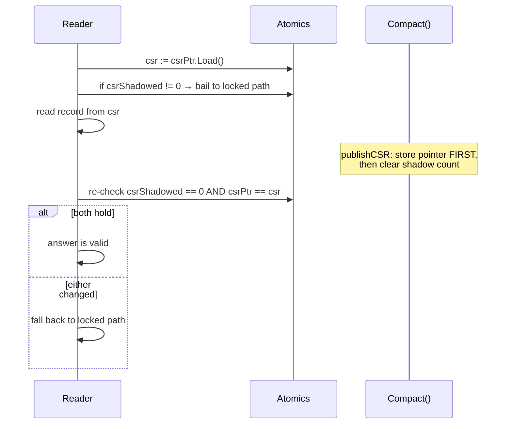

**Two invariants make it sound:**

1. The shadow counter is only ever incremented within the life of one CSR, so
   observing zero *after* the read proves it was zero throughout.
2. The reader re-checks **the pointer it read from**, which catches a `Compact()`
   that swapped the CSR and cleared the counter underneath it.

Pointer identity is sound because the reader still holds a reference to that CSR,
so the object cannot be collected and its address cannot be reused mid-check.

**Counting shadows rather than asking "is the delta empty"** is what makes this
useful. Appending new entities shadows nothing, so ongoing writes do not disable
the fast path for pre-existing records. An "is the delta empty" flag would switch
off after the first write and stay off until the next compaction.

#### The version that was wrong

The first implementation used a separate generation counter, with `Compact`
bumping the generation *before* storing the new pointer. That left a window:

```
reader: sample generation  → N+1   (already bumped)
reader: load pointer       → OLD   (not yet stored)
reader: check shadow count → 0     (already cleared)
reader: read stale record, re-check, both match → ACCEPTS STALE DATA
```

Every ordering of two independent atomics has such a window, because the reader
needs the pointer and its validity to agree and they were separate words. The fix
**removed the second word** rather than reordering the stores.

**What did not catch this:** neither the race detector — which finds
unsynchronised access, not stale answers, and the code was perfectly
synchronised — nor the concurrency tests, whose window is two instructions wide.
`TestConcurrent_ReadsDuringCompaction` now runs 200 compactions against 8
readers as defence in depth, but the correctness argument rests on the design.

### 9.3 Scaling characteristics

| Path | Behaviour |
|---|---|
| Disk point lookup | **4.8×** across 16 cores (lock-free path) |
| Disk 3-hop BFS | **5.4×** across 16 cores |
| Property registration, distinct keys | **2.4×** (16 shards) |
| Property registration, one key | ~1.2× — sharding cannot help single-key traffic |
| Memory point lookup | **~0.5× — negative.** `RWMutex` with a very short critical section: `RLock` is an atomic increment on one shared cache line, and the synchronisation costs more than the work it protects |
| Writes | serialised by the store lock; disk additionally bounded by a single WAL append point |

The memory backend is the reference implementation, not the production path, and
is deliberately left unsharded — see §14.

### 9.4 Compaction with the lock released

Compaction used to hold `s.mu` from its first map read to its last publish. That
put an O(V+E) scan, a sort, a Merkle pass over every record, index entry and
tombstone, a whole-image serialisation and a whole-image fsync inside every
writer's critical section — a single stall that grows with the size of the
store. Measured on a 100 000-record store, the worst commit during a compaction
took **91–93 ms**, which is the compaction's own wall time: one writer, blocked
for all of it, and **2** commits got through.

The work splits at the point where it stops reading the store:

| Stage | Lock | Does |
|---|---|---|
| `compactPin` | `s.mu` | collect the records, the property entries, the redaction ledger and the log offset, all at one epoch |
| `build` | none | sort, hash, serialise, write and fsync the temp image |
| `compactCommit` | `s.mu` | checkpoint, rename, retire the log, splice the delta, publish |

The middle stage is safe unlocked because the plan shares nothing mutable with
the store: the record slices are freshly built, a `*store.Node` in the delta is
*replaced* rather than edited when it changes, a `CSRGraph` is immutable once
published, and the property entries and ledger are copies taken under the lock.
Same store, same measurement: worst commit **17–20 ms**, and **132–148** commits
got through. The compaction itself takes ~15% longer, which is the writers now
actually running.

**The released lock costs two things, and both are mechanisms rather than
caveats.**

*Commits land during the build.* They are in the log and in the delta and
nowhere else on disk — not in the image, which was built from an older epoch. So
the log cannot be emptied behind them. `compactCommit` knows where the log stood
at the pin, and rebuilds it holding only the bytes after that offset. Carrying
raw bytes is sound because a record's CRC covers its type, length and payload
and nothing about its position; it is sound *only within one framing*, so a
pre-container v1 log is left alone instead. A log being rotated to a retained
segment is left alone too: replay reads only the active log, so carrying the
tail forward would open a window between two renames in which a crash leaves it
in neither. Leaving the log is always safe — its records are in the image as
well, so replay applies them a second time as upserts — and costs only that this
compaction reclaims no log space. The audit entry says which happened.

**The checkpoint marker belongs to the branch, not to the commit stage — and
putting it in the wrong place lost data.** A checkpoint record means "replay
stops here". `compactCommit` used to write one before it knew which retire branch
it would take, which is right for the two that then empty or rebuild the log and
wrong for the third, which keeps the log and goes on appending to it. Every
record committed after such a compaction sat in the log *after* a stop marker,
and replay discarded it — silently, on the next open, with no error anywhere. The
branch is reachable whenever segment retention is configured and a commit lands
during a build, which is the steady state for a retained-segment store under
load. The commit stage now only flushes the log and takes its end offset
(`drainedEnd`); each retiring branch writes its own marker, and the keep branch
writes none. `TestRetiredLogKeepsWritesMadeAfterACompaction` is the regression.

*The durability moved with the marker, and this is what keeps a compaction at one
fsync.* `drainedEnd` drains the queue and stats the file; it does **not** sync.
The two branches that write a marker sync as part of writing it, and the keep
branch, which writes no marker, issues the sync on its own — the tail commits
still have to be durable before the epoch covering them is published. Syncing in
`drainedEnd` as well is the obvious way to write it and costs a second fsync per
compaction; measured through the WAL's `syncHook`, every branch went from two
syncs of the active log to one.

*What the marker is worth now, stated honestly.* After this change no correct
store can hold a record after a marker: every branch that writes one goes on to
empty the log, rebuild it excluding the marker, or rotate the whole file away. A
marker can therefore only sit at EOF, where stopping at it and stopping at EOF are
the same stop — the record is **inert**. It is still written, because removing it
would drop a record type from the durable format and change what `graphene
inspect` renders, which wants its own change and its own review. The consequence
for testing is that "a retiring branch stops writing its marker" is an *equivalent
mutant* rather than a test gap, and `TestRetiringBranchesReplayWhole` — which was
written to assert the marker and cannot — says so in place of a claim it cannot
support.

*The delta holds both generations.* Publishing an empty layer, which is what
compaction always did, would drop them. `deltaLayer.since` keeps exactly the
chains whose head is newer than the pinned epoch and drops the rest, which is
what preserves compaction as the point where a delete stops costing memory. Only
the head is carried: the new view is published under the lock together with the
epoch, so nothing can pin it at an older one. Surviving heads are *copied*, never
relinked, because an open snapshot is still reading the layer they came from.

**The invariant this buys** is the one the rest of the engine reads as obvious:
*the image holds every epoch up to the pin, the log holds every epoch after it,
and neither holds both.* Backup and PITR need it to mean one thing.

**One correctness subtlety worth naming.** A commit in the window may supersede a
record the new image holds — a node created before the pin, folded into the
image, and updated during the build. The store's shadow counter never saw it
(`nodeInCSR` was false against the *old* image when the update was applied), so
publishing the new view has to *restore* `csrShadowed` from the surviving layer
rather than clear it, and has to store the count **before** the view pointer.
Clearing it, or storing it after, lets a lock-free point read find the image's
superseded copy, re-check against a count that is still zero and a pointer that
already matches, and return it. See §9.2 for why that class of bug is a
two-word problem and how it is avoided elsewhere.

### 9.5 Background compaction

Off by default. `disk.Options.AutoCompact` takes a `store.CompactionPolicy` and
starts **the only goroutine in engine code**, which evaluates the policy on a
ticker and compacts when a rule fires.

`CompactionPolicy.Evaluate` has always been able to say "this store is due" and
nothing acted on it. That was right while a compaction froze every writer for the
length of a whole-image rebuild — when to pay that is genuinely the caller's
decision. §9.4 is what changed the cost of saying yes; it did not change who gets
to say it, which is why the default is still off and `Graph.ShouldCompact`
remains the documented shape.

The goroutine means a lifecycle, and it is short:

- Started by `Open`, last, once the store is fully built. Never on a read-only
  store, which cannot compact and would refuse on every tick.
- `Close` cancels it and then **waits**. A compaction in its commit stage ignores
  cancellation, so the wait is what stops `Close` pulling the log, the audit log
  and the process lock out from under a rename in progress. That is a
  use-after-close, not a lost compaction.
- The wait is bounded by one commit stage, not one compaction: `CompactCtx`
  checks the context around the build and abandons it.

`Options.AutoCompactObserver` is told the rule that fired and what the compaction
returned. Without it a failing background compaction fails silently and repeats,
because the library has no logger and there is no caller to return an error to.

---

## 10. Consistency model

### 10.1 What a read guarantees

> **Every ID a read returns named an entity that was live at the moment it was
> checked, and every record returned is internally coherent** — an edge is
> incident to the node it was requested for, and a neighbour is that edge's far
> endpoint.

**The moment is inside the call, not after it.** By the time a caller acts on a
result the entity may be gone, so `GetNode` on an ID just returned can
legitimately fail. Measured against a deleter running flat out: **0.7%** of IDs
from a single-key lookup, **4–11%** from a typed query, which returns more IDs
over a longer call.

A sequence of plain calls is **not** a transaction. To close that gap, take a
snapshot:

```go
snap, err := g.Snapshot()
defer snap.Close()
```

Every read through one sees the graph as it stood when it was taken, for as long
as it is held — see §10.3.

### 10.2 Why property lookups resolve against the records

The index and the records are separate structures under separate locks.
`DeleteNode` holds the store lock across its whole cascade, but a lookup
consulting only the index could read postings the delete had not reached yet and
return an entity the records no longer had — a **torn read of one logical
operation**.

`NodesByProperty` / `EdgesByProperty` therefore resolve postings against the
records before returning, making the records the authority. This also covers
index entries with no record behind them at all, since index writes do not verify
that the entity exists.

Cost: ~20 ns on a raw single-key lookup, nothing measurable on the typed query
path, which already resolved candidates that way.

**The label paths never had this problem**, for an instructive reason: the memory
backend keeps label postings *inside* the store lock alongside the records, and
the disk backend re-validates candidates under a single lock hold. The property
index was the outlier precisely because it is separate — which sharding it made
more true, not less.

---

### 10.3 Snapshots

`Snapshot()` returns a fixed read view. Every read through it answers about the
graph as it stood when it was taken, however long it is held and whatever
writers do meanwhile. Both backends implement it.

A `store.Snapshot` is the read half of `store.GraphStore` and nothing else, so
it satisfies `store.GraphReader` and every traversal accepts one directly:

```go
snap, _ := g.Snapshot()
defer snap.Close()
res, err := traversal.BFS(snap, origin, 3, store.DirectionBoth, nil)
```

**What is fixed.** Nodes, edges, adjacency, labels, and everything derived from
them, including counts and label queries.

**What is not.** The property index is a live structure shared with the store,
so `NodesByProperty` and `EdgesByProperty` resolve *current* postings against
*pinned* records. A posting whose node did not exist at this epoch, or has since
been deleted, is dropped; an entry registered after the snapshot was taken, for
a node that already existed, is the one case this cannot exclude.

**Epochs.** `Epoch()` names the version of the graph the snapshot reads. Two
snapshots with the same epoch over the same store see the same graph. It is
monotonic within one open store and means nothing across processes.

#### How it works on disk

The store holds one `view` — a CSR image paired with the delta layer above it —
behind a single atomic pointer, and a separate `visibleEpoch` counter. Each delta
entry is a version chain rather than a bare record, newest first, and a read at
epoch E walks to the first version with `epoch <= E`. A delete stacks a tombstone
rather than erasing the entry, which is precisely what the old delete masks could
not express: they recorded *that* an ID was gone, never *when*.

Opening a snapshot is therefore two words and a registry entry, not a copy. That
matters because the delta is unbounded between compactions; copying it would make
a snapshot cost O(everything written since the last compaction).

Three structures cannot express a version — the adjacency lists, the label
postings, and the property index. For those the rule is: remove an entry when no
reader can still be behind, leave it when one can. Leaving it is always safe
because every read re-resolves each candidate against its own epoch, so a stale
posting costs a filtered-out candidate and never a wrong result. `VerifyIndexes`
checks the direction that still has teeth — that nothing a read *needs* is
missing.

**"No reader can be behind" is not "no snapshot is open",** and reading it as the
latter was a bug — the one this release fixes. A plain read runs at
`visibleEpoch`, and group commit leaves `visibleEpoch` trailing `mutEpoch` for
the whole of a transaction's durability wait, *with the store lock released
across it* (§9). A writer that truncated a chain to its newest version in that
window deleted the version those readers were entitled to, and `at()` reports "no
opinion" for a chain whose every entry is newer than the reader's epoch — which,
with no image beneath it, is indistinguishable from the record never having
existed. So a node updated inside a transaction did not read as *stale* to a
concurrent reader; it read as **absent**, from `GetNode` and from its own label's
posting alike, for the length of the fsync. `tests/graphene_visibility_test.go`
is the regression test and fails on every build before this one.

`retainLocked` now floors the retained epoch at `visibleEpoch` whenever any
commit is applied but unpublished, tracked by a counter on the store. The
qualifier is what keeps the common case free: a single-record mutator advances
both epochs under the lock, so the gap it opens is closed before anything can
observe it, and its chains still collapse to a single version. A chain under a
*transactional* writer settles at two — 24 bytes per record that has been
updated at least once, and no extra allocation, because the retained version is
the previous head rather than a new one. Interleaved A/B on
`BenchmarkTxUpdate_Disk_NoSync_*` shows no time regression and one allocation
*fewer* per single-record transaction, the superseded label posting no longer
being deleted and immediately re-added.

A compaction publishes a new view with a fresh delta layer and leaves the old one
untouched, so an open snapshot keeps working and the garbage collector reclaims
what it pinned when it closes. `StorageStats` reports `OpenSnapshots` and
`OldestSnapshotEpoch`; a store whose memory will not come down after a compaction
is usually explained there. `Options.MaxSnapshotAge` is the guard against a
leaked one.

#### The memory backend copies

`memory.Store` implements the same interface by copying its maps under the read
lock — O(V+E) per snapshot in time and resident bytes. That is deliberate. It is
the oracle the disk backend is tested against, so its answers have to be
obviously correct by construction; a second versioning scheme would be a second
thing that can be wrong in the same way.

### 10.3a Iteration

Every read on `GraphReader` answers with a slice. That is the right shape for a
lookup and the wrong one for a graph: `QueryNodeIDs(NodeQuery{})` on a million
nodes builds a million-element slice before the caller sees the first ID, and a
bulk export then holds it for the whole of the export.

`store.Scanner` is the other shape — `ScanNodes`, `ScanEdges` and
`ScanNodesByType`, each an `iter.Seq2[ID, error]`. Both bundled backends
implement it, on their `Snapshot` and not on the live store.

**Why only over a snapshot.** It is the answer to the question a live iterator
cannot answer: what a scan should do when a writer changes the graph underneath
it. A snapshot has already fixed that (§10.3). It also makes the scan cheap — a
delta layer a compaction has superseded is never written to again, so iterating
one takes no lock at all. This is the same rule algorithms already follow.

**Why `Seq2` and not `Seq`.** A scan can fail partway: the snapshot behind it
can be closed or can expire while the caller is still pulling. The error is the
last thing the sequence yields, and the ID beside it is not a result. Swallowing
it would make a scan that stopped early indistinguishable from one that
finished, which is the difference between a partial export and a complete one.
Stopping early is `break`; nothing has to be closed.

**Ascending, on both backends.** The same order the equivalent query returns, so
a scan can replace one without changing what the consumer writes — `bulk`
streams a source that implements `Scanner` and enumerates one that does not, and
the two produce byte-identical dumps.

**How the disk scan is bounded.** The obvious implementation — range the delta
map, yield each ID, then walk the image — cannot be written, because a snapshot
whose view the store is still writing to reads under `s.mu`, and yielding to
caller code while holding it deadlocks against a caller that reads the store
from inside its own loop. So a scan resolves a **batch** under the lock,
releases it, and yields the batch; the lock is held for a fixed number of
records at a time and never across caller code. The batch starts at 32 and
doubles to 512, so a caller taking one ID and breaking does not pay to resolve
five hundred, and a caller draining the graph reaches the full batch after five
of them.

**What it costs, honestly.** A scan is not O(1). The delta half has to be
gathered and sorted up front — a map cannot be ranged across a lock release, and
the result is promised ascending. What it is not is O(V+E): the image, which is
the large half, is walked in place. So peak memory is the delta plus one batch
rather than the graph, which is the whole win on a compacted store and is also
when it matters. It is measured at 6 allocations for a full walk, and 6 for a
walk stopped at the first ID — the number that matters being that neither grows
with the graph.

The in-memory backend materialises and sorts instead. A snapshot there is
already a copy of the whole graph (§10.3), so streaming over it would save
nothing, and what the oracle owes the disk store is an answer that is obviously
right rather than one that is cheap.

**What a snapshot reports, and what it may not do.** A scan is only half of what
makes a view usable as a `bulk.Source`. The other half is the header: an export
writes the store's ordered and composite declarations into the dump so the
import can rebuild the same indexes. Those live on the store and not on the
view — the ordered index a key is answered from is the one the store holds now,
whatever epoch the snapshot pins — so `store.OrderedIndexReporter` and
`store.CompositeIndexReporter` were split out of the declarer interfaces as
their read halves, and both snapshots implement them by forwarding. A view
deliberately does not satisfy the declarers: it may say what was declared and
may not declare. A closed or expired snapshot reports nothing, matching what its
scans and its property walk do rather than answering from a store the caller has
let go of.

The consequence of getting this wrong was silent, which is why it is stated
here: `bulk` asserted the full declarer, so a dump taken through a snapshot came
out with an empty header, imported without complaint, and left the restored
store answering range and composite queries by scanning.

### 10.4 Traversal budgets

Depth was the only limit a traversal took, and depth bounds nothing once a hub is
in range: one node of degree 100 000 puts 100 000 entries in the visited set at
depth one, and the walk has no way to report that it is in trouble.

Every traversal now has a `*Ctx` variant taking a `context.Context` and a
`store.Budget`:

```go
res, err := g.BFSCtx(ctx, origin, 3, store.DirectionBoth, nil,
        store.Budget{MaxNodes: 100_000, MaxTime: 5 * time.Second})
if errors.Is(err, store.ErrBudgetExceeded) { ... }
```

`MaxNodes` bounds memory (the visited set), `MaxEdges` bounds work on a dense
graph, and `MaxTime` is the limit of last resort. Exceeding one is a **refusal,
not a truncation** — a partial answer that looks complete is the failure mode
this exists to prevent, so nothing partial comes back with the error.

The context is checked every 256 steps rather than every step: `ctx.Err()` takes
a mutex on a cancellable context, and that is not cheap a million times. The
worst-case overshoot after a cancel is a few microseconds of walking.

A deadline is checked on a much shorter cadence, every 16 steps, and the split is
the point. 256 was answering a question about cancellation, where overshooting
costs nothing because the caller has stopped caring about the answer. As a
deadline cadence it left a hole: a walk charging fewer than 256 steps never
reached the check at all, so `MaxTime` went unenforced on exactly the walks whose
cost a caller cannot predict — few steps, each of them slow, which is what a
traversal over cold pages looks like. `MaxNodes` and `MaxEdges` never had that
hole, because they are charged per visit.

16 is measured rather than assumed. `BenchmarkBFS_Deep_Budget` runs one fixture
in three arms — `unbounded`, `nodes` (accounting, no deadline) and `time`
(accounting plus a deadline) — and interleaved over ten runs, checking the clock
on *every* step put the `time` arm at 2.712 ms against `nodes` at 2.317 ms. At 16
it is 2.185 ms against 2.205 ms: indistinguishable, and the only significant
movement in the comparison (−19.4%, p=0.003) while `unbounded` and every control
sat still. The clock read is cheap; doing it on the inner loop of a walk that
charges three ticks per node is not. Only a caller who set `MaxTime` pays for it
at all — with no deadline the guard runs the code it always ran.

What this cannot fix is a clock too coarse to see the deadline. The Go monotonic
reading on Windows is `_INTERRUPT_TIME` from the `KUSER_SHARED_DATA` page, which
advances at the system timer interrupt: 15.6 ms by default, ~0.5 ms while some
process has raised the timer resolution. Two readings inside one tick are *equal*,
not ordered, so a `MaxTime` shorter than a tick can never be observed as exceeded
— by `After`, by `!Before`, or by any other comparison. `MaxTime` is therefore
documented as best-effort with that floor named, and the enforcement tests drive
an injected clock (`traversal/guard_test.go`) rather than asserting that the real
one moved. A test that depends on the machine's timer resolution is a test that
passes or fails according to what else is running on the box.

A zero `Budget` with a background context sets a flag that makes every check a
single boolean test, so the unbounded call costs what it always did — the
interleaved A/B against HEAD showed identical `B/op` and `allocs/op` once the
guard was made a stack value rather than a heap allocation.

The recursive walks (`DFS`, `ProvenanceChain`, `FindSubgraphMatches`) also carry
a hard recursion limit of 100 000 frames. A goroutine stack that runs out is a
crash rather than an error, which is the one failure a caller cannot handle.

`helpers.go`'s `HasCycle` recurses the same way and was outside that guard,
because it is not in the `traversal` package. It now checks the same limit,
which moved to `store.MaxRecursionDepth` so the two cannot drift — two copies of
a limit are two limits.

### 10.5 Cancelling what is not a traversal

Four calls walk something proportional to the whole store while holding a lock,
and none of them is a walk: `VerifyIndexes`, `RebuildIndexes`, `QueryNodes` and
`QueryEdges`. Each has a `*Ctx` variant. They take no `Budget` — there is no
frontier to bound and no depth to cap; what they take is a context.

**The lock is the reason, more than the time.** A query over a large candidate
set holds `s.mu.RLock` for its whole duration and a verification holds it for
seconds on a large store, so a caller that has given up is not merely spending
its own time — it is holding up every writer queued behind it. The first check
therefore happens *before* the lock is taken: a caller handing over an
already-dead context never makes a writer wait at all.

**`store.CancelCheck` is the shared rule.** `traversal/guard.go` already
amortises `ctx.Err()` at one check per 256 steps, but it is bound up with
`Budget` accounting and lives in a package the index and the backends cannot
import. `CancelCheck` is the same rule with the budget taken out, in `store`
where everything can reach it. A context that can never be cancelled sets a
flag and every check becomes one predictable branch.

Measured, interleaved against the same tree with all 26 checks stripped out,
`PointLookupNode_Memory` as the control:

| benchmark | with the checks | checks stripped |
|---|---|---|
| `PointLookupNode_Memory` — **control** | 24.1–25.5 ns | 24.3–25.0 ns |
| `QueryNodes_PropertyEqual_Disk` | 298–339 ns | 296–346 ns |
| `QueryNodes_EqualityPlusContains_Disk` | 608–749 ns | 615–675 ns |
| `QueryNodes_EqualityPlusContains_Memory` | 626–745 ns | 612–637 ns |
| `QueryNodes_PropertyRange_Ordered_Disk` | 616–688 µs | 662–725 µs |

Every arm overlaps, control included, which is the answer: on the uncancelled
path the checks cost nothing measurable. (An earlier run at `-benchtime 300x`
moved the control by 10% and was discarded — a control that moves means there is
no result, however good the headline looks.)

**Where the checks go, and where they deliberately do not.** Inside the loops
that are proportional to the store — the candidate loops, the residual probe,
the per-value merge, every pass of a verification, including the property
index's own, which is most of a verification and is behind its own call. Not
inside `RebuildIndexes`'s structural rebuild.

That exception is the whole of the rebuild's contract. A rebuild clears the
label postings and the adjacency and repopulates them; stopping half way leaves
postings naming only some of the records that carry a label, which §11.4 calls
the fault that matters — a missing posting costs a query *result*, silently, and
an extra one costs a candidate the read path filters out anyway. So the rebuild
either finishes or does not begin, and cancellation is honoured before it and
during the dead-entry sweep after it. A cancelled rebuild leaves the store **no
worse than it found it** and not repaired; `VerifyIndexes` still reports
whatever the sweep did not reach. Same shape as `CompactCtx` — cancellation
reaches the part that can be thrown away and stops at the part that cannot.

**Nothing partial comes back.** A query stopped part way holds a candidate set
some filters have been applied to and others have not: a superset of the answer
shaped exactly like the answer. Both the residual pass and the planner drop it
independently, which is belt and braces — the planner's guard makes a mutation
of the index's invisible, so the index's own contract is pinned by a test in
that package rather than through a store.

**A cancellation is not an inconsistency.** `VerifyIndexesCtx` returns
`ctx.Err()`, distinguishable with `errors.Is`, because a caller that reads every
non-nil error from a verification as corruption would otherwise treat a timeout
as a reason to restore from backup.

## 11. Failure and recovery

### 11.1 Durability boundary

**An individual write is not durable when it returns.** `fsync` runs on the
commit path (see the group-commit note below), in `WAL.Sync()`, in
`WAL.Checkpoint()` (invoked only from `Compact`) and in `WAL.Close()`. The
single-record path never syncs.

Worse, the drain is opportunistic:

```go
w.enqueue(recType, copied)
if w.writeMu.TryLock() {          // if another goroutine holds it, skip
    w.drainQueuedLocked()
    w.writeMu.Unlock()
}
return nil                        // returns either way
```

If that `TryLock` fails, the record is still in the **process-memory ring buffer**
when the call returns — it has not reached the OS, let alone the platter.

| Failure | Survives? |
|---|---|
| Nothing crashes | yes; visible to all readers immediately |
| Process crash | **usually** — see below |
| Power loss / kernel panic | **only if `Compact()` or `Close()` has run since** |

Measured, so the risk is not overstated: 200 `AddNode` calls with no `Close()` or
`Compact()` left all 4 800 bytes already in the file. Single-threaded, the
`TryLock` always succeeds and every record reaches the OS immediately. A record
lingers in the ring only when another goroutine holds `writeMu` at that instant.

**So the real exposure is power loss, not process crash** — the OS will flush its
page cache for a dead process, but nothing has been forced to the platter since
the last `Compact()` or `Close()`.

**The policy, now that one exists:**

| Write | Durable when |
|---|---|
| Batch (`AddNodesBatch` / `AddEdgesBatch` / `ApplyTransaction`) | **at commit** — fsynced by default; `SetSyncOnCommit(false)` opts out, and the bytes still reach the file immediately |
| Individual | on `Sync()`, `Compact()`, or `Close()` |

Individual writes are not synced per call by design: an fsync per `AddNode` turns
a ~6 µs operation into a ~1 ms one. `WAL.Sync` (exposed as `Store.Sync` and
`Graph.Sync`) drains and fsyncs without rebuilding the CSR, so a caller can
establish a durability point for ~1 ms instead of the ~64 ms a `Compact()` costs.

The previous text here — "recoverable once its WAL append returns" — was simply
wrong, and was found by tracing the write path during bulk-write planning rather
than by any test.

#### Group commit

One fsync makes every byte written before it durable, so a committer that
arrives while a sync is in flight has nothing to do but wait for it. The first
committer in becomes the leader; the rest wait on a condition variable and
return when the leader's flush covers them. N commits, one fsync.

Two things had to be true for that to work.

**The store lock is released before the wait** (§9.1). Nothing is shared while
the fsync happens under `Store.mu`, because then no second committer can reach
the gate to join the cohort.

**The leader owns the write as well as the sync.** The first version wrote each
commit's bytes in its own goroutine and shared only the fsync, and on Windows it
grouped nothing at all: `WriteFile` blocks while `FlushFileBuffers` is in flight
on the same handle, so the committers who should have been forming a cohort were
stuck in `write()` instead. Measured, the write cost per commit went from 37 µs
at one writer to 604 µs at four — exactly the fsync duration — and 640 commits
still cost 639 fsyncs. Commits therefore queue their framed bytes in the WAL's
existing ring (whose sequence is already the log order) and the leader drains and
syncs the queue holding `writeMu` across both. Nothing else touches the file
while either is happening.

Measured after that change, same machine, 40 batches per writer:

| Writers | Commits | fsyncs | Per commit |
|---|---|---|---|
| 1 | 40 | 40 | 646 µs |
| 4 | 160 | 49 | 181 µs |
| 16 | 640 | 53 | 53 µs |

Interleaved against a HEAD worktree with `PointLookupNode_Memory` as the control,
`BenchmarkConcurrentCommits` is flat at ~610 µs/op on HEAD for every writer count
— fully serialised — against 602 µs / 346 µs / 188 µs / 108 µs / 66 µs at 1, 2,
4, 8 and 16 writers here: **9× at 16 writers**, and still scaling.

Space held by deleted or superseded records is reclaimed at the next `Compact()`.

### 11.2 What a crash leaves behind

| Crash point | State on reopen |
|---|---|
| Before WAL append | operation never happened |
| After WAL append, before apply | replay applies it **if the record reached the OS** — see §11.1 |
| Mid-cascade in `DeleteNode` | edges deleted, node alive — consistent, because edge tombstones are journalled first |
| During `Compact`, before publish | old CSR + full WAL; replay reconstructs |
| After publish, before WAL truncate | new CSR + stale WAL; replay is idempotent (upserts and tombstones) |
| Abrupt kill (no clean close) | committed data intact; next `Open` replays everything since the last compaction |

### 11.3 Why `Open` does not verify indexes

It did, briefly: ~200 ms on a 100k-node store, an O(V+E) tax on **every** startup,
catching little that is not already covered.

- A corrupt index section is rejected while parsing — magic, counts and bounds
  are all checked.
- Label postings and the property index are rebuilt by insertion through the
  normal code paths, which sort and deduplicate, so their structure is correct by
  construction whatever the file contained.

What remains is engine bugs, which belong in tests rather than in a startup scan.
Recovery is explicit: `VerifyIndexes()` then `RebuildIndexes()`.

### 11.4 What verification can and cannot check

| `VerifyIndexes` checks | It cannot check |
|---|---|
| postings ordering and deduplication | that an indexed *value* still matches the entity's properties |
| forward ↔ reverse agreement, both directions | — because values are caller-encoded and opaque |
| `ref1`/`refN` arity invariants | |
| a composite's postings against the member values they were derived from, both directions (§6.4a) | |
| label postings against live labels | |
| adjacency against edge endpoints | |
| that no index entry outlives its entity | |

`RebuildIndexes` recomputes what is derivable from the records — label postings,
adjacency — and drops property entries whose entity is gone. **It repairs
structure, not content.**

### 11.5 Replay cost — buffering and the checksum

Replay is the cost of opening a store that has not been compacted, and it is
**I/O-bound, not index-bound**. A CPU profile of a cold open put 69% of the time
in `syscall.readFile`; the index maintenance that replay performs per record did
not reach the top twenty.

The cause was structural: each record was read with three separate `io.ReadFull`
calls against the file handle — header, payload, footer — so a 60 000-record log
issued roughly 180 000 syscalls. Replay now pulls the log through a
`bufio.Reader`.

> **Why buffering is safe here.** The WAL is opened `O_APPEND`. Writes go to the
> end of the file regardless of the read offset, so a buffered reader that reads
> past the last record cannot affect a subsequent append. Without `O_APPEND` this
> would corrupt the log.

With the syscalls gone, the record checksum became 46% of what remained. It was a
bit-by-bit CRC-32 — eight iterations per byte — over polynomial `0xEDB88320`,
which is the reversed IEEE polynomial. `crc32.ChecksumIEEE` produces the
**identical value** using a hardware-accelerated implementation.

That identity is a **format guarantee**: every WAL already on disk was written by
the old loop, and a checksum that differed anywhere would fail every record on
replay. `disk/crc_test.go` pins the values with fixed vectors — including the
standard `0xCBF43926` check value — rather than comparing against
`crc32.ChecksumIEEE`, which would now be tautological.

Together: a cold open of a 10 000-node uncompacted store went from 1 263.9 ms to
**42.7 ms**, with allocation counts unchanged — no allocation figure could have
located either cost.

The read buffer is capped to the log's own size. A fixed 1 MiB buffer cost a
megabyte on every open, including compacted stores that replay almost nothing.

---

### 11.6 Backup, restore, and recovery to a point in time

`Store.Backup(dst)` writes a consistent copy of a store that is **still open and
still being written**. `disk.Restore(src, dst, opts)` reads one back, optionally
rewound to a commit sequence number or a wall-clock instant.

**What makes a copy consistent.** §9.4's invariant, restated as a property of the
directory: the image holds every commit up to the compaction's pin, the log holds
every commit after it, and neither holds both. A copy of the pair is a whole
store exactly when both halves come from the same side of a compaction — so
compaction is the only operation a backup has to exclude, and the two refuse each
other with `ErrBackupInProgress` and `ErrCompactionInProgress`. Everything else
under `dir` is append-only, and a prefix of an append-only file is a valid
shorter version of itself.

**Writers are not stopped.** The store lock is held only to note where the log
stands and to list what to copy; the copy itself runs with no lock at all.
Measured on a 100 000-record store, one writer committing throughout: the worst
single commit during a backup is **1.0–1.6 ms** against a control worst of
**1.0–1.2 ms** with nothing else running — the same figure, inside its own noise.
The copy costs a few percent of write throughput (**0.92–0.98** of idle, one
outlier at 0.77), which is I/O contention rather than blocking.

**The log is cut to an offset; nothing else is.** `WAL.stableSize` takes the
maintenance barrier so the recorded length names a record boundary. That figure
has to be exact, because it is what a recovery point is later measured against;
the ledgers carry no such promise and are copied whole. The process lock is not
copied — it names the pid holding the *source* — and neither is any `.tmp`.

**The manifest is the backup.** `graphene.backup.json` commits to every file's
length and SHA-256, and is written **last**, so a directory without one is not a
backup however complete it looks. Digests are computed from the bytes actually
written, and the image is additionally checked against the digest in its own
header, so "the backup succeeded" is a statement about the copy rather than about
the original. `VerifyBackup(dir)` re-checks the lot without restoring — the
question an archive has no answer to until someone asks it, and the worst moment
to first ask is during a recovery. A restore verifies before copying a byte and
hashes again as it writes.

**Recovery to a point is a truncation.** Replay applies a batch only when it
reaches the commit record closing it, so recovering to a point is cutting the
copied log at the end of the last commit at or below it. The restored directory
*is* the store as it stood then — there is no "stop early" flag anywhere for a
later open to ignore. The cut is placed by driving `replayRecords`, the same
parser the store replays through and the one `FuzzWALReplay` covers, so the cut
and the meaning of the truncated log cannot drift apart.

Two limits follow from that being the mechanism, and both are reported rather
than hidden:

- **Only commits are boundaries.** The single-record mutators append a bare
  record with no sequence number and no timestamp, because they have never been
  transactions (§11.1). They are restored with the commit that follows them and
  dropped with it otherwise, and a store written entirely through them has no
  boundaries at all. `RestoreInfo.DroppedRecords` counts what a cut discarded, so
  the pitfall shows up as a number.
- **A point inside the image cannot be reached.** Compaction folds commits into
  the image and is not reversible, so the earliest point a backup can be rewound
  to is the image's own `commitSeqHW`. Asking for less returns
  `ErrRestorePointTooEarly` naming that figure — read from the image's header
  rather than from the manifest, because that is the file it is a property of.
  Going further back needs an older backup, which is the reason to keep more than
  one.

**What a restore leaves.** An ordinary store, opened with `disk.Open`. Its commit
numbering resumes past what it holds rather than colliding with it, because the
counter's high-water mark is in the image header (v8) and in the log it kept. If
the backup carried an audit log, the restore appends an `AuditRestore` entry to
it, continuing the chain rather than starting one — and a store that was never
audited does not acquire a chain here, because a first entry claiming to describe
a history it has none of would be worse than no entry.

---

## 11a. Integrity architecture

All of this is opt-in and none of it is on the critical path of a store that has
not asked for it. [SECURITY.md](../SECURITY.md) is the authority on what each
mechanism proves; [FORENSICS.md](FORENSICS.md) is how to call it. This section is
how it is put together.

### 11a.1 Six chains, and what each answers

| Chain | Where | Question |
|---|---|---|
| snapshot roots | `GHSH` in the image | what does this image contain, and what did it replace |
| attestations | `GATT` in the image | who asserted this image, and when |
| WAL segments | `graphene.NNN.wal` | which commits produced it, across past compactions |
| audit entries | `graphene.audit` | what was done to the store |
| redactions | `graphene.redactions` | what was destroyed on purpose, by whom, why |
| grants | `graphene.grants` | who was permitted to do any of it |

Each is hash-linked and verifies on its own. Each was built for a different
question, and **none of them answers the one an investigation asks** — *can this
artefact be accounted for end to end?* `CustodyFor` walks all six and returns the
gaps; it is synthesis over the chains rather than a seventh mechanism.

### 11a.2 Why the ledgers are not in the WAL

Compaction truncates the WAL. A deletion record living there would be destroyed
by the very operation that makes the deletion permanent — a record that
disappears exactly when it becomes the only evidence. The same argument applies
to grants and audit entries, so each is its own append-only file that compaction
never touches.

The cost is more files and more fsyncs; BL-33's measurement puts the audit +
retention overhead at a flat ~15–16 ms per compaction, independent of image size,
because it is durable writes rather than hashing.

### 11a.3 What binds them together

A `Checkpoint` hashes every chain's head into one digest — snapshot root,
attestation ID, segment head, audit head, redaction head, grant head — plus the
count of each. Publishing only the snapshot root would leave the others free to
be rewritten, so binding them jointly removes the choice.

The digest is what leaves the system. The engine **ships no anchor transport**:
what makes an anchor an anchor is being beyond the reach of whoever can rewrite
the store, and nothing in-process can establish that. `disk.Anchor` is two
methods; supplying one is the deployment's job.

### 11a.4 The boundary, restated

Graphene is a library in the caller's process, so every check here compares the
store against the store. That catches corruption and it catches an outsider. It
does not catch an insider holding the signing key, who can rebuild every chain
consistently. Only a value retained outside the system closes that, which is why
`CustodyFor` can never report `Complete()` and says so rather than letting a
clean report be mistaken for proof.

The role model is the same shape and is documented as such: nothing in the engine
calls `CheckCapability`. What the grant ledger provides is that capabilities are
derived from it and nothing else, so a privilege change cannot happen without
leaving a record — an invariant that holds by construction rather than by
checking, which is the only way it could hold here.

---

## 11b. Operations

### 11b.1 The metrics sink

There was no logging and no metrics anywhere in library code. That is a
defensible position for an embedded engine — writing to a logger of its own
choosing is a decision belonging to the program embedding it — and a useless one
for anybody operating a store. `Options.Metrics` is the place to attach one, nil
by default, the same shape as `Signer` and `AutoCompactObserver`.

**One method taking a concrete struct.** The alternatives were a method per event
and a stringly-typed counter/gauge pair. A method per event makes every new
measurement a breaking change to an exported interface, which is the wrong trade
for something whose purpose is to grow. A string-keyed sink allocates on the hot
path and pushes the meaning of every number into documentation nothing checks.
One method is neither: adding a `MetricKind` is additive, the struct passes by
value so nothing escapes, and the per-kind meaning of each field is a table in
the type's own doc comment.

**Where the emissions are, and where they are not.** Commit, sync, compaction,
query, open-replay, snapshot open/close, backup, refresh. Not `GetNode` and the
other point reads: that path is ~6 ns and lock-free, two clock reads are an
order of magnitude more than the work, and a measurement that dominates the
thing it measures is not an observation.

**Every emission but one is outside the store lock.** A sink is caller code, and
holding a lock across it lets a slow implementation stall exactly the writers it
was attached to measure — so the query metric is recorded after `RUnlock`, the
commit metric after the store lock is released for the durability wait, and the
snapshot-open metric after the write lock. `TestMetrics_TheSinkIsNeverCalledUnderAStoreLock`
pins that by giving the sink a store read to perform, which deadlocks if any of
them is emitted under the write lock. The exception is `MetricSync`, emitted
inside the log's `writeMu`: the duration of an fsync is only knowable where the
fsync happens.

**What it costs when unset, measured.** Interleaved A/B against a copy of the
same tree with the guards on the commit and query paths stripped out entirely,
four rounds, warm-up discarded, `PointLookupNode_Memory` as the control:

| benchmark | with the guards | guards stripped |
|---|---|---|
| `PointLookupNode_Memory` — **control** | 19.6–24.4 ns | 19.1–24.5 ns |
| `QueryNodes_PropertyEqual_Disk` | 206–285 ns | 196–273 ns |
| `QueryNodes_EqualityPlusContains_Disk` | 412–579 ns | 381–531 ns |
| `QueryNodes_EqualityPlusContains_Memory` | 418–529 ns | 401–566 ns |
| `Ingest_AddNodes_Batch1000` | 630–811 µs | 685–835 µs |
| `BulkWrite_AddNodes_Disk_NoSync/n=10000` | 3.44–5.92 ms | 3.82–5.92 ms |

Every pair of ranges overlaps, and so does the control's — which is the answer,
with a caveat worth stating rather than burying. The control is byte-identical
between the arms and still moves 2.3% between their minima, with a spread of
about 25% of its own; that is this host's noise floor, and a cost smaller than
it would not be visible here. What the run establishes is that the guards cost
nothing this machine can measure, not that they cost nothing.

An earlier attempt at 300 iterations per benchmark moved the control by **10%**
and was discarded rather than reported. A control that moves is not a result,
however good the headline looks.

**A refusal is not a failure.** A compaction returning `ErrCompactionInProgress`
or `ErrBackupInProgress` never ran, and reporting it would give a background
compactor an error rate made entirely of its trigger working. A query refused
before it takes the lock is not a query that failed. Everything that *did* run
is recorded whatever its outcome, on one code path shared by both, because a
sink hearing only about successes cannot compute an error rate.

### 11b.2 Bulk import and export

Three formats over one walk. `bulk/walk.go` decides what records exist and in
what order; each format decides only how a record is spelled. A bug in the
enumeration is then one bug rather than three.

**What makes a dump complete is the property entries**, and they are the part
easiest to leave out. A record's `Properties` blob is opaque — the engine never
parses it — and the values in the property index arrived separately through
`IndexNodeProperty`, from a caller who knew how to derive them. A dump of the
records alone restores a graph that looks complete and answers nothing, and
§11.4's point applies exactly: `RebuildIndexes` repairs structure, not content.
So `store.PropertyEnumerator` was added as its own capability, and an export
whose source does not implement it is **refused** rather than written without
them.

That refusal is not theoretical. `*graphene.Graph` embeds `store.GraphStore`,
and an embedded interface promotes only its own method set — so a `Graph` does
not satisfy `PropertyEnumerator` by inheritance, and an exporter treating a
missing enumerator as "nothing to export" would have compiled, run, and produced
a silently incomplete dump. `Graph` now implements the two methods explicitly,
and the bulk package refuses the case anyway.

**IDs are not preserved, and the ordering rule follows from that.** A store
assigns IDs; nothing can ask it for a particular one, and adding a way to would
break the monotonic-and-never-reused property the WAL, the CSR and every ledger
depend on. An import therefore allocates fresh IDs and rewrites every reference
through a map built as the nodes arrive — which only works if nodes arrive
before the edges that name them and the entries filed against them. Every
exporter writes that order; every importer checks it and refuses
(`ErrOutOfOrder`) rather than buffering the whole graph to reorder a stream no
exporter here produces.

**The trailer is what makes truncation detectable.** Counts live at the end, not
the head: a header count could only come from asking the store how many records
it thinks it has, which is a second source that can disagree with the walk and
would fail a perfectly good dump. Counted as they are written, they are what was
written by construction. A dump cut mid-record is caught by the decoder; one cut
between records holds nothing but well-formed records, and only the trailer's
absence and its counts can tell. Same argument as `graphene.backup.json` being
written last — and CSV, whose four tables are separate files, puts them in
`manifest.csv` and writes that last for the same reason.

**graphene_dump reuses the WAL's framing** — `[type][length][payload][crc32]`
with the CRC over all three — rather than inventing one. A checksum over the
payload alone leaves the framing unprotected, so a corrupted length reads as a
valid length and takes the reader somewhere arbitrary before anything notices.
Every length is bounded against the bytes available before it sizes an
allocation, which is `readOrderedKeySection`'s rule in the CSR reader.

**Compression is a CLI concern, not a format one.** `-gzip` wraps the file the
CLI opens; nothing in `bulk` knows about it, because the exporters take an
`io.Writer` and the importers an `io.Reader` and neither should acquire a second
notion of what a dump is. Two consequences follow. The gzip writer is closed
before the file and its error is kept — `Close` is what writes the final block
and the trailer, so closing the file first would produce a stream that
decompresses to a dump missing exactly the trailer the paragraph above relies on
to detect truncation, and the export would have reported counts it never
finished writing. And the *import* side sniffs the two-byte magic number rather
than taking a `-gzip` flag of its own: a flag there could only ever be a way to
contradict the file, and sniffing is what lets the export write the path it was
given instead of renaming it to end in `.gz`. `-format csv` is refused, since it
writes a directory of tables and there is no single stream to sit in front of.

**It has no fuzz target, and that is what the deferral cost.** A hand-rolled
binary reader over attacker-controllable lengths is precisely what CONTRIBUTING
§2 points at. The bounds and the CRC are an argument, not evidence. Together
with `readCompositeSection` it is the first thing to fuzz when new fuzz work is
un-deferred.

### 11b.3 The CLI's writing subcommands

`cmd/graphene` states "no repair, no truncate, no compact": a tool safe to point
at production is worth more than one that can also fix things. Five subcommands
now write, and each is argued rather than admitted as a group.

`backup`, `verify-backup` and `export` never touch the store they are pointed
at — they take the shared lock and write to a destination that must not already
exist. `import` refuses any destination that is not empty or absent, so it
creates a store rather than adding to one. None of the four can lose data that
is already there, which is the property the policy protects.

`migrate` is the real exception: it opens for writing, compacts, and leaves a new
image. It exists because a store written by an older build reads fine and stays
at its old format until something compacts it, so an operator upgrading a fleet
has no way to say "bring these up to date" except by writing a program — and a
migration that requires writing a program is one that does not happen, leaving
stores read by compatibility paths years after they stopped being exercised.
What makes it acceptable is that it adds nothing: it is Open, Compact, verify,
in the order the engine already takes, and a compaction that fails leaves the old
image in place because the new one is renamed in only once complete and fsynced.
It reads the version back and re-verifies the indexes afterwards, because a
migration reporting success without reading back what it wrote fails silently.

`migrate -to` names the version to write, in either direction. It is not a
second code path and could not be one: which version a compaction produces is
`Options.IndexMode`'s decision — v9 carries the property index as GPIX and GPIR,
v8 carries GIDX — so `-to` opens the store under the mode that version implies
and then compacts once. A downgrade is therefore exactly as crash-safe as any
other compaction, costs the same single pass, and shares every guarantee above
including the read-back. Only v8 and v9 are writable, and `-to 7` is refused by
the flag parser rather than by the handler, so a typo does not acquire the
exclusive lock on the way to being rejected. The accepted versions come from
`disk.CSRVersionsWritable`, so the tool cannot come to name a set the engine does
not write.

That `-to` reaches an Option at all is a small framework addition worth naming:
the CLI opens what a command declared *before* the handler runs, so a flag that
decides how the store must be opened cannot be acted on by the handler. An
options struct may therefore implement `tuneOpen(*disk.Options)`, which runs
after the ledger detection and the `-metrics` bind and before the open. It may
set fields and nothing else — it cannot refuse the open, and `ReadOnly` is
applied after it, so a tuner cannot undo `-dry-run`'s downgrade.

`migrate -check` reads the image header before the graph is touched, so the
report describes the image on disk rather than what the open made of it, and a
store this build could not open still gets an account of why it needs migrating.
It distinguishes "there is no image" — an ordinary state for a store that has
never compacted — from "the image will not parse", because collapsing the two
sends an operator looking for corruption that is not there. `-dry-run` asks the
same question and gets the same answer.

What `-check` does *not* do is avoid the lock, and an earlier version of this
paragraph claimed it did. The framework opens what the command declared before
any handler runs, so `-check` on a store another process holds fails like every
other subcommand; `info`, `csr` and `wal` are the ones that read the files
directly. Making `-check` one of them means letting a flag downgrade the open
mode rather than adjust its options, which is a larger change than the one above
and has not been made.

#### The register, extended

The command surface has since grown, and the writing half of it divides into
four kinds rather than the one the paragraphs above describe. The distinction
that organises them is *what a confirmation could protect*.

**Append-only.** `anchor add` records a checkpoint and its publication;
`assertion add` writes an audit entry; `grant add` and `grant revoke` write
ledger records. Each of these adds and can neither alter nor remove anything
already recorded, so there is nothing for `-confirm` to protect — and gating
them anyway would be worse than leaving them open, because a gate on a command
that cannot lose anything teaches the habit of typing `-confirm` without reading
it, which is precisely what makes the gate stop working on the commands where it
matters. None of them is behind `-confirm`. All of them honour `-dry-run`.

Two consequences worth recording. `assertion add` refuses any audit kind below
`AuditCustom`, because `CustodyFor` compares recorded compactions against
retired segments specifically to catch a compaction that was never recorded — an
audit log a caller can write engine history into is not evidence of what the
engine did. And it reads the chain back before reporting success: `RecordAudit`
on a store opened without `Options.Audit` succeeds and writes nothing, which is
right for a library and silent in exactly the wrong way for a command whose only
job is to record something. See §11b.4 for the related fix.

**Additive.** `node create` and `edge create` add records and touch nothing that
was already there. They are behind `-confirm` regardless, because the operator's
model of this tool is "it does not change my store", and a create is still a
change to what the next query returns. The only thing they consume is ID space,
which is not a loss: IDs are never reused, so a create later deleted leaves a
gap and never a collision.

**Replacing.** `node upsert` and `edge upsert` are the fourth kind, and the one
the other three do not describe. They add a record when the key is new and
replace one when it is not — so they can overwrite labels, properties and index
entries that were already there, which is more than additive, while never
removing an entity, which is less than destructive. They are behind `-confirm`
for the same reason a create is.

What makes replacement acceptable here is that it is the *point*: an ingest
pipeline re-run over a source it has already seen must produce the same graph
rather than a second copy of it, and there is no way for a shell to express
"make sure this exists" through an ID it would have to have kept. Last-write-wins
is what makes the re-run safe when the extraction improves. Keys given with
`-index` are replaced; keys not named keep the entries they had, so a state field
moves without the caller enumerating everything else to preserve it. `-index` may
not name the key itself: registering it twice would move the entity's name in the
same breath as using it.

Both declare the key unique before writing anything, so a store that already
holds two entities under one value is refused whole rather than added to, and the
refusal names `debug unique` — which is the declaration run for its answer rather
than its effect. That command writes nothing and still opens for writing, because
declaring is refused on a read-only store: a store that cannot be written to can
hold a constraint and never enforce it, which is the guarantee without the
behaviour. Its notice says so. It runs the library's own declaration rather than
counting postings itself, since a second implementation of uniqueness in the CLI
would be a second thing that can disagree with the first.

**Destructive.** `node delete`, `edge delete`, `redaction apply`,
`maintenance compact` and `maintenance reindex`. These are the commands the gate
exists for.

`maintenance compact` is `migrate` without the version check, and rests on the
same argument. `maintenance reindex` is safe for a different reason: indexes are
derived state, rebuilt from the authoritative records, so nothing that is not
already in the store can be lost by rebuilding them — and it verifies afterwards,
because a rebuild that still disagrees means the records are the problem, which
is a very different conversation.

`redaction apply` destroys content deliberately and records the fact: signed
into a hash-chained ledger, with a tombstone in the next image under the
snapshot root and the version hash of what was destroyed retained. That record
is what separates lawful redaction from evidence destruction, which is why the
engine requires a reason and this does not soften it.

`node delete` and `edge delete` are the exception that is hardest to justify, and
they are here because a store is not always evidence and an engine that cannot
delete is not a graph store. What makes them acceptable is that they say what
they are, every time they run and not only in the help text: the notice on every
invocation states that the removal is unattributed and names `redaction apply` as
the command that records one. The operator most likely to reach for a delete on
an evidence store is the one who has not read the help.

**`maintenance repair`, `maintenance vacuum` and `wal compact` are registered
commands that refuse.** They exist so that somebody who types one gets an
argument rather than "unknown subcommand", and each refusal names what does
exist — `reindex`, `backup restore`, `store csr -verify` for the first two,
`maintenance compact` for the third. An operator told a tool cannot help them
goes looking for one that can, and the one they find will not have this tool's
caution. Refusing usefully is part of the doctrine, not an afterthought to it.

`wal compact` earns its registration twice over. Before it was registered, the
verb matched nothing under `wal`, fell through to the `wal` legacy alias, and
was read as a store directory — so a command this tool has a considered position
on reported `compact: no such file or directory`. That is worse than an unknown
subcommand: it sends the operator looking for a path, and the doctrine it would
have run into never gets stated.

#### What a `-dry-run` is, structurally

The framework downgrades the open mode for a dry run — `OpenGraphRW` becomes
`OpenGraphRO`, `OpenDiskRW` becomes `OpenDiskRO` — before the store is acquired.
A dry run therefore cannot take the exclusive lock and cannot write, because the
handle it holds makes both impossible, not because the handler remembered to
check a flag. The command's own notice is replaced under a dry run too: a notice
that says "takes the exclusive lock" while the tool holds a shared one is a small
dishonesty that costs more than it saves.

Each gated command additionally answers the question the operator actually has.
`redaction apply -dry-run` reports the cascade. `node delete -dry-run` lists the
edges that would go with the node. `backup restore -dry-run` verifies the backup
and reports where the cut would land, including when the requested commit is
below the backup's image commit and the rewind cannot go that far — which is
worth saying before the restore, because a restored store that is newer than
asked for is how somebody comes to believe a rewind happened when it did not.

A test walks the registry and, for every command declaring `Mutates`, asserts
both halves: omitting `-confirm` refuses, and `-dry-run` leaves the directory
byte-for-byte as it was. Asserting on exit status alone would pass even if the
command wrote.

#### Configuration may not reach the gate

The CLI reads a config file, and it may set only how a command reports: `-json`,
`-indent`, `-quiet`, `-no-color`, `-log-level`, `-metrics`. There is no way to
put `-confirm` or `-dry-run` in it, and unknown fields are a load error rather
than something silently ignored.

A config that could set `-confirm` would make `graphene node delete -id 7`
destructive on one machine and a refusal on another, with the difference living
in a file that the command line does not show. The gate is only worth having if
it means the same thing everywhere.

### 11b.4 Who owns the store the CLI opens

Handlers do not open the store. The framework opens what a command's registry
entry declares, defers the close in `run`'s own frame, calls the handler, and
returns an exit status. That is not tidiness; it is the fix for a defect, and
the shape of the fix is the point.

Two commands used to end with `if report.Broken() { os.Exit(1) }` inside a
function holding the store under a `defer s.Close()`. **`os.Exit` does not run
deferred functions.** A `custody` or `anchor` that found a broken chain
therefore left the lock file behind, and the next process to try the store was
told it was busy by a process that had already exited — a store that looks
locked, by nobody, after the one command an operator runs when they already
suspect something is wrong.

Adding a `Close` before those two `Exit` calls would have fixed those two. It
would also have left the trap armed for the next command that wanted to exit
early, and there were seven `os.Exit(1)` sites in the file. Moving the open into
the framework removes the class: a handler returns a **verdict**, there is no
`os.Exit` reachable from one, and no early return can skip a close because the
handler never held the thing.

**Verdict and error are different questions.** An error means the command could
not answer — the store is held, the file is not there. A verdict is the answer,
and a negative answer is still a successful run. That distinction is what makes
the documented exit-status policy expressible: `VerdictFindings` exits zero,
because a store that was never signed, audited or anchored is unprovisioned
rather than broken, and that is the normal state of most stores. A tool that
exited non-zero on it would be useless in the scripts that most want it.

**The mutation gate is enforced before the open, not inside the handler.** A
command marked `Mutates` is refused without `-confirm`, and under `-dry-run` its
open mode is *downgraded* — `OpenGraphRW` becomes `OpenGraphRO` — so a dry run
cannot take the exclusive lock and cannot write by construction rather than by
the handler remembering to check a flag.

The one precondition that cannot live in a handler is `import`'s: it must refuse
a destination that is not empty, and `graphene.Open` *creates* the directory, so
by the time a framework-opened handler could look, the check would already be
meaningless. That is what `Command.Before` exists for, and it has exactly one
use.

**`-timeout` is honest about what it can reach.** Most of the library has no
context-taking variant — the whole `bulk` package, every `Open` (which replays
the log, and is the slow step for precisely the commands a deadline is aimed
at), `CustodyFor`, and every ledger read. So each command declares a tier, and a
command whose work is one uninterruptible call says so in its help and *reports*
at the deadline rather than cancelling. A hard kill mid-compaction would
manufacture exactly the torn write the engine exists to prevent, on the
operator's behalf.

**`-limit` is deliberately not a global flag.** `wal -limit N` predates the
group surface and means something specific — stop after N records, `0` means
all, default 50. Registering a global `-limit` on that command's flag set makes
the `flag` package panic outright (`flag redefined: limit`), and exempting `wal`
from the global would be worse: the same flag would mean two different things
depending on the command, and the one place it differed would be the command
people use it on most. Paging is a shared binder with a per-command default
instead, which gives the consistency a global was wanted for and keeps
`wal -limit 0` meaning what it always meant.

**The CLI opens a store the way it was built.** The audit, redaction and grant
ledgers are per-open options: a directory holding `graphene.audit` opened
without `Options.Audit` has no audit log as far as the engine is concerned, and
`RecordAudit` on it succeeds and writes nothing. That is right for a library —
auditing is the caller's decision, and a caller that did not ask for it should
not pay for it — and wrong for a tool that is handed a directory and nothing
else.

It also had a consequence worth naming, present before the ledger question was
noticed. `migrate` compacts, and a compaction performed by a store opened
without `Options.Audit` is not recorded in the audit log. `CustodyFor` compares
recorded compactions against retired segments *precisely* to catch a compaction
that was never recorded, so the tool was manufacturing the exact anomaly the
custody report exists to detect — and doing it during the operation an operator
runs across a whole fleet.

So the framework stats for the three ledger files before opening and enables the
matching option for each one it finds. A store that has none gets none, because
creating a ledger is a change nobody asked for. Under a read-only open the
engine ignores all three (it will not open a ledger it cannot write), so the
detection costs nothing there. The filenames are the on-disk format's; a
regression test builds a store with all three ledgers, appends an audit entry
through the CLI and reads the chain back, which is what would fail if the names
ever moved.

**Metrics are a global flag, not a `debug profile` verb.** `store.Metrics` can
only be attached at open time, through `disk.Options.Metrics`, and in this tool
the framework owns the open — so a `debug profile <subcommand...>` wrapper would
have to re-enter dispatch from inside a handler and open the store a second way,
which is the arrangement the section above exists to prevent. `-metrics`
composes with every command that opens a store instead, so a slow `node list`
and a slow `backup create` are profiled identically and nobody has to learn
which commands the profiler knows how to wrap. It costs nothing when unset:
`Options.Metrics` stays nil and the engine's emission sites compile down to a
nil check.

**Profiles resolve in the operand, and only when nothing is there.** A `<dir>`
operand that names a profile in the config resolves to that profile's directory
— but a path that exists always wins, so adding a profile can never change what
a command that works today means. The resolution is printed on stderr: a tool
that silently substituted a path would be one you could not safely paste a
command into. A profile's public keys are supplied to any command that binds
`-pubkey` and was given none, never merged with keys that were, and the command
says on stderr that it used them. A report reading "signatures verified" has to
be able to answer "against which keys".

## 12. Worked examples

### 12.1 A two-filter query, end to end

```go
g.QueryNodeIDs(store.NodeQuery{Filters: []store.PropertyFilter{
    {Key: "sha256", Op: store.PropertyOpEqual,    Value: hash},
    {Key: "tool",   Op: store.PropertyOpContains, Value: []byte("acquire")},
}})
```

| Step | What happens |
|---|---|
| Drive | `EqualityDrivers` returns both filters (MatchAll). Only `sha256` is `Equal`; its cardinality is **1**. It drives. |
| | `candidates = [artID]`, ascending, `DriverFilter = 0` |
| Types | none in the query — skipped |
| Residual | one filter left: `tool Contains`. Cost estimate = entries under `tool` = **100 000**. Candidates = 1. `1 < 100 000` → **probe** |
| | probe reads `refs[artID]` in `tool`'s shard, tests `strings.Contains` |
| Order | candidates already ascending, `QueryOrderAsc` → no sort |
| Window | no `Offset`/`Limit` |

```
driver=equality(sha256) candidates=1 residual=tool:probe~100000 results=1
```

Before residual costing, that `Contains` resolved to its own set — a scan of all
100 000 `tool` entries — to eliminate a single candidate. **12.97 ms → 443 ns.**

### 12.2 A delete, end to end

`DeleteNode(N)` where N has 3 incident edges and 2 indexed properties:

```
 1. acquire store write lock
 2. collect incident edge IDs from adjacency
 3. WAL: 0x06 tombstone × 3        ← edges first, for crash safety
 4. WAL: 0x05 tombstone for N
 5. for each edge: remove from delta/adjacency/label postings,
                   propIdx.RemoveEdge, shadow CSR edge
 6. unindex N's labels
 7. delete N from delta records and adjacency
 8. mark N tombstoned if it exists in the CSR; shadow it
 9. propIdx.RemoveNode(N):
       for each of 16 shards:            ← never two locks at once
           lock, look up ref1/refN, remove those (key,value) postings, unlock
10. release store lock
```

Step 9 is why the reverse map exists: without it, removing N would require
scanning every `(key, value)` bucket in the index. With it, the work is
proportional to N's own entries — **686× faster** on a populated index.

---

## 13. Extension points

### 13.1 Adding a property operator

1. Add the constant to `store.PropertyOp`.
2. Implement it in **`propertyFilterMatches`** — the shared body — so both the
   scan rule and the ordered rule get it. If it is comparator-dependent, verify
   both comparators behave sensibly.
3. Decide whether the ordered index can serve it, and add a case to
   `orderedIndex.rangeFor` if so. **If not, ensure it is comparator-free**, or
   the probe and the scan will disagree (§7.4).
4. Add cases to the residual semantics tests, checking against expectations
   computed in the test rather than against the engine's other path.

### 13.2 Adding an index type

1. Decide whether it is derivable from records (like label postings) or
   caller-supplied (like property entries). Derivable indexes should be rebuilt
   at load, not persisted.
2. If persisted, add a section to the CSR with its own magic and bounds checks.
   **The format version does not move**: v8's section table exists so a new
   section is added by writing one more directory entry, and a reader that does
   not know the magic skips it unless it is marked critical (§4.1). Add the magic
   to `checkCriticalSections` and to `InspectCSR`'s known list in the same change,
   or `graphene csr` reports the section as unrecognised.
   If what you are persisting is caller *intent* rather than index content —
   a declaration, a constraint — it belongs in the catalogue sidecar instead
   (§4.6), which changes at a different cadence from the image.
3. Add its consistency checks to `VerifyIndexes` and its repair to
   `RebuildIndexes`.
4. Teach the planner to drive from it, if it can bound a result set.

### 13.3 Adding a backend

Implement `store.GraphStore`, then opt into whichever capability interfaces make
sense (§2.3). The parity suite is the acceptance test: it compares the new
backend against `memory.Store` across queries, traversals and mutations.

Note which capabilities are constraints rather than optimisations (§2.3): an
implementation of `UniqueIndexDeclarer` or `EdgeCardinalityDeclarer` must reject
**exactly** what `memory.Store` rejects, on every write funnel, or the parity
suite is measuring two different databases. For edge cardinality that is
`AddEdge`, the batch form, `UpdateEdge`, and the `TxOpAddEdge`/`TxOpUpdateEdge`
resolver — and the transaction must also see its own pending additions and its
own deletions, which is the part a new backend is most likely to miss.

### 13.4 Invariants any change must preserve

See §15. The two most easily broken by well-meaning changes are **ID reuse** and
**the ordering rule for a declared key**.

---

## 14. Trade-offs and rejected alternatives

This section exists so these are not re-attempted. Each was measured.

### 14.1 What was bought, and with what

| Change | Cost | Bought |
|---|---|---|
| Reverse `ID → (key,value)` map | +89–96% B/op on register; **90% of index memory** (measured, §14.8) | `DeleteNode` **686×** |
| Property index in the CSR | +63% peak bytes on reopen | reopen **17×** |
| 16-way key sharding | 16× map header overhead | distinct-key registration **2.4×** |
| CSR label postings | ~8 B per (node, label) | `NodesByType` **88×** |
| Ordered index per declared key | ~10.5 B/node (scales with *distinct values*) | range queries 6.8–199× |
| Postings resolved against records | ~20 ns per raw lookup | **read consistency** — not speed |
| Adaptive value interning (§14.9) | one table slot per *repeated* value; none for unique values | index **−34%** at low cardinality, **0%** at all-distinct |
| Buffered WAL replay + hardware CRC (§11.5) | 1 MiB read buffer, capped to log size | cold open **~30×** |
| `edgeProbe` + adjacency memo (§8.3) | one buffer and a one-entry memo per search | pattern matching **5.2×**, allocations **−99.96%** |

**The bill in one number:** property-index memory is **+19–48% per node** against
the pre-index baseline. That is the honest counterweight to the query speedups.
Adaptive value interning (§14.9) took the low-cardinality end of that range down
by roughly a third; the all-distinct end is unchanged, by design.

### 14.2 Rejected: ID-remapping compaction

Would recover the memory a CSR sized by the highest identifier wasted.
**Rejected because it breaks "IDs are never reused"** (§15), which is
documented, relied on by callers holding IDs outside the store, and the reason
an ID is a stable external handle at all. A stored ID that silently means a
different node after a compaction is a far worse defect than the memory it
saves.

Mitigation: the page table (§14.15). `Compact()` recovers the 4.5× overhead of
*uncompacted deletions* outright, and compaction is now ~10× cheaper than it
was; what it never recovered was the identifier space itself, and that is what
paging made cheap rather than what compaction fixed.

### 14.3 Rejected: offset table + decode-on-access

The only design that makes `Open` O(1). **Rejected because it inverts the
bargain**: today you pay once at open and every `GetNode` is a directory
read and an arena index at ~6-8 ns; this would spend a decode on every read, forever, to save a one-off
startup cost. For a long-lived process that is the wrong way round — opens are
counted per process, lookups per query.

`Open` is ~74 ms on a compacted 50 000-node store, and its cost is attributed:
~58% CSR record parsing, ~42% property index, with WAL replay contributing
nothing after a compaction.

**What survives:** mmap'ing the *flat adjacency arrays*, which stay fixed-width
and directly indexable, so it costs the read path nothing.

**Measured, and the survivor does not pay for itself.** `disk/mmap_spike_test.go`
(`-tags=stress -run TestMmapSpike`) breaks a reopened 50 000-node / 150 000-edge
store's heap down by what a mapping could actually displace — bytes on disk that
are contiguous, pointer-free and usable without decoding:

| Property blob | Heap | Flat arrays (mappable) | Record arrays + payloads (needs the rejected design) |
|---|---|---|---|
| none | 19.4 MiB | 3.1 MiB — **15.8%** | 14.5 MiB — 74.9% |
| 64 B | 31.6 MiB | 3.1 MiB — **9.7%** | 26.7 MiB — 84.6% |
| 512 B | 117.0 MiB | 3.1 MiB — **2.6%** | 112.1 MiB — 95.9% |

The mappable share is fixed at 3.1 MiB and everything else grows, so the prize
*shrinks* as a store gets more realistic. **No-go**: reinstating a format section
v7 deleted as dead bytes, plus a platform-specific mapping path, to save 2.6% of
a store carrying real payloads is not a trade worth making. The 90%+ figure is
real but it is the column that requires exactly the design rejected above — an
offset table and a decode on every `GetNode`.

Re-run 2026-09-11 on the tree carrying Phases 0–1 of the memory program, as
that program's plan required before its own mapping work began: 19.4 / 33.6 /
121.8 MiB of heap at the three blob sizes, mappable share **15.7 / 9.1 / 2.5%**.
The table holds within noise and so does the verdict. What that program maps is
the *record stream* — the right-hand column — which §14.13's arena layout made
reachable without the decode this section rejects.

**What the spike found instead.** With no property blobs at all, 19.4 MiB of heap
sits over a 5.7 MiB image, and 14.1 MiB of that is the `nodes[]`/`edges[]`
backing arrays — 56 bytes per `nodeRecord` and 80 per `rawEdge`, of which 48 are
two slice headers pointing at two bytes of labels. The amplification is not the
image being in the heap; it is each record carrying pointers to tiny separate
allocations. Packing labels and properties into one arena addressed by offsets
would reclaim most of it **without** mapping anything and **without** putting a
decode on the read path — the flat fields stay directly indexable. That is a
format change and belongs with §4's version work, but it is the measurement's
actual finding and it is a better lead than mmap.

### 14.4 Rejected: bulk index loading

Built, tested for equivalence, and **reverted**. One lock per shard, parallel
fill, presized maps, batch-local value interning. It cut allocations 9–19% but
cost **35–75% more resident memory**: partitioning copies every entry into
per-shard slices, and the presize is keyed on entry count where the reverse map
is keyed on entity.

Spending P1 to buy P2 is the wrong direction, especially on the axis already
carrying the project's largest regression.

### 14.5 Rejected: compressed postings

Delta+varint or bitmaps over the sorted `[]ID`. The floor is **103.9 B per index
entry**, of which the sorted `[]ID` is **8 B** — so the ceiling on this work is
~5%, bought with variable-length decoding on a structure that binary-searches on
every removal. **The overhead is in the maps, not the lists.**

### 14.6 Rejected: sharding the in-memory store

The memory store is the reference implementation the disk store's parity tests
compare against; optimising it makes it a worse reference. Sharding it is a large
change with genuine deadlock risk — an edge insert touches the edge shard, both
endpoint adjacency shards and the global label postings, and `DeleteNode`'s
cascade spans arbitrarily many. Poor risk-to-benefit for a backend not on the
production path, whose disk counterpart already has its read scaling fixed.

### 14.7 Deferred: lazy index construction

Deferring the property index until first use has a **resurrection hazard**:
`DeleteNode` calls `RemoveNode` on an index that does not exist yet, the removal
is a no-op, and the later lazy build reloads the deleted entity's entries from
the section.

Correct only if the trigger is *first touch of any kind*, writes included — which
narrows the benefit to traversal-only and property-free workloads, and saves a
write-heavy workload nothing.

### 14.8 Rejected: sorted array for the reverse index map

The reverse map (`ref1`/`refN`) is the single largest consumer of memory in this
engine. Measured directly — by building the index with it disabled — it costs
**84.3 B/entry, 90% of the property index**, against 9.1 B for the forward
postings that answer queries.

Replacing it with one array of `{id, propRef}` sorted by id (append fast path for
monotonic ingest, binary search for lookup, contiguous runs per id so the arity
split disappears) was built and measured:

| | |
|---|---:|
| Index memory | −16.7% |
| Probe / query path | **no measurable change** — a packed array's locality offsets the extra comparisons |
| `DeleteNode` with a property index | **+469%** (2.36 µs → 13.42 µs) |

**Rejected on the delete regression.** Deletion memmoves the tail where a map
delete was O(1), and deleting oldest-first — what expiry and pruning do — is the
worst case. Speed outranks memory (§ priority order), so 5.7× slower deletes for
16.7% less memory is the wrong trade. Tombstoning would fix it at the cost of a
validity check on the probe path and a compaction pass; not worth it for 16.7%.

The experiment's lasting value is the decomposition it forced. Of the 84.3 B, the
array recovers only the map machinery — **~32 B/entry is value strings pinned by
the reverse entries**, because a reverse entry keeps the caller's string while the
forward index keeps only the first one it saw for that value. At cardinality 1
that is 100k live copies of one distinct string.

That made value interning the largest remaining lever — and it has since been
taken; see §14.9. What is left of the reverse map is Go map machinery.

### 14.9 Taken: value interning, conditional on repetition

A reverse entry stores the value it was registered under. It used to store the
*caller's* string, and the forward index deduplicates by content — a bucket key
is written once and never replaced — so a thousand entities sharing one value
left one string on the forward side and a thousand copies pinned on the reverse
side. Measured: ~32 B per entry.

Interning unconditionally is the wrong trade. A key whose values are unique per
entity (a hash, an ID) would pay one table slot per value and save nothing, which
is why §14.8 recorded this as a design question rather than an optimisation.

**The condition is available for free.** `insertSorted` has just returned the
value's posting list, so its length says how many entities now share it. A value
is interned on its second entry and never before:

```go
func (p *postings[T]) canonical(value string, n int) string {
    if n < 2 {
        return value // also the forward bucket's key — shared by construction
    }
    if canon, ok := p.shared[value]; ok {
        return canon
    }
    ...
}
```

| Key shape | Table slots | Copies saved |
|---|---|---|
| unique per entity (`sha256`) | **none** | none — and none available |
| repeated (`bucket`, `status`) | one per distinct value | one per entry |

Index memory falls **34% at low cardinality and exactly 0% at all-distinct**, and
the intern entry is released when its bucket empties so churn cannot leak it.

Correctness here is invisible to functional tests — a content-equal string
changes nothing observable — so `index/interning_test.go` asserts on
backing-pointer identity instead.

### 14.10 Live readers: what they cost, measured before they were built

This section costed the feature while it was deferred. It is kept as the record
of what the decision was actually about — the trade was accepted and §9.1c is
what got built — because every number below is still the reason the design has
the shape it does.

§9.1b used to say a reader is fixed at its own open and has to reopen to advance,
and attributed that to a missing refresh protocol. Building the protocol was
scoped and the blocking constraint turned out to be somewhere else, so the price
was recorded here rather than discovered later.

**Two processes, one open file.** A live reader has the writer's log open while
the writer is replacing it. Compaction replaces the log three ways — `os.Truncate`
after closing, `os.Rename` away (`Rotate`), `os.Rename` over (`truncateFrom`) —
and each has to survive a foreign read handle. Measured on Windows 11:

| operation | plain `os.Open` reader | reader granting `FILE_SHARE_DELETE` |
|---|---|---|
| `os.Rename` **away** — `Rotate` | Access denied | **OK** |
| `os.Rename` **over** — `truncateFrom` | Access denied | Access denied |
| `ReplaceFileW` over | — | **OK** |
| `os.Truncate` | OK | OK |
| append, then read through the old handle | — | sees the append |

Go's `os.Open` asks for `FILE_SHARE_READ|FILE_SHARE_WRITE` and not `DELETE`, and
`os.Rename` is `MoveFileEx` with `MOVEFILE_REPLACE_EXISTING`, which is refused
either way. So live readers on Windows need **both** a platform-specific open on
the reader and a platform-specific replace on the writer.

**Three costs, and none of them is the protocol.**

1. **The process lock has to give.** A shared lock and an exclusive lock cannot
   coexist — that is what the OS primitive means — so either the writer stops
   taking an exclusive lock, or readers stop taking a shared one. Both give up an
   guarantee `OpenReadOnly` documents today.
2. **`truncateFrom` would have to use `ReplaceFileW`.** It exists precisely
   because the window tail is the only durable copy of those commits (§9.4), and
   `MoveFileEx`'s replace is the atomicity that argument rests on. `ReplaceFileW`
   is not documented with the same guarantee.
3. **A generation marker is needed anyway.** The WAL container header's 50 bytes
   are fully used and CRC-covered, but `SegmentSeq` is already there and is only
   informational for the active log — `Truncate` and `truncateFrom` write zero
   into it. Making them increment it is a one-line, backward-compatible marker.
   This is the cheap part.

So the honest shape is a third, opt-in open mode that trades `OpenReadOnly`'s
"no writer is running" guarantee for the ability to advance — not a change to
what `OpenReadOnly` already promises. That is the shape that was chosen, and how
each of the three costs was actually paid:

1. **The reader gives, not the writer.** `OpenLive` takes `LockNone`. The
   writer's exclusive lock is untouched, so "one writer" — the guarantee that
   stops two processes replaying and rewriting the same store — is exactly as
   strong as it was. What a live reader surrenders is its own "no writer is
   running", which is the guarantee it cannot have and go on advancing.
2. **`ReplaceFileW` is a fallback, not the path.** `truncateFrom` tries
   `os.Rename` and reaches `ReplaceFileW` only when the rename is refused because
   someone holds the destination open, so a store with no live reader attached
   never takes the weaker call. The window it opens is covered rather than
   accepted: the replacement is fsynced under its `.tmp` name before the
   destination is touched, so a crash inside the window leaves a complete log at
   that name and `adoptOrphanedLog` installs it on the next open. Both halves of
   the contract have Unix implementations that are the ordinary system call —
   `rename(2)` is already atomic and already unaffected by open descriptors — so
   nothing here is a Windows feature the other platforms do without.
3. **The generation marker cost the one line it was costed at.** `SegmentSeq`
   now increments in `Truncate`, `truncateFrom` and `Rotate`, and a reader reads
   the first 50 bytes of the log to see it.

**One thing the costing missed**, and it was the largest piece of the work: the
property index was a field on `Store`, read by paths that hold no lock. A reload
replaces it along with the image and the delta, so leaving it there would have
recreated §9.2's torn-pair bug in a third place — new records, old postings. It
moved into `view`, so all three are one pointer load (§9.1c). That is a change
every read path touches, and none of it is visible in the table above.

Nothing above is speculative: the table is a measurement and the lock argument is
what the primitive is.

### 14.11 Rejected: a persisted histogram section

Range selectivity was scheduled as a histogram, persisted in the v8 container
alongside the property index. It was not built, because the structure a
histogram would be *built from* is already in memory and already sorted.

`orderedIndex.values` is the key's distinct values in ascending order, each with
its postings. A histogram over that key is a lossy summary of a structure the
planner can binary-search directly, so reading it costs less than consulting a
summary of it — two binary searches and one subtraction (§7.2a) — and it can
never be stale, because it *is* the index the query will use.

Persisting one would have added a section to build, maintain, version, and
invalidate on drift, in exchange for a worse answer. The declarations are already
persisted (GORD, §4.1) and re-declared on open, so the ordered index is rebuilt
before the first query runs and the estimates are correct from that moment with
nothing written to disk.

The one thing a histogram would buy is the skew case named in §7.2a: a key where
one value holds most of the entries, queried through a wide window. If that ever
shows up as a real misplan, a per-key distribution belongs behind
`NodeRangeCardinality` / `EdgeRangeCardinality` — the same two calls, a different
answer — and not in a new section that every reader has to understand. Not built
on speculation.

**Ranges on an undeclared key are deliberately still uncosted.** There is no
ordering to size them with, and the entry count remains an honest upper bound;
guessing a selectivity would order residual steps on a number with no evidence
behind it (§7.3).

### 14.12 Taken: three representations for a traversal's visited set

At `-test.memprofilerate=1` on a wide BFS, the two `map[ID]struct{}` sets a walk
carries were **1.13 MB of its 2.17 MB/op** — more than half of everything it
allocated, and the largest remaining site on the read path. They appear nowhere
near the top by object *count*: what costs is a map's growth as the walk widens,
which is why the two rankings `make allocprofile` prints are both needed.

`traversal.idSet` replaces them. It has three representations and **no tuning
constant deciding between the two that grow.**

**The choice is measured density, not an entry-count threshold.** A threshold is
a bet on the walk continuing, and a walk that stops just after paying for the
switch has paid for nothing. The rule, re-tested on every insert:

```
a bitset covering maxSeen costs (maxSeen/64 + 1) words
the same entries in a map cost at least one word each
so the bitset is never larger once maxSeen/64 <= n
```

For the dense, contiguous IDs a compacted CSR holds this is true on the first
insert, so a dense walk never builds a map at all. For a walk starting at ID
90 000 it becomes true at ~1 400 entries — the point where the map genuinely is
the more expensive of the two. The bitset is therefore **never** the larger
representation, which is what makes the promotion safe to do unconditionally.
Demotion is the same rule read backwards; `maxSeen` only rises, so the two
cannot alternate.

**The third representation exists because of a measurement, and the first
version shipped without it and lost.** With only the map and the bitset, the set
cost a flat **+192 B and +2 allocations per set on every disk walk**, whatever
its size, while winning 46-58% on the in-memory ones. Under Phase 7's revert
rule that is a revert, so the cause had to be found rather than worked around.

It was not the algorithm. On the disk fixtures the density rule correctly
declines to build a bitset at all — the walk starts at ID ~33 000 and visits ~15
nodes, so `33334/64 = 522 > 15`. `go build -gcflags='-m'` named the real cause:

> `idset.go:93: make(map[uint64]struct {}) escapes to heap`
> `dfs.go:65: visited does not escape`

**A map reached through a pointer-held struct field cannot be proved
non-escaping.** The maps this replaced were short-lived locals the compiler put
on the *stack*. Moving one behind `s.m` moves it to the heap unconditionally,
and every walk pays that whether it grows or not — a cost created by the
refactor, invisible in the algorithm, and only findable by escape analysis.

So the small case gets neither map nor bitset: the first 32 distinct IDs live in
an array inside the set and are scanned linearly, allocating nothing on any
path. The bound is not fitted to a benchmark — it is where a linear scan stops
being obviously cheaper than hashing, and it is the same value and the same
argument as `neighbourDedupeLinear` in `disk/view_read.go`. Overflowing it spills
directly to whichever growable representation the density rule picks, so the
first heap allocation the set makes is already the right one.

Measured at the disk fixtures' ID shape, isolated: map **1 872 B / 10 allocs**,
two-representation `idSet` **2 256 B / 14 allocs** (reproducing the +384 B / +4
on a two-set walk exactly), three-representation `idSet` **0 B / 0 allocs**. The
full A/B is in [benchmarks.md](benchmarks.md); every walk wins all three columns,
resident bytes are ±0.0% on all five footprint fixtures, and the control moved
+5.6% *against* the tree.

### 14.13 CSR record arena: the spike, the correction, and what shipped

§14.3 rejected offset-table-plus-decode-on-access for mmap, and the Phase 2 mmap
spike rejected mmap itself while pointing at something better: with no property
blobs at all, 14.1 MiB of a 19.4 MiB heap is the record arrays, and **48 of every
56-80 bytes per record are two slice headers pointing at two bytes of labels.**

`nodeRecord` is `{ID, Labels []NodeType, Properties []byte}`; `rawEdge` is the
same shape. The spike's proposal was to replace both slices with `(off, len
uint32)` into two byte arenas, giving `arenaNode` at **24 bytes against 56** and
`arenaEdge` at **48 against 80**, and — the part that was said to matter — making
both arrays **pointer-free**.

#### What the spike reported

`disk/arena_spike_test.go` (`stress`), 100 000 nodes / 200 000 edges at three
blob sizes, resident bytes through the footprint suite's own measurement and GC
cycle cost as the mean of 12 forced cycles with the image live:

| blob | current | arena | saved | B/node | B/edge | GC now | GC arena |
| ---: | ---: | ---: | ---: | ---: | ---: | ---: | ---: |
| 0 B | 22 235 992 | 12 705 904 | **42.9%** | 95.3 | 47.7 | 1.344 ms | 223 µs |
| 64 B | 41 410 528 | 33 357 920 | **19.4%** | 80.5 | 40.3 | 2.29 ms | 258 µs |
| 512 B | 175 810 704 | 166 707 296 | **5.2%** | 91.0 | 45.5 | 5.774 ms | < 1 µs |

Its verdict was *no-go on P2, go on P1* — the resident share collapsing from
42.9% to 5.2% as blobs grow (the same trap mmap fell into), against a GC cost
said to be 6× to 25× lower and blob-independent. Re-run 2026-09-11: the
`current` column reproduces to within 16 bytes and `arena` byte for byte; only
the GC columns move (2.66 / 4.49 / 9.25 ms), being wall clock on a different day.

#### Three corrections, and only one of them is about the number

**1. The GC column was measured with the collector's trigger left on.** The
spike calls `runtime.GC()` in a timed loop but never `debug.SetGCPercent(-1)`.
At a fixed GOGC a smaller live heap triggers proportionally more cycles, so a
comparison of two layouts at GOGC=on measures the **trigger rate** as much as the
**scan cost** — and the arena's whole claim is about scan cost. Every figure in
the last two columns above mixes the two. `tests/gc_bench_test.go`, written for
the A/B below, disables the trigger and times nothing but forced cycles.

**2. The spike's baseline does not reproduce.** Its "GC now" column *tracks blob
size* — 1.344 → 2.29 → 5.774 ms, a 4.3× rise — and that rise is most of the
argument, since it says the current design gets worse as a store grows. Measured
on the shipped loader with the trigger disabled, the same three fixtures are
**flat**: 3.22 / 3.14 / 3.76 ms in one run, 3.25 / 3.42 / 5.45 in another. The
shape the spike found is an artifact of the instrument in (1).

**3. What shipped is not the layout the spike modelled, and this is the
important one.** `nodeRecord` and `rawEdge` **still hold `[]NodeType` and
`[]byte`**. The change in `disk/csr_io.go` packs every record's labels and blobs
into shared backing arrays and hands each record a three-index sub-slice
(`arena[lo:hi:hi]`, which preserves the `csrBytes` aliasing contract by making an
append copy rather than scribble into a neighbour). That changes **where the
pointers point**, not **whether they exist** — `CSRGraph.nodeRecs` and
`.edgeRecs` remain pointer-bearing arenas the collector walks. So the mechanism the spike
predicted the win from was never built: what shipped is the allocation-count half
(~600k small objects become a handful of large ones) without the layout half.

The GC win below is therefore real but differently caused. Mark cost is **per
object** even for an object holding no pointers, so collapsing the object count
is worth something on its own — and it is worth *more* as blobs grow, which is
the opposite of the resident prize's shape and the reason the measured win is
largest at 512 bytes rather than flat across all three.

#### There is no v9

> **Superseded.** There is a v9, and since the 2026-09 memory program it is what a
> compaction writes: it carries the property index as the GPIX and GPIR sections,
> read in place out of the image. This subsection is about a *different* v9 — the one
> the arena work below would have needed — and that one was correctly never built.
> The distinction is the point: v9 exists because the index had to move out of the
> heap, not because a load-path representation changed. See `docs/MEMORY_MODEL.md`
> §6.4 and `Options.IndexMode`.

The section above used to end by costing a durable format break: two arena
sections, an offset table, and a third hand-rolled parser owing Phase 6 a fuzz
target. **None of that is needed, and none of it was built.**

The on-disk format already stores records as one packed byte stream, and
adjacency has not been serialised since v7 — `Build` recomputes the neighbour
arrays on every load. So both wins here are **in-memory representation changes on
the load path**, invisible to the file: no section, no version gate, no parser,
no migration, and no new fuzz surface. The evidence is in the footprint suite
rather than in the argument: `DiskFileSize` is **175.0 B/node in every arm of
every run**, ±0.0%.

Phase 6 still owes two fuzz targets (`readCompositeSection` and `bulk/dump.go`).
It does not owe a third.

#### The A/B, and what the revert rule did with it

Interleaved against a HEAD worktree, prebuilt binaries, warm-up round discarded,
minima as the statistic, `PointLookupNode_Memory` as the byte-identical control
read **before** the headline.

Two harness defects were found and fixed before any number was believed, both of
the same family — **a 25 ns control must not share a process with a benchmark
that builds a 100 000-node store, and neither must two such benchmarks share one
with each other.** The first voided two runs outright (control −9.7% to −13.3%).
The second left a valid control but two uninterpretable rows: with all three blob
sizes in one process, each sub-benchmark's forced-GC loop was collecting its
predecessor's store, and the base arm's spread reached **176%** at blob0 and
**147%** at blob64. Per-sub-benchmark process isolation fixed it — no code
change, since `-test.bench` accepts a sub-benchmark pattern.

Final run, control **−0.6%** (28.05 → 27.87 ns, overlapping ranges):

| fixture | base (min) | spread | tree (min) | spread | change | |
| --- | ---: | ---: | ---: | ---: | ---: | --- |
| blob 0 B | 3.245 ms | 18.0% | 2.769 ms | 41.8% | **−14.7%** | overlap |
| blob 64 B | 3.419 ms | 53.1% | 3.605 ms | 37.4% | **+5.4%** | overlap |
| blob 512 B | 5.452 ms | 16.0% | 4.285 ms | 20.2% | **−21.4%** | **disjoint** |

Isolating the sub-benchmarks **flipped blob0's sign** (+41.1% → −14.7%) and
tightened blob64's base spread from 147% to 53%, which is what says the apparent
small-blob regression in the previous run was the harness and not the change.
blob512 is disjoint for the third time under a third harness — −32.6%, −34.0%,
−21.4%; the magnitude tracks host temperature, the direction does not move.

**Verdict against §7.5's three columns: keep.**

- **Speed** is split and nets positive. Reopening a compacted store is **+11.6%
  slower** (58.6 → 65.3 ms), consistent in direction across three runs — the
  arena has to size and fill the backing arrays before it can slice them. That is
  paid **once per process**; the GC saving is paid **every cycle for the life of
  the process**. Break-even is ~6 forced cycles at 512-byte blobs and ~14 at
  none.
- **Resident** is ±0.0% on all five footprint fixtures — and that is a **weak
  instrument here, not a measurement**: no footprint fixture reopens from disk,
  so none of them executes the arena load path at all. "No regression" is what
  the suite can support; "measured and unchanged" is not.
- **Allocations** are **−21.8%** on the load path, deterministic.

The revert rule fires on an allocation win that costs speed or resident bytes.
Neither column loses, so it does not fire. It did fire on the other candidate
measured beside this one — denormalised neighbour arrays, reverted; see §14.14.

**Why this slab is not the slab §14.4 and CONTRIBUTING §3 reject.** That
objection is about lifetime spread — "a slab lives until every object in it
dies", which is why `Node`, `Labels` and `deltaAdj` are still allocated
individually in the delta. A built `CSRGraph` has no lifetime spread at all: it
is immutable, and every record in it dies at one moment, when a compaction
replaces the image and the last snapshot pinning it closes. The arena's lifetime
**is** the image's lifetime, so it retains nothing that was not retained anyway.
This is the one structure in the engine where that holds.

It is also not §14.3's rejected design. Accessors return **sub-slices of a
resident arena** under the aliasing contract `csrBytes` already documents — no
decode, no offset-table lookup on the read path. §14.3 rejected decode-on-access
for a mapped file; this is the opposite trade.

### 14.14 Reverted: denormalised neighbour arrays

The second candidate measured beside the arena, and the one the revert rule
fired on.

**The premise, which is sound.** The adjacency arrays hold `EdgeID`, so to learn
*one neighbour* `reader.incidentEdges` does three cache-hostile things per
incident edge: a map probe into the delta (paid even when the delta is empty), a
random access into an 80-byte-stride record array, and a pointer chase into a
separately allocated label slice. The far endpoint — the one field a hop actually
needs — is the one field not present where the walk is looking. Storing it
beside the `EdgeID`, plus an unfiltered fast path that skips record resolution
entirely when a walk asks for no edge-type filter, removes all three for the
common hop.

**What it cost, and the arithmetic that attributes it.** Resident bytes rose
**+10.8% / +7.7% / +5.6%** across the footprint fixtures. That is not a
measurement artifact and it needed no interpretation: the fixtures give each node
two edges, and 2 edges × 2 directions × 8 bytes is **32 B/node** against the
**32.1 B/node** observed. The change costs exactly what it stores.

**What it bought: nothing this suite can resolve.** All four walk benchmarks
landed inside the control's own spread. A degree sweep to 32 768 was written
specifically to give the change its most favourable case — the deeper the
adjacency span, the more record resolutions the fast path skips — and it returned
scatter with the *opposite* of the predicted shape.

**The arithmetic explains the scatter, which is what makes this a decision rather
than a failed run.** At degree 32 768 the walk costs **351 ns per edge**. The
spike's isolated denormalised hop cost **14.6 ns per edge**. So the work B1
eliminates is about **4% of what `Neighbours` actually does** — the remaining 96%
is result materialisation, dedupe and the caller's own iteration, none of which
the change touches. Its ceiling is therefore **~2.8% at any degree**, permanently
below this suite's noise floor. No fixture would have shown it, and building a
fixture that could would have been building a benchmark to flatter a change
rather than to test it.

**Verdict: reverted.** §7.5's rule is that an item losing resident bytes must win
speed to survive, and this one cannot win speed by more than its own arithmetic
allows. `disk/csr.go` is back at HEAD.

**It stays cheap to revisit.** Adjacency has not been serialised since v7, so
none of this was ever a format change — the neighbour arrays are recomputed by
`Build` on every load. If a workload ever appears whose hop cost is dominated by
record resolution rather than by materialising results, the change costs a
rebuild and no migration.

### 14.15 Taken: the page-table CSR

The change that made a repeated rebuild bounded, and the first one in this file
whose acceptance test fails on the tree that preceded it.

**The defect, measured before it was fixed.** Identifiers are never reused
(§15.1) and `Compact()` preserves them (§14.2), so a store that rebuilds a
derived layer — delete every record of a type, write the same number again —
leaves each generation's identifiers behind at the *low* end of the space. The
CSR indexed one record slot per identifier, so those dead identifiers kept 56 B
of `nodeRecord` and 16 B of offsets each, for the life of the store, and
compaction recovered none of it: it recovers the *high* end, which a rebuild
never touches. The Phase 0 instrument put it at **79 B of RSS per burned node
identifier** across a twelve-cycle series, decomposing in the heap instrument as
exactly 72 B of node slot plus 80 B of edge slot — a figure the plan predicted
from the struct layout before anything was measured, which is the rare case of a
model and an instrument agreeing to the byte. At the consumer's shape (1.5M
identifiers per rebuild) that is ~119 MiB added permanently per rebuild, and an
addressable lifetime of about 44 rebuilds before the 2²⁶ ceiling.

**What shipped.** Records live in pages of 4096 identifiers. A per-kind
directory of `int32` maps a page number to an arena page or to −1; the arenas
hold `live pages × 4096` slots; adjacency is one CSR over that slot space with a
single sentinel. A page nothing occupies costs four bytes. `GetNode` became two
dependent loads instead of one.

**Why it is format-neutral, and how that is enforced.** Arena pages are assigned
in ascending page number, so arena order is identifier order, so the linear walk
that skips dead slots is byte-for-byte the walk the old layout did. Nothing about
pages is written. That claim is not left to argument: `disk/testdata/csr_v8_before_pages.bin`
was written by the build *before* this change and
`TestCSRPages_WalkOrderMatchesSerialisedBytes` asserts this build reproduces it
byte for byte, while `TestCSRPages_GoldenImageStillVerifies` reparses it,
recomputes its Merkle roots from the paged layout and checks an inclusion proof
against the root the file carries. The determinism tests already in the package
cannot do this: both compare a build against *itself*, so a change that reordered
every record consistently satisfies them and makes every image in the field
unreadable.

**What changed observably.** Four things, all deliberate:

- `Build` refuses a duplicate identifier instead of silently keeping the last
  one, so a file whose records collide fails to open rather than opening with a
  header count that disagrees with its contents.
- `maxCSREntityID` rose from 2²⁶ to 2³². The ceiling now bounds the *directory*
  (4 MiB per kind at the top of the space), not the record arrays, so the old
  value was costing addressable lifetime for a bound that no longer binds. A
  file whose identifiers exceed 2²⁶ is refused by a v0.7.0 reader; nothing else
  about the format moved.
- The sparsity rule counts **touched pages**, not the highest identifier:
  `touchedPages × 4096 ≤ max(65536, records × 256)`, with the pages of an edge's
  endpoints counted as touched. It is identically tight against a hostile file
  and strictly more permissive for a real one — a single record naming an
  identifier just under the ceiling now loads, because it now costs one page.
- An edge naming an endpoint no record occupies materialises that endpoint's
  page rather than panicking. No file that loaded before stops loading.

**What it cost.** A directory read per lookup, and the quantisation: a page keeps
its 4096 slots while one record in it survives, so a store whose live records are
spread thinly over many pages pays more than one whose records are dense.
`graphene store info` flags that: when an image's record slots run far ahead of
its records — by a ratio *and* by an absolute margin, so a small store is not
flagged for holding one page — it names the pages and the multiple.

### 14.16 Taken: the streamed image writer

The second item of the memory program, and the one that removed the largest
single allocation the engine made.

**The defect.** `SerialiseWithPayload` built the whole image in a
`bytes.Buffer` and returned a `[]byte` for compaction to hand to
`writeFileSync`. On the store this program is aimed at that is a 1.2 GiB
allocation — transiently closer to 1.8 GiB, because a `bytes.Buffer` that
outgrows its capacity allocates a larger one and copies — held at the moment
compaction is already holding a freshly built CSR and a plan. Nothing read the
bytes twice.

Beside it sat a second allocation nobody had counted: `computeSnapshotRootsAs`
built a `[]merkle.Hash` of every leaf — one 32-byte entry per node, per edge and
per property-index entry — folded the three arrays into three hashes and dropped
them. At the consumer's shape that is another ~900 MB of hashes whose only use
is to produce ninety-six bytes.

**What shipped.** `SerialiseTo(dst io.ReadWriteSeeker, payload)` writes the same
bytes through a 64 KiB buffer. `SerialiseWithPayload` is now a wrapper that
streams into memory, so there is exactly one writer and the two cannot diverge.
`merkle.RootBuilder` computes the RFC 6962 tree head one leaf at a time, holding
one hash per set bit of the leaf count — at most 64, against the millions the
array held — and the leaves are hashed as the records stream past on their way
into the file. `writeStreamSync` is `writeFileSync` for a payload that is
produced rather than held.

The additional memory a serialisation costs is now stated rather than estimated:
one 64 KiB buffer, three `RootBuilder` stacks, a leaf-encoding scratch sized by
the largest single record, and the section directory.
`TestSerialiseTo_AllocatesIndependentlyOfImageSize` asserts both halves of that —
a ceiling, which catches a writer that holds the image, and a slope across an
eight-fold size difference, which catches a per-record cost small enough to slip
under the ceiling at test sizes and ruinous at the sizes this is for.

**Why the file is read back.** The digest covers the header, and the header
carries `sectionTableOffset`, which is not known until the last section has been
placed. SHA-256 is sequential and the header is hashed first, so the digest
cannot be teed off the write. The alternative was to compute the image's total
size up front, which means a second implementation of every encoder, whose
disagreement with the real one would corrupt an image silently. Reading the
finished file back is a sequential pass over bytes still in the page cache, it
costs one copy buffer, and it goes through the same `csrDigestHeader` every other
digest path uses. Wall clock is the cheaper thing to spend, and under this
program it is explicitly the cheaper thing to spend.

**Why the bytes did not move.** The record order, the section order and the leaf
order are unchanged, and `RootBuilder` is the same tree as `merkle.Root` rather
than a cheaper one — `TestRootBuilder_EqualsRoot` sweeps every leaf count from 0
to 1025 and `FuzzRootBuilderMatchesRoot` sweeps arbitrary ones.
`disk/testdata/csr_v8_before_pages.bin`, the fixture written by the build before
the page table, still reproduces byte for byte through the new writer, which
makes it a cross-build guard for this change as well.

**What the allocation guard found that reading did not.** Three costs that were
invisible while a `[]merkle.Hash` was in the picture and dominant once it was
gone, each caught by the guard rather than by inspection:

- `merkle.HashLeaf` and `hashInternal` build a fresh SHA-256 state per call, so
  folding a tree allocated once per leaf *and* once per internal node.
  `RootBuilder` keeps one.
- A `[Size]byte` local sliced into a `hash.Hash` method escapes, which is two
  allocations for every internal node. The internal-node preimage is staged in a
  builder field instead.
- `io.CopyBuffer` hands off to an `*os.File`'s own `WriteTo` and allocates a
  buffer past the one it was given. The digest pass reads in an explicit loop.

Between them these were 2,570 allocations and 251 KB per image on a 576 KB
fixture; afterwards, 70 allocations and 73 KB, of which 64 KB is the buffer.

**What it bought.** On a 100,000-node store, three interleaved rounds: the
transient peak a compaction adds over steady state fell from 555.1 MiB to
**165.2 MiB** (−70.2%) and the process peak during it from 844.8 to 437.4 MiB,
while the Go heap the store retains afterwards was 235.1 MiB in both arms — the
control, and the point: what a store holds did not move, only what writing it
costs while it runs. A compaction at 10,000 nodes allocates 4,793,200 B in
10,144 calls where it allocated 9,149,776 B in 60,133. The image is
byte-identical on every round. See
[benchmarks.md](benchmarks.md#the-streamed-image-writer-2026-09-11).

**What the mutation pass found.** That no byte test in the package crossed the
output buffer — the largest image any of them wrote was 30 KB against a 64 KiB
buffer, so a writer that duplicated every buffer's worth of bytes passed
everything. `TestSerialiseTo_CrossesTheBufferCleanly` writes an image several
buffers long and one whose single record is larger than the buffer, and parses
both back.

---

### 14.17 Taken: the compaction plan holds the image instead of copying it

The third item of the memory program, and the one that finished bounding what a
compaction costs by what was written since the last one.

**The defect.** `compactPin` built the new image's record set as two slices,
under `s.mu`, by walking the live image and appending every record the delta had
no opinion about. That is one `nodeRecord` per live node and one `rawEdge` per
live edge — 56 B and 80 B — for the whole live set, allocated while a writer is
blocked, and held for the length of the build *beside the image it had just been
copied out of*. Neither slice was presized, so reaching that size had allocated
about five times as much again.

**What the copy was for, and why it was not needed.** The plan must share nothing
mutable with the store, because the build runs with no lock. The delta's maps
satisfy nothing of the sort and must be copied. But a `CSRGraph` is immutable
once published — that is already an invariant, §15 — so the image does not need
copying at all. It needs *reaching*, which is one pointer.

**What shipped.** `compactPlan` holds `csr *CSRGraph`, the pinned image, plus the
delta's own records in `deltaNodes`/`deltaEdges`, presized from the live counts
the delta already maintains. `build` merges the two, so the record set is never
materialised anywhere:

- `Build` becomes a thin wrapper over `buildSeq(iter.Seq[nodeRecord],
  iter.Seq[rawEdge])`. `deserialiseCSR` holds a slice and keeps calling `Build`,
  as do the tests; nothing outside compaction changed shape.
- `compactPlan.nodeSeq`/`edgeSeq` walk the image's arena and the sorted delta
  with two cursors, yielding ascending identifiers and materialising nothing.

**The problem the known-identifier sets solve.** The merge has to drop the image
records the delta displaces, and the old loop answered that with
`reader.deltaNodeKnown(id)` — a map probe plus a version-chain resolve, once per
image record, under the lock. Probing a map from inside the build would mean the
plan holding the delta's maps, which is precisely what it may not do.

So the pin records every identifier the delta had an opinion about at the pinned
epoch — `deltaKnownNodes`, `deltaKnownEdges` — in the same single pass over the
delta maps that produces the record copies. A tombstone contributes an identifier
and no record, which is the only reason a tombstone survives the pin. Outside the
lock the four slices are sorted, and the merge consumes the known set with a
monotonic cursor: the test that ran once per image record now runs once per delta
entry, and the structure it needs is two sorted slices of identifiers rather than
a map.

**Why the sequences are walked more than once, and what that costs.** `buildSeq`
makes three passes over nodes and five over edges, and that is inherent rather
than lazy: the page directory is sized from the highest identifier, the arena
from the touched pages, and adjacency is a degree count followed by a fill. A
sequence given to it must therefore be repeatable and must yield the same records
every time — a contract no slice caller can break and every generator caller can.

It is checked to the extent it cheaply can be. Each later pass counts what it saw
and disagreement with the first pass returns `errUnstableBuild`, at the pass where
it appears rather than as an out-of-range write two passes downstream. The
adjacency fill carries the check *inside* its loop as well, because that is the
one pass where an extra record writes past the end of an array sized by an
earlier count rather than merely disagreeing with it. A sequence yielding the same
number of *different* records is a caller bug this does not try to survive, and
the doc comment says so: both sequences in the package are stable by construction,
so these are a diagnostic for whatever is written next, not a defence against a
file.

**The side-effect worth having.** The merge yields globally ascending identifiers,
so the adjacency arrays a compaction produces are now identical to the ones the
same image produces when it is read back from disk, where records arrive in file
order. Before this the delta's edges were appended in Go map order, so a freshly
compacted store and a reopened one could disagree about the order of a node's
incident edges — and disagree differently on every run.
`TestCompact_AdjacencyMatchesAReopenOfTheSameImage` holds that.

**The metric that had been wrong against its own contract.** `store/metrics.go`
documents a compaction's `Examined` as "records scanned", and it was
`len(plan.nodes) + len(plan.edges)` — the records in the new image, which is what
`Count` reports. The pin can state the true figure for nothing now, because both
counts it needs are maintained: the image's live records plus every delta entry.
`Examined − Count` is therefore the work that produced nothing, which is the
number that says whether compacting was worth the write.

**What it bought.** On a store with a 100,000-record image and a 1,000-record
delta, three interleaved rounds: a compaction allocates **95,859,304 B against
128,050,664 B**, which is 949.1 B per live record against 1,268 B, and its
transient peak over steady state falls from 122.0 MiB to **91.27 MiB**. At twice
the image the per-record figures are unchanged in both arms — 949.1 B and 1,267 B
— so the cost removed was proportional to the image, and the saving doubles with
it, 30.70 MiB to 61.24 MiB. The pin measured on its own allocates **2,416 B over
a 1,000-record image and 2,416 B over an 8,000-record one**. The image is
byte-identical. See
[benchmarks.md](benchmarks.md#the-compaction-plan-stops-copying-the-image-2026-09-12).

**What it cost, and where.** A compaction is slower: +10.7%, +8.3% and +2.5% on
the three `Forensic_Compact` arms at n=10,000, spreads overlapping. A three-arm
measurement attributes all of it to sorting the delta — about 330 ns a record,
dominated by moving 56-byte structs — and shows the rest of the change to be
*quicker* than what it replaced, by around 10% with non-overlapping spreads: the
sequence indirection costs less than building and growing the slice it removed.
The sort was kept, because it is what makes the merge two cursors instead of a
lookup structure and what makes the ascending-order property above statable
without an exception. Under decision 1 of the program that is the trade to make.

Open pays the indirection too, `Build`'s other caller being `deserialiseCSR`, and
the figures say what for: **twenty-three allocations per open, no measurable bytes
and no measurable time.**

**What the mutation pass found.** That one of eleven mutations was provably
equivalent rather than surviving: flushing delta records ahead of an image record
with `<=` instead of `<` cannot change the output, because a delta record sharing
an image record's identifier is necessarily in the known set, so the image record
is dropped either way and the delta record is emitted at the same position. It
was replaced by a mutation that is a realistic bug — `edgeSeq` consulting
`deltaKnownNodes` — which two tests catch. The pass also found that the
adjacency-fill bounds check was not covered: the existing extra-edge case used
endpoints in the middle of the arena, so the stray write landed in another node's
range and the trailing count check caught it instead. A subtest whose extra edge
is incident on the highest node makes the write land past the end of the array,
which is the case that check exists for.

---

### 14.18 Taken: the image is mapped, not copied

The second item of the memory program's Phase 3, and the first one that moves
bytes out of the class a RAM ceiling constrains rather than merely allocating
fewer of them.

**The defect.** `loadCSR` read `graphene.csr` with one `os.ReadFile` and then
copied every property blob out of that buffer into an arena the `CSRGraph` keeps
for its life. So opening a 1.2 GiB store cost a 1.2 GiB transient, a second
allocation of the blob bytes that never went away, and a peak of both at once.
The bytes on disk are contiguous, pointer-free, and already in exactly the form a
reader wants: the copy bought nothing but the copy. M1 in the brief named this
and got half of it wrong — the file buffer does *not* stay for the life of the
handle, it is garbage as soon as `loadCSR` returns — and the half it got right is
the arena.

**What shipped.** `Options.ImageMode`, defaulting to `ImageMapped`. The loader
maps the file and `deserialiseCSRFrom(data, mapped)` resolves each record's
property blob as a three-index sub-slice of the mapping rather than appending it
to an arena. Under a mapping there is no arena *and* no span array: spans exist
only so that a slice taken mid-parse survives the arena's own growth
reallocating, and a mapping never grows.

Labels stay on the heap in both modes. A label is a `uint16` written at offset +9
of a record, so the on-disk stream is unaligned and reading it in place would need
an `unsafe` cast; three megabytes at a million and a half nodes is not worth one.

`mapping` in `disk/mapping.go` owns the region; `mmap_unix.go` is `syscall.Mmap`
with `PROT_READ`/`MAP_SHARED`, `mmap_windows.go` is
`CreateFileMapping`/`MapViewOfFile`, and `mmap_unsupported.go` is an honest
refusal on the platforms with neither. `MAP_SHARED` rather than `MAP_PRIVATE` is a
measurement decision: read-only the two behave identically, but the kernel
accounts a shared file mapping's pages as file-backed, which is the separation
Phase 0's instrument reports and the separation the whole item is judged by.

The Windows half turns the mapping address into a slice by assigning the slice
header's fields rather than converting a `uintptr` to a pointer, which is the form
Phase 0 arrived at in `tests/rss_mapfile_windows_test.go` after trying the
alternatives: `go vet`'s `unsafeptr` check flags the direct spelling inline,
behind a helper and fed straight from the syscall result alike, and the only way
to silence it otherwise is to disable the check for the whole repository — where it
is doing real work in `index/narrow.go` and `index/encoding/encoding.go`.
`reflect.SliceHeader`'s deprecation is aimed at describing heap memory, which is
the one thing this is deliberately not.

**Where it falls back, and why that is reported.** Mapping is unavailable on a
platform with no primitive, on an empty or unaddressably large file, and when the
mapping call fails. It is also *declined* for a store that holds no process lock —
a live reader, or a platform where locking is not enforced — because a mapping is
only as stable as the file under it and a lock is what makes "nothing else is
rewriting this" true. Every one of those falls back to the copy, so the store
always opens; each is reported through `store.MetricImageFallback` and
`StorageStats.ImageMode`, because a store paying for a copy it was configured not
to pay for is a memory regression with no symptom other than the memory.
`ImageMappedUnlocked` is the opt-in for the lock-less case, with its own contract.

**The lifetime problem, and why the planned answer was wrong.** The plan for this
item specified `runtime.AddCleanup` marking a mapping retirable, a `retired` list,
and a sweep at the commit of the compaction producing image N+2 — so a mapped
slice would be valid across one compaction and released at the next. Building it
that way is a use-after-unmap, and the reason is one line of `buildSeq`: it copies
*record values*, and a record value is two slice headers. The graph a compaction
publishes therefore addresses the previous image's bytes for every record the
delta did not touch, and the graph after that addresses them too, having been
built from records that already do. Unmapping at N+2 would pull the file out from
under the live graph. Pinning each mapping until its dependents were gone gives
the opposite failure: the *first* mapping is pinned for the life of the store and
one more is added per compaction.

So the design is the simpler one that follows from that observation. **A mapping
created at Open lives until Close. A compaction creates none and retires none** —
it writes a file and goes on reading blobs from the mapping it already had. A
store holds exactly one image mapping however often it compacts, there is no
window in which a compaction invalidates a caller's slice, and the contract on a
returned `Properties` or `Labels` is the one it always had with one sentence
added: not after `Close`.

The retirement machinery still exists and is still needed, for exactly one path.
A live reader rebuilds from the files on a `Refresh` that crosses a compaction, so
under `ImageMappedUnlocked` it really does map a second image. There
`runtime.AddCleanup` on the `CSRGraph` marks the old mapping retirable once
nothing can reach that graph — not `viewPtr`, not a snapshot, not an in-flight
lock-free reader's local — and `sweepImages` releases it at the next reload.
Measured over five reloads the reader holds two mappings in the steady state and
has released four, which is the grace period stated on `ImageMappedUnlocked`: a
slice from image N is valid until the second reload after it.

Two details of that are worth writing down because they are easy to get backwards.
The `CSRGraph` deliberately does **not** hold its mapping — it holds only the
mapped size — because `runtime.AddCleanup` never runs a cleanup whose argument is
reachable from the object it watches; `Store.images` is what keeps the mapping
alive. And the test is reachability rather than a reference count because a point
read from the image costs about six nanoseconds and an atomic pair around it would
cost more than the read. Reachability is a *floor* on the truth, not the truth:
the collector does not trace slices into mapped memory, because mapped memory is
not in the heap. That is why the documented window is the conservative reading of
the sweep points and why `store.CloneNode`/`CloneEdge` exist.

**The Windows install sequence the plan called for, and the measurement that
deleted it.** §15.13 predicted that installing an image under a mapping could not
be a single rename on Windows, and that the old name would have to be renamed
aside first. Measuring it before building on it — which is what this document asks
of every claim in it — showed the prediction was wrong. A section object created
from a `FILE_SHARE_DELETE` handle keeps the bytes reachable by itself and inherits
that share mode, so once the file handle is closed the name is free: renaming
another file over the mapped one succeeds, and the mapping goes on reading its own
bytes. Three generations of image, each mapped and each replaced by a rename over
the live mapping, each read back whole and correct. The table is in §15.13.

So `mapFile` closes the file handle before it returns — load-bearing, not tidy,
because keeping it open is what makes the rename fail — and `compactCommit`
installs an image with the plain `os.Rename` it always used, on both platforms.
`imageinstall_unix.go`, `imageinstall_windows.go`, the `.retired.<seq>` aside
files, and the recovery path for a crash between two renames were all designed and
none of them exist. `TestImageMapped_CompactRenamesOverALiveMapping` is what keeps
that true, and it runs everywhere.

The same measurement made the fault contract in §15.14 more precise rather than
less. Windows refuses to shorten a file with a live mapping at all
(`ERROR_USER_MAPPED_FILE`), so the truncation that produces `SIGBUS` on Unix has
no Windows counterpart. What is reachable on both is an in-place overwrite, which
is visible through the mapping immediately — not a fault, but a read returning
bytes the image's own digest does not vouch for.

**Verification on open stopped reading the image twice.** `verifyImageOnOpen` took
a path and read the file for itself; the load then read it again. It now takes the
`imageSource` the open already has, so the image is read or mapped once and the
two legs share it. The parse still happens twice — verification builds a throwaway
graph to recompute the roots against — and under a mapping neither parse allocates
a blob arena, which is why the verified arm gains the same two thirds the plain one
does.

**What it bought.** Three interleaved rounds against the tree before it, reopening
from disk, `BenchmarkRSS_Open`:

| | 100 000 nodes | 200 000 nodes |
|---|---:|---:|
| Go heap after it settles | 234.6 → **182.1 MiB** (−22.4%) | 467.0 → **362.0 MiB** (−22.5%) |
| anonymous resident | 297.7 → **257.4 MiB** (−13.5%) | 545.0 → **444.6 MiB** (−18.4%) |
| file-backed resident | 0 → 84.83 MiB | 0 → 172.0 MiB |
| total resident | 297.7 → 342.7 MiB | 545.0 → 616.2 MiB |
| the image on disk | 88.02 MiB | 176.0 MiB |

The heap falls by **52.5 MiB at one size and 105.0 MiB at twice it** — exactly
double, so what was removed is proportional to the image and the saving doubles
with it. Per live record the heap goes from 2.46 KiB to 1.91 KiB. What remains is
the record arenas, the label arena, the adjacency, and the property index, which
is the larger term and is R3's target.

Total resident goes *up*, and that is the item working rather than failing. The
file-backed pages are counted in the working set and are evictable without swap;
the anonymous pages are what a 2 GB ceiling actually constrains. A report that
looked only at total RSS would read this change as a 15% regression, which is
precisely why Phase 0 built `TestRSSInstrument_SeparatesFileBackedResidency`
before anything depended on the separation.

The transient is visible in allocation, which is exact rather than polled.
`BenchmarkForensic_Open`: **6,295,947 → 2,038,619 B/op (−67.6%)** on the plain
arm and **12,456,753 → 3,999,403 (−67.9%)** verified, with allocations down 11 and
25. Wall clock fell on both — 8.19 → 6.80 ms plain, with non-overlapping spreads —
which is the read and the copy not happening.

A compaction over an existing image inherits the steady-state saving: heap
235.7 → 183.1 MiB. What it allocates is unchanged to four significant figures,
because R1(iii) had already stopped it copying the image.

**What it cost, and where.** The polled process residency *during* a compaction
rises 11.9% (386.0 → 432.0 MiB) — the mapped pages are in the working set, same
accounting effect as above.

`BenchmarkForensic_Compact` moves by up to 18% and in both directions, and the
figure to take from that is that it is noise: those arms compact a store that was
never compacted, so no image is mapped and the change cannot reach them, which
their identical `B/op` to four significant figures confirms. It is a useful
calibration of this host — an n=1,000 compaction varies by nearly a fifth between
runs — and the same caution applies to `PointLookupNode_Memory`, which cannot be
reached by this change either and moved 6.2%.

The real cost is the one no existing benchmark could see, because every read
benchmark in the suite gets a record *back* without dereferencing its blob — which
is the engine's read contract, and exactly the wrong shape for measuring a
mapping, since a blob nobody reads is a page nobody faults in.
`BenchmarkRSS_BlobTouch` is that instrument: it walks every record and touches
every page of every blob, which is the most a mapping can be made to cost.

**The controls.** The image on disk is byte-identical — 175.0 B/node, 87.50
B/edge, 16.69 MiB on every round of both arms — and no exported behaviour changed
except the documented lifetime of a returned slice. Both point lookups overlap.

**What the mutation pass found.** Nine mutations, nine caught, and two of them
only after the pass pointed at something.

A counter that was not counting. `mapping` carried `pins atomic.Int64` so that
several graphs could share a mapping, and removing the check against zero changed
nothing any test could observe. That is the definition of a dead counter: a
mapping is attached exactly once, in `noteImage`, and a compaction attaches
nothing because the graph it publishes is not parsed from a file. The field is
gone, with a comment saying what would bring it back.

And an invisible leak. Dropping `src.discard()` from `loadImage`'s failure path
leaks a mapping that was never added to `Store.images`, so no test that counts
entries in that list can see it — the only place it is visible is from a caller
holding the source.
`TestLoadImage_ReleasesTheMappingWhenTheParseFails` does that, and it exists
because the pass found nothing else did.

---

### 14.19 Taken: the compaction payload is streamed, not materialised

The last large allocation a compaction made was the property index.

`compactPin` called `PropertyIndex.NodeEntries()` and `EdgeEntries()`, which
return every indexed triple in the store as a slice of
`{ID uint64, Key string, Value []byte}` — 48 bytes of header each, plus a copy of
the value, because the API hands the caller ownership and two entries of a
multi-ID posting sharing one backing array would alias. Both were built **under
the store lock**, and both were held from the pin until the image had been
written.

On the store this program is aimed at that is about 28 million entries: roughly
1.3 GiB of slice and copies, built while every writer waited, and alive at the
same moment as the freshly built CSR and the plan. §14.16 removed the image
buffer and §14.17 removed the plan's copy of the records; this is the third of
the three terms, and the only one still proportional to something the store
holds.

#### The shape

`csrPayload.NodeProps` and `EdgeProps` are `iter.Seq` rather than slices, and
`build` fills them in with a walk of the live index:

```go
p.payload.NodeProps = p.nodePropSeq(newCSR)

func (p *compactPlan) nodePropSeq(csr *CSRGraph) iter.Seq[index.NodePropEntry] {
	return func(yield func(index.NodePropEntry) bool) {
		p.propIdx.ForEachNodeProperty(func(id store.NodeID, key string, value []byte) bool {
			if !csr.containsNode(id) {
				return true
			}
			return yield(index.NodePropEntry{ID: id, Key: key, Value: value})
		})
	}
}
```

`ForEachNodeProperty` was already there — it is `NodeEntries`' streaming form,
written for bulk export, and `index.TestPropertyIndex_StreamingWalkMatchesNodeEntries`
already pinned it to the same `(key, value, id)` order over twenty rounds. That
order is the format's byte-determinism contract, so this item did not have to
establish it; it only had to use it.

Nothing copies the value. The index owns the bytes for the duration of the
callback, `writePropEntry` copies them into the output buffer and the Merkle
stream hashes them immediately, and nothing downstream retains them. That is the
per-entry allocation, gone.

The section's two counts are written as zeros and patched after the flush, the
way the header's `sectionTableOffset` already was and for the same reason: a
stream has no length, and the count precedes the entries in the format. The
digest pass reads the finished file back, so it covers the patched bytes. The
bytes that reach the file are the bytes the counted form wrote, which
`csr_golden_bytes_test.go` asserts against a fixture captured before any of this.

#### What it costs, and the three things that make it sound

The plan holds the property index **by pointer**, and the build walks it with no
lock held. That is the one thing in a `compactPlan` the store goes on mutating —
the file comment says so explicitly, because the rest of the plan's safety
argument is that it shares nothing mutable. The index is not epoch-versioned, so
the entries a compaction writes are read *during* the build rather than at the
pinned epoch.

Three separate arguments make that correct, and none of them is "the index does
not change":

**Convergence, for an entry the stream caught.** Every index mutation is
journaled to the WAL before it is applied, under `s.mu`. So an entry the stream
happens to see is an entry the log also carries. `retireLog` truncates the log
whole only when nothing landed during the build — in which case
index-at-build *is* index-at-pin. Otherwise the tail survives (branch 2 rebuilds
over it, branch 3 keeps the log) and replay re-applies every post-pin mutation as
an idempotent upsert or purge. The image and the log converge on the same index
whichever entries the stream caught.

**A filter, for an entry no convergence can repair.** A node committed after the
pin is not in the image — the merge never saw it — but its entries *are* in the
live index by the time the stream runs. Writing them would put a posting into the
image naming a node the image does not contain: an orphan against invariant
§15.5, standing until the log was replayed and visible to every read in between.
This one is closed by construction rather than by convergence. `containsNode` is
one page-table probe (§14.15) against the image the entries are being written
for, so the section cannot contain such an entry. It is the reason the streams
are attached in `build` rather than at the pin: the filter needs the image.

The filter is deliberately one-directional. A node *deleted* during the build is
the mirror case — its record is in the image, because the pin held it, and its
entries are gone from the live index, so the image carries a record with no
postings. That is not an orphan and not a contradiction, only an index that
disagrees with its records until the tail is replayed. Filtering it out is right;
adding its entries back would be wrong.

**A refusal, for the one caller that would break it.** A live reader replaces its
property index wholesale on reload (`live.go`), which would leave this pointer
addressing an abandoned one. A live reader cannot compact: `Compact` goes through
`mustWrite` first.

#### The lock that moved

Under `NodeEntries`, every shard read lock was taken at the pin, with `s.mu`
held. Under the stream, `ForEachNodeProperty` takes one shard read lock per key,
during the build, with no store lock held. So the shard lock is now held across
part of a file write rather than across a slice append.

That is a real trade and it is the right way round. The pin got shorter by the
whole enumeration, which is the interval every writer in the process waits on;
what got longer is a per-key read lock that blocks only writers touching that
key's shard, and only for as long as that key's entries take to write. Nothing
can deadlock on it: the build holds no store lock and asks for nothing further.

#### What it did not do

The on-disk format did not move, and neither did the read path. `NodeEntries` and
`EdgeEntries` still exist and are still the materialising form, used by tests and
by anything that genuinely wants a slice; what changed is that a compaction is no
longer one of their callers. Measured figures are in `docs/benchmarks.md`.

R3 rewrites this walk as a base ∪ delta merge over the mapped GPIX sections, at
which point the stream's source changes and its shape does not. That is why the
payload is an `iter.Seq` rather than a callback: the seam is already where R3
needs it.

### 14.20 Taken: the mapped index is checked once, by whoever asks

The question this settles is where the invariants of a disk-resident index get
checked. There were three candidates and only one of them is affordable.

**At parse time** is what an ordinary section reader does, and GPIX's parser does
do part of it: the header, the footer, the key directory's extent and order, each
key's name bytes, and each key's value table and runs regions against the body and
against the declared counts. That is everything a *bound* needs, and it is O(keys).
What it cannot include is anything about the runs themselves — that values ascend,
that a run's postings ascend, that the counts in the directory are what the runs
hold, that every reverse entry names a forward run that lists its id. Each of
those is O(entries), and doing it at parse time would mean every `Open` walking
the whole index: exactly the pass the mapped index exists to stop paying, given
back at the moment the store starts.

**On every read** is worse and is worth naming only to dismiss it: a lookup that
re-established the ordering it was about to binary-search would be a linear scan
wearing a search's clothes.

**Once, on request** is what shipped. `Store.VerifyIndexes` — `graphene verify`,
and what `store migrate` runs after it rewrites an image — pays the O(entries)
pass, and nothing else does. `index.Base.Verify` is the interface method that
carries it, so the check lives with the encoding rather than with whoever holds
the concrete type; `PropertyIndex.VerifyBase` is the entry point and is separate
from `PropertyIndex.Verify`, which checks the delta and is called far more often.

#### Why the cross-check is exhaustive rather than merely thorough

GPIR's entries of one kind are strictly ascending in `(id, keyID, valueOff)`, so
they are distinct; each resolves to one `(run, id)` pair, which is one GPIX entry;
so the map from reverse entries to forward entries is **injective**. The per-key
counts then establish that the two sets are the same size. An injection between
finite sets of equal size is a bijection — so those two checks together prove the
two directions describe exactly the same entries, with no structure materialised
on either side. That is the property a delete cascade rests on: an entity's
entries are found through the reverse direction, and a forward entry the reverse
direction does not know about is an entry that outlives its entity (invariant
15.5) with nothing to notice it.

#### Why it has to be there at all

A value table prefix that disagrees with the value it indexes changes no entry, no
record and therefore no Merkle root. So the digest matches, `VerifyCSRRoots`
passes, the store opens and serves — and the binary search that prefix steers
goes down the wrong half and reports a present value as **absent**. Every other
check in the engine looks at content; this is the only one that looks at the
tables that find it. `TestVerifyIndexes_NamesDamageInTheImagesIndex` constructs
exactly that file, digest repaired, and asserts that the other three checks pass
and this one does not.

The same argument covers the two fields nothing reads: the value table's sentinel
prefix and GPIR's two padding bytes. Both are covered by the digest, so a
difference in either makes two compactions of the same content produce different
files — and nothing else in the engine would ever look.

#### What it costs

Measured on the machine in `README.md`, five keys per node, interleaved against a
control tree, three passes:

| `VerifyIndexes` | 25,000 entries | 100,000 entries |
|---|---|---|
| without the base check | 0.44–0.59 ms | 1.84–2.10 ms |
| with it | 2.24–2.28 ms | 9.20–9.71 ms |
| added | ~1.8 ms | ~7.6 ms |

That is **~76 ns per entry**, flat between the two sizes, which is the forward
pass plus a binary search per reverse entry. Allocations went from 240 B and 6 to
416 B and 13 — **identical at both sizes**, which is the boundedness requirement
`Base.Verify` states, observed at the store level rather than argued.

### 14.21 Taken: a property join carries its position

A consumer joining an external table against an indexed key calls
`NodesByProperty` once per row. Each call searches the whole key: about log2 of the
distinct values, each probe a 16-byte read at an unrelated offset in a value table
that at a million distinct values is sixteen megabytes. A million rows is twenty
million random touches over the whole table, and on a cold image most of them are a
page fault. The arithmetic is right for one lookup and wrong for a join.

What makes a join different from a million lookups is that the *answers* are ordered
if the questions are. A base's values ascend, so an ascending sequence of wants walks
them monotonically and a search that begins where the last one ended never revisits a
page. That is the whole idea; everything below is where it had to be put and what it
actually measured.

**Where the position lives.** `disk` imports `index`, so the reader must be in `disk`
and the merge with the delta and the retraction set must be in `index`. The seam is
`index.ValueCursor`, one method:

```go
type ValueCursor interface {
	Seek(want []byte) (ids IDRun, found bool, err error)
}
```

One interface dispatch per value, which is the granularity `index.Base` already
blesses for `ForEachValue`. The alternative — pushing the whole batch across the
boundary — would have put the retraction set and the shard locks in `disk`. A want
below the previous one is refused with an error naming both values rather than
answered, because a cursor that silently re-bisected would make the API's cost
unpredictable in a way no caller could see. An *equal* want is not a descent: the
cursor stays where it is and answers again, which is what makes a repeated value cost
one probe.

**Why a callback and not `[][]NodeID`.** A million values would be a million slice
headers and a million backing arrays: tens of megabytes and a million allocations, in
a program whose entire purpose is to stop doing exactly that. The primitive is
therefore `fn(i int, ids []NodeID) bool`, where `i` is the caller's own index into
the list it passed and `ids` is scratch that is overwritten on the next value. Three
things are deliberately not promised, and are documented as not promised: the order
of the callbacks (it is value order, not input order, and that is the observable
trace of the sweep), a callback for a value nothing holds (there is none), and
anything about the input slice (it is not permuted — a caller indexes its own rows by
those positions).

**Two measurements changed the design.** Both are in
[benchmarks.md](benchmarks.md#resolving-many-values-in-one-pass-2026-09-13).

*The comparison cannot be a function call.* Factoring "compare the i'th value against
want, reading the run only if the prefix ties" into one method read well and cost 11%
of the all-distinct point lookup, consistently, across five interleaved passes. At
`cost 101` against the inliner's budget of 80 it stayed a call, and a bisection makes
twenty of them over a table it is already walking. So `comparePrefixAt` is its own
function and inlines at all three probe sites, `compareRunAt` is a call only on the
probes whose prefixes tie, and the composition is written out three times. That is the
ordering rule in one place and the dispatch in three, which is the trade; the tidier
shape measured +11% on the path this section exists to protect.

*An equal probe is the answer.* A key's values are strictly ascending and distinct, so
the first value not less than want equals want exactly when some probe compares equal
— there is no earlier equal value to keep looking for. Returning there removed two
probes and a run read from every hit: the old shape had the doubling search find the
value, the bisection converge on it again, and a final confirmation read its run a
third time. With no probe able to finish having found equality, that confirmation
became dead code rather than a saving. Bisection already assumes the ordering, so this
assumes nothing further. The point lookup came out **11% faster on an all-distinct key
and 22% faster on a low-cardinality one** than before the batch existed.

**What the sweep is worth, and where it is not.** Flat, about 30 ns per value, whether
the key holds two hundred distinct values or a quarter of a million — against 24 ns to
77 ns for a search per value over the same range. The crossover is between 256 and
4,096 distinct values; below it the cursor loses by about 4 ns per value to its own
position, guard and dispatch. End to end, 50,000 values against a 50,000-distinct key:
**2.7x faster than the loop when the caller's values ascend, 1.17x slower when they do
not.**

That second figure is the one worth stating plainly. Warm, the ordering does not pay
for itself: 108 ns per value to sort, and then about 200 ns per value to walk the
caller's value table in an order different from the one it was allocated in — two
cache misses the sequential arm never pays, and the price of promising not to permute
the caller's slice. The unsorted case is expected to win *cold*, where a search per
value is eighteen page faults rather than eighteen cache misses, and that has not been
measured: there is no way to drop the page cache from a Go test on Windows. It is an
open measurement, not a claim. The documented advice — supply ascending values — is
what the numbers actually support today.

**The ordering itself.** `[]batchKey{prefix uint32, at int32}`, eight bytes per value,
sorted unstably. Each half was chosen against a measurement. Bare `[]int32` positions
cost 2.5x more because every comparison dereferenced two slice headers; a stable sort
cost 2.4x more for a property the contract does not promise (pdqsort is deterministic
for a given input, so a test over repeated values stays reproducible either way); and a
four-byte prefix beat an eight-byte one on *both* axes, so there was nothing to weigh.
An already-ascending input allocates none of it — `ascendingOrder` returns nil and the
batch walks the caller's slice as it is.

**Locking.** The delta read must not copy — that would be the million allocations
again — so it happens under the shard's read lock, through `postings.lookupRef`, which
returns the shard's own slice. The base read, the only thing here that can page-fault,
happens *outside* it. That is strictly less lock-holding than the existing union walks
in `index/union.go`, which hold a shard lock across a whole key's base reads. At the
store level both methods hold `s.mu.RLock` for the whole batch, which is the choice
`CountNodesByProperty` already makes and for the same reason — postings and records
from one reader — with the consequence stated on the method: a very large batch stalls
writers for its duration, so split it.

**Why it is not on `GraphStore`.** `store.PropertyBatcher` is an optional interface,
like `Aggregator`, but for the opposite reason. `Aggregator` is optional because there
is no correct fallback; `PropertyBatcher` is optional because there *is* one —
`NodesByProperty` in a loop, which `Graph.NodesByPropertyBatchCtx` runs when the
backend does not implement it, checking `ctx.Err()` per value. So the helper never
fails for a missing capability, and a backend that gains the fast path changes nothing
a caller can see except the time.

### 14.22 Taken: a residual probe is costed from where the reverse index lives

`probeIsCheaper` (`index/narrow.go`) decides how each residual filter is applied, and
it had one line in it: `candidates < setSize`. That line was correct for as long as
both sides of it meant the same thing. Probing cost one map lookup per candidate;
building the filter's own set cost one slice element per entry. Counting them in the
same unit compared like with like.

The mapped index (§14.20, and `MEMORY_MODEL.md` §6.4 for `IndexMode`) moved the
reverse direction into the image, and the unit broke. A probe of the base is
`gpirLowerBound` — a binary search by id over a mapped array — so it is
`bits.Len(entries)` reads rather than one: eighteen over the 220,000-entry fixture
below, twenty-five at the twenty-eight million this program is aimed at. The
comparison therefore preferred the probe for every candidate count between `setSize`
and `25 × setSize`, which for a compacted store is most of them.

**What it charges now.** `reverseProbeCost(entries)` is `bits.Len(uint(entries))`, and
it is asserted against a loop that counts the searches rather than against a table
somebody wrote down. Derived rather than fixed at a constant because the constant is
wrong at both ends: a thousand-entry image charges ten, and an index with no base at
all charges one — which is what this model did before bases existed, so
`IndexResident`, the memory backend and every store before its first compaction make
exactly the decisions they made before. The figure is computed once in `AttachBase`
and held on `baseState`, per kind, because the base is immutable and the alternative
is summing a key directory on every residual pass.

What it deliberately does not charge: the walk of the entry run the search lands on.
The run is contiguous in GPIR, but resolving each entry reads a value out of its own
key's runs, so an entity carrying thirteen entries pays something nearer thirteen
further reads. Leaving it out understates the probe, which is the safe direction.

**The cap is a footprint bound, not an estimate.** Building the set materialises
`setSize` ids; probing materialises nothing. A probe cost of twenty-five would
otherwise license building a set twenty-five times the candidate slice the caller
already holds — two hundred megabytes against an eight-megabyte candidate set, which
is the shape of thing this program exists to remove. `residualBuildCap` is four
million ids, 32 MiB: deliberately far above the sizes where the comparison is
interesting and far below the sizes that threaten a budget, so it overrides no
decision being made on the merits. Past it the probe is chosen however slow it is.

**What it measured** (200,000 nodes, 2,000 candidates from an equality driver, a
`Contains` residual estimated at 20,000 entries; five interleaved passes warm, three
for the pages, minima):

| | probe (before) | build (after) |
|---|---|---|
| warm query | 394 µs | 1,094 µs (2.8× slower) |
| mapped pages faulted in | 5.58 MiB | 0.85 MiB (6.6× fewer) |
| resident after the pass | 73.5 MiB | 68.9 MiB |
| allocations | 4,006 | 30 |
| bytes allocated | 243 KB | 203 KB |

Three things worth reading off that table rather than past it.

The warm regression is real and it is the honest cost. A probe's reads are random but
they are in cache, and the build it is weighed against walks twenty thousand values
and sorts what matches. The model's unit is *a read of the image*, which is right on
an image that has not been read and pessimistic on one that has. There is no way to
drop the page cache from a Go test on Windows, so the page column is the proxy: the
same count of four-kilobyte reads, charged as faults here and as seeks there. On an
NVMe image 5.58 MiB of random four-kilobyte reads is some hundreds of milliseconds
against 1.1; on SATA it is seconds.

The allocation column was not the point and is the strongest column. The probe's base
half allocates two per candidate — `entryMatches` captures a bool by address and
passes a closure through `Base.ForEachEntryOf`, so escape analysis moves both to the
heap because the callback crosses an interface. Four thousand allocations to filter two
thousand candidates is the opposite of what the probe path exists for, and it is a
separate change: removing it means either a non-closure shape on `Base` or a receiver
with a method rather than a literal.

And the decision is reported. `QueryPlan.Residuals[i].Probe` is what
`ExplainNodeQuery` prints, forecast against the candidate count the driver produced;
the executor re-decides it per step because each step shrinks the set. Both call sites
read the same cost, and a test watches the executor rather than the forecast —
`ForEachValue` is the forward direction, so a walk of it means the set was built and no
walk means the candidates were probed. Without that, a change reaching one call site
and not the other leaves every assertion passing, because the answer is identical
either way.

### 14.23 Taken: adjacency is derived from the arena, and may be derived late

Adjacency is four arrays — `outOffset`, `outEdges`, `inOffset`, `inEdges` — and nothing
in the file carries them. They are the inverse of the edge records: sixteen bytes per
live edge and sixteen per node slot, computed while the image loads.

Two things changed, and only one of them is the option.

**The build reads the arena, not the sequence.** `buildSeq` used to count degrees and
fill the arrays by walking its edge sequence two more times, which made it five passes
over the edges and three over the nodes. It walks `g.edgeRecs` instead — the records
it has just placed. That is three passes each, and for compaction, whose edge sequence
is a merge over an image and two sorted slices rather than a slice, two fewer walks of
the expensive thing.

The reason to do it is not the two passes. It is that the eager path and the lazy path
are then the same function called at two moments, rather than two pieces of code that
have to be kept agreeing — the failure mode a mode flag invites, where each path passes
its own tests and they disagree with each other. §14.22 paid for that lesson in the
planner, where a forecast and an executor were two call sites of one comparison.

It also narrowed something and widened something. `buildSeq` refuses a sequence that
yields a different number of records on a later pass, and four of the cases that
refusal was tested against perturbed the two adjacency passes — one of them
dangerously, since the fill's arrays were sized by the degree count and an extra edge
wrote past their end. Those passes are gone, so those cases are gone. What replaced
them is wider, not narrower: adjacency is the inverse of the records, so it cannot
disagree with them at all — including under the one instability the refusal was always
documented not to survive, a sequence yielding the same *number* of different records.

**And the build may be deferred.** `Options.Adjacency` chooses between `AdjacencyEager`
(the zero value, and what every earlier version did) and `AdjacencyLazy`, which builds
on the first call that reads the arrays. The gate is an `atomic.Bool` checked before
every adjacency read and a mutex around the build — a double-checked lock written out,
rather than `sync.Once`, whose `Do` would allocate a closure per call on a path that is
a branch inside `OutDegree`. The atomic is not optional: the fast read path takes no
store lock, so any reader can be the one that triggers the build, and the Store after
it is what publishes the four slice headers to a goroutine that did not do the
building.

**Why it is not the default, which is the finding.** `DeleteNode` cascades to incident
edges through `incidentEdgeIDsLocked` — through exactly these arrays. A writer that
deletes anything builds adjacency on its first delete, having also paid the branch on
every read until then. The mode is worth asking for in a process that opens a store,
reads properties out of it, and closes — a real and common shape, and the one this
program's consumer runs for its read-only aggregate — and worth nothing at all in a
writer. That is a property of the caller, not of the engine, so the engine does not
guess: `StorageStats.Adjacency` reports `"built"` or `"deferred"`, read off the graph
rather than off the option, because the option is a request and that is the answer.

**One saving that is not the option's.** `verifyImage` builds a graph to check the
image's roots and discards it. Roots are trees over records, property entries and
tombstones — never adjacency — so that graph's arrays were allocated at open, read by
nothing, and freed. It now builds lazily and never builds them. The premise is stated
as `rootsAdjacencyMode` rather than as a literal at the call site, and
`TestRoots_DoNotNeedTheAdjacency` holds it to account: if a root is ever added over
adjacency the test fails at the place where the answer would have to change, instead of
the arrays quietly reappearing inside a verification nobody re-measures.

Measured: `docs/benchmarks.md`, "What adjacency costs a process that never traverses".

### 14.24 Taken: an identifier stream, and the lock that makes it usable

A property read is `base ∪ delta − retracted`, and `mergeLookup` delivers it as a slice
sized `run.Len() + len(delta)`. For a key half a million nodes hold that is four
megabytes; for a million and a half, twelve. The caller walks it once. Nothing about
the merge needs it to exist — both sides are already ascending, and the union is a
two-finger walk that could hand over one identifier at a time.

Two layers, and they solve different problems.

**The index layer is where the memory is.** `IDStream` wraps a `runMerge` cursor: the
same two-finger walk, resumable, reading `IDRun.At(i)` straight out of the image
mapping. It holds one pending base identifier and two cursors. `Fill` draws up to a
limit into a caller-owned slice and says whether the stream is drained — and refuses a
non-positive limit by appending nothing and reporting *not* drained, so that a caller
whose batch size is computed cannot turn an arithmetic bug into an infinite loop that
also looks like a finished stream.

**The store layer is where the lock is, and that is the harder half.** The reason to ask
for identifiers one at a time is to load what each one names, so the callback must be
able to read the store. `disk/scan.go` states the rule this obeys: yielding to caller
code while holding `s.mu` "is a deadlock waiting for a caller that reads the store from
inside its own loop", because Go's `RWMutex` does not promise a second read lock while a
writer is queued. So the pass takes the lock, fills a batch, filters the dead
identifiers *in place* — the write index never passes the read index, so no second array
is needed — releases, and then calls out. The batch ramps 32 → 512, `scanChunked`'s
constants, for the same reason: a caller that wants the first few rows should not wait
for five hundred.

`NodesByPropertyBatch` takes the opposite position on purpose and it is right to: its
callback receives a value's whole run as scratch, so the lock is what makes the scratch
safe, and it documents that writers wait. The difference is not a disagreement, it is
that a per-value sink and a per-identifier sink want opposite things. The new
`store.PropertyStreamer` contract says so in the interface's own doc: an implementation
**must not** hold a lock across `fn`.

**Pinning a reader across a lock release** is safe for the reason a snapshot is. The
`reader` holds a `*view`, the view holds the CSR, and nothing frees an image a live
reference names. `locked := s.cur() == r.v` is the test `snapshot.use()` makes: while
the pinned view is still the current one the pass locks per batch, and once a compaction
has published a new one the pinned view is frozen and no lock is needed at all.

**Cancellation is checked once per batch as well as amortised inside it.** `CancelCheck.Step`
checks every 256th call, which is right for a query over a large candidate set and wrong
here: a batch takes the store lock and resolves up to five hundred records under it, and
a value held by fifty identifiers would never reach the 256th step. `Check` at the top of
each batch also makes cancellation land at a batch boundary rather than at a multiple of
256, which is where a caller would expect it.

**Which queries stream, and why the answer is conservative.** `ForEachNodeID` streams a
single equality filter, `MatchAll`, ascending, no labels and no identifier list — the
one shape where `driveNodeCandidates` is always `DriverEquality` over ascending postings
with nothing left for the residual pass to narrow. `MatchAny` over one filter is the
same query and a prefix or range filter on a declared ordered key also drives ascending;
neither is admitted, because each would be a second thing to keep true as the planner
changes. Everything else runs the query and walks the result, which is what the caller
would have written. `TestStreamableNodeQuery_DecidesTheShape` exists because without it
the differential against `QueryNodeIDs` is satisfied by a `ForEachNodeID` that never
streams at all.

**The engineering call that measurement reversed, which is the finding.** This was first
written with `mergeRun` reduced to a loop over the cursor, so the merge had one
implementation and two drivers — §14.23's lesson about a mode flag inviting two paths
that each pass their own tests. The interleaved A/B refuted it:
`BenchmarkUnionLookup/LowCardinality` went 4278 ns to 12059 and 3357 to 7825, two to
three times slower, consistently. The reason is mechanical. The tight loop keeps `i`,
`n` and `j` in registers for the whole merge; a cursor loads and stores them through a
pointer once per identifier. That cost lands on `NodesByProperty`, which gains no memory
from the rewrite — slower for memory is this program's accepted trade, slower for
nothing is not. So `mergeRun` keeps its own loop, `index/union.go` is purely additive
against the tree before it, and the agreement between the two loops is held by
`TestIDStream_AnswersExactlyWhatNodesByPropertyAnswers`, which drains the stream and
compares it to `NodesByProperty` over every combination of base, delta and retraction
the fixture can build. A divergence fails there, which is what sharing the code was for.

**What it does not save.** The delta's list is still copied under the shard read lock,
because `postings.lookupRef` requires that lock held and holding a shard lock across
caller code is the same deadlock in a smaller room. The delta is entries since the last
compaction; the base is the store. So the saving is the base's side of the union, which
is the side that scales.

Measured: `docs/benchmarks.md`, "What an answer costs to hold, against what it costs to
deliver".

### 14.25 Taken: the store accounts for its own memory, in bounded time

The consumer that started this program measured 9,290 MiB from outside and had no way
to ask the engine where it went. Every figure in `MEMORY_MODEL.md` was obtained by
building a process, settling it, and reading `/proc` — which is the right instrument for
a document and useless to a running store, since the store cannot stop and re-measure
itself before deciding whether to compact.

So `StorageStats` carries `EstimatedResidentBytes`, and `disk.Store.EstimateResident`
returns its seven terms individually. Three decisions in it were not obvious.

**Bounded time is a requirement, not a property.** `AutoCompact` evaluates a
`CompactionPolicy` against `StorageStats` on a ticker, so any term proportional to the
store would put a pass over the whole store on a timer — and the structure whose size is
the question is the one a 28M-entry store cannot afford to walk. That single constraint
decides the shape of everything else: the index term comes from maintained counts rather
than from the postings, the label postings are summed over *distinct labels* rather than
over records, and the delta's payload had to become a maintained counter because deriving
it means walking every version chain. Measured, the call is flat across a 25× change in
store size in both arms of the A/B.

**Three classes of figure, kept apart and labelled.** Counts are exact — slice lengths
and counters the write paths already maintain. Per-item costs are measured: 107 B per
resident index entry, the same figure `preflight.go` uses and arrived at the same way,
deliberately not shared across the package boundary because one describes a file not yet
opened and the other a structure in the heap now, and a later measurement may move one
without the other. One figure is neither: the average length of an indexed value, which
no counter carries and which cannot be totalled in bounded time. Naming which is which
is most of what makes the estimate usable — a reader who knows the counts are exact knows
that a disagreement with a profile is a per-item cost and not a miscount.

**Where it is allowed to be wrong is a direction, not a magnitude.** A figure a caller
refuses an operation on must be wrong towards declining work that would have fit. The
same rule `preflight.go` states, and it decides each loose term: the delta's adjacency is
charged two entries per delta edge, which is the maximum rather than the actual; the
value length is the largest of the eight keys the program is sized against rather than
an average; a graph a compaction has just published reports the payload its records
*reference*, so blobs that are really page cache in the image being replaced are counted
as heap until the next open.

**What it is not.** Retained heap, not RSS. On the one fixture measured, resident ran
1.19× to 1.54× live heap across three runs of an *identical* store, so the estimate is a
floor and a ratio away. That is why the acceptance measurement compares it against
retained heap rather than against RSS: a band wide enough to contain that ratio would be
wide enough to contain a doubling of the per-record cost, which is the
test-that-cannot-fail `CONTRIBUTING` §2 warns about. Differenced across three sizes, the
marginal cost agreed to within one percent — 78.8 B per record modelled against 79.4
measured — and the estimate was a floor at every size.

**Mapped bytes are reported beside the total and not in it.** They are page cache the
kernel may evict, and a total that included them would say that mapping the image made
the store more expensive, which inverts the comparison §14.18 exists to win. Measured
from outside: the same image opened mapped and opened on the heap differ by very nearly
the blob bytes, in the mapped direction, which is what `TestEstimateResident_MappingMovesTheBlobsOutOfTheHeap`
asserts.

**A maintained counter needs something that recomputes it.** `DeltaBytes` is adjusted on
four write paths and given back by one chain truncation, which is five places to forget.
`verifyDelta` already recomputed the live and masked counts for exactly this reason, and
the byte total joins them — walked over *every* version of every chain rather than over
the heads, because the versions beneath a head are precisely what a truncation that
failed to report itself would leave uncounted.

One thing the size constants deliberately do not use: `unsafe.Sizeof`. Not because it
would be wrong but because it cannot be *noticed* changing, and `tests/build_constraints`
audits every production appearance of `unsafe` by exact set, which is an argument this
kind of arithmetic should not have to make. The literals live in production and the
`unsafe.Sizeof` comparison lives in a test, so a struct that grows a field fails at the
line naming the number that needs revisiting.

### 14.26 Taken: a composite's member values are a row, not a struct per entity

A composite index answers a conjunction of equalities in one lookup, and to do that it
holds, per entity, the values that entity carries at each of the tuple's positions. It
has to: forming the tuples a new value makes reachable needs the other positions, and
those live behind shard locks a composite must never take (see `composite_index.go`'s
header for why that is structural and not a preference).

What it held them in was a `*memberState` per entity, in a `map[T]*memberState`. Per
entry that is a map slot, a 48-byte struct, a separately allocated backing array of
width string headers, and — because every registration arrives as a freshly converted
string — one copy of the value's bytes for every entity carrying it.

`MEMORY_MODEL.md` §8.4 had already named the composites as the term no residency option
moves: 61.04 MiB of the 90.9 a fully mapped store holds, and 427.2 MiB of the 537 a
default configuration holds at the consumer's shape. What it had not done is say which
half of a composite that was. Measuring the two separately over 200,000 entities of a
width-2 composite:

| part | 1,000 distinct tuples | 200,000 distinct tuples |
|---|---:|---:|
| postings | 11.02 B/entry | 127.02 B/entry |
| member values | **135.65** | **135.65** |

The member figure does not move with the tuple shape, which is what identifies it as the
copy rather than as the index: about 85% of the term, holding values the index already
has.

**Taken:** a row of `int32` references, width of them per entity, laid out row-major in
one array, into a value table that interns each distinct value once and counts its
holders. Rows and value slots each carry a free list, so a store that deletes its derived
layer and writes a new one reuses both rather than growing either. Measured interleaved
against the previous form over twelve samples: **146.60 → 43.87 B per entry** at the
thousand distinct tuples the program's own fixture declares. On a 200,000-node store
reopened from disk, seven interleaved rounds with one process per measurement: anonymous
memory **124.40 → 89.08 MiB**, Go heap **66.31 → 33.09 MiB**, process peak 197.9 → 168.2
MiB, and file-backed residency unchanged, which is the right answer because no byte of
the image moved.

Two things fell out of the measurements rather than out of the design.

**Rejected: a map for the reverse direction.** Interning needs a value-to-reference
lookup, and the obvious one is `map[string]int32`. It measures at ~96 B per distinct
value, so on exactly the composite `postings.canonical` warns about — a member key whose
values rarely repeat — the first version came out **16.6% worse per entry than the form
it replaced**, which is the whole item inverted. `canonical`'s own answer, interning only
a value's second entry, needs a count this side cannot have before the lookup that would
establish it. So the reverse direction is an open-addressed set of references instead,
probed by hashing the value and comparing against the table: 4 bytes per bucket at a load
factor of one half, 8 B per distinct value against 96. That arm then reads −1.98% rather
than +16.6%.

**Rejected: caching each value's hash beside it.** The remaining cost of the set is the
rehash, which re-hashes every live value at each doubling, and it shows up as **+39.18%**
on the build path of the high-cardinality composite (unchanged, p=0.932, at the fixture's
shape). A `[]uint32` of hashes parallel to the values removes the hashing from the rehash
and lets a colliding probe compare four bytes before any string. Built and measured: it
bought 8% of that time and cost 3.3% of that shape's bytes. Memory is this programme's
P0, so it was taken out again and the rehash hashes strings.

Left standing, and deliberately: **nothing here puts a composite on disk.** It is still
filled from the base's member keys at open (`fillCompositeFromBase`) and still resident
under every one of §8's twelve specifications, because a composite cannot be answered in
place — it is an index over a tuple the forward direction holds separately. What this
changes is the coefficient that follow-up has to beat, from 160 B per entry to 48.

`index/resident.go`'s `residentBytesPerCompositeEntry` moves with it, and is the one
per-item cost in that file that is not the up-direction choice its header describes: the
160 it replaces was chosen against the low-cardinality shape too, because a composite
whose tuples are nearly all distinct returns one entity per lookup and is not a composite
anyone would declare. `TestEstimatedResident_WithinBand` is what holds it honest.

### 14.27 Taken: a caller may hand the engine a node instead of lending it

The root package's `Tx` copies every record it buffers. `disk.Store`'s transaction
path does not: `putNode` hangs the caller's `*store.Node` straight off the delta's
version chain, and `memory.Store`'s `upsertNodeLocked` puts it straight in the map.
The copy is therefore not the engine protecting itself from the caller; it is the
root package protecting the caller from a promise it never asked them to make.

Which is the right default. A transaction buffers, so the record has to survive
from the call until `Commit`, and a caller refilling one `*store.Node` in a loop is
an ordinary thing to write.

**Taken:** `Tx.UpsertNodeOwned`, identical to `UpsertNode` except that it buffers
the caller's node rather than a copy of it, under a stated promise: once it
returns, the node and the memory it points at belong to the store.

**The hazard, stated plainly.** Nothing detects a broken promise. A caller that
writes to the slice after handing it over changes what the store answers with, and
there is no error anywhere — not at `Commit`, not at read, not at `VerifyIndexes`,
because the bytes are consistent with themselves at every layer. That is why this
is a second method rather than a flag on the first, and why the documentation says
to use `UpsertNode` unless a measurement says the copy matters.

**Not taken: ownership of the key value and the entry map.** Symmetry would say
that a method called `Owned` owns everything passed to it. The shape of caller code
says otherwise. A key value is typically a digest in a reused scratch buffer, and
an entry map is typically one map refilled per entity — both are patterns a caller
writes without thinking, both would break silently, and both are small beside the
blob. `bytes.Clone` and `copyProps` stay, and a test says why, so that a later
tidy-up has to delete the reason before it can delete the copy.

One visible effect on the caller's own struct: `n.ID` is set to the resolved ID.
`UpsertNode` leaves the caller's struct untouched, so the two differ there as well,
and both halves carry a test.

#### Escape analysis decides this item twice, and it is not obvious either time

The first implementation gave the two methods one shared body with an `owned`
flag, which is the ordinary way to avoid duplicating thirty lines of key
resolution. It cost `UpsertNode` **two heap allocations per node**, measured
against HEAD at 16.88k → 18.88k (+11.85%, p=0.000) allocs/op.

The reason is that a body which can store `n` makes `n` a leaking parameter:

```
HEAD          transaction.go:251:52: n does not escape
shared body   transaction.go:295:52: leaking param: n
```

`UpsertNode` never leaked `n`, so a caller's `&store.Node{...}` and its labels
slice could live on the caller's stack. Sharing the body took that away from every
existing caller, to save one allocation for a new one — a net loss, and one that
no test would ever have caught.

So the split is: `claimNodeKey` is shared and never sees `n`; the four lines that
choose between the caller's node and a copy of it are written out twice. The
duplication is the point, and `claimNodeKey`'s comment says so.

**The same effect then corrupted the benchmark.** The first fixture ran both arms
from one function:

```go
if owned { tx.UpsertNodeOwned(...) } else { tx.UpsertNode(...) }
```

`n` is passed to `UpsertNodeOwned` on one path, so it escapes at the call site on
both, and the copying arm was charged the two allocations a real caller does not
pay. That fixture read the saving as three allocations per node. Split into two
functions, each mentioning one method, it reads one.

The lesson generalises past this item: **for any change whose subject is a copy, a
fixture that branches between the arms measures the branch.** Arms that differ in
what escapes have to be separate functions.

#### `copyNode` allocates three times and one of them is a saving

The obvious arithmetic says this removes three allocations a node: `copyNode`
makes a struct, a labels slice and a properties slice. The measurement says one.
Both are right, and the difference is again where the escape analysis puts things.

A caller who hands the node over makes it escape, so the `&store.Node{...}` and
its labels literal move to the caller's heap. A caller who lends it keeps both on
the caller's stack and pays for `copyNode`'s heap copies instead. The struct and
the labels are allocated once either way — they change owner, not count. Only the
properties slice is allocated twice in the copying arm and once in the owning one,
because the caller's blob was already on the heap in both.

So the byte figure is the honest one, and it is exactly the payload: 512.04 B per
node at 512-byte blobs and 65,536 B at 64 KiB. A caller whose nodes are already on
the heap — decoded from a wire format, say — gives up nothing at all for the one
allocation, and the blob is the whole of what it saves.

#### Measured

`UpsertNode`, against HEAD, ten interleaved rounds — the control for the
restructuring, which must be nothing:

| `UpsertNode` | HEAD | after the split | |
|---|---:|---:|---|
| allocs/op, blob=512 | 16.88k ± 0% | 16.88k ± 0% | ~ (p=0.246 n=10) |
| allocs/op, blob=65536 | 16.91k ± 0% | 16.91k ± 0% | ~ (p=0.549 n=10) |
| B/op, blob=512 | 5.379 MiB ± 0% | 5.379 MiB ± 0% | ~ (p=0.122 n=10) |
| B/op, blob=65536 | 492.4 MiB ± 0% | 492.4 MiB ± 0% | ~ (p=0.289 n=10) |
| sec/op, blob=512 | 5.038m ± 32% | 5.185m ± 21% | ~ (p=0.579 n=10) |
| sec/op, blob=65536 | 152.5m ± 22% | 153.8m ± 20% | ~ (p=0.912 n=10) |

`UpsertNodeOwned` against `UpsertNode`, separate fixtures, twelve
interleaved rounds each:

| 1,000 nodes a transaction | `UpsertNode` | `UpsertNodeOwned` | |
|---|---:|---:|---|
| allocs/op, blob=512 | 16.86k ± 0% | 15.86k ± 0% | **−5.92%** (p=0.000 n=12) |
| allocs/op, blob=65536 | 16.89k ± 0% | 15.88k ± 0% | **−5.93%** (p=0.000 n=12) |
| B/op, blob=512 | 5.387 MiB ± 0% | 4.898 MiB ± 0% | **−9.07%** (p=0.000 n=12) |
| B/op, blob=65536 | 492.4 MiB ± 0% | 429.9 MiB ± 0% | **−12.69%** (p=0.000 n=12) |
| sec/op, blob=512 | 11.92m ± 47% | 10.64m ± 53% | ~ (p=0.114 n=12) |
| sec/op, blob=65536 | 285.2m ± 28% | 245.0m ± 37% | ~ (p=0.128 n=12) |

Per node that is 0.999 allocations and 512.04 B at the small blob, 1.002 and
65,536.98 B at the large one: one allocation, one payload, nothing else.

The wall clock is reported as noise on purpose. Run as two blocks in one process
— all of one arm, then all of the other — the small-blob arm reads +143% with a
spread of ±115%, which is the ten fresh `TempDir` stores and their fsyncs drifting
across the run, not the method. Interleaved one process per arm, twelve rounds, it
is p=0.114. Memory was never at risk from that ordering; the wall clock was, and
the interleaved figure is the one that counts.

And a 200,000-node transaction measured while still buffered, one process per
measurement, seven rounds:

| 200,000 nodes, still buffered | `UpsertNode` | `UpsertNodeOwned` | |
|---|---:|---:|---|
| Go heap | 267.7 MiB | 170.0 MiB | **−36.5%** (−97.7 MiB) |
| anonymous | 300.3 MiB | 144.5 MiB | **−51.9%** (−155.8 MiB) |
| process peak | 342.2 MiB | 210.1 MiB | **−38.6%** (−132.1 MiB) |
| file-backed | 0 | 0 | unchanged |

The heap delta is 97.7 MiB and 200,000 × 512 B is 97.65625 MiB, so the copy costs
the payload and not a byte more. Anonymous memory and the peak move half again as
far, because a smaller live heap lowers the collector's goal as well as the live
set — which is the term a caller near a limit actually feels. The Go heap figure
was identical to a tenth of a MiB in all seven rounds of each arm; the anonymous
and peak figures are medians, with the copying arm spanning 299.3–338.1 MiB
anonymous and the owning arm 142.8–149.2.

### 14.28 Taken: a batch read may be bounded by the bytes it hands back

`GetNodes` resolves every id it is given. The size of its answer is therefore set
by two things the method has no say over — the caller's id slice and the store's
blobs — and the shape it is wrong for is the one this engine is being sized for: a
consumer resolving half a million ids against a store whose payloads run from a
few hundred bytes to 64 MiB. There is no id count that is safe at both ends of
that distribution, which is why a count is the wrong unit and this item exists.

**Taken:** a byte budget on the batch read. `store.BoundedBatchReader` on both backends
(`GetNodesBatchBounded`, `GetEdgesBatchBounded`), and on `Graph` the step
(`GetNodesBounded`, `GetEdgesBounded`) and the loop around it
(`ForEachNodeBatch`, `ForEachEdgeBatch`, each with a `…Ctx` form). The loop is the
form to reach for; the step exists because a caller that wants to drive its own
paging should not have to reimplement the budget to do it.

#### The rule that keeps a resume loop from being a hang

The budget is not consulted until a record is already in the batch. A record
whose payload alone exceeds `maxBytes` is therefore returned on its own rather
than refused, and every call consumes at least one id.

Without that rule the failure is not a wrong answer, it is a spin: a store
holding one 64 MiB blob, read with an 8 MiB budget, returns an empty batch and
the same `rest` forever. That is a hang with no error and no output, found in
production rather than in a test, and it is the worst shape a bug in a paging API
can take. The cost of the rule is that the bound governs all but the first record
of a batch, which the doc comment and `API_REFERENCE.md` both state rather than
bury.

The same rule makes `maxBytes <= 0` need no special case: nothing fits beside the
first record, so the call yields exactly one. A caller computing
`remaining - used` that slips to zero or below gets safe-and-slow rather than the
unbounded batch it was trying to avoid. Writing it as a special case would have
been more code and a worse answer.

`Graph.ForEachNodeBatch` additionally refuses to spin on a *third-party* store
that gets the rule wrong: a call that returns as many ids as it was given stops
the loop with `ErrBatchStalled` naming both counts. Neither bundled backend can
reach it, which is exactly why it is cheap to have.

#### What the budget counts, and the two things it is not

It counts payload bytes: the sum of `len(Properties)` over the records returned.
It does not count the per-record `*store.Node` or the pointer slice holding it —
about 72 bytes a record whatever the blobs weigh.

It is **not a bound on what the engine allocates**, and under the default
`ImageMapped` it is **not a bound on resident memory** either. A record served
from the image has `Properties` pointing into the mapping, so the engine
allocates the struct and nothing else, and the blob bytes are file-backed pages
that become resident when the caller reads them. What the budget bounds is what
the caller takes on per call — the bytes it is about to touch, decode or copy.
That quantity means the same thing on both backends and in both residency modes,
which is the only reason it is the one in the contract. The measurement below
shows this directly: the file-backed row does not move.

#### Two things the measurement caught

**The first fixture measured the wrong residency, for a reason already written
down.** It built a store, compacted it, and read — and reported `fileMiB` of zero
with 115 MiB of heap holding what should have been mapped payloads. The cause is
`MEMORY_MODEL.md` §9.4: a compaction neither creates nor retires a mapping, so
the graph it publishes was built in the heap and `StorageStats` reports
`ImageMode=heap` until the next `Open` maps the file. That is documented
behaviour and the fixture simply did not respect it; the figures it produced
described the heap-image path under the name of the mapped one. `boundedBenchStore`
now closes and reopens before it measures anything, and logs if the image it ends
up with is still unmapped rather than letting a silent fallback be read as a
result.

The rule — **a fixture reporting residency for a compacted store has to reopen
it** — was already in the repository and this fixture simply did not follow it:
`rssBuildFixture` closes the store it built, and `rssFixtureDir` says in as many
words that the caller reopens so the measurement covers a cold decode rather than
the residue of the build. The footprint suite next door does measure a graph
built in the running process, but that is its question rather than an oversight.
What was new here was only a second fixture that had to learn it.

**The first version allocated more than the method it was replacing.** Each
batch's slice grew by doubling from `nil`, which over a whole walk allocates
roughly twice the pointers it ends up holding: `+23.5%` B/op against `GetNodes`,
churn the paging is supposed to be saving rather than adding. `batchHint` now
reserves from the first record's payload, clamped at both ends — never more than
the ids on offer, and never more than 65,536 entries (512 KiB of pointers)
however small that first record was. The upper clamp is the load-bearing half: a
first record much smaller than its successors then costs a fixed 512 KiB of
over-reservation instead of one pointer per id in the whole request. With it the
bounded walk allocates *less* than the unbounded one, because `GetNodesBatch`
presizes a per-id `pending` index slice that the bounded path never needs.

#### Measured

200,000 nodes, 512-byte payloads, a compacted store **reopened** so the image is
mapped, an 8 MiB budget — 16,384 records a batch, 13 batches. Residency is a
median of seven rounds, one process per measurement, sampled with one batch live
for the bounded arm and the whole answer live for the unbounded one.

| 200,000 records in hand | `GetNodes` | `ForEachNodeBatch` | |
|---|---|---|---|
| Go heap held | 30.09 MiB | 17.50 MiB | **−41.8%** |
| anonymous | 86.8 MiB | 73.6 MiB | **−15.2%** |
| file-backed | 98.7 MiB | 98.8 MiB | ~ unchanged |
| total resident | 185.5 MiB | 172.4 MiB | **−7.1%** |
| records live at once | 200,000 | 16,384 | |

The heap delta of 12.59 MiB is 183,616 records that are no longer live at 64
bytes apiece — the `store.Node` size class — plus the pointer slice, which is
12.6 MiB. The model and the measurement agree to a hundredth of a MiB. The
file-backed row not moving is the contract restated as a number: both arms alias
the same mapped payloads, so what changed is how many records one caller holds,
not how much of the file is resident.

Throughput, six interleaved rounds of ten iterations each, one process per arm:

| Whole walk, 200,000 records | `GetNodes` | `ForEachNodeBatch` | |
|---|---|---|---|
| sec/op | 16.63m ± 40% | 18.34m ± 73% | ~ (p=0.818 n=6) |
| B/op | 15.27 MiB ± 0% | 13.83 MiB ± 0% | **−9.45%** (p=0.002 n=6) |
| allocs/op | 200,002 | 200,013 | +11 (p=0.002 n=6) |

Wall clock is unchanged and the spread says why no stronger claim is available
from this machine: both arms span more than two-fold across rounds, so a
difference smaller than that is not visible here and is not asserted. The
allocation figures have no spread at all, and they are the ones the item is
judged on.

### 14.29 Taken: indexed values may be served without their records

A caller that wants three fields of a million records reads a million records to
get them. Under a mapped image that means faulting in a million payloads — tens
of kilobytes apiece at the shape this engine is sized for — to reach a few dozen
bytes of each. The index already holds those values; what was missing was a way
to ask for them that does not cost more than the records did.

**Taken:** `index.PropertyIndex.ProjectNodes`/`ProjectEdges`, `store.Projector`
on both backends, and on `Graph` the streaming form
(`ForEachNodeProjection`/`ForEachEdgeProjection`, each with a `…Ctx`) plus the
materialising convenience (`GetNodesProjected`/`GetEdgesProjected`).

**Not taken: a projection of the record.** This reads the index. The values are
the ones handed to `IndexNodeProperty`; a caller that indexed something other
than what it put in the payload gets back what it indexed, and a key that was
never indexed produces no callback at all rather than an error. It is exact for
indexed keys and silent about everything else, and that is the trade that makes
it cheap. Non-indexed fields still need the record.

#### The measurement came before the implementation, and nearly stopped it

The feasibility arms were written and run before any of this existed, against
`NodeEntriesOf` — the index's existing reverse read, which takes all sixteen
shard locks, copies every value and sorts, once per id. That is the index at its
worst, and it was deliberately the arm to beat: if the worst case had been an
order of magnitude off the record path, no amount of shard-grouping would have
closed it and the right answer would have been to report that and not build.

It was 12–14× *dearer* than reading the records at 512-byte and 4 KiB payloads,
which looked like a refusal. What that framing missed is that the record arm is
charged only for **reaching** the bytes: the engine never parses a payload, so
the decode is the caller's and is precisely what a projection removes. The
comparison is not index-versus-blob, it is index-versus-blob-plus-decode, and
what a projection has to beat is therefore a break-even rather than a number.

#### Measured

25,000 nodes, four indexed keys each, medians of four rounds, one process per
arm. `record` is `GetNodesBatch` plus a touch of every payload page; `entriesOf`
is `NodeEntriesOf` filtered to the four keys; `projection` is what shipped.

| payload | record | `entriesOf` | projection | projection vs record |
|---|---:|---:|---:|---|
| 512 B | 89 ns | 1,386 ns | **418 ns** | 4.7× dearer |
| 4 KiB | 172 ns | 1,284 ns | **449 ns** | 2.6× dearer |
| 16 KiB | 6,728 ns | 1,555 ns | **502 ns** | **13.4× cheaper** |
| 64 KiB | 32,556 ns | 1,798 ns | **559 ns** | **58× cheaper** |

| per 25,000 records, any payload size | B/op | allocs/op |
|---|---:|---:|
| record | 2,009,600 | 25,002 |
| `entriesOf` | 11,600,000 | 225,000 |
| **projection** | **434,704** | **150** |

The projection column is flat — 418 to 559 ns across a 128-fold change in payload
— because it never touches a payload. The record column is not, and **what moves
it is not really the payload size**: it is whether the store still fits in page
cache, and payload size is what decides that. At 25,000 nodes the fixture is
13 MiB at 512 B and 1.6 GiB at 64 KiB. That confound is stated rather than
hidden, because it is also the regime this engine is for: a 2 GiB store on a
machine with other tenants is on the far side of it by construction.

So: below the crossover a projection costs about **300 ns a record more** than
reading the record, and pays for itself as soon as the caller's own decode of
those fields exceeds 300 ns. Above it there is no crossover to discuss. And it
allocates less than reading the records at every size — 4.6× fewer bytes and 167×
fewer allocation events — which is not a trade at all.

The shard path is measured separately, because every arm above is served from the
image's index section and would have left the delta side an assertion:

| 25,000 nodes, entries still in the shards | `entriesOf` | projection | |
|---|---:|---:|---|
| ns/record | 1,790 | **564** | **3.2× faster** |
| B/op | 10,400,000 | **466,448** | **22× less** |
| allocs/op | 175,000 | **444** | **394× fewer** |

That is where naming the keys pays: a key lives in exactly one shard, so four
keys touch four shards, against the sixteen `NodeEntriesOf` must take because it
answers "everything this entity is indexed under" and cannot know where that is.
Four lock acquisitions per 512-id chunk instead of sixteen per record.

#### Three things that had to be got right, and two that were not at first

**A shard lock is never held across the callback.** The caller's sink is expected
to read the store, the store's read path takes its own locks, and a shard lock
held across arbitrary caller code is the deadlock `disk/scan.go`'s header
describes and `index/walk_lock_test.go` pins. Each chunk of 512 ids is collected
under the locks into a scratch slab and yielded once they are released.

**The base half is de-duplicated against the delta half, on the pair.** An entity
indexed, compacted, then re-registered with the same value holds that entry in
both halves; yielding it twice would make an idempotent re-ingest double-count.
A bucket chain over the chunk's own hits does it without a per-chunk map. The
dedup is on (key, value) and on the whole value: two keys carrying the same bytes
are two entries, and two values sharing a leading byte are two values — which for
content digests is one pair in 256.

**It is not a point-in-time read of the whole pass.** `NodesByPropertyFunc` is,
because the index copies its delta side once when the stream is made. A
projection resolves each chunk as it reaches it, so a write landing mid-pass can
be visible for later ids and not earlier ones. Each entity's values are read at
one instant, which is what a loop of `GetNode` calls gives, and API_REFERENCE §6
already records that the property index is a live structure a snapshot does not
fix.

**Not got right at first: a closure allocated per entity.** The base walk's
callback was built inside the per-id loop, capturing a fresh index each time —
one heap closure per record, which for a method whose whole point is to allocate
nothing per record was the entire budget. The delta walk had the same bug. Both
are now one closure per chunk over a mutable position, and the figure went from
25,052 allocations per 25,000 records to 150.

**Not got right at first: a `[]byte` conversion per delta hit.** The delta holds
values as interned strings and the slab is bytes; `[]byte(s)` allocates and
`append(slab, s...)` does not. Neither of these was visible to review. Both were
visible the moment allocations were counted.

#### What mutation testing found that the tests did not

Twenty-two mutants across four passes. Three survived for real reasons, and each
would have produced a **wrong answer** rather than a crash:

- **A key sharing a shard with a requested key leaked**, under the requested
  key's index. No fixture had ever put a non-requested key in the same shard as a
  requested one, so the filter was never exercised. The test that closes it
  *searches* for a colliding pair rather than hard-coding one, because the hash
  is an implementation detail and a hard-coded pair would stop testing anything
  the day it changed — silently, since both keys would still exist.
- **A dedup matching on a leading byte** passed everything, because every fixture
  used obviously-different strings.
- **A dedup ignoring the key** passed everything, because no fixture had one
  entity carrying the same bytes under two keys.

Three further survivors were equivalent mutants — a redundant fast path, a dead
store, and a reset whose state is never re-read — checked one by one rather than
counted as passes.

## 15. Invariants

Any change must preserve these. Each is enforced by tests.

1. **IDs are monotonic and never reused** for the lifetime of a store, across
   restarts and compactions. Callers may hold an ID externally and rely on it
   meaning the same entity forever.
2. **Postings are strictly ascending and duplicate-free**, everywhere.
3. **The reverse map agrees with the postings in both directions**, and an id
   lives in exactly one of `ref1`/`refN`, with `refN` holding only ids that have
   two or more entries in that shard. A mapped index holds the same invariant
   between GPIR and GPIX, and there it is checked exhaustively rather than
   sampled — see §14.20 for why an injection plus equal counts is a proof.
4. **No edge outlives its endpoints.** `DeleteNode` cascades under one lock hold;
   `AddEdge` validates endpoints under the same hold.
5. **No index entry outlives its entity.** Checked by `VerifyIndexes`; hidden
   from reads by the live-filter if it occurs. A compacted image is held to the
   stronger form — it carries no entry for an entity it does not itself hold,
   enforced by construction rather than by convergence, because a compaction now
   reads the index while the store is still mutating it (§14.19).
6. **Every ID a read returns named a live entity at the moment it was checked** —
   and explicitly not stronger (§10.1).
7. **A reader on the lock-free path never observes a superseded CSR** (§9.2).
8. **A declared key is compared byte-wise on every path** that evaluates a filter
   for it (§7.4).
9. **The store never retains caller memory, and never mutates a blob it has
   handed out** (§5.3). Writes copy in; reads alias out. Both halves are load-
   bearing: the first makes it safe for a caller to reuse its buffers, the second
   is what makes reads independent of blob size.
10. **Every node and every edge carries at least one label.** Enforced on every
    add path, every update path and inside a transaction — the record layout
    permits a label-less entity, and such an entity is invisible to `NodesByType`
    and to every Types-filtered query while still being counted.
11. **At most one live entity holds a given value under a declared-unique key**
    (§6.6). Checked when the key is declared, and enforced check-then-insert
    inside one shard lock on every registration thereafter.
12. **A transaction's records and its index entries become visible together.**
    One batch, one epoch (§5.1a).
13. **A store file is never rewritten in place, so the bytes behind an open
    handle never change under it.** Every replacement is written to a temporary
    file, fsynced, and renamed over the old name; the log is only ever appended
    to or replaced whole by that same sequence. Two things already rest on this:
    `VerifyCSRDigest` hashes an image as it reads it rather than reading it
    whole, a live reader parses one while a writer may be compacting, and since
    §14.18 a mapped image rests on it absolutely — see §15.14.

    The two platforms honour it by different routes, and which route depends on
    whether the reader is holding a *file handle* or a *mapping*. On unix the
    distinction does not arise: the rename leaves the old inode alone, so a
    handle or a mapping taken before a compaction goes on reading the image it
    opened while the directory entry names a newer one, and the old file is
    reclaimed when the last reference closes.

    On windows renaming a file *over* another is refused while any handle to the
    target is open — with `FILE_SHARE_DELETE` and without it alike, since that
    share flag permits renaming a file *aside*, which is a different operation.
    So a process holding the image **open** — `graphene store csr -verify`
    against a live store — stalls a writer's compaction for as long as it holds
    on, and the writer sees `Access is denied` on the rename. The compaction
    leaves the store untouched and succeeds on the next attempt once the reader
    lets go. The reader is protected just as completely, by the compaction
    failing rather than by the two files coexisting.

    A **mapping** is not a handle, and that is what makes §14.18 possible. This
    section previously concluded that installing an image underneath a mapping
    could not be a single rename on windows and that the old name would have to
    be renamed aside first. That was a prediction, and measuring it before
    building on it — which is what this document asks of every claim in it —
    showed it to be wrong. A section object created from a handle opened with
    `FILE_SHARE_DELETE` keeps the bytes reachable by itself and inherits that
    share mode, so once the handle is closed the *name* is free. Measured on
    Windows 11 Pro 26200:

    | operation on a mapped `graphene.csr` | handle closed | handle kept open |
    |---|---|---|
    | rename the mapped file away | OK | OK |
    | rename another file over it | **OK** | Access denied |
    | delete it | OK | OK |
    | read through the mapping after any of those | OK | OK |
    | truncate it | `ERROR_USER_MAPPED_FILE` | `ERROR_USER_MAPPED_FILE` |

    Three generations of image, each mapped and each replaced by a rename over
    the live mapping, each read back its own bytes whole and correct. So
    `mapFile` closes the file handle before it returns — load-bearing, not tidy —
    and `compactCommit` installs an image with the plain `os.Rename` it always
    used, on both platforms, with no aside, no `.retired.<seq>` files and no
    recovery path for a crash between two renames.
    `TestImage_AHeldHandleNeverSeesTheBytesChange` pins the handle route and
    `TestImageMapped_CompactRenamesOverALiveMapping` the mapping route, the
    latter on every platform.
14. **The store directory is the engine's to write, and no one else's, for as
    long as a handle is open.** This is an obligation on the caller, not a
    property the engine can enforce: the write lock keeps other *graphene*
    processes out (§9.1a), and nothing keeps out `truncate`, an editor, a restore
    into a live directory, or a backup tool that rewrites files in place.

    What breaking it costs depends on how the image is held, and since §14.18
    there are two answers rather than one.

    Under `ImageHeap` the damage is bounded and reported: the bytes are already
    decoded, so a live handle keeps working, and the next refresh or reopen fails
    with a parse error naming what it found.

    Under a mapping there are two distinct hazards and they are not the same
    size. **Shortening** the file removes pages a slice still addresses, and the
    next access to one is a machine fault rather than an error — `SIGBUS` on
    unix. It is not recoverable in Go, so the process dies, and it dies at
    whatever unrelated line of caller code happened to touch the property slice.
    On windows this hazard **does not exist**: the operating system refuses to
    shorten a file with a live mapping at all (`ERROR_USER_MAPPED_FILE`, measured
    in the table above and asserted by
    `TestImageMapped_TruncationIsRefusedOnWindows`), so the act that produces the
    fault cannot happen. **Overwriting bytes in place** without changing the
    length is permitted on both platforms and is visible through the mapping
    immediately. That is not a fault but something arguably worse to diagnose: a
    read returning bytes the image's own digest does not vouch for, with no error
    anywhere. `VerifyOnOpen` catches it at the next open and nothing catches it
    during one.

    Both are *defined* outcomes rather than safe ones, which is why the invariant
    was written down here before any mapping existed to enforce it. They bind
    hardest on `OpenLive` readers, which take no lock at all (§9.1c) and so have
    no way of knowing a writer's directory is being edited beneath them — and
    that is precisely why a live reader is **not** mapped by default and
    `ImageMappedUnlocked` is a separate, documented opt-in rather than a
    platform detail of `ImageMapped`.

15. **No engine lock is held while caller code runs.** A read that yields to a
    function the caller supplied — `ForEachNodeProperty`, `ForEachEdgeProperty`,
    `ForEachNodeEntry`, and `bulk`'s export walk built on them — must own no
    shard lock, no `s.mu` and no other engine lock at the moment it calls out.
    The reason is an ordering the engine cannot escape: every write path takes
    the store lock first and an index shard lock second (`IndexNodeProperty` →
    `indexNodePropertyLocked` → `IndexNodeUnique` → `sh.mu.Lock`), so a walk
    holding a shard lock while its callback reads the store is the other half of
    an AB-BA cycle. That is not a hypothesis about a rare interleaving: it hangs
    both goroutines within a second, against a plain `IndexNodeProperty` write,
    with no compaction anywhere near it. The callers that closed it — `bulk`'s
    export, `graphene export graph`, `Graph.ForEachNodeProperty`,
    `VerifyIndexes`, the memory backend's snapshot walk — were all doing the
    obvious thing with the id they had been handed.

    The shape that satisfies it is §14.24's, applied to entries instead of ids:
    copy one key's delta side out from under the shard lock, release the lock,
    then merge the immutable base and yield with nothing held. Ordering inside
    that is load-bearing in one direction only — the base must be read *after*
    the delta copy, because `SwapBase` installs the new base and then empties the
    shards, so a copy taken before the clear pairs with either base and is a
    superset either way, while a base read before the copy pairs a pre-swap base
    with a delta that has since been emptied and loses the difference in
    silence. The window is two instructions wide, so a race detector will not
    find it; `TestForEachNodeEntry_LoadsTheBaseAfterCopyingTheDelta` performs
    `SwapBase`'s two halves by hand between them instead.

    The copy is the price, and it is charged only where it is owed. A walk
    retains one key's worth at a time — the largest key's, 28 bytes per entry of
    it, released when the walk returns — and no value bytes at all, because the
    copied slice holds headers into the shard's interned strings. A store that
    has compacted pays +0.02%, the ordinary mixed state +20%, and only one that
    has never compacted pays for its whole index, which is the case where the
    delta *is* the index. The walks that keep the shard lock — `ForEachNodeValue`,
    `ForEachEdgeValue`, `NodeValueWalker`, `EdgeValueWalker`, and so the v9
    compaction's own payload — are not exceptions to this invariant but outside
    it: their callbacks are the engine's filter, aggregate and image-writing
    scans, which either hold `s.mu.RLock` already or touch nothing but the image
    being built, and so cannot invert. Their doc comments state that contract,
    and charging the streaming query path for a copy is the opposite of what it
    exists for.

    `TestForEachNodeProperty_CallbackMayWriteTheIndex` and its edge and entry
    forms are the guards, each under a deadline, because the failure this
    invariant describes is a hang and not an error.

---

## 16. Known limitations

1. **No query language.** The planner is driven by the `NodeQuery` struct, not
   parsed text. There *is* a cost model — exact equality cardinality, sized
   ranges, residuals costed per strategy — inspectable via `ExplainNodeQuery`.
1a. **A window is not always pushed down, and iteration is snapshot-only.** A
   `Limit` reaches the driving step only for an ascending, unfiltered,
   label-driven query, and reaches the residual pass only for an ascending
   `MatchAll` one; the ordered-index driver emits value order rather than ID
   order, and `MatchAny` builds a full match set to intersect, so neither can
   take a bound (§7.3a). Both refuse it rather than approximating, so a
   descending or `MatchAny` query still costs what it always did.
   `store.Scanner` is offered over a `Snapshot` and not over a live store
   (§10.3a) — which is the answer to what a live iterator should do when a
   writer changes the graph beneath it, not an omission — and there is no
   streaming form of a *filtered* query, only of the three enumerations.
2. **Statistics are computed on demand, never persisted, and have no
   distribution.** Everything the planner costs it reads live from the indexes,
   so nothing can be stale and nothing is written to disk (§14.11). A range or
   prefix on a **declared** key is sized from the ordered index — exactly for a
   narrow window, from the mean postings length for a wide one (§7.2a) — so the
   remaining gap is skew: a key where one value holds most of the entries,
   queried through a wide window, is under-estimated. On an **undeclared** key
   there is no ordering to size with and the estimate stays the key's entry
   count, which is an upper bound rather than a distribution.
3. **No regex or fuzzy operators.**
4. **`Contains` always scans** the key's entries. No ordering can bound a
   substring match.
5. **Ranges on an undeclared key use the scan rule**, which is not a total order.
   Declare the key and use `index/encoding` for ranges that must be both fast and
   well-defined.
6. ~~**Index declarations survive a compaction, not a bare reopen.**~~ **Closed.**
   Every declaration is now recorded in `graphene.schema` (§4.6) as it is made
   and re-applied by every `Open`, including a read-only one. Ordered keys
   (GORD) and composite tuples (GCMP) are still written to the CSR image as well,
   so an engine predating the catalogue still finds them after a compaction; the
   two sources are unioned, which cannot conflict because both are monotone.
   `OrderedProperties()` and `CompositeProperties()` report what is actually
   declared — a GCMP tuple or a catalogue line this build will not accept is
   skipped rather than refused, since neither is a constraint and a reader
   ignoring one still answers every query correctly.
7. **A composite index serves only a fully pinned tuple.** Its postings are keyed
   by the whole tuple, so a declaration over three keys does nothing for a query
   fixing two (§6.4a). It is also opt-in for a measured reason: on the disk
   backend, registering a member key costs ~10% more with a composite declared
   (§7.2b).
8. **Property indexing is explicit.** The engine will not infer which fields to
   index, because it cannot read the blob.
9. **A sequence of plain calls is not a transaction** (§10.1). `Snapshot()`
   gives a consistent read view (§10.3); it does not make a *write* sequence
   atomic, which is what `Begin()` is for. ~~There is no general read-set
   conflict detection either.~~ **Partly closed.** `BeginTracked` records what a
   transaction read and refuses the commit if it moved (§6.7a), which covers
   read-modify-write over identified records. It is **not** serialisability and
   does not exclude phantoms: a decision made from the *absence* of anything
   matching a predicate is still unprotected, and there is deliberately no
   tracked `QueryNodeIDs`.
9a. ~~**Unique-key declarations do not survive a reopen.**~~ **Closed.** They are
   recorded in `graphene.schema` (§4.6) and re-applied by every `Open`, so a
   process that does not re-declare no longer gets a store with the constraint
   quietly absent — which was the sharper half of the defect, because two
   processes could hold one directory enforcing different rules. The declaration
   is still validated at `Open`, which costs one pass over the key's values
   (§6.6), and that pass is now load-bearing: a store whose data stopped
   satisfying a recorded constraint is refused rather than opened without it.
   `disk.ConstraintPolicy` chooses between refusing and opening with the
   violated declarations dropped and reported; a writable open refuses, and
   `OpenReadOnly`/`OpenLive` drop, because a reader enforces nothing and reading
   a damaged store is what it opened one to do.
9b. **A unique constraint is not a uniqueness *index*.** It reuses the hash
   postings rather than adding a structure, so it constrains registration and
   answers `NodeByProperty` in one lookup, but it does not make anything faster
   that was not already an equality lookup.
10. **Pattern matching is unoptimised** (§8.3).
11. **Memory-backend read concurrency is negative** past one core (§9.3).
12. **Write scaling is bounded by a single WAL append point** — but no longer by
    a serialised fsync: concurrent committers share one (§11.1).
13. **Delta growth is bounded only if something compacts.** `Options.AutoCompact`
    will do it in the background (§9.5); left off, which is the default, it is
    the caller's loop around `Graph.ShouldCompact`. Nothing else caps the delta:
    everything written since the last compaction stays in memory and is replayed
    at every open. It also sets the floor on what iteration costs — a scan walks
    the image in place but has to gather and sort the delta's IDs first (§10.3a),
    so a store that never compacts gives up the streaming as well as the
    memory.

    What has changed is that this is now *answerable in advance and refusable*.
    `disk.PreflightOpen(dir)` reports what the log holds — its bytes, the records
    a replay would apply, the records a rolled-back batch would make it buffer
    and discard — reading the log once in memory bounded by a constant, so the
    question can be asked about a store too large to open. `Options.MaxReplayBytes`
    and `Options.MaxReplayRecords` turn the answer into a refusal: an `Open` over
    either budget fails with `disk.ErrReplayBudget` naming both figures instead of
    replaying into an out-of-memory kill. The engine cannot catch an OOM in Go, so
    a bound can only ever mean refusing before allocating, never degrading while
    allocating. **Both budgets cover the replay only** — the image is loaded by
    the same `Open` and is not governed by either. `Options.MemoryBudget` is the
    one that covers both halves, and it governs `Compact` as well: it compares
    `OpenEstimate.HeapBytesFor` for the Options being opened with, and a
    compaction's modelled working set on top of what the store already holds,
    refusing with `disk.ErrMemoryBudget` and the arithmetic attached. It is a
    pre-flight refusal for the same reason and under the same limitation — no
    runtime degradation of any kind, because there is nothing to degrade once the
    allocation has begun. The one part of that working set an operator sets
    directly is `Options.Compact.MaxWorkingBytes`: the four intermediates a
    mapped-index compaction holds while it streams come to 4,325,376 B whatever
    the store holds, and that figure divides them. Floor 524,288 B, refused at
    `Open` with `disk.ErrCompactWorkingBytes` below it, and the image is
    byte-identical at every setting — a spill decides where bytes are held and
    never what they are. Worth 3.32 MiB for 12–42% of the compaction's wall clock
    at the floor, and nothing at all in the other direction (docs/MEMORY_MODEL.md
    §4.2a).
14. **A compaction still stalls writers for its pin and its commit** — ~17–20 ms
    on a 100 000-record store, down from the whole rebuild (§9.4). The remainder
    is the record scan, which is under the lock because the delta layer is
    mutable while it is live.
15. **An `OpenReadOnly` reader is fixed at its own open** and must reopen to
    advance (§9.1b). `OpenLive` is the mode that advances, and it costs the
    reader's process lock — it neither excludes a writer nor is excluded by one,
    so it gives up "no writer is running" (§9.1c). It advances only when
    `Refresh` is called, and trails the writer by at most one fsync. A live
    reader that never sees a generation change keeps growing its delta, because
    only a replaced log makes it reload.
16. **Recovery to a point in time cuts at commit boundaries only.** Records
    written through the single-record mutators carry no sequence number and no
    timestamp, so a cut takes them with the commit that follows;
    `RestoreInfo.DroppedRecords` reports how many (§11.6). And no backup can be
    rewound past the `commitSeqHW` of the image it carries, because compaction is
    not reversible — `ErrRestorePointTooEarly` says so and names the figure.
17. **A backup excludes compaction for its duration**, and a background
    compactor's tick reports `ErrBackupInProgress` and retries later (§11.6).
    Writers are unaffected.
18. **A bulk import does not preserve IDs, and is not a transaction.** A store
    assigns IDs and nothing can ask it for a particular one, so an import
    allocates fresh ones and rewrites every reference through a map: the result
    is isomorphic to the original, not identical (§11b.2). And it writes as it
    reads, so a failure part way leaves a partial graph — import into an empty
    directory and discard it if it fails.
19. **A dump carries the graph, not its history.** No WAL, no audit log, no
    redaction or grant ledger, no custody chain, no signatures. Use `Backup` for
    those: it copies the store rather than describing it.
20. **`graphene_dump`'s parser has no fuzz target** (§11b.2), along with
    `readCompositeSection`. Both are hand-rolled binary readers over
    attacker-controllable lengths, both bound every length before allocating,
    and neither has been fuzzed — the two items to take first when new fuzz work
    is un-deferred.
21. **A cancelled `RebuildIndexes` is one to run again, not one that partly
    ran.** Cancellation is honoured before the structural rebuild and during the
    dead-entry sweep after it, and nowhere in between, because a half-rebuilt
    index omits records it should name (§10.5). What a cancelled rebuild
    guarantees is that the store is no worse than it was, not that it is
    repaired.
22. **The identifier space is capped at 2³² per kind, and a store cannot be
    renumbered.** Identifiers are never reused (§15.1) and compaction preserves
    them (§14.2), so a long-lived store's highest identifier only rises. Above
    `maxCSREntityID` an image is refused at open — the directory that addresses
    its pages is bounded at 4 MiB per kind, and that bound is the ceiling. At a
    million identifiers burned per rebuild that is some four thousand rebuilds;
    `StorageStats` reports the headroom so it is visible long before it binds.
    The sanctioned remedy is an export and import into a fresh store, which is
    a new store with new identifiers rather than a renumbering of this one.
23. **Records are paged, so slots are not records.** A page of 4096
    identifiers is materialised whole as soon as one record falls in it, and
    keeps its 4096 record slots until nothing in it survives a compaction. A
    store whose live identifiers are spread thinly therefore costs more than
    its record count suggests — the worst case being one record per page, which
    the open path bounds at `touchedPages × 4096 ≤ max(65536, records × 256)`
    and refuses beyond it. `graphene store info` flags the gap when it is worth
    an operator's attention, naming the pages.
24. **Writing an image reads it back once.** The body digest covers the header,
    and the header carries `sectionTableOffset`, which is not final until the
    last section has been placed — so the digest is computed over the finished
    file rather than teed off the write (§14.16). That is one sequential pass
    over bytes that are still in the page cache, on top of the write. It is a
    wall-clock cost taken deliberately: the alternative is a second
    implementation of every encoder to size the image up front, and a
    disagreement between the two would corrupt an image silently.

---

For usage patterns start with [USER_GUIDE.md](USER_GUIDE.md); for the API surface
see [API_REFERENCE.md](API_REFERENCE.md); for measurements and methodology see
[benchmarks.md](benchmarks.md); for competitive context see
[comparison.md](comparison.md).
