# GrapheneDB — Technical Details

The low-level design. This is the document to read **before modifying the
engine**: it describes every on-disk structure to the byte, every non-obvious
algorithm, the concurrency protocol, and — importantly — the alternatives that
were tried and rejected, so they are not re-attempted.

For *using* the engine, read [API_REFERENCE.md](API_REFERENCE.md) and
[USER_GUIDE.md](USER_GUIDE.md). For numbers, read [benchmarks.md](benchmarks.md);
figures here are illustrative and that document is authoritative.

**Status.** Pre-production. This describes the current implementation, not a
frozen contract. It is an embedded native graph engine — it owns its graph-shaped
storage layout directly — not yet a production-complete peer to server-oriented
graph databases.

---

## Contents

1. [System intent](#1-system-intent)
2. [Architecture](#2-architecture)
3. [Storage model](#3-storage-model)
4. [On-disk formats](#4-on-disk-formats)
5. [Read and write paths](#5-read-and-write-paths)
6. [Indexing internals](#6-indexing-internals)
7. [Query planning and execution](#7-query-planning-and-execution)
8. [Traversal and pattern matching](#8-traversal-and-pattern-matching)
9. [Concurrency and safety](#9-concurrency-and-safety)
10. [Consistency model](#10-consistency-model)
11. [Failure and recovery](#11-failure-and-recovery)
12. [Worked examples](#12-worked-examples)
13. [Extension points](#13-extension-points)
14. [Trade-offs and rejected alternatives](#14-trade-offs-and-rejected-alternatives)
15. [Invariants](#15-invariants)
16. [Known limitations](#16-known-limitations)

---

## 1. System intent

One workload shape drives every decision here:

1. Ingest large, connected datasets quickly.
2. Persist safely, with crash recovery.
3. Run many read-heavy graph queries and traversals against a long-lived process.

Point three is why several trade-offs land where they do. Opens are counted per
process; lookups are counted per query. Anything that makes startup cheaper by
taxing every read is the wrong direction — see §14.

---

## 2. Architecture

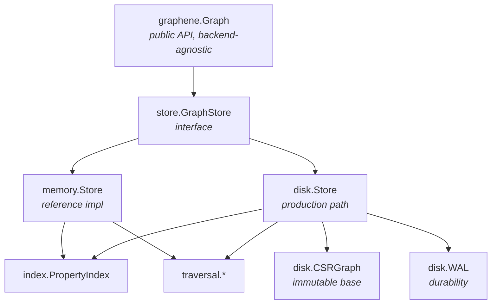

### 2.1 Component responsibilities

| Component | Responsibility |
|---|---|
| `graphene.Graph` | Façade: batch helpers, result utilities, visualisation hand-off |
| `store.GraphStore` | The contract both backends satisfy |
| `store` (types) | IDs, records, queries, filters, sorted-ID helpers, plan types |
| `memory.Store` | In-memory reference implementation |
| `disk.Store` | CSR + delta + WAL; the production path |
| `disk.CSRGraph` | Immutable compacted base, addressed by ID |
| `disk.WAL` | Append-only durability log with a lock-free ring buffer |
| `index.PropertyIndex` | Sharded secondary index, forward and reverse |
| `index.orderedIndex` | Sorted values per declared key |
| `index/encoding` | Order-preserving encoders |
| `traversal` | BFS, DFS, shortest path, subgraph matching |
| `viz` | Standalone HTML export |

### 2.2 Why a façade

`Graph` delegates almost everything, which is why most of its methods are
one-liners. The intent is that **the interface is the contract** and the façade
never becomes a second place where behaviour lives. When a method here contains
logic, that is a smell worth checking.

### 2.3 Capability interfaces, not one fat interface

`GraphStore` carries only what every backend must have. Everything optional is a
small separate interface a backend may satisfy, which callers type-assert:

| Interface | Purpose |
|---|---|
| `AdjacencyReader` | `IncidentEdges` into a caller buffer; `NodeExists` without materialising |
| `DegreeCounter` | Degree from CSR offsets without building records |
| `Reindexer` | `UpdateNodeIndexed`, reindex policy |
| `IndexVerifier` | `VerifyIndexes` |
| `IndexRebuilder` | `RebuildIndexes` |
| `OrderedIndexDeclarer` | `DeclareOrderedProperty` |
| `NodeQueryExplainer` / `EdgeQueryExplainer` | Query plans |

This is what lets the disk backend expose a zero-allocation degree count from CSR
offsets without forcing the memory backend into the same shape, and lets callers
degrade gracefully rather than crash on a backend that lacks a capability.

---

## 3. Storage model

### 3.1 Core model

Property graph. Nodes and edges both carry:

- a monotonic ID (`NodeID` / `EdgeID`, `uint64`, never reused — §15),
- zero or more `uint16` labels,
- an opaque property blob (msgpack by convention; the storage layer never parses
  it).

Edges additionally carry `Src`, `Dst` and a `float32` weight.

**The blob is opaque on purpose.** The engine never decodes it, which is why
property *indexing* is explicit: the caller supplies `(key, value)` pairs in its
own encoding. That keeps the storage layer schema-agnostic at the cost of making
index maintenance the caller's responsibility on update (§6.5).

### 3.2 The disk store is a two-layer read

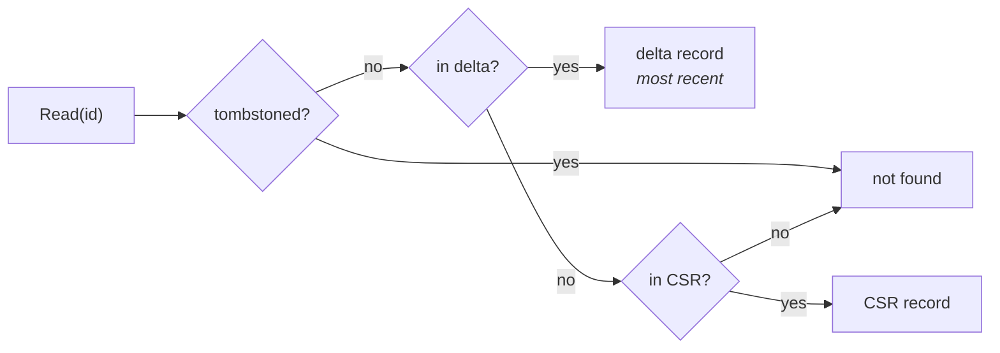

| Layer | Contents | Mutability |
|---|---|---|
| Delta | records written since the last compaction, plus tombstones | mutable Go maps |
| CSR | the compacted base | **immutable once published** |

That asymmetry is the whole basis of the lock-free read path (§9.2): the delta
needs a lock because it is a map, but the CSR does not because it never changes.

`Compact()` folds the delta into a fresh CSR, publishes it atomically, and
empties the WAL.

### 3.3 Why CSR

Compressed Sparse Row, addressed **by ID directly**:

```
                    ┌────────────────────────────────────────┐
 nodes[]            │ n₀ │ n₁ │ n₂ │ n₃ │ ...  len = maxID+1 │
                    └────────────────────────────────────────┘
                             ▲
                    GetNode(1) = nodes[1]   ← bounds check + pointer, ~6 ns

 outOffset[]        │ 0 │ 2 │ 5 │ 5 │ 7 │      len = maxID+2
                       └───┬───┘
 outEdges[]         │ e₃ │ e₇ │ e₁ │ e₄ │ e₉ │ e₂ │ e₅ │

 neighbours(1) = outEdges[outOffset[1] : outOffset[2]] = [e₁, e₄, e₉]
```

Three properties follow, and they are the reason for the layout:

1. **A point lookup is an array index**, not a hash — no hashing, no probe chain.
2. **Adjacency is contiguous**, so a traversal walks memory linearly rather than
   chasing pointers.
3. **Degree is `outOffset[n+1] - outOffset[n]`** — O(1), zero allocation, no
   record materialised.

**The cost:** arrays follow the highest ID ever issued, not the live count, so
deletions leave holes until `Compact()`. Measured at 715 B per live node
half-deleted-uncompacted against 158 B compacted — **4.5×**. §14 explains why
this is accepted rather than fixed.

---

## 4. On-disk formats

Two files per store directory: `graphene.csr` and `graphene.wal`.
**Everything is little-endian.**

### 4.1 CSR file layout

```
┌─────────────────────────────────────────────────────────┐
│ HEADER (46 bytes, v6)                                   │
├─────────────────────────────────────────────────────────┤
│ NODE RECORDS      × nodeCount     (variable length)     │
├─────────────────────────────────────────────────────────┤
│ EDGE RECORDS      × edgeCount     (variable length)     │
├─────────────────────────────────────────────────────────┤
│ outOffset[] │ outEdges[] │ inOffset[] │ inEdges[]       │  ← fixed width
├─────────────────────────────────────────────────────────┤
│ PROPERTY INDEX SECTION  ("GIDX")   ← at header.indexOffset│
└─────────────────────────────────────────────────────────┘
```

**Header, v6 — 46 bytes:**

| Offset | Size | Field | Since |
|---:|---:|---|---|
| 0 | 4 | magic `GCSR` | v2 |
| 4 | 2 | version (2–7 readable, 7 written) | v2 |
| 6 | 8 | node count | v2 |
| 14 | 8 | edge count | v2 |
| 22 | 8 | node sequence high-water mark | v5 |
| 30 | 8 | edge sequence high-water mark | v5 |
| 38 | 8 | property-index section offset | v6 |

**Node record** (variable length):

| Size | Field |
|---:|---|
| 8 | node ID |
| 1 | label count |
| 2 × count | labels (`uint16` each; **1 byte each before v4**) |
| 4 | property blob length (`uint32`) |
| n | property blob |

**Edge record** (variable length):

| Size | Field |
|---:|---|
| 8 | edge ID |
| 8 | source node ID |
| 8 | destination node ID |
| 1 | label count |
| 2 × count | labels (`uint16` each; 1 byte before v4) |
| 4 | weight (`float32`) |
| 4 | property blob length (`uint32`) |
| n | property blob |

**v2 carried no property blob** — it reserved 8 bytes there and the reader skips
them, which is why a v2 file loses nothing by upgrading but cannot round-trip
properties until it does.

**Version history:**

| Version | Change |
|---|---|
| v2 | baseline readable format |
| v3 | — |
| v4 | labels widened from `uint8` to `uint16` |
| v5 | sequence high-water marks added |
| v6 | property-index section + `indexOffset` |

All of v2–v7 are readable; v7 is written. Older files upgrade on the next
`Compact()`.

**Two header fields worth explaining:**

*Sequence high-water marks* exist because IDs must never be reused (§15). Without
them, a store whose highest-ID record was deleted before the CSR was written
would, on reopen, derive its next ID from the surviving records and **reissue a
live ID**. The marks persist the true watermark independently of what survives.

*`indexOffset`* makes the property-index section directly addressable. Without
it, a reader would have to walk every variable-length record to find where the
section begins.

### 4.2 Property-index section

```
┌──────┬────────────┬───────────────┬────────────┬───────────────┐
│ GIDX │ nodeCount8 │ node entries… │ edgeCount8 │ edge entries… │
└──────┴────────────┴───────────────┴────────────┴───────────────┘

entry:  [id:8][keyLen:2][key][valueLen:4][value]
        └ uint64 ┘└ uint16 ┘      └ uint32 ┘
```

Note the asymmetry: key length is `uint16` (keys are short identifiers) while
value length is `uint32` (values are caller-encoded and may be arbitrary bytes).
Minimum entry size is 14 bytes, which is the bound checked before each read.

Magic, per-list counts, and strict bounds checks on every length — which is why
`Open` does not need to verify the index separately (§11.3).

Only the **property** index is persisted. Label postings and adjacency are
derivable from the records in one pass at load, so persisting them would add file
size and a consistency risk for nothing. Property entries are caller-supplied and
recoverable from nothing else — hence the asymmetry.

### 4.3 WAL format

```
record:  [type:1][length:4][payload:length][crc32:4]
```

| Type | Meaning |
|---|---|
| `0x01` | node upsert |
| `0x02` | edge upsert |
| `0x03` | node property index entry |
| `0x04` | edge property index entry |
| `0x05` | node delete (tombstone) |
| `0x06` | edge delete (tombstone) |
| `0x07` | node property purge |
| `0x08` | edge property purge |
| `0x09` | batch begin — payload is the record count |
| `0x0A` | batch commit — payload is count then a CRC over the batch body |
| `0xFF` | checkpoint |

**The purge types exist for a specific bug.** With `ReindexPurge`, an update drops
an entity's index entries. If that were not journalled, replay would re-apply the
original `0x03` records and **resurrect entries the purge had dropped**.

### 4.3.1 Transactional batches

A batch is written as one contiguous run bracketed by markers:

```
[0x09 begin | count]  [rec 1] [rec 2] … [rec N]  [0x0A commit | count | crc]
                                                  ▲
                          replay applies the batch only on reaching this
```

**Per-record CRCs catch a torn record; they do not catch a torn batch.** If a
1 000-record write is interrupted after 500, every one of those 500 is
individually valid, and replay without markers would apply half a transaction.

Replay buffers everything between the markers and applies it only on a commit
whose count *and* CRC agree with what was read back — "the commit is present" and
"the batch is intact" being different claims. Reaching EOF with a batch still
open discards the buffer, and **that discard is the rollback**: it costs nothing
because none of it had been applied.

**Unknown record types are rejected, not skipped.** Replay previously ignored
types it did not recognise. That is unsafe once markers exist: a build that does
not understand them would ignore a begin/commit pair and apply a *rolled back*
batch as if it had committed.

Aborted batches leave gaps in the ID sequence, since IDs are assigned before the
write. That is consistent with §15 — IDs are monotonic and never reused, never
promised to be dense.

### 4.4 WAL write path — the ring buffer

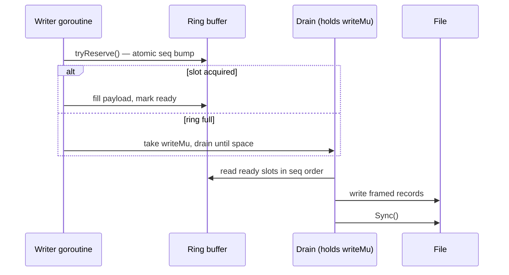

A writer reserves a slot with an atomic sequence bump, fills it, and marks it
ready — no lock on the common path. A drain pass writes ready slots to the file
**in sequence order**, so WAL order matches logical order. Overflow takes
`writeMu` and drains until space appears.

A `barrier` flag lets maintenance (compaction) exclude new writers without
holding a lock across the whole operation: writers observing the barrier yield
rather than reserving.

**The limit, stated plainly:** the file is still a single append point. The ring
removes lock contention between writers, not the serialisation of the write
itself, so write scaling is bounded by the file regardless.

---

## 5. Read and write paths

### 5.1 Write path

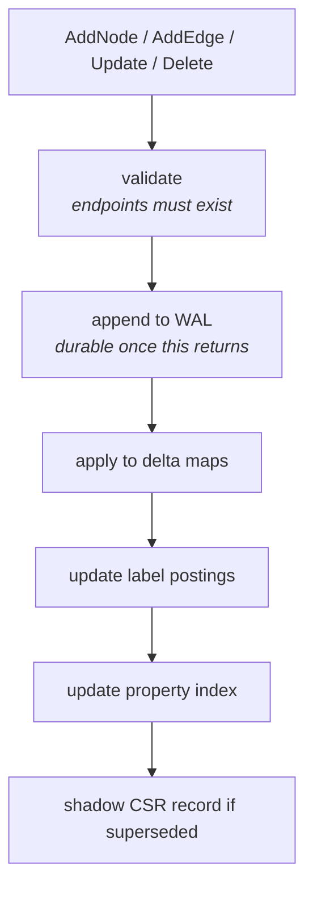

**Validation, WAL append and apply happen under a single lock hold.** That is
what makes `AddEdge` racing `DeleteNode` on the same node resolve cleanly: either
the edge is created before the node is gone and is then cascaded, or it is
rejected with `ErrInvalidEdge`. There is no window where a committed edge points
at a missing node.

**Cascade ordering matters for crash safety.** `DeleteNode` journals tombstones
for every incident edge *before* the node's own tombstone. A crash midway leaves
edges deleted and the node alive — recoverable and consistent. The reverse order
would leave edges pointing at a missing node.

### 5.1a Transactions

`Graph.Begin()` buffers writes and commits them as one unit. It exists for the
one shape the slice APIs cannot express: nodes and the edges between them.
`AddNodes` then `AddEdges` is two commits, and a crash between them leaves nodes
without their edges.

```mermaid
sequenceDiagram
    participant C as caller
    participant T as Tx (caller-side buffer)
    participant S as Store
    C->>T: AddNode(n)
    T->>S: ReserveNodeID()
    S-->>T: id (atomic bump)
    T-->>C: id — usable immediately
    C->>T: AddEdge{Src: id, ...}
    Note over T: buffered; no lock, no WAL traffic
    C->>T: Commit()
    T->>S: ApplyTransaction(nodes, edges)
    Note over S: lock → validate all edges<br/>→ one framed write → apply
    S-->>C: nil, or "nothing happened"
```

**IDs are reserved at buffer time, not assigned at commit.** That is what lets
`AddEdge` name a node the store has not seen. A transaction that rolls back burns
the IDs it took — permitted by the standing invariant that IDs are monotonic and
never reused, but never promised dense. `AddNodesBatch` has burned IDs on WAL
failure since the batch framing work; the transaction applies an existing rule
rather than adding one.

`ApplyTransaction` orders its work so atomicity and replayability both fall out:

1. **Validate every edge first**, against live nodes *and* the transaction's own
   pending nodes. A failure happens before anything is written.
2. **Frame nodes, then edges**, into one batch. Replay applies records in file
   order, so a node always precedes any edge that depends on it.
3. **One `AppendBatch`.** If it fails nothing is applied — the commit marker never
   reached the file, so replay discards the partial bytes. That absence is the
   rollback; there is no undo path to get wrong.

The in-memory backend has no WAL, so its atomicity is structural: validate
everything, then apply, with nothing in between that can fail. It must reject
exactly what disk rejects, since it is the oracle disk is compared against.

A `Tx` is a caller-side buffer and is not safe for concurrent use; the store lock
is taken once, at commit. Buffering means a transaction costs memory proportional
to its size — the same trade the slice APIs make, and the reason the API
documentation recommends chunking a bulk load rather than opening one transaction
over it.

#### Ordering and the cascade

A transaction is a **sequence**, not a set. `store.TxOp` carries the six
operation kinds and each is evaluated against the store as modified by the ones
before it, so `AddNode` then `DeleteNode` on the same ID nets out to nothing, and
an edge onto a node the transaction has already deleted is rejected.

Deleting a node cascades to its incident edges — including edges that exist only
inside the transaction:

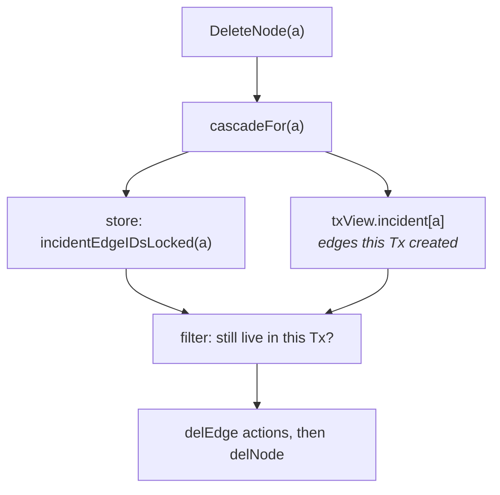

The cascade is computed at commit under the lock, never buffered — buffering it
would resolve against a graph that can still change before the transaction
commits.

#### resolve → frame → apply

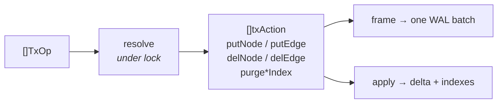

Resolution flattens the operations into primitives with no conditionals left in
them; framing and applying then read **the same list**. An earlier shape
validated and then re-derived the work while applying — two passes computing the
same thing from different inputs, which is how a WAL drifts from the state it
claims to describe.

Index purges are resolved actions too. `Graph.UpdateNode` honours
`ReindexPolicy == ReindexPurge`; a transaction that skipped it would leave stale
property-index entries that the non-transactional path removes, so the purge is
framed and applied with everything else.

*Scope:* property *indexing* is not transactional — `IndexNodeProperties` is a
separate call and is not buffered. Index *cleanup* is, for the reason above.

### 5.2 Read path

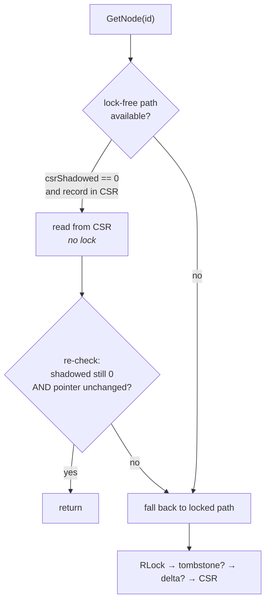

The fast path is described in full in §9.2.

### 5.3 Blob ownership: copy in, alias out

Property blobs and label slices are handled asymmetrically, deliberately.

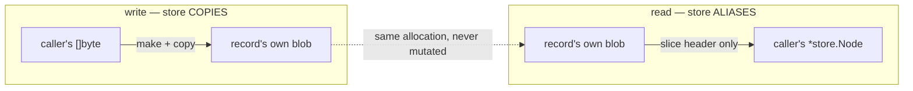

**Writes copy.** A caller may reuse or overwrite its buffer the moment
`AddNode`/`AddEdge`/`UpdateNode` returns. Retaining the caller's slice would let
later caller writes silently rewrite stored data. These copies look redundant and
are not; `graphene_blob_aliasing_test.go` pins them on both backends.

**Reads alias.** A read returns the record's own slice. Four properties make this
safe, and each is a real constraint on future changes:

1. **A blob is its own allocation.** `readCSRProperties` does
   `make([]byte, propLen)` + copy per record while deserialising. Blobs are *not*
   windows into one large file buffer — so holding one retains `propLen` bytes,
   not the whole CSR. Were blobs ever changed to slice a shared buffer, aliasing
   would become a retention hazard and this decision would need revisiting.
2. **Blobs are never mutated after construction.** The only operations reading a
   blob are `append`-from; nothing assigns into one.
3. **Ingest copies**, per above, so a record's blob is never caller-owned.
4. **The API contract permits it** — and always has.

This was previously inconsistent rather than wrong: delta-resident reads aliased
while CSR-resident reads copied, so a single `EdgesOf` result could contain
entries under both policies depending on where each record happened to live.
`Labels` had always aliased on every path. The copy was removed rather than a
copy-on-demand view built, because the contract already allowed the cheaper
behaviour and the code was simply not taking it.

The effect is structural: **disk read cost is now flat in blob size** instead of
proportional to it. A 512-byte-blob point lookup went 151 ns → 45 ns, a 10 000-node
bulk read 2.05 ms → 0.48 ms. Figures in [benchmarks.md](benchmarks.md).

---

## 6. Indexing internals

### 6.1 Catalogue

| # | Index | Structure | Complexity | Persisted |
|---|---|---|---|---|
| 1 | Primary (memory) | hash map | O(1) | no |
| 2 | Primary (CSR) | direct array offset | O(1) | yes |
| 3 | Primary (delta) | hash-map overlay | O(1) | via WAL |
| 4 | Adjacency (CSR) | prefix-sum arrays | O(degree) | yes |
| 5 | Adjacency (delta/memory) | `map[NodeID]{out,in}` | O(degree) | via WAL |
| 6 | Label postings | sorted `[]ID` per label | O(log n) lookup | rebuilt at load |
| 7 | Label postings (CSR) | sorted `[]ID` | O(1) lookup | derived at load |
| 8 | Property index | sorted postings + reverse map | O(1) equality | **yes**, v6 |
| 9 | Ordered index | sorted values per declared key | O(log n + k) | no — runtime |

### 6.2 Why postings are sorted, not hashed

Three reasons, all load-bearing:

1. **Lookups return an already-ordered slice**, so the query path can merge and
   window without sorting.
2. **Removal is a binary search plus a memmove**, not a rehash.
3. **Intersection is a merge**, not a hash probe — one pass per side, no
   allocation, and the output is ascending so the final sort is retired.

The trade is that removal remains *linear* in the postings length: the search is
logarithmic, the shift is not. True O(log n) removal needs a non-contiguous
structure, which would make `NodesByType` — one contiguous copy today — worse.

### 6.3 Property index structure

```
PropertyIndex
 └── shards[16]                        ← chosen by FNV-1a over the KEY
      └── shard
           ├── mu  sync.RWMutex
           ├── nodes postings[NodeID]
           │    ├── byKey   map[key]map[value][]ID     ← forward, sorted IDs
           │    ├── ref1    map[ID]propRef             ← reverse, single entry
           │    ├── refN    map[ID][]propRef           ← reverse, 2+ entries
           │    └── perKey  map[key]int                ← O(1) scan costing
           ├── edges postings[EdgeID]                  ← same shape
           ├── orderedNodeKeys map[key]*orderedIndex
           └── orderedEdgeKeys map[key]*orderedIndex
```

**Sharded by key, so unrelated keys never contend.** Registering `sha256` on one
goroutine does not block a lookup of `bucket` on another.

**The reverse map is sharded alongside the forward map, not by ID.** Each shard
holds only the pairs for keys it owns, so removing an entity is a pass over all
16 shards, each taking its own lock. The cost is 16 map lookups instead of one.
The benefit is decisive: **no operation ever holds two shard locks**, so there is
no lock ordering to get wrong and no deadlock to reason about. Sharding the
reverse map by ID would require holding a key-shard lock and an ID-shard lock
simultaneously for a single removal.

**The reverse map is split by arity.** Sharding by key made "one entry per entity
per shard" the universal case — each key lives in exactly one shard, and an
entity normally carries one value per key. A `map[ID][]propRef` therefore
allocated a one-element backing array per entity, roughly 21.5 B of pure
overhead on top of the map entry. `ref1` stores that case inline; `refN` carries
only entities with two or more entries in the same shard, which requires two keys
hashing together.

An id appears in **exactly one** of the two maps, never both, and `refN` never
holds an id with fewer than two entries. `VerifyIndexes` checks both directly,
because a bug in the promotion path would otherwise surface much later as a lost
or duplicated entry.

### 6.4 Ordered index

```go
type orderedIndex[T] struct {
    values []orderedValue[T]   // sorted ascending by bytes.Compare, no duplicates
}
type orderedValue[T] struct {
    value string   // raw encoded bytes
    ids   []T      // ascending, deduplicated
}
```

A range filter resolves to `[lo, hi)` positions by binary search, then walks:

| Operator | Range |
|---|---|
| `GreaterThan` | `[upperBound(v), len)` |
| `GreaterThanOrEqual` | `[lowerBound(v), len)` |
| `LessThan` | `[0, lowerBound(v))` |
| `LessThanOrEqual` | `[0, upperBound(v))` |
| `BetweenInclusive` | `[lowerBound(v), upperBound(upper))` |
| `Prefix` | `[lowerBound(p), lowerBound(prefixUpperBound(p)))` |
| `Equal`, `Contains` | **not served** — see below |

`prefixUpperBound` increments the last non-`0xFF` byte and truncates. If the
prefix is all `0xFF` it reports "unbounded" and the range runs to the end,
because no successor exists.

**`Equal` and `Contains` are declined deliberately.** Equality is already O(1)
through the hash postings, and `Contains` cannot be bounded by any ordering.
Both are comparator-free (`bytes.Equal`, `strings.Contains`), which is what makes
declining them safe — see §7.4.

### 6.5 Index maintenance on update

The engine cannot re-derive index entries: values are caller-encoded and the
property blob is opaque. So an update must state what happens to them.

| Policy | Behaviour | Failure mode |
|---|---|---|
| `ReindexKeep` (default) | entries untouched | they go **stale** — the old value still matches |
| `ReindexPurge` | entity's entries dropped | they are **lost**, including untouched keys |

`UpdateNodeIndexed` / `UpdateEdgeIndexed` avoid both by updating the record and
replacing its entries in one step. Purges are journalled (`0x07`/`0x08`) so
replay cannot resurrect superseded values.

---

## 7. Query planning and execution

### 7.1 Pipeline

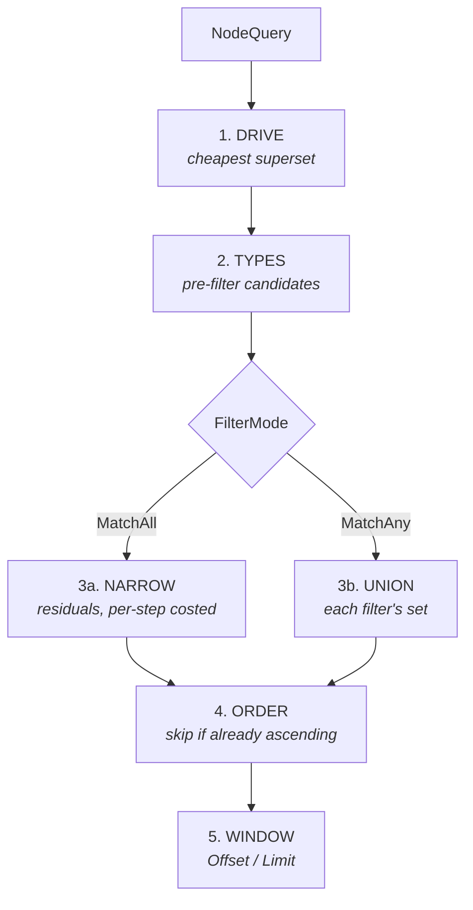

### 7.2 Driver selection

The planner picks the cheapest source **guaranteed to contain the answer**:

| Priority | Source | Cost known? |
|---:|---|---|
| 1 | explicit `IDs` | exact |
| 2 | most selective equality postings | **exact** — postings length is a map lookup |
| 3 | label postings | **exact** — `NodesByType` aliases CSR memory, so `len` is O(1) |
| 4 | ordered-key range | bounded by the range |
| 5 | incident-edge lists (edge queries) | exact — CSR offsets give degree |
| 6 | full scan | — |

Priority is a starting order, not a decision: where costs are comparable the
planner **compares them** rather than taking the first available. Equality and
labels are both exact, so a selective label beats a weak filter — a 100-node
label against a 25 000-hit filter is 58× faster driven from the label. Ties go to
equality, which returns candidates already ascending where a label union does
not, so equal candidate counts are not equal cost.

Label counts are **upper bounds**: they double-count a record present in both the
delta and the CSR, and ignore tombstones. That is the safe direction — the driver
must be a superset of the answer, so overestimating makes the planner more
reluctant to choose labels, never wrong.

> This comparison existed on the in-memory backend before the disk one, which
> made it a parity bug as well as a performance gap: the same query could be
> planned differently per backend. `TestLabelDriverParity` now pins the two
> together.

**Why `MatchAny` usually cannot be driven.** Under `MatchAll` the result is the
intersection of every filter's set, so it is contained in each and any may drive.
Under `MatchAny` it is the union, which no single filter's set contains.
`store.SupersetDrivers` encodes this in one place: it returns `nil` for
`MatchAny` with more than one filter.

### 7.3 Residual evaluation

Filters that did not drive still have to be applied. Each is costed **both ways,
per step, against the current candidate count**:

| Strategy | Cost |
|---|---|
| Probe candidates via the reverse map | one lookup per candidate |
| Materialise the filter's set and intersect | the size of that set |

Deciding per step matters because each step shrinks the set: a filter not worth
probing against 1 000 candidates often is against the 5 that survive.

Filters run **most-selective-first** so candidates die early, the pass stops the
moment none remain, and **the driving filter is excluded outright** rather than
re-derived from the set it just produced.

The estimate is exact for equality (postings cardinality) and, for anything else,
the number of entries under the key — which is what a scan of that key would
visit, and therefore an upper bound.

**Why this matters.** A filter no index can serve — a `Contains`, or a range on
an undeclared key — costs a scan of *every entry under its key*. Before residual
costing, a query driven down to a single candidate still did work proportional to
the graph to eliminate it.

### 7.4 Comparison semantics — the sharpest edge in the system

Two rules coexist, and confusing them produces **wrong answers**, not slow ones:

| Key | Rule |
|---|---|
| **Undeclared** | numeric when both operands parse as numbers, byte-wise otherwise |
| **Declared ordered** | byte-wise throughout |

They differ because the first is **not a valid total order**. Under it:

```
"9" < "10"     (numeric: 9 < 10)
"10" < "1x"    (byte-wise: '0' < 'x')
"1x" < "9"     (byte-wise: '1' < '9')
∴ "9" < "9"    — a cycle
```

No sorted structure can be built on a comparator with a cycle, which is why
declaring a key **must** change its semantics. It is a correctness choice, not a
performance one.

Every path evaluating a filter must pick the same rule for a given key — the
index, the scan fallback, and the residual probe.
`store.PropertyFilterMatches` and `store.PropertyFilterMatchesOrdered` are the
two implementations. `index/encoding` supplies order-preserving encoders so byte
order means what the caller intends.

**`Equal` and `Contains` are comparator-free on both sides**, which is why the
ordered index declining to serve them cannot cause divergence.

### 7.5 Query plans

`ExplainNodeQuery` / `ExplainEdgeQuery` report the driver, candidate count, and
each residual with its cost estimate and strategy. They exist because **results
alone cannot distinguish an index lookup from a full scan that happened to agree
with it** — which also makes them the regression test for planner behaviour.

The `Probe` flag is a forecast: it reports the decision as of the start of the
pass, while the executor re-decides per step. Order and cost estimates are exact.

---

## 8. Traversal and pattern matching

### 8.1 BFS — two buffers, not a queue

```
depth 0:   current = [origin]              next = []
depth 1:   expand current → next           swap
depth 2:   expand current → next           swap
```

Two level buffers, reused and swapped at each depth. Memory is bounded by the
**widest level**, not by the number of nodes visited, and depth becomes the loop
counter so entries are bare IDs rather than `{id, depth}` pairs.

The original implementation used `queue = queue[1:]`, which slid through the
backing array so every append past capacity reallocated — one allocation per
visited node. `BFS_Deep` went from 30 190 allocations to 198.

`BFSIDs` walks without building any record at all: 20 allocations against 394 for
the record-returning walk on the same traversal.

### 8.2 DFS — `bestRemaining`, not `visited`

A boolean `visited` set is **incorrect under a depth limit**. A node first reached
by a long path gets marked visited, and is never re-expanded when a shorter path
later arrives with budget to spare.

```
A→B→C→E  plus shortcut A→C,  maxDepth 2

  boolean visited:  A B C ✗   (E lost — C consumed the budget via B)
  bestRemaining:    A B C E ✓
```

`bestRemaining map[NodeID]int` records the largest remaining budget each node has
been expanded with, and re-expands when a later path arrives with more. Nodes are
appended on first arrival only, so there are no duplicates.

**Complexity changed honestly:** a node can be expanded once per distinct
remaining value, so the bound is O(V × maxDepth) expansions rather than O(V).
Measured cost ≈6%.

**BFS cannot be replaced by DFS.** They return the same type but different
results under a depth limit; performance is a wash; and DFS is recursive, so
stack depth tracks graph depth. DFS is right where it is used —
`ProvenanceChain` follows a single chain and terminates early.

### 8.3 Pattern matching

`FindSubgraphMatches` matches a small `Pattern` against a scope by backtracking,
pruned by node- and edge-label constraints. It used to be the worst path in the
codebase — a 2 000-node scope cost 24.6 ms and 399 950 allocations — and is now
4.75 ms and 150.

**Candidate building.** For each pattern node, scope members are tested against
the label postings by binary search. The earlier version loaded each node record
to read its labels back off it. Scope order is preserved, because candidate order
decides which matches a `maxMatches`-capped search returns.

**Edge checks — `edgeProbe`.** Backtracking asks "is there an edge from src to
dst with these labels?" once per candidate pair per pattern edge. That question
does not need edge records:

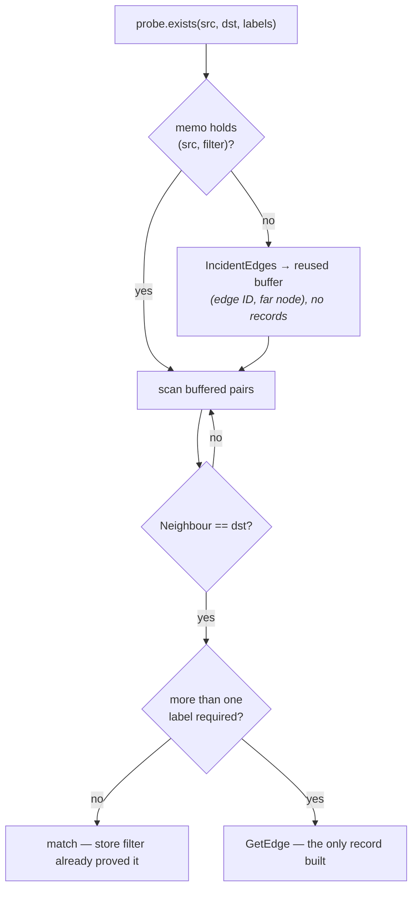

Two properties hold this together:

- **The store's edge filter is OR; a pattern's labels are AND.** So the filter
  can prove at most one required label on its own. That is exactly why the
  no-materialisation fast path is limited to `len(labels) <= 1`.
- **The memo is keyed on (source, filter).** Backtracking holds the source fixed
  while iterating every candidate for the next pattern node, so without it the
  same adjacency is re-walked — and re-locked — once per candidate. This was the
  *larger* half of the speedup, and invisible to allocation counts: after the
  record work was removed the path still spent 17 ms doing 150 allocations.

Caching within one search weakens nothing: §10 already states a query is not a
snapshot, and the previous code offered no cross-call guarantee either.

Correctness rests on `graphene_pattern_test.go`, which compares full match sets
against a brute-force oracle over five pattern shapes on both backends.

---

## 9. Concurrency and safety

### 9.1 Lock inventory

| Lock | Covers | Held during |
|---|---|---|
| `memory.Store.mu` | records, adjacency, label postings | every operation |
| `disk.Store.mu` | delta maps, tombstones, delta postings, CSR pointer swap | locked reads, all writes |
| `propertyShard.mu` × 16 | one shard's forward and reverse maps | that shard's operations |
| `WAL.writeMu` | the drain pass | overflow and flush only |

**No operation holds two shard locks.** This is a design constraint, not an
accident — it is what removes deadlock from the reasoning entirely.

### 9.2 The lock-free CSR read path

A published `CSRGraph` is immutable, so a reader that obtains the pointer
atomically can read a record from it with **no lock at all**.

```go
csrPtr      atomic.Pointer[CSRGraph]
csrShadowed atomic.Int64   // CSR records superseded by an update or tombstone
```

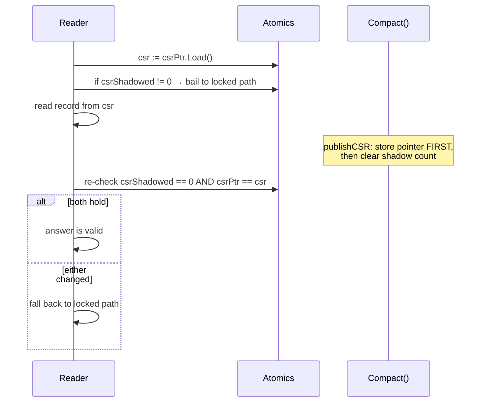

**Two invariants make it sound:**

1. The shadow counter is only ever incremented within the life of one CSR, so
   observing zero *after* the read proves it was zero throughout.
2. The reader re-checks **the pointer it read from**, which catches a `Compact()`
   that swapped the CSR and cleared the counter underneath it.

Pointer identity is sound because the reader still holds a reference to that CSR,
so the object cannot be collected and its address cannot be reused mid-check.

**Counting shadows rather than asking "is the delta empty"** is what makes this
useful. Appending new entities shadows nothing, so ongoing writes do not disable
the fast path for pre-existing records. An "is the delta empty" flag would switch
off after the first write and stay off until the next compaction.

#### The version that was wrong

The first implementation used a separate generation counter, with `Compact`
bumping the generation *before* storing the new pointer. That left a window:

```
reader: sample generation  → N+1   (already bumped)
reader: load pointer       → OLD   (not yet stored)
reader: check shadow count → 0     (already cleared)
reader: read stale record, re-check, both match → ACCEPTS STALE DATA
```

Every ordering of two independent atomics has such a window, because the reader
needs the pointer and its validity to agree and they were separate words. The fix
**removed the second word** rather than reordering the stores.

**What did not catch this:** neither the race detector — which finds
unsynchronised access, not stale answers, and the code was perfectly
synchronised — nor the concurrency tests, whose window is two instructions wide.
`TestConcurrent_ReadsDuringCompaction` now runs 200 compactions against 8
readers as defence in depth, but the correctness argument rests on the design.

### 9.3 Scaling characteristics

| Path | Behaviour |
|---|---|
| Disk point lookup | **4.8×** across 16 cores (lock-free path) |
| Disk 3-hop BFS | **5.4×** across 16 cores |
| Property registration, distinct keys | **2.4×** (16 shards) |
| Property registration, one key | ~1.2× — sharding cannot help single-key traffic |
| Memory point lookup | **~0.5× — negative.** `RWMutex` with a very short critical section: `RLock` is an atomic increment on one shared cache line, and the synchronisation costs more than the work it protects |
| Writes | serialised by the store lock; disk additionally bounded by a single WAL append point |

The memory backend is the reference implementation, not the production path, and
is deliberately left unsharded — see §14.

---

## 10. Consistency model

### 10.1 What a read guarantees

> **Every ID a read returns named an entity that was live at the moment it was
> checked, and every record returned is internally coherent** — an edge is
> incident to the node it was requested for, and a neighbour is that edge's far
> endpoint.

**The moment is inside the call, not after it.** By the time a caller acts on a
result the entity may be gone, so `GetNode` on an ID just returned can
legitimately fail. Measured against a deleter running flat out: **0.7%** of IDs
from a single-key lookup, **4–11%** from a typed query, which returns more IDs
over a longer call.

Closing that would require snapshot isolation, which is not offered. A sequence
of calls is **not** a transaction.

### 10.2 Why property lookups resolve against the records

The index and the records are separate structures under separate locks.
`DeleteNode` holds the store lock across its whole cascade, but a lookup
consulting only the index could read postings the delete had not reached yet and
return an entity the records no longer had — a **torn read of one logical
operation**.

`NodesByProperty` / `EdgesByProperty` therefore resolve postings against the
records before returning, making the records the authority. This also covers
index entries with no record behind them at all, since index writes do not verify
that the entity exists.

Cost: ~20 ns on a raw single-key lookup, nothing measurable on the typed query
path, which already resolved candidates that way.

**The label paths never had this problem**, for an instructive reason: the memory
backend keeps label postings *inside* the store lock alongside the records, and
the disk backend re-validates candidates under a single lock hold. The property
index was the outlier precisely because it is separate — which sharding it made
more true, not less.

---

## 11. Failure and recovery

### 11.1 Durability boundary

**A returned write is not yet durable.** `fsync` is called in exactly two places —
`WAL.Checkpoint()` (invoked only from `Compact`) and `WAL.Close()`. The write path
never syncs.

Worse, the drain is opportunistic:

```go
w.enqueue(recType, copied)
if w.writeMu.TryLock() {          // if another goroutine holds it, skip
    w.drainQueuedLocked()
    w.writeMu.Unlock()
}
return nil                        // returns either way
```

If that `TryLock` fails, the record is still in the **process-memory ring buffer**
when the call returns — it has not reached the OS, let alone the platter.

| Failure | Survives? |
|---|---|
| Nothing crashes | yes; visible to all readers immediately |
| Process crash | **usually** — see below |
| Power loss / kernel panic | **only if `Compact()` or `Close()` has run since** |

Measured, so the risk is not overstated: 200 `AddNode` calls with no `Close()` or
`Compact()` left all 4 800 bytes already in the file. Single-threaded, the
`TryLock` always succeeds and every record reaches the OS immediately. A record
lingers in the ring only when another goroutine holds `writeMu` at that instant.

**So the real exposure is power loss, not process crash** — the OS will flush its
page cache for a dead process, but nothing has been forced to the platter since
the last `Compact()` or `Close()`.

**The policy, now that one exists:**

| Write | Durable when |
|---|---|
| Batch (`AddNodesBatch` / `AddEdgesBatch`) | **at commit** — `AppendBatch` fsyncs by default; `SetSyncOnCommit(false)` opts out |
| Individual | on `Sync()`, `Compact()`, or `Close()` |

Individual writes are not synced per call by design: an fsync per `AddNode` turns
a ~6 µs operation into a ~1 ms one. `WAL.Sync` (exposed as `Store.Sync` and
`Graph.Sync`) drains and fsyncs without rebuilding the CSR, so a caller can
establish a durability point for ~1 ms instead of the ~64 ms a `Compact()` costs.

The previous text here — "recoverable once its WAL append returns" — was simply
wrong, and was found by tracing the write path during bulk-write planning rather
than by any test.

Space held by deleted or superseded records is reclaimed at the next `Compact()`.

### 11.2 What a crash leaves behind

| Crash point | State on reopen |
|---|---|
| Before WAL append | operation never happened |
| After WAL append, before apply | replay applies it **if the record reached the OS** — see §11.1 |
| Mid-cascade in `DeleteNode` | edges deleted, node alive — consistent, because edge tombstones are journalled first |
| During `Compact`, before publish | old CSR + full WAL; replay reconstructs |
| After publish, before WAL truncate | new CSR + stale WAL; replay is idempotent (upserts and tombstones) |
| Abrupt kill (no clean close) | committed data intact; next `Open` replays everything since the last compaction |

### 11.3 Why `Open` does not verify indexes

It did, briefly: ~200 ms on a 100k-node store, an O(V+E) tax on **every** startup,
catching little that is not already covered.

- A corrupt index section is rejected while parsing — magic, counts and bounds
  are all checked.
- Label postings and the property index are rebuilt by insertion through the
  normal code paths, which sort and deduplicate, so their structure is correct by
  construction whatever the file contained.

What remains is engine bugs, which belong in tests rather than in a startup scan.
Recovery is explicit: `VerifyIndexes()` then `RebuildIndexes()`.

### 11.4 What verification can and cannot check

| `VerifyIndexes` checks | It cannot check |
|---|---|
| postings ordering and deduplication | that an indexed *value* still matches the entity's properties |
| forward ↔ reverse agreement, both directions | — because values are caller-encoded and opaque |
| `ref1`/`refN` arity invariants | |
| label postings against live labels | |
| adjacency against edge endpoints | |
| that no index entry outlives its entity | |

`RebuildIndexes` recomputes what is derivable from the records — label postings,
adjacency — and drops property entries whose entity is gone. **It repairs
structure, not content.**

### 11.5 Replay cost — buffering and the checksum

Replay is the cost of opening a store that has not been compacted, and it is
**I/O-bound, not index-bound**. A CPU profile of a cold open put 69% of the time
in `syscall.readFile`; the index maintenance that replay performs per record did
not reach the top twenty.

The cause was structural: each record was read with three separate `io.ReadFull`
calls against the file handle — header, payload, footer — so a 60 000-record log
issued roughly 180 000 syscalls. Replay now pulls the log through a
`bufio.Reader`.

> **Why buffering is safe here.** The WAL is opened `O_APPEND`. Writes go to the
> end of the file regardless of the read offset, so a buffered reader that reads
> past the last record cannot affect a subsequent append. Without `O_APPEND` this
> would corrupt the log.

With the syscalls gone, the record checksum became 46% of what remained. It was a
bit-by-bit CRC-32 — eight iterations per byte — over polynomial `0xEDB88320`,
which is the reversed IEEE polynomial. `crc32.ChecksumIEEE` produces the
**identical value** using a hardware-accelerated implementation.

That identity is a **format guarantee**: every WAL already on disk was written by
the old loop, and a checksum that differed anywhere would fail every record on
replay. `disk/crc_test.go` pins the values with fixed vectors — including the
standard `0xCBF43926` check value — rather than comparing against
`crc32.ChecksumIEEE`, which would now be tautological.

Together: a cold open of a 10 000-node uncompacted store went from 1 263.9 ms to
**42.7 ms**, with allocation counts unchanged — no allocation figure could have
located either cost.

The read buffer is capped to the log's own size. A fixed 1 MiB buffer cost a
megabyte on every open, including compacted stores that replay almost nothing.

---

## 12. Worked examples

### 12.1 A two-filter query, end to end

```go
g.QueryNodeIDs(store.NodeQuery{Filters: []store.PropertyFilter{
    {Key: "sha256", Op: store.PropertyOpEqual,    Value: hash},
    {Key: "tool",   Op: store.PropertyOpContains, Value: []byte("acquire")},
}})
```

| Step | What happens |
|---|---|
| Drive | `EqualityDrivers` returns both filters (MatchAll). Only `sha256` is `Equal`; its cardinality is **1**. It drives. |
| | `candidates = [artID]`, ascending, `DriverFilter = 0` |
| Types | none in the query — skipped |
| Residual | one filter left: `tool Contains`. Cost estimate = entries under `tool` = **100 000**. Candidates = 1. `1 < 100 000` → **probe** |
| | probe reads `refs[artID]` in `tool`'s shard, tests `strings.Contains` |
| Order | candidates already ascending, `QueryOrderAsc` → no sort |
| Window | no `Offset`/`Limit` |

```
driver=equality(sha256) candidates=1 residual=tool:probe~100000 results=1
```

Before residual costing, that `Contains` resolved to its own set — a scan of all
100 000 `tool` entries — to eliminate a single candidate. **12.97 ms → 443 ns.**

### 12.2 A delete, end to end

`DeleteNode(N)` where N has 3 incident edges and 2 indexed properties:

```
 1. acquire store write lock
 2. collect incident edge IDs from adjacency
 3. WAL: 0x06 tombstone × 3        ← edges first, for crash safety
 4. WAL: 0x05 tombstone for N
 5. for each edge: remove from delta/adjacency/label postings,
                   propIdx.RemoveEdge, shadow CSR edge
 6. unindex N's labels
 7. delete N from delta records and adjacency
 8. mark N tombstoned if it exists in the CSR; shadow it
 9. propIdx.RemoveNode(N):
       for each of 16 shards:            ← never two locks at once
           lock, look up ref1/refN, remove those (key,value) postings, unlock
10. release store lock
```

Step 9 is why the reverse map exists: without it, removing N would require
scanning every `(key, value)` bucket in the index. With it, the work is
proportional to N's own entries — **686× faster** on a populated index.

---

## 13. Extension points

### 13.1 Adding a property operator

1. Add the constant to `store.PropertyOp`.
2. Implement it in **`propertyFilterMatches`** — the shared body — so both the
   scan rule and the ordered rule get it. If it is comparator-dependent, verify
   both comparators behave sensibly.
3. Decide whether the ordered index can serve it, and add a case to
   `orderedIndex.rangeFor` if so. **If not, ensure it is comparator-free**, or
   the probe and the scan will disagree (§7.4).
4. Add cases to the residual semantics tests, checking against expectations
   computed in the test rather than against the engine's other path.

### 13.2 Adding an index type

1. Decide whether it is derivable from records (like label postings) or
   caller-supplied (like property entries). Derivable indexes should be rebuilt
   at load, not persisted.
2. If persisted, add a section to the CSR with its own magic and bounds checks,
   and bump the format version.
3. Add its consistency checks to `VerifyIndexes` and its repair to
   `RebuildIndexes`.
4. Teach the planner to drive from it, if it can bound a result set.

### 13.3 Adding a backend

Implement `store.GraphStore`, then opt into whichever capability interfaces make
sense (§2.3). The parity suite is the acceptance test: it compares the new
backend against `memory.Store` across queries, traversals and mutations.

### 13.4 Invariants any change must preserve

See §15. The two most easily broken by well-meaning changes are **ID reuse** and
**the ordering rule for a declared key**.

---

## 14. Trade-offs and rejected alternatives

This section exists so these are not re-attempted. Each was measured.

### 14.1 What was bought, and with what

| Change | Cost | Bought |
|---|---|---|
| Reverse `ID → (key,value)` map | +89–96% B/op on register; a large share of index memory | `DeleteNode` **686×** |
| Property index in the CSR | +63% peak bytes on reopen | reopen **17×** |
| 16-way key sharding | 16× map header overhead | distinct-key registration **2.4×** |
| CSR label postings | ~8 B per (node, label) | `NodesByType` **88×** |
| Ordered index per declared key | ~10.5 B/node (scales with *distinct values*) | range queries 6.8–199× |
| Postings resolved against records | ~20 ns per raw lookup | **read consistency** — not speed |

**The bill in one number:** property-index memory is **+22–53% per node** against
the pre-index baseline. That is the honest counterweight to the query speedups.

### 14.2 Rejected: ID-remapping compaction

Would recover the 4.5× memory overhead of max-ID-sized CSR arrays. **Rejected
because it breaks "IDs are never reused"** (§15), which is documented, relied on
by callers holding IDs outside the store, and the reason an ID is a stable
external handle at all. A stored ID that silently means a different node after a
compaction is a far worse defect than the memory it saves.

Mitigation: `Compact()` recovers the 4.5× outright, and compaction is now ~10×
cheaper than it was.

### 14.3 Rejected: offset table + decode-on-access

The only design that makes `Open` O(1). **Rejected because it inverts the
bargain**: today you pay once at open and every `GetNode` is a direct array index
at ~6 ns; this would spend a decode on every read, forever, to save a one-off
startup cost. For a long-lived process that is the wrong way round — opens are
counted per process, lookups per query.

`Open` is ~74 ms on a compacted 50 000-node store, and its cost is attributed:
~58% CSR record parsing, ~42% property index, with WAL replay contributing
nothing after a compaction.

**What survives:** mmap'ing the *flat adjacency arrays*, which stay fixed-width
and directly indexable, so it costs the read path nothing.

### 14.4 Rejected: bulk index loading

Built, tested for equivalence, and **reverted**. One lock per shard, parallel
fill, presized maps, batch-local value interning. It cut allocations 9–19% but
cost **35–75% more resident memory**: partitioning copies every entry into
per-shard slices, and the presize is keyed on entry count where the reverse map
is keyed on entity.

Spending P1 to buy P2 is the wrong direction, especially on the axis already
carrying the project's largest regression.

### 14.5 Rejected: compressed postings

Delta+varint or bitmaps over the sorted `[]ID`. The floor is **103.9 B per index
entry**, of which the sorted `[]ID` is **8 B** — so the ceiling on this work is
~5%, bought with variable-length decoding on a structure that binary-searches on
every removal. **The overhead is in the maps, not the lists.**

### 14.6 Rejected: sharding the in-memory store

The memory store is the reference implementation the disk store's parity tests
compare against; optimising it makes it a worse reference. Sharding it is a large
change with genuine deadlock risk — an edge insert touches the edge shard, both
endpoint adjacency shards and the global label postings, and `DeleteNode`'s
cascade spans arbitrarily many. Poor risk-to-benefit for a backend not on the
production path, whose disk counterpart already has its read scaling fixed.

### 14.7 Deferred: lazy index construction

Deferring the property index until first use has a **resurrection hazard**:
`DeleteNode` calls `RemoveNode` on an index that does not exist yet, the removal
is a no-op, and the later lazy build reloads the deleted entity's entries from
the section.

Correct only if the trigger is *first touch of any kind*, writes included — which
narrows the benefit to traversal-only and property-free workloads, and saves a
write-heavy workload nothing.

### 14.8 Rejected: sorted array for the reverse index map

The reverse map (`ref1`/`refN`) is the single largest consumer of memory in this
engine. Measured directly — by building the index with it disabled — it costs
**84.3 B/entry, 90% of the property index**, against 9.1 B for the forward
postings that answer queries.

Replacing it with one array of `{id, propRef}` sorted by id (append fast path for
monotonic ingest, binary search for lookup, contiguous runs per id so the arity
split disappears) was built and measured:

| | |
|---|---:|
| Index memory | −16.7% |
| Probe / query path | **no measurable change** — a packed array's locality offsets the extra comparisons |
| `DeleteNode` with a property index | **+469%** (2.36 µs → 13.42 µs) |

**Rejected on the delete regression.** Deletion memmoves the tail where a map
delete was O(1), and deleting oldest-first — what expiry and pruning do — is the
worst case. Speed outranks memory (§ priority order), so 5.7× slower deletes for
16.7% less memory is the wrong trade. Tombstoning would fix it at the cost of a
validity check on the probe path and a compaction pass; not worth it for 16.7%.

The experiment's lasting value is the decomposition it forced. Of the 84.3 B, the
array recovers only the map machinery — **~32 B/entry is value strings pinned by
the reverse entries**, because a reverse entry keeps the caller's string while the
forward index keeps only the first one it saw for that value. At cardinality 1
that is 100k live copies of one distinct string.

That makes value interning the largest remaining lever, and a cardinality-
dependent one: a clear win on low-cardinality keys, a clear loss on all-distinct
ones. See plan §5.2.4.

---

## 15. Invariants

Any change must preserve these. Each is enforced by tests.

1. **IDs are monotonic and never reused** for the lifetime of a store, across
   restarts and compactions. Callers may hold an ID externally and rely on it
   meaning the same entity forever.
2. **Postings are strictly ascending and duplicate-free**, everywhere.
3. **The reverse map agrees with the postings in both directions**, and an id
   lives in exactly one of `ref1`/`refN`, with `refN` holding only ids that have
   two or more entries in that shard.
4. **No edge outlives its endpoints.** `DeleteNode` cascades under one lock hold;
   `AddEdge` validates endpoints under the same hold.
5. **No index entry outlives its entity.** Checked by `VerifyIndexes`; hidden
   from reads by the live-filter if it occurs.
6. **Every ID a read returns named a live entity at the moment it was checked** —
   and explicitly not stronger (§10.1).
7. **A reader on the lock-free path never observes a superseded CSR** (§9.2).
8. **A declared key is compared byte-wise on every path** that evaluates a filter
   for it (§7.4).
9. **The store never retains caller memory, and never mutates a blob it has
   handed out** (§5.3). Writes copy in; reads alias out. Both halves are load-
   bearing: the first makes it safe for a caller to reuse its buffers, the second
   is what makes reads independent of blob size.

---

## 16. Known limitations

1. **No query language.** The planner is driven by the `NodeQuery` struct, not
   parsed text. There *is* a cost model — exact equality cardinality, residuals
   costed per strategy — inspectable via `ExplainNodeQuery`.
2. **Statistics are exact but ephemeral.** Computed on demand, never persisted,
   no histograms — so selectivity *within* a range is estimated by the key's
   entry count rather than by distribution.
3. **No regex or fuzzy operators.**
4. **`Contains` always scans** the key's entries. No ordering can bound a
   substring match.
5. **Ranges on an undeclared key use the scan rule**, which is not a total order.
   Declare the key and use `index/encoding` for ranges that must be both fast and
   well-defined.
6. **Ordered-key declarations are not persisted.** Re-declare after reopening.
7. **Property indexing is explicit.** The engine will not infer which fields to
   index, because it cannot read the blob.
8. **No snapshot isolation.** A sequence of calls is not a transaction (§10.1).
9. **Pattern matching is unoptimised** (§8.3).
10. **Memory-backend read concurrency is negative** past one core (§9.3).
11. **Write scaling is bounded by a single WAL append point.**

---

For usage patterns start with [USER_GUIDE.md](USER_GUIDE.md); for the API surface
see [API_REFERENCE.md](API_REFERENCE.md); for measurements and methodology see
[benchmarks.md](benchmarks.md); for competitive context see
[comparison.md](comparison.md).
